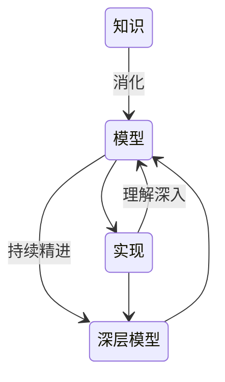
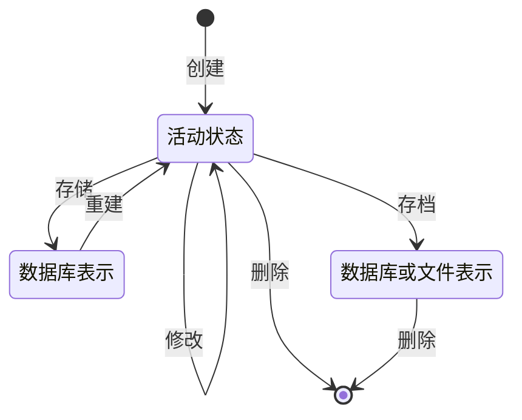
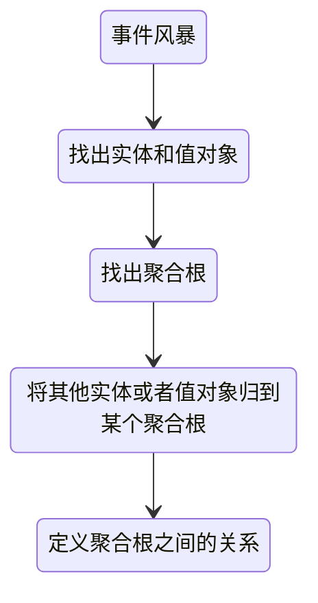

# 领域驱动设计

- 架构设计的本质是解决问题，我们可以随意地剪裁方法论，用其中20%-30%的套路来简化我们的沟通和设计成本即可

三种类型导向的设计：

- UI导向
- 业务导向(DDD)
- 数据导向

DDD能解决的：

- 代码冗余降低
- 需求响应提升
- 故障缺陷降低
- 部分性能提升

不能解决的：

- 大部分性能优化的问题
- 需求理解偏差的问题
- 人员开发技术差的问题

## 核心概念


### 领域

领域就是这个边界内要解决的业务问题域

### 子域

每个子域对应一个更小的问题域或更小的业务范围

- 核心域：重点关注的子域
- 支撑子域服务于核心子域
- 通用子域被多个子域共同使用 具有通用性

### 界限上下文

封装通用语言和领域对象，提供上下文环境，保证在领域之内的一些术语、业务相关对象等（通用语言）有一个确切的含义

- 子域提出问题 界限上下文解决问题

#### 分离模式

- 互不干扰，各走各道

#### 防腐层模式

集成遗留系统，又不能强制老系统更新。新系统要做个适配器层来转换模型.

#### 跟随者模式

跟随者关系:一定要跟某上游系统绑定，但别人是主，本系统是从。

#### 客户供应者模式

客户供应商关系，强依赖，上下游系统开发合作顺利，对模型逻辑修改反应迅速。

#### 共享内核模式

共享内核，两团队之间紧密合作，代码模型可以提取成通用组件共享。

#### 合并上下文模式

单个界限上下文，两团队如一家人，紧密到无法分开。一切模型要素都是共享的。

## 模型

模型：对知识进行了选择性的简化和有意的结构化

- 模型与设计相互影响
- 模型是团队的通用语言
  - 通用语言是连接技术人员与业务人员的桥梁
- 模型是浓缩的知识

### 有效建模的要素

- 模型与实现绑定
  - 如果模型不能帮助开发可运行的软件 那就毫无意义
  - 寻找一种可以绑定模型与程序设计的设计
- 建立了基于模型的语言
- 模型蕴含丰富的知识
- 提炼模型
  - 不断对模型精简或者增加元素
- 讨论



### 通用语言

领域模型可以作为一种语言，语言就是模型的一种表现，模型与语言是一致的


使用文档与图作为面的面沟通的辅助手段，文档不应重复表示代码已经明确表达的内容，并且要与模型保持同步

### 模型驱动设计

在设计模型时需要考虑如何让代码更加自然地表达模型

### 亲自编码的建模师

如果参与建模的人最终没有参与到实现的工作中，那么模型与实现二者之间便会割裂开来

### 建模范式

模型驱动的设计并非一定只能使用OO设计，混用其他的一些设计范式能使设计更加自然

像现在我正在尝试系统整体使用OO，局部使用函数式

## 领域

### 分层架构


层名          | 含义
----------- | -------------------------------------------------------------------------------------------------------------------------------------------------------------------
用户界面层（或表示层） | 负责向用户显示信息和解释用户指令。这里指的用户可以是另一个计算机系统，不一定是使用用户界面的人
应用层         | 定义软件要完成的任务，并且指挥表达领域概念的对象来解决问题。这一层所负责的工作对业务来说意义重大，也是与其他系统的应用层进行交互的必要渠道。应用层要尽量简单，不包含业务规则或者知识，而只为下一层中的领域对象协调任务，分配工作，使它们互相协作。它没有反映业务情况的状态，但是却可以具有另外一种状态，为用户或程序显示某个任务的进度
领域层（或模型层）   | 负责表达业务概念，业务状态信息以及业务规则。尽管保存业务状态的技术细节是由基础设施层实现的，但是反映业务情况的状态是由本层控制并且使用的。领域层是业务软件的核心，这层理论上不应该直接依赖基础设施层，而是通过依赖倒置实现领域层对基础资源的解耦
基础设施层       | 为上面各层提供通用的技术能力：为应用层传递消息，为领域层提供持久化机制，为用户界面层绘制屏幕组件，等等。基础设施层还能够通过架构框架来支持4个层次间的交互模式

### 领域模型

建模范式：

- 对象范式
- 非对象范式
- 混合范式

贫血模型：getter setter CRUD

充血模型：拥有业务逻辑行为、数据封装

#### 关联

代表领域中两个实体的关联 以及技术里的关联

为了使关联更易于控制：

1. 使用单向关联
2. 对关联进行限定，缩小范围
3. 消除不必要的关联

#### 实体

由标志所定义的对象，数据可变，拥有着自己的生命周期

这个标识是什么？是一个ID

实体类通常采用充血模型，与这个实体相关的所有业务逻辑都在实体类的方法中实现，跨多个实体的领域逻辑则在领域服务中实现

#### 值对象

没有概念标识的对象

作为一个临时对象，应该是不可变的，通常用来传递消息

#### Service

有些操作是无法归类到某个值对象或者实体上面

需要使用Service来封装这些行为，由于上层的用户都可以使用Service, Service应用保持无状态

粒度更粗的Service更容易被服用，较粗粒度的Service也不容易把领域层的知识泄露到应用层上面去

#### 模块

对一些职责类似的对象进行封装

### 领域对象的生命周期



#### 聚合

> 聚合就是一组相关对象的集合，我们把它作为数据修改的单元。每个聚合都有一个根（root）和一个边界（boundary）。边界定义了聚合的内部都有什么。根则是聚合所包含的一个特定实体。对聚合而言，外部对象只可以引用根，而边界内部的对象之间则可以互相引用，聚合根的主要目的是为了避免由于复杂数据模型缺少统一的业务规则控制，而导致聚合、实体之间数据不一致性的问题


聚合以及聚合根的构建：



设计原则：

1. 聚合内的对象、实体具备自洽、不变性
2. 聚合保持小而美
3. 使用聚合根ID引用别的聚合根，而非直接的对象引用
4. 聚合内数据强一致性，而聚合之间数据最终一致性
5. 跨聚合的服务调用应有应用层来完成

#### [工厂](/软件工程/设计模式/创建型模式.md#工厂模式)

> 当创建一个对象或创建整个聚合时，如果创建工作很复杂，或者暴露了过多的内部结构，则可以使用工厂进行封装。

创建方法要是原子的

工厂应该创建抽象类型 而不是具体类

#### Repository

> 客户需要一种有效的方式来获取对已存在的领域对象的引用
> Repository是一个简单的概念框架，它可用来封装对聚合在数据库的检索技术


- 查询：Specification

对类型进行抽象

充分利用与客户端解耦的优点

将事务的控制权交给客户

工厂与Repository的区别在于工厂聚焦于对象的创建，Repository的中间及结束生命周期，也就是查询已有对象

### 领域建模方法论

#### [CBM](/软件工程/架构/系统设计/架构设计.md#CBM基于模块的业务模型)
#### [SOA](/软件工程/服务计算.md)
#### [UML建模](/软件工程/理论/UML.md)
#### 事件风暴

> 围绕系统事件，定义事件，从而完成对系统的整体建模

参与者：项目干系人

材料：描述命令、实体、领域事件、补充信息的不同颜色贴纸

关注点：某些业务动作或行为（事件）是否会触发下一个业务动作，这个动作（事件）的输入和输出是什么？是谁（实体）发出的什么动作（命令），触发了这个动作（事件）

### 领域事件

一个领域事件将导致进一步的业务操作，在实现业务解耦的同时，还有助于形成完整的业务闭环


领域事件是实现 [CQRS](/软件工程/微服务/查询.md#CQRS模式)的一种方式

## 重构

为改进蹩脚的模型、实现更深层次模型而进行重构

所以DDD的重构不仅是为了干净的代码，也是为了一个更为一致的模型

重构的时机：

- 设计没有表达出对领域的最新理解
- 重要的概念被隐含分散在设计中了，但是已经有让它变成显式概念的方法了
- 发现一个能让设计更灵活的设计

### 突破

持续重构能不断精进，当达到一定量促成质变，对模型的理解会产生一个突破，从而使模型更加自洽

当然这种突破也意味着大改，对项目来说是一种风险

### 提炼概念

> 将隐式概念转为显式概念

- 有没有一些术语能够简洁地表达出复杂的概念
- 借助领域专家 书籍
- 不断尝试

#### 隐式概念

- 注意约束：使用对象来描述施加在某个对象上的约束
  - Specification 模式就可以用来约束对象状态

```java
QueryWrapper qw = new QueryWrapper()
wq.equals("name", "cxk")
wq.like("address", "%翻斗大街%")
```

Specification 可以用来在验证、查询、创建用来描述必须满足什么规则

- 将过程提炼为领域对象的行为

### 柔性设计

乐于使用 易于修改

使代码更加清晰可以表达领域模型，需要切分多个子域，从小开始，还要尽可能利用已有的形式来使现在与过去自洽

- 模式：Intention-Revealing Interfaces
  - 使用接口来解释代码的意图
- 模式：Side-Effect-Free Function
  - 将操作粗略分为有副作用的命令以及无副作用的查询
- 模式：[Assertion](/软件工程/软件设计/代码质量/防御式编程.md#断言)
  - 声明前置条件与后置条件
- 模式：Conceptual Contour
  - 概念轮廓 将设计元素组织成内聚的单元
- 模式：Standalong Class
  - 类尽可能保持与其他类的低耦合 以此降低依赖带来的复杂度
- 模式：Closure Of Operation 闭合操作
  - 入参类型与出参类型相同 减少了与其他概念的依赖

#### 声明式设计*

把代码写成一种可执行的规则

也就说必须遵守某种预先定义好的规则

基于规则的编程

DSL是一种可以通过声明的方式完成业务的设计

### 使用分析模式

所谓分析模式，就是业务建模中的常见结构，可以理解是业务的设计模式

在重构精进时如果发现合适的分析模式，可以尝试使用，但重要的一点就是对于分析模式中的术语，应该忠于其原来的意义，不要赋予其不同的含义，因为分析模式的术语也是一种通用语言

### 使用[设计模式](/软件工程/设计模式/设计模式.md)

## 战略设计

### 保持模型的完整性

看似相同的概念其实并不是同一个东西

- 模式：Bounded Context
  - 限定模型的工作范围
- 模式：Continuous Integration
  - 使用CI快速发现模型的错误
- 模式：Context Map
  - 使用该模式描述两个边界上下文之间的关系


- 模式：Shared Kernel


- 模式：Customer/SupplierDevelopment Team
  - 建立上下游系统关系
- 模式：Conformist
  - 使用承诺维护上下游系统关系
- 模式：Anticorruption Layer
  - 封装遗留/外部系统


- 模式：Separate Way
  - 子系统分道扬镳 独立演化
  - 继承总是代价高昂 而且又是获益却很小
- 模式：Open Host Service
  - 定义一套Service 暴露给其他系统
- 模式：Published Language
  - 使用一种通用的语言作为通信媒介

### 精炼

- 模式：Core Domain
  - 针对核心领域模型进行优化、开发
- 模式：Gneric Subdomain
  - 降低非核心领域模型的优先级
- 模式：Domain Vision Statement
  - 简短描述领域模型
- 模式：Highlighted Core
  - 标记核心领域模型相关元素
- 模式：Cohesive Mechanism
  - 当模型的某些行为变得复杂时 将这些行为抽离到一个独立的框架里
- 模式：Segregated Core
  - 增强Core的内聚性
- 模式：Abstract Core
  - 对核心领域进一步抽象 降低复杂度

### 大型结构

通过重构来得到这些结构

- 模式：Evolving Order
  - 让结构随着代码一起演变
- 模式：System Metaphor
  - 一种促进系统一致性的隐喻
- 模式：Responsibility Layer
  - 注意系统中的依赖 根据依赖可能会形成自然的层次结构 进而进行抽取
- 模式：Knowledge Level
  - 分层提高定制灵活度
- 模式：Pluggable Component Framework
  - 设计一个可插拔的灵活框架