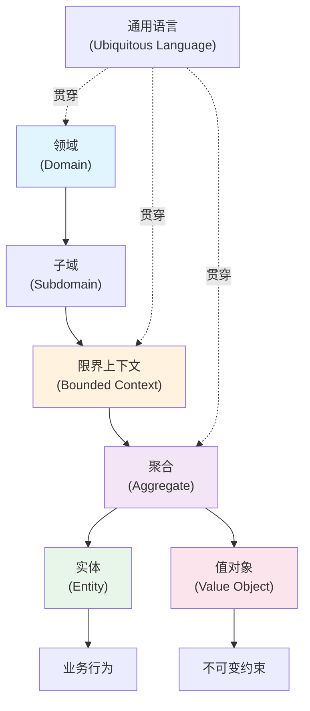
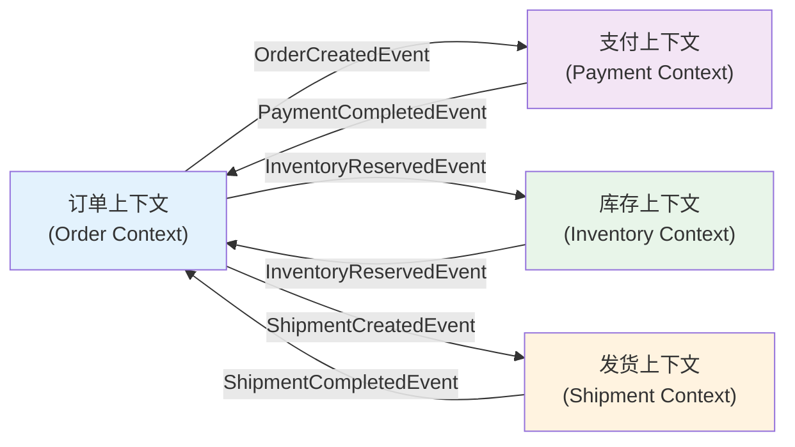

# 领域驱动设计

> DDD 不是一套建模技巧集合，而是一种**在复杂业务系统中，通过语言、边界与模型压缩认知复杂度、协调组织协作的系统性方法论**。


---

## 第一性原理层（Why）——DDD 为什么存在

### 1. 复杂系统的根本矛盾

* 业务复杂度随时间 **不可逆增长**
* 人类个体认知能力 **强约束**
* 团队协作导致 **认知分裂与语义漂移**

> **DDD 解决的根本问题**：
> 如何在长期演进的复杂系统中，让多个角色对“系统是什么、在做什么”保持一致理解。

---

### 2. DDD 的第一性原理

| 原理       | 本质解释                      |
| -------- | ------------------------- |
| 语言即模型    | 语言是认知的载体，不一致的语言必然导致不一致的系统 |
| 边界先于实现   | 不清晰的边界会放大复杂度              |
| 不变性优先    | 稳定的不变性是系统演进的锚点            |
| 模型是认知压缩  | 好模型 = 用更少概念表达更多规则         |
| 架构是组织的映射 | 系统结构反映沟通结构（Conway 定律）     |

---

## DDD 核心概念关系图


```mermaid
graph TD
    A["领域<br/>(Domain)"] --> B["子域<br/>(Subdomain)"]
    B --> C["限界上下文<br/>(Bounded Context)"]
    C --> D["聚合<br/>(Aggregate)"]
    D --> E["实体<br/>(Entity)"]
    D --> F["值对象<br/>(Value Object)"]
    E --> G["业务行为"]
    F --> H["不可变约束"]

    I["通用语言<br/>(Ubiquitous Language)"] -.->|贯穿| A
    I -.->|贯穿| C
    I -.->|贯穿| D

    style A fill:#e1f5ff
    style C fill:#fff3e0
    style D fill:#f3e5f5
    style E fill:#e8f5e9
    style F fill:#fce4ec
```

---

## 认知与语言层（What）——我们如何理解业务世界

### 1. 领域（Domain）

> **领域 = 一个被语言和规则定义的问题空间**

* 不是“系统边界”
* 而是“业务问题的认知边界”

---

### 2. 子域（Subdomain）

子域是对领域的**问题拆分方式**：

| 子域类型 | 认知价值   | 战略意义   |
| ---- | ------ | ------ |
| 核心子域 | 差异化竞争力 | 投入最强人力 |
| 支撑子域 | 支持核心   | 可内部实现  |
| 通用子域 | 通用能力   | 可购买/外包 |

> **子域划分的本质**：资源配置与注意力分配。

---

### 3. 通用语言（Ubiquitous Language）

> **通用语言 = 团队共享的业务世界观**

* 业务人员、产品、研发使用**同一组术语**
* 语言变化 = 模型变化 = 系统变化

**原则**：

* 代码是通用语言的最终载体
* 文档仅用于解释“代码未表达的意图”

---

## 模型层（How）——如何构建可演化的认知结构

### 1. 模型的定义

> **模型 = 对现实知识的有意简化 + 结构化表达**

模型的价值不在“是否完整”，而在：

* 是否帮助决策
* 是否约束行为
* 是否降低沟通成本

---

### 2. 有效建模的判定标准

| 维度   | 判定问题        |
| ---- | ----------- |
| 可执行性 | 是否能指导代码结构？  |
| 表达力  | 是否自然表达业务规则？ |
| 稳定性  | 是否围绕不变性构建？  |
| 演化性  | 是否允许逐步精进？   |

---

### 3. 模型与实现的闭环

> **脱离实现的模型必然腐化**

* 建模者必须参与编码
* 实现反向促进模型理解

---

## 战术设计层（Structure）——模型如何落地为结构

> 本层关注：**在单一边界内，如何保持模型一致性**

---

### 实体（Entity）

**设计原理**：业务中存在需要追踪生命周期、拥有唯一身份的对象。实体通过身份标识而非属性值来判断相等性。

* 由**身份标识**定义
* 拥有生命周期
* 业务行为应内聚于实体

**核心要点**：相等性基于身份，不是属性。订单 A 和订单 B 即使内容完全相同，也是不同的实体。

**常见误用**：将所有对象都设计为实体，导致系统复杂度爆炸。应该优先考虑值对象。

---

### 值对象（Value Object）

**设计原理**：某些概念本质上是对某个度量、描述或约束的表达，不需要身份追踪。值对象通过属性值判断相等性，且应该不可变。

* 无身份
* 不可变
* 表达度量、描述、约束

**核心要点**：相等性基于属性值。两个 Money(100, USD) 是相同的，无论何时创建。不可变性保证了值对象的安全性和可预测性。

**常见误用**：将值对象设计为可变，导致难以追踪状态变化。

---

### 聚合（Aggregate）

**设计原理**：在复杂业务中，多个实体和值对象需要协作维护一致性。聚合是一致性与不变性的最小边界——聚合内部强一致，聚合之间通过事件最终一致。

> **聚合 = 一致性与不变性的最小边界**

**核心原则**：

1. 只通过聚合根访问
2. 聚合内强一致
3. 聚合之间最终一致
4. 聚合要”小而自洽”

**核心要点**：聚合边界的划分决定了并发冲突的粒度。过大的聚合导致频繁锁定，过小的聚合导致频繁跨聚合操作。聚合根是唯一的访问入口，保证了内部一致性规则的执行。

**常见误用**：聚合边界划分过大，导致并发冲突和性能问题；或过小，导致频繁跨聚合操作。

---

### 领域服务（Domain Service）

**设计原理**：某些业务行为跨越多个实体，但仍属于领域逻辑。这些行为不应该强行放入某个实体，而应该用领域服务表达。

* 表达**跨实体但仍属于领域的行为**
* 无状态
* 不应成为逻辑垃圾桶

**核心要点**：领域服务是对跨聚合业务逻辑的表达，但不应该成为贫血对象的容器。如果发现领域服务中有大量逻辑，说明可能需要重新审视聚合边界。

**常见误用**：将所有业务逻辑都放入领域服务，导致实体变成贫血对象。

---

### Repository & Factory

**设计原理**：
- **Factory**：复杂对象/聚合的创建往往涉及复杂的初始化逻辑，应该用工厂封装
- **Repository**：聚合的生命周期管理（查询、保存、删除）应该通过统一接口

**核心要点**：Factory 关注”如何创建”，Repository 关注”如何获取已存在的对象”。两者都是为了隐藏复杂性，让调用者专注于业务逻辑。

> 二者的本质区别在于：
> **创建 vs 已存在对象的获取**

---

## 边界与协作层（Boundary）——如何在组织中保持一致性

### 1. 限界上下文（Bounded Context）

> **限界上下文 = 语言与模型的生效范围**

* 同名 ≠ 同义
* 上下文是语义的防火墙

---

### 上下文映射（Context Mapping）

> 上下文关系 = 组织协作关系

**映射策略对比**：

| 场景      | 推荐策略              | 适用条件 | 成本 |
| ------- | ----------------- | ------ | ---- |
| 强协作、强控制 | 共享核心模型     | 团队紧密、模型稳定 | 低 |
| 受制于外部   | 防腐层               | 依赖第三方系统 | 中 |
| 收益低     | 分开演进     | 上下文独立性强 | 低 |
| 服务化输出   | 定义标准化接口给外部 | 作为平台方 | 中 |

**决策框架**：

```
选择上下文映射策略时考虑：

1. 团队结构
   ├─ 同一团队 → 共享核心模型
   └─ 不同团队 → 防腐层或分开演进

2. 系统复杂度
   ├─ 高耦合 → 共享核心模型
   └─ 低耦合 → 分开演进

3. 演进阶段
   ├─ 单体应用 → 共享核心模型
   ├─ 微服务初期 → 防腐层
   └─ 微服务成熟 → 分开演进
```

**伪代码示例**（订单与支付上下文）：

```
// 防腐层模式：隔离外部支付系统的变化
class PaymentAntiCorruptionLayer {
  // 核心职责：转换外部模型 ↔ 内部模型
  processPayment(order: Order): PaymentResult {
    // 1. 转换：内部模型 → 外部模型
    // 2. 调用：外部支付系统
    // 3. 转换：外部模型 → 内部模型
  }
}
```

**核心要点**：防腐层的本质是隔离外部系统的变化，通过转换层将外部模型转换为内部模型。这样即使外部系统变化，内部模型保持稳定。

**常见误用**：上下文映射策略选择不当，导致过度耦合或过度分离。

---

### 电商系统的限界上下文示例


```mermaid
graph LR
    A["订单上下文<br/>(Order Context)"] -->|OrderCreatedEvent| B["支付上下文<br/>(Payment Context)"]
    B -->|PaymentCompletedEvent| A
    A -->|InventoryReservedEvent| C["库存上下文<br/>(Inventory Context)"]
    C -->|InventoryReservedEvent| A
    A -->|ShipmentCreatedEvent| D["发货上下文<br/>(Shipment Context)"]
    D -->|ShipmentCompletedEvent| A

    style A fill:#e3f2fd
    style B fill:#f3e5f5
    style C fill:#e8f5e9
    style D fill:#fff3e0
```

**上下文职责**：
- **订单上下文**：维护订单聚合，协调其他上下文
- **支付上下文**：处理支付逻辑，独立演进
- **库存上下文**：管理库存，通过事件与订单协调
- **发货上下文**：处理发货，通过事件与订单协调

---

## 演进与重构层（Evolution）——模型如何随认知成长

### 1. 重构的本质

> **DDD 重构 = 模型认知升级，而非代码洁癖**

触发信号：

* 新理解无法表达
* 隐式规则过多
* 模型开始僵化

---

### 2. 从隐式到显式

* 提炼概念
* 引入 Specification
* 将过程行为转为对象职责

---

### 3. 突破与风险

* 质变来自持续量变
* 模型突破往往意味着系统级调整

---

## 战略设计层（Direction）——长期竞争力的来源

> **战略设计的两个维度**：
> - **微观战略**：子域分类、限界上下文、上下文映射（已在前文详述）
> - **宏观战略**：大规模结构（Large-Scale Structure），用于组织多个限界上下文的整体架构

---

### 1. 核心域（Core Domain）

> **核心域 = 组织最值得投入认知与人才的地方**

| 特征 | 说明 |
|------|------|
| 高复杂度 | 需要深度专业知识和持续投入 |
| 高差异化 | 构成企业核心竞争力 |
| 高回报 | 投入产出比最高 |

---

### 2. 精炼与分离策略

| 策略 | 本质 | 适用场景 |
|------|------|--------|
| **Generic Subdomain** | 降级处理 | 通用能力，非核心竞争力 |
| **Segregated Core** | 增强内聚 | 核心域被通用逻辑污染时 |
| **Abstract Core** | 抽象不变性 | 多个子域共享核心概念时 |

---

### 3. 大规模结构（Large-Scale Structure）

> **大规模结构的本质**：在多个限界上下文之上，建立**统一的组织原则**，使系统整体具有**可理解性**和**一致性**。

**根本问题**：限界上下文数量增长后，系统整体复杂度超越人类认知上限。

**大规模结构的价值**：
- 提供一种"元模型"来组织多个上下文的关系
- 帮助新成员快速理解系统整体架构
- 在多个团队间建立统一的架构心智模型

---

#### 3.1 四种大规模结构模式的本质

| 模式 | 核心思想 | 解决的根本问题 | 何时选择 |
|------|--------|--------------|--------|
| **系统隐喻** | 用一个简单比喻描述整体架构 | 降低认知成本，建立统一心智模型 | 系统需要被广泛理解时 |
| **职责分层** | 按职责抽象级别纵向分层 | 分离关注点，建立依赖方向 | 系统需要清晰的依赖关系时 |
| **知识层** | 分离"规则定义"与"规则执行" | 应对策略频繁变化的复杂度 | 业务规则需要高度灵活性时 |
| **可插拔框架** | 核心稳定、扩展可变 | 支持第三方扩展，保持核心稳定 | 需要生态扩展时 |

---

#### 3.2 系统隐喻（System Metaphor）

> **系统隐喻 = 用一个简单的比喻来描述系统整体架构**

**本质**：通过类比已知系统，降低对新系统的理解成本。

**核心价值**：
- 用一个词或短语让所有人理解系统"是什么"
- 指导代码结构和命名的一致性
- 降低沟通成本，建立统一语言

**设计原则**：
- 隐喻必须能贯穿多个限界上下文
- 隐喻应指导代码结构，而非仅停留在文档
- 隐喻过度延伸时需重新审视

**风险**：隐喻可能掩盖真实业务逻辑，导致设计僵化。

---

#### 3.3 职责分层（Responsibility Layers）

> **职责分层 = 按职责类型对多个限界上下文进行分层组织**

**本质**：每一层代表一种职责抽象级别，上层依赖下层，下层独立于上层。

**核心价值**：
- 建立清晰的依赖方向
- 分离关注点，降低耦合
- 支持各层独立演进

**分层原则**：
- 上层可依赖下层，下层不可依赖上层
- 依赖抽象而非具体实现（依赖倒置）
- 层间通过明确接口通信

**与限界上下文的关系**：
- 分层是**纵向**职责划分
- 限界上下文是**横向**业务边界
- 一个限界上下文可跨越多个层次

---

#### 3.4 知识层（Knowledge Level）

> **知识层 = 将"业务规则的定义"与"业务规则的执行"分离**

**本质**：当系统需要支持多种业务策略、且策略频繁变化时，将策略定义抽象为独立的知识层。

**核心价值**：
- 应对策略频繁变化的复杂度
- 支持同一系统多套策略体系
- 将业务规则显式化、可配置化

**何时选择**：
- 业务规则需要动态配置
- 同一系统需支持多套策略体系
- 策略组合复杂度超越硬编码可管理范围

**风险**：过度设计——简单场景引入知识层反而增加复杂度。

---

#### 3.5 可插拔组件框架（Pluggable Component Framework）

> **可插拔组件框架 = 定义一组接口和协议，允许第三方组件动态扩展系统能力**

**本质**：将系统核心能力与扩展能力分离，通过标准化接口实现即插即用。

**核心价值**：
- 核心系统保持稳定
- 扩展能力可频繁变化
- 支持第三方开发者扩展系统能力

**设计原则**：
- 核心框架稳定，插件可频繁变化
- 插件间相互隔离，互不影响
- 插件生命周期可管理（加载、卸载、热更新）

**与限界上下文的关系**：
- 可插拔框架本身可作为一个限界上下文
- 每个插件也可视为独立的限界上下文

---

#### 3.6 大规模结构的选择原则

| 考量维度 | 决策问题 | 指导原则 |
|--------|--------|--------|
| **认知成本** | 新成员能否快速理解系统整体？ | 优先选择系统隐喻 |
| **依赖管理** | 系统依赖关系是否清晰？ | 优先选择职责分层 |
| **变化频率** | 业务规则是否频繁变化？ | 优先选择知识层 |
| **扩展需求** | 是否需要第三方扩展？ | 优先选择可插拔框架 |

> **核心原则**：大规模结构是**认知工具**，而非技术约束。选择的标准是"是否降低了整体复杂度"，而非"是否符合某种模式"。

## 适用边界与常见误区

### 1. DDD 不解决的问题

* 性能极限
* 人员能力差异
* 需求本身不清晰

---

### 2. 常见误区

* 所有系统都用 DDD
* 战术设计替代战略思考
* 把 DDD 当成代码规范

---

## 反模式与陷阱

### 1. 聚合边界划分错误

**问题**：聚合边界过大或过小，导致并发冲突或频繁跨聚合操作。

**表现**：
- 过大聚合：订单聚合包含所有订单项、支付、发货等，导致并发修改冲突
- 过小聚合：每个订单项都是独立聚合，导致频繁跨聚合事务

**修复方案**：
- 聚合边界应该围绕一致性规则划分，而非数据关系
- 支付、发货等应该是独立聚合，通过事件与订单协调
- 原则：聚合内强一致，聚合间最终一致

---

### 2. 过度设计（过多的值对象）

**问题**：为了追求"纯净"而创建过多值对象，导致代码复杂度反而增加。

**表现**：
- 每个字段都包装成值对象（OrderId、CustomerId、Timestamp 等）
- 维护成本高，收益低

**修复方案**：
- 只为有业务规则、需要不可变性的概念创建值对象
- 简单的标识符、时间戳可以用基本类型
- 原则：复杂度与收益的平衡

---

### 3. 通用语言漂移

**问题**：团队对同一术语的理解逐渐分化，导致代码与业务脱节。

**表现**：
- 代码中的"订单"与业务人员理解的"订单"含义不同
- 不同模块对同一概念有不同实现
- 文档与代码不一致

**修复方案**：
- 建立术语表，明确关键概念的定义
- 定期与业务人员同步术语理解
- 代码注释中明确术语定义
- 文档与代码保持一致

---

### 4. 限界上下文泄露

**问题**：限界上下文的边界不清晰，导致模型污染和耦合。

**表现**：
- 订单上下文直接引用支付上下文的模型
- 支付上下文直接引用订单上下文的模型
- 上下文间的依赖关系混乱

**修复方案**：
- 上下文间只通过标识符引用，不包含对象
- 通过事件或 API 进行协调
- 原则：上下文是语义的防火墙，边界必须清晰

---

## 演进阶段指导

### 单体应用中的 DDD

**特点**：所有限界上下文在同一进程中运行。

**应用方式**：
- 聚合、限界上下文的逻辑划分
- 通过包结构体现上下文边界
- 使用本地事件总线协调上下文

**核心要点**：在单体应用中，DDD 的价值在于通过清晰的模型和边界管理复杂度，为未来的微服务化做准备。

---

### 微服务中的 DDD

**特点**：每个限界上下文对应一个微服务。

**应用方式**：
- 限界上下文与服务边界对应
- 通过 API 或消息队列协调服务
- 使用防腐层隔离外部服务变化

**核心要点**：微服务中的 DDD 强调上下文的独立性和自治性。每个服务维护自己的聚合，通过事件驱动实现最终一致性。

---

## 总结：DDD 的真正价值

> **DDD 的终极价值不在于“代码长什么样”，而在于：**

* 团队是否拥有一致的业务世界观
* 系统是否围绕不变性演进
* 组织是否通过模型降低了复杂度

## 关联内容（自动生成）

- [/软件工程/微服务/服务建模.md](/软件工程/微服务/服务建模.md) 服务建模中详细讨论了DDD的聚合、实体、值对象等概念在微服务架构中的应用
- [/软件工程/架构/系统设计/业务建模.md](/软件工程/架构/系统设计/业务建模.md) 业务建模涵盖了DDD中的限界上下文、实体、值对象、聚合等核心概念
- [/软件工程/架构模式/分层架构.md](/软件工程/架构模式/分层架构.md) 分层架构与DDD紧密结合，DDD的分层架构将业务核心（Domain）作为稳定层
- [/软件工程/架构模式/基本模式.md](/软件工程/架构模式/基本模式.md) 基本模式中包含了值对象等DDD核心概念的详细说明
- [/软件工程/理论/结构化分析方法.md](/软件工程/理论/结构化分析方法.md) 结构化分析与DDD结合使用，结构化分析侧重信息流与过程，领域驱动设计侧重领域模型和业务逻辑封装
- [/数据技术/数据网格.md](/数据技术/数据网格.md) 数据网格采用领域驱动设计思想，通过领域导向的数据所有权实现数据架构的合理划分
- [/编程语言/JAVA/框架/ORM.md](/编程语言/JAVA/框架/ORM.md) ORM框架通过实体映射实现对象-关系映射，与DDD的实体概念相关联
- [/软件工程/设计模式/创建型模式.md](/软件工程/设计模式/创建型模式.md) 创建型模式在领域模型构建中发挥重要作用，与DDD中的工厂模式等概念相关

