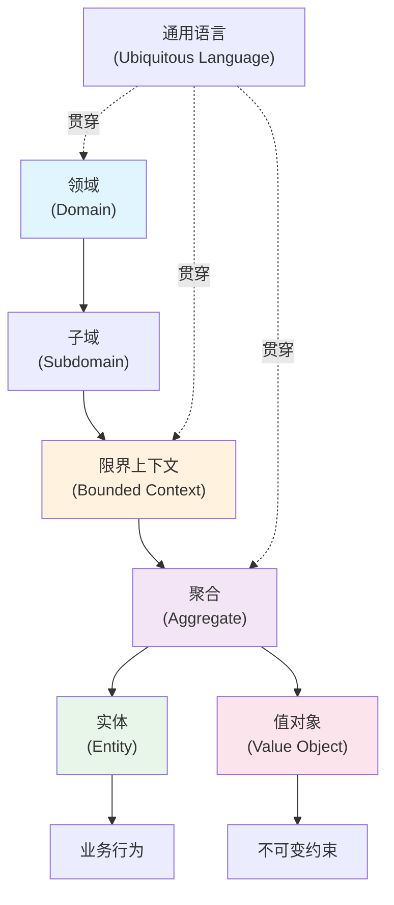
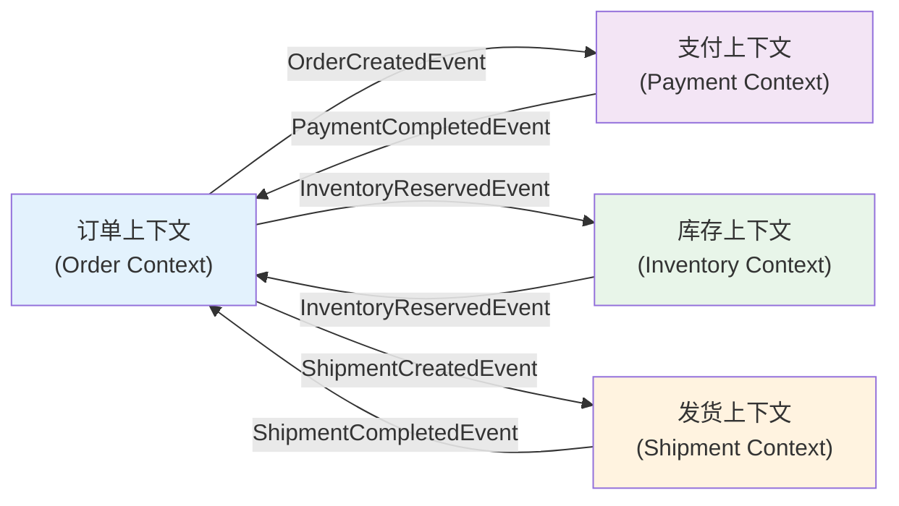

# 领域驱动设计

> DDD 不是一套建模技巧集合，而是一种**在复杂业务系统中，通过语言、边界与模型压缩认知复杂度、协调组织协作的系统性方法论**。


## 第一性原理层（Why）——DDD 为什么存在

### 复杂系统的根本矛盾

* 业务复杂度随时间 **不可逆增长**
* 人类个体认知能力 **强约束**
* 团队协作导致 **认知分裂与语义漂移**

> **DDD 解决的根本问题**：如何在长期演进的复杂系统中，让多个角色对"系统是什么、在做什么"保持一致理解。

### DDD 的第一性原理

| 原理       | 本质解释                      |
| -------- | ------------------------- |
| 语言即模型    | 语言是认知的载体，不一致的语言必然导致不一致的系统 |
| 边界先于实现   | 不清晰的边界会放大复杂度              |
| 不变性优先    | 稳定的不变性是系统演进的锚点            |
| 模型是认知压缩  | 好模型 = 用更少概念表达更多规则         |
| 架构是组织的映射 | 系统结构反映沟通结构（Conway 定律）     |

## DDD 核心概念关系图


```mermaid
graph TD
    A["领域<br/>(Domain)"] --> B["子域<br/>(Subdomain)"]
    B --> C["限界上下文<br/>(Bounded Context)"]
    C --> D["聚合<br/>(Aggregate)"]
    D --> E["实体<br/>(Entity)"]
    D --> F["值对象<br/>(Value Object)"]
    E --> G["业务行为"]
    F --> H["不可变约束"]

    I["通用语言<br/>(Ubiquitous Language)"] -.->|贯穿| A
    I -.->|贯穿| C
    I -.->|贯穿| D

    style A fill:#e1f5ff
    style C fill:#fff3e0
    style D fill:#f3e5f5
    style E fill:#e8f5e9
    style F fill:#fce4ec
```

## 认知与语言层（What）——我们如何理解业务世界

### 领域（Domain）

> **领域 = 一个被语言和规则定义的问题空间**

* 不是"系统边界"
* 而是"业务问题的认知边界"

### 子域（Subdomain）

子域是对领域的**问题拆分方式**：

| 子域类型 | 认知价值   | 战略意义   |
| ---- | ------ | ------ |
| 核心子域 | 差异化竞争力 | 投入最强人力 |
| 支撑子域 | 支持核心   | 可内部实现  |
| 通用子域 | 通用能力   | 可购买/外包 |

> **子域划分的本质**：资源配置与注意力分配。

### 通用语言（Ubiquitous Language）

> **通用语言 = 团队共享的业务世界观**

* 业务人员、产品、研发使用**同一组术语**
* 语言变化 = 模型变化 = 系统变化

**原则**：

* 代码是通用语言的最终载体
* 文档仅用于解释"代码未表达的意图"

## 模型层（How）——如何构建可演化的认知结构

### 模型的定义

> **模型 = 对现实知识的有意简化 + 结构化表达**

模型的价值不在"是否完整"，而在：

* 是否帮助决策
* 是否约束行为
* 是否降低沟通成本

### 有效建模的判定标准

| 维度   | 判定问题        |
| ---- | ----------- |
| 可执行性 | 是否能指导代码结构？  |
| 表达力  | 是否自然表达业务规则？ |
| 稳定性  | 是否围绕不变性构建？  |
| 演化性  | 是否允许逐步精进？   |

### 模型与实现的闭环

> **脱离实现的模型必然腐化**

* 建模者必须参与编码
* 实现反向促进模型理解

## 战术设计层（Structure）——模型如何落地为结构

> 本层关注：**在单一边界内，如何保持模型一致性**

### 实体（Entity）

**设计原理**：业务中存在需要追踪生命周期、拥有唯一身份的对象。实体通过身份标识而非属性值判断相等性。

* 由**身份标识**定义
* 拥有生命周期
* 业务行为应内聚于实体

**核心要点**：相等性基于身份，不是属性。订单 A 和订单 B 即使内容完全相同，也是不同的实体。

**常见误用**：将所有对象都设计为实体，导致系统复杂度爆炸。应该优先考虑值对象。

### 值对象（Value Object）

**设计原理**：某些概念本质上是对某个度量、描述或约束的表达，不需要身份追踪。值对象通过属性值判断相等性，且应该不可变。

* 无身份
* 不可变
* 表达度量、描述、约束

**核心要点**：相等性基于属性值。两个 Money(100, USD) 是相同的，无论何时创建。不可变性保证了值对象的安全性和可预测性。

**常见误用**：将值对象设计为可变，导致难以追踪状态变化。

### 聚合（Aggregate）

**设计原理**：在复杂业务中，多个实体和值对象需要协作维护一致性。聚合是一致性与不变性的最小边界——聚合内部强一致，聚合之间通过事件最终一致。

> **聚合 = 一致性与不变性的最小边界**

**核心原则**：

1. 只通过聚合根访问
2. 聚合内强一致
3. 聚合之间最终一致
4. 聚合要"小而自洽"

**核心要点**：聚合边界的划分决定了并发冲突的粒度。过大的聚合导致频繁锁定，过小的聚合导致频繁跨聚合操作。聚合根是唯一的访问入口，保证了内部一致性规则的执行。

**常见误用**：聚合边界划分过大，导致并发冲突和性能问题；或过小，导致频繁跨聚合操作。

### 领域服务（Domain Service）

**设计原理**：某些业务行为跨越多个实体，但仍属于领域逻辑。这些行为不应该强行放入某个实体，而应该用领域服务表达。

* 表达**跨实体但仍属于领域的行为**
* 无状态
* 不应成为逻辑垃圾桶

**核心要点**：领域服务是对跨聚合业务逻辑的表达，但不应该成为贫血对象的容器。如果发现领域服务中有大量逻辑，说明可能需要重新审视聚合边界。

**常见误用**：将所有业务逻辑都放入领域服务，导致实体变成贫血对象。

### Repository & Factory

**设计原理**：
- **Factory**：复杂对象/聚合的创建往往涉及复杂的初始化逻辑，应该用工厂封装
- **Repository**：聚合的生命周期管理（查询、保存、删除）应该通过统一接口

**核心要点**：Factory 关注"如何创建"，Repository 关注"如何获取已存在的对象"。两者都是为了隐藏复杂性，让调用者专注于业务逻辑。

> 二者的本质区别在于：
> **创建 vs 已存在对象的获取**

## 边界与协作层（Boundary）——如何在组织中保持一致性

### 限界上下文（Bounded Context）

> **限界上下文 = 语言与模型的生效范围边界**

#### 为什么需要限界上下文

在大型系统中，同一个词在不同上下文里代表不同概念——"账户"在财务上下文是资产负债结构，在用户上下文是认证凭据，在游戏上下文是角色档案。如果强行统一为一个"通用账户模型"，结果是每个上下文都要为自己不关心的字段买单，模型变得臃肿且无法演进。

限界上下文的本质是**拒绝语义上的全局一致性**，转而在每个边界内维护局部一致性——边界内语言精确、模型清晰，边界间通过显式协议通信。

#### 子域 vs 限界上下文

这是 DDD 中最常被混淆的概念：

| 维度 | 子域（Subdomain） | 限界上下文（Bounded Context） |
|------|-----------------|--------------------------|
| 属于 | 问题空间（Problem Space） | 解决方案空间（Solution Space） |
| 定义者 | 业务本身决定 | 团队/架构师划分 |
| 可变性 | 相对稳定 | 可按需调整 |
| 关系 | 一个子域可对应多个上下文 | 一个上下文可跨越多个子域 |

> 子域描述"业务问题的自然边界"，限界上下文是"我们决定如何建模它"的解决方案边界。理想情况下二者对齐，现实中经常需要权衡。

#### 如何识别限界上下文边界

**语言分歧是最强烈的信号**：当同一术语在不同场合被不同方式使用时，说明语义边界已经存在，只是没有被显式化。

常见的划分依据：

| 依据 | 说明 |
|------|------|
| **语言断层** | 同一概念在两个团队/场景中含义不同 |
| **不变量隔离** | 某些业务规则只在特定范围内成立 |
| **团队自治边界** | 独立部署、独立发布、独立演进的能力边界 |
| **数据所有权** | 谁有权修改这条数据，谁拥有该上下文 |
| **生命周期差异** | 概念在不同上下文中的生命周期不同（如"订单"从下单到发货是一段，从财务角度是另一段） |

### 上下文映射（Context Mapping）

> 上下文关系 = 组织协作关系

**映射策略对比**：

| 策略 | 场景 | 权力关系 | 适用条件 | 集成成本 |
| --- | --- | --- | --- | --- |
| **共享内核**（Shared Kernel） | 强协作、强共享 | 对等 | 同一团队、模型高度稳定 | 低（但变更需双方协商） |
| **合作关系**（Partnership） | 共同演进、强依赖 | 对等 | 两个上下文紧密配合、共同规划发布 | 中 |
| **客户/供应商**（Customer/Supplier） | 上下游依赖 | 非对等（下游可影响上游） | 下游团队能参与上游规划 | 中 |
| **遵奉者**（Conformist） | 完全跟随上游 | 非对等（上游主导） | 下游无法影响上游、愿意接受上游模型 | 低（但模型侵蚀风险高） |
| **防腐层**（Anti-Corruption Layer） | 受制于外部 | 非对等（保护自身） | 依赖遗留系统或第三方，不愿被污染 | 高 |
| **开放主机服务**（Open Host Service） | 服务化输出 | 上游主导 | 作为平台方，服务多个下游消费者 | 中 |
| **发布语言**（Published Language） | 标准化集成 | 上游主导 | 需要通用的、文档化的交换格式（常与开放主机服务组合使用） | 中 |
| **各行其道**（Separate Ways） | 收益不足以集成 | 无关 | 上下文独立性强，集成复杂度超过收益 | 无 |

> **关键区分**：遵奉者 vs 防腐层——同样是下游跟随上游，遵奉者直接接受上游模型（主动放弃隔离），防腐层主动建立翻译层（保护内部模型）。

**决策框架**：

```
选择上下文映射策略时考虑：

1. 团队权力关系
   ├─ 对等协作 → 共享内核 / 合作关系
   ├─ 上下游、下游有话语权 → 客户/供应商
   └─ 上下游、下游无话语权 → 遵奉者 / 防腐层

2. 是否需要隔离外部模型
   ├─ 需要隔离（第三方/遗留系统）→ 防腐层
   └─ 可接受上游模型 → 遵奉者

3. 作为服务提供方
   ├─ 多个下游消费者 → 开放主机服务
   └─ 需要标准交换格式 → 发布语言（配合开放主机服务）

4. 集成收益判断
   └─ 集成成本 > 收益 → 各行其道
```

**伪代码示例**（订单与支付上下文）：

```
// 防腐层模式：隔离外部支付系统的变化
class PaymentAntiCorruptionLayer {
  // 核心职责：转换外部模型 ↔ 内部模型
  processPayment(order: Order): PaymentResult {
    // 1. 转换：内部模型 → 外部模型
    // 2. 调用：外部支付系统
    // 3. 转换：外部模型 → 内部模型
  }
}
```

**核心要点**：防腐层的本质是隔离外部系统的变化，通过转换层将外部模型转换为内部模型。这样即使外部系统变化，内部模型保持稳定。

**常见误用**：上下文映射策略选择不当，导致过度耦合或过度分离。

### 电商系统的限界上下文示例


```mermaid
graph LR
    A["订单上下文<br/>(Order Context)"] -->|OrderCreatedEvent| B["支付上下文<br/>(Payment Context)"]
    B -->|PaymentCompletedEvent| A
    A -->|InventoryReservedEvent| C["库存上下文<br/>(Inventory Context)"]
    C -->|InventoryReservedEvent| A
    A -->|ShipmentCreatedEvent| D["发货上下文<br/>(Shipment Context)"]
    D -->|ShipmentCompletedEvent| A

    style A fill:#e3f2fd
    style B fill:#f3e5f5
    style C fill:#e8f5e9
    style D fill:#fff3e0
```

**上下文职责**：
- **订单上下文**：维护订单聚合，协调其他上下文
- **支付上下文**：处理支付逻辑，独立演进
- **库存上下文**：管理库存，通过事件与订单协调
- **发货上下文**：处理发货，通过事件与订单协调

## 演进与重构层（Evolution）——模型如何随认知成长

### 重构的本质

> **DDD 重构 = 模型认知升级，而非代码洁癖**

模型重构的根本驱动力是**认知的深化**。当团队对业务的理解超越了当前模型的表达能力，重构就是必然的。

**触发信号**：

| 信号类型 | 具体表现 | 根本原因 |
|---------|---------|---------|
| 语言失效 | 团队开始用"绕行说法"描述业务 | 模型无法承载新业务概念 |
| 隐式规则泛滥 | 大量业务规则散落在服务层 | 领域概念未被对象化 |
| 边界模糊 | 一个改动牵动多个聚合 | 聚合边界划分失当 |
| 模型僵化 | 新需求总是"不得不"绕过模型 | 核心抽象已不再稳定 |
| 认知分裂 | 不同团队对同一概念理解不一致 | 通用语言已发生漂移 |

### 认知突破的来源

> **模型进化的本质是认知突破，而认知突破来自深度对话**

* **业务深度对话**：与领域专家的深入交流常常揭露隐藏的业务规则
* **代码中的坏味道**：贫血模型、过胖的服务层，往往是领域概念缺失的信号
* **新业务场景**：边缘场景常常暴露当前模型假设的局限性
* **压力测试**：高并发、高复杂度下，模型的边界问题会被放大

### 从隐式到显式

> **DDD 演进的方向：让隐藏在代码注释和口口相传中的业务规则，成为可执行的模型对象**

**三种提炼手法**：

| 手法 | 本质 | 示例 |
|------|------|------|
| **概念提炼** | 命名一个之前无名的概念 | 发现"退款窗口期"是独立的业务规则，提炼为值对象 |
| **引入 Specification** | 将复杂业务判断规则对象化，使其可组合、可测试 | `OrderEligibleForRefund` 替代散落各处的 if 判断 |
| **过程行为对象化** | 将流程性逻辑封装为领域服务或策略对象 | 将定价逻辑从服务层提炼为 `PricingPolicy` |

### 常见重构模式

| 模式 | 触发场景 | 核心动作 |
|------|---------|---------|
| **拆分聚合** | 聚合过大、事务边界不清 | 识别独立不变量，分裂为多个小聚合 |
| **提炼子域** | 某块业务增长为独立关注点 | 从大上下文中划出新的限界上下文 |
| **引入领域事件** | 上下文间耦合过紧 | 用事件替代直接调用，解耦协作关系 |
| **统一通用语言** | 团队用词出现分歧 | 召集领域专家重新对齐语言，同步到代码 |
| **上下文边界迁移** | 某个概念归属模糊 | 重新谈判边界，搬移模型到正确上下文 |

### 演进节奏与风险控制

> **模型突破往往意味着系统级调整，需要有节奏地推进**

**风险来源**：模型重构不仅是技术动作，还是组织认知的同步过程。代码改了但语言没改、文档没改，重构就是半成品。

**安全演进的节奏**：

```
1. 语言先行  → 先在团队中对齐新概念，确认认知一致
2. 模型试点  → 在新代码路径中使用新模型，旧路径保持不动
3. 双轨并行  → 新旧模型共存，通过防腐层隔离
4. 逐步迁移  → 将旧逻辑逐步迁移到新模型
5. 清除遗留  → 确认迁移完成后，删除旧模型
```

### 团队认知同步

> **模型变了，通用语言必须同步变，否则重构无效**

这是 DDD 演进中最常被忽视的环节：

* 模型重构后，**词汇表必须更新**
* 日常对话、需求文档、代码命名必须同步使用新语言
* **语言漂移是模型腐化的早期信号**，需要持续维护

## 战略设计层（Direction）——长期竞争力的来源

> **战略设计的两个维度**：
> - **微观战略**：子域分类、限界上下文、上下文映射（已在前文详述）
> - **宏观战略**：大规模结构（Large-Scale Structure），用于组织多个限界上下文的整体架构

### 核心域（Core Domain）

> **核心域 = 组织最值得投入认知与人才的地方**

| 特征 | 说明 |
|------|------|
| 高复杂度 | 需要深度专业知识和持续投入 |
| 高差异化 | 构成企业核心竞争力 |
| 高回报 | 投入产出比最高 |

**核心域的现实困境**：随着系统演进，核心域的代码往往会被通用逻辑侵蚀、边界模糊，导致最重要的业务逻辑淹没在技术噪音中。精炼策略就是用来**重新找回核心域纯净性**的工具。

**精炼策略**：

| 策略 | 解决的问题 | 本质动作 | 适用场景 |
|------|-----------|---------|--------|
| **Generic Subdomain**（通用子域剥离） | 核心域混入了大量通用能力（如权限、日志、消息），稀释了核心注意力 | 识别并踢出非差异化能力，交给外部系统或独立团队 | 系统中存在大量与业务竞争力无关的通用模块 |
| **Segregated Core**（隔离核心） | 核心域代码与支撑逻辑混在同一模块，难以识别和保护核心 | 在同一上下文内，将核心代码物理隔离为独立包/模块 | 核心域已识别，但边界在代码层面仍不清晰 |
| **Abstract Core**（抽象核心） | 多个子域重复表达同一套核心概念，导致概念漂移和重复建模 | 将跨子域共享的不变性向上提炼为抽象层 | 多个限界上下文存在共享的核心业务概念 |

> **三者关系**：Generic Subdomain 解决"混入了什么不该有的"，Segregated Core 解决"核心在哪里看不清"，Abstract Core 解决"核心被重复表达了"。三者可组合使用，共同服务于同一个目标——让核心域保持纯粹、可识别、可演进。

### 大规模结构（Large-Scale Structure）

> **大规模结构的本质**：在多个限界上下文之上，建立**统一的组织原则**，使系统整体具有**可理解性**和**一致性**。

**根本问题**：限界上下文数量增长后，系统整体复杂度超越人类认知上限。

**大规模结构的价值**：
- 提供一种"元模型"来组织多个上下文的关系
- 帮助新成员快速理解系统整体架构
- 在多个团队间建立统一的架构心智模型

#### 四种大规模结构模式的本质

| 模式 | 核心思想 | 解决的根本问题 | 何时选择 |
|------|--------|--------------|--------|
| **系统隐喻** | 用一个简单比喻描述整体架构 | 降低认知成本，建立统一心智模型 | 系统需要被广泛理解时 |
| **职责分层** | 按职责抽象级别纵向分层 | 分离关注点，建立依赖方向 | 系统需要清晰的依赖关系时 |
| **知识层** | 分离"规则定义"与"规则执行" | 应对策略频繁变化的复杂度 | 业务规则需要高度灵活性时 |
| **可插拔框架** | 核心稳定、扩展可变 | 支持第三方扩展，保持核心稳定 | 需要生态扩展时 |

#### 系统隐喻（System Metaphor）

> **系统隐喻 = 用一个简单的比喻来描述系统整体架构**

**本质**：通过类比已知系统，降低对新系统的理解成本。

**核心价值**：
- 用一个词或短语让所有人理解系统"是什么"
- 指导代码结构和命名的一致性
- 降低沟通成本，建立统一语言

**设计原则**：
- 隐喻必须能贯穿多个限界上下文
- 隐喻应指导代码结构，而非仅停留在文档
- 隐喻过度延伸时需重新审视

**风险**：隐喻可能掩盖真实业务逻辑，导致设计僵化。

#### 职责分层（Responsibility Layers）

> **职责分层 = 按职责类型对多个限界上下文进行分层组织**

**本质**：每一层代表一种职责抽象级别，上层依赖下层，下层独立于上层。

**核心价值**：
- 建立清晰的依赖方向
- 分离关注点，降低耦合
- 支持各层独立演进

**分层原则**：
- 上层可依赖下层，下层不可依赖上层
- 依赖抽象而非具体实现（依赖倒置）
- 层间通过明确接口通信

**与限界上下文的关系**：
- 分层是**纵向**职责划分
- 限界上下文是**横向**业务边界
- 一个限界上下文可跨越多个层次

#### 知识层（Knowledge Level）

> **知识层 = 将"业务规则的定义"与"业务规则的执行"分离**

**本质**：当系统需要支持多种业务策略、且策略频繁变化时，将策略定义抽象为独立的知识层。

**核心价值**：
- 应对策略频繁变化的复杂度
- 支持同一系统多套策略体系
- 将业务规则显式化、可配置化

**何时选择**：
- 业务规则需要动态配置
- 同一系统需支持多套策略体系
- 策略组合复杂度超越硬编码可管理范围

**风险**：过度设计——简单场景引入知识层反而增加复杂度。

#### 可插拔组件框架（Pluggable Component Framework）

> **可插拔组件框架 = 定义一组接口和协议，允许第三方组件动态扩展系统能力**

**本质**：将系统核心能力与扩展能力分离，通过标准化接口实现即插即用。

**核心价值**：
- 核心系统保持稳定
- 扩展能力可频繁变化
- 支持第三方开发者扩展系统能力

**设计原则**：
- 核心框架稳定，插件可频繁变化
- 插件间相互隔离，互不影响
- 插件生命周期可管理（加载、卸载、热更新）

**与限界上下文的关系**：
- 可插拔框架本身可作为一个限界上下文
- 每个插件也可视为独立的限界上下文

#### 大规模结构的选择原则

| 考量维度 | 决策问题 | 指导原则 |
|--------|--------|--------|
| **认知成本** | 新成员能否快速理解系统整体？ | 优先选择系统隐喻 |
| **依赖管理** | 系统依赖关系是否清晰？ | 优先选择职责分层 |
| **变化频率** | 业务规则是否频繁变化？ | 优先选择知识层 |
| **扩展需求** | 是否需要第三方扩展？ | 优先选择可插拔框架 |

> **核心原则**：大规模结构是**认知工具**，而非技术约束。选择的标准是"是否降低了整体复杂度"，而非"是否符合某种模式"。

## 边界、误区与反模式

### DDD 不解决的问题

* 性能极限
* 人员能力差异
* 需求本身不清晰

### 常见误区

* 所有系统都用 DDD
* 战术设计替代战略思考
* 把 DDD 当成代码规范

#### 反模式

#### 聚合边界划分错误

**问题**：聚合边界过大或过小，导致并发冲突或频繁跨聚合操作。

**表现**：
- 过大聚合：订单聚合包含所有订单项、支付、发货等，导致并发修改冲突
- 过小聚合：每个订单项都是独立聚合，导致频繁跨聚合事务

**修复方案**：
- 聚合边界应该围绕一致性规则划分，而非数据关系
- 支付、发货等应该是独立聚合，通过事件与订单协调
- 原则：聚合内强一致，聚合间最终一致

#### 过度设计（过多的值对象）

**问题**：为了追求"纯净"而创建过多值对象，导致代码复杂度反而增加。

**表现**：
- 每个字段都包装成值对象（OrderId、CustomerId、Timestamp 等）
- 维护成本高，收益低

**修复方案**：
- 只为有业务规则、需要不可变性的概念创建值对象
- 简单的标识符、时间戳可以用基本类型
- 原则：复杂度与收益的平衡

#### 通用语言漂移

**问题**：团队对同一术语的理解逐渐分化，导致代码与业务脱节。

**表现**：
- 代码中的"订单"与业务人员理解的"订单"含义不同
- 不同模块对同一概念有不同实现
- 文档与代码不一致

**修复方案**：
- 建立术语表，明确关键概念的定义
- 定期与业务人员同步术语理解
- 代码注释中明确术语定义
- 文档与代码保持一致

#### 限界上下文泄露

**问题**：限界上下文的边界不清晰，导致模型污染和耦合。

**表现**：
- 订单上下文直接引用支付上下文的模型
- 支付上下文直接引用订单上下文的模型
- 上下文间的依赖关系混乱

**修复方案**：
- 上下文间只通过标识符引用，不包含对象
- 通过事件或 API 进行协调
- 原则：上下文是语义的防火墙，边界必须清晰

## 演进阶段指导

### 单体应用中的 DDD

**特点**：所有限界上下文在同一进程中运行。

**应用方式**：
- 聚合、限界上下文的逻辑划分
- 通过包结构体现上下文边界
- 使用本地事件总线协调上下文

**核心要点**：在单体应用中，DDD 的价值在于通过清晰的模型和边界管理复杂度，为未来的微服务化做准备。

### 微服务中的 DDD

**特点**：每个限界上下文对应一个微服务。

**应用方式**：
- 限界上下文与服务边界对应
- 通过 API 或消息队列协调服务
- 使用防腐层隔离外部服务变化

**核心要点**：微服务中的 DDD 强调上下文的独立性和自治性。每个服务维护自己的聚合，通过事件驱动实现最终一致性。

## 总结：DDD 的真正价值

> **DDD 的终极价值不在于"代码长什么样"，而在于：**

* 团队是否拥有一致的业务世界观
* 系统是否围绕不变性演进
* 组织是否通过模型降低了复杂度

## 关联内容（自动生成）

- [/软件工程/架构/系统设计/业务建模.md](/软件工程/架构/系统设计/业务建模.md) 业务建模是 DDD 战略设计的核心实践，限界上下文、聚合、领域事件等概念为业务建模提供了结构化方法
- [/软件工程/微服务/服务建模.md](/软件工程/微服务/服务建模.md) 服务建模以 DDD 为理论基础，限界上下文与聚合直接指导微服务边界划分
- [/软件工程/微服务/微服务.md](/软件工程/微服务/微服务.md) DDD 是微服务架构的核心理论基础，通过限界上下文实现服务合理拆分
- [/软件工程/架构模式/分层架构.md](/软件工程/架构模式/分层架构.md) DDD 分层架构将业务核心（Domain）作为稳定层，是分层架构的深化应用
- [/软件工程/架构模式/基本模式.md](/软件工程/架构模式/基本模式.md) 包含值对象、映射器等 DDD 核心战术模式，是 DDD 落地的基础构件
- [/数据技术/数据网格.md](/数据技术/数据网格.md) 数据网格采用 DDD 领域导向思想，通过领域所有权实现数据架构的合理划分
- [/软件工程/架构/架构治理.md](/软件工程/架构/架构治理.md) DDD 的通用语言、模型治理机制是架构治理的重要组成部分
- [/软件工程/架构/演进式架构.md](/软件工程/架构/演进式架构.md) DDD 强调模型随认知演进，与演进式架构理念高度契合
