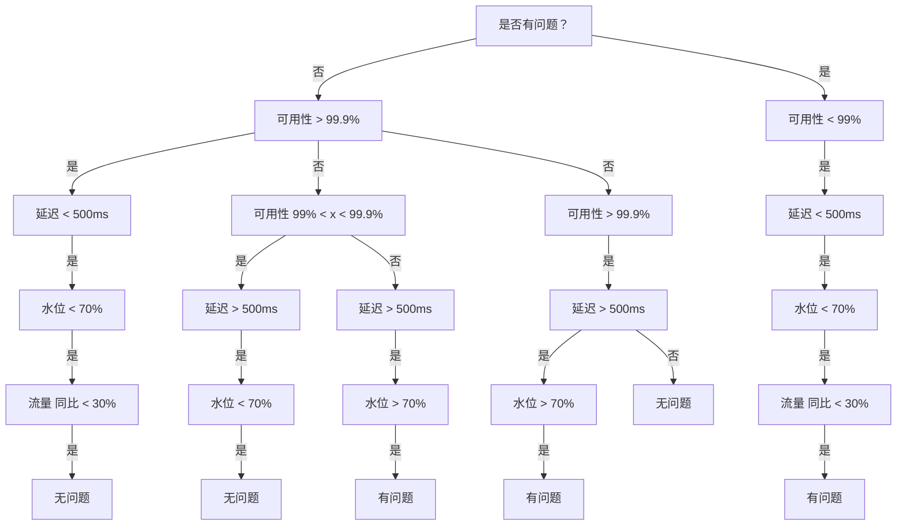

# AIOps

## 故障发现

### 监控指标多而不同

处理大量且不同类型的数据曲线是个挑战。每条曲线需要特定的监控规则，传统方法无法高效应对，AIOps 可以通过分类算法来判断指标是否正常，如

1. 自相关系数（Autocorrelation Function，ACF）：通过计算时间序列数据的自相关系数，可以观察数据是否存在周期性。
2. 傅里叶变换（Fourier Transform）：傅里叶变换可以将时域的时间序列数据转换到频域，从而可以观察数据在频域上是否存在明显的周期分量

或基于乐观的算法，计算一周内这些数据点的峰值，然后取这些峰值的平均值，并加上一个预设的缓冲值，这样得到的结果就是设定的监控指标上边界

$avg(max(1-7天)) + x$

或基于悲观的算法，通过孤立森林等异常检测算法来发现离群点，从而判断监控指标是否异常

### 细微变化

指标细小的变化难以通过传统的同比环比方法捕捉，可以通过余弦相似度或其他相似度算法来判断指标是否正常

### 多指标联合判断

当系统的状态与多个指标都有关时，单个指标并不能反映系统的真实状态，此时可以根据已有历史数据训练决策树，以此预测当前系统的状态

## 问题定位

### 多维归因分析

用于处理多维度下的指标波动，帮助识别造成故障的关键因素。例如，某次系统故障可能是由于运营商或地理位置等特定维度的异常导致

- Attributor：一种用于多维数据分析的算法。它通过计算每个维度下的“惊喜度”（Surprise）和“解释力”（Explanatory Power, EP）来快速定位可能导致关键性能指标（KPI）波动的因素
- Divisia 分解法：一种经济学中的指标分解方法，用于分析不同维度（如运营商、区域等）对总量变化的贡献
- HotSpot 算法：使用“预测 + 搜索”策略，并提出了基于 Ripple Effect 的根因判断方法。它通过计算潜在分，来量化节点与它所有叶子节点之间满足 Ripple Effect 的程度

### 因果推断

主要用于解决复杂的服务调用链故障定位问题，帮助确定是哪个服务导致了其他服务的问题

- 倾向得分匹配（Propensity Score Matching）：通过计算每个个体接受处理的概率（倾向得分），将处理组和对照组中相似的个体进行匹配，以减少选择性偏倚。
- 双重差分法（Difference-in-Differences, DiD）：通过比较处理组和对照组在干预前后的变化差异，来估计干预的因果效应。
- 工具变量法（Instrumental Variable, IV）：使用与处理变量相关但与误差项不相关的工具变量来解决因果关系的识别问题

### 重复问题定位

整理已有故障案例，通过提取故障的特征（如日志、性能指标等），在历史故障库中进行相似度匹配，找到之前发生过的类似问题。也是一种分类算法

## 容量预测

### 流量预测

预测未来的系统负载，确保在高峰期有足够的资源支持

Holt-Winters 模型：一种基于指数平滑的时间序列预测模型，擅长处理具有趋势和季节性的时间序列数据

- $L_t=\alpha\times(Y_t-S_{t-m})+(1-\alpha)\times(L_{t-1}+T_{t-1})\text{(水平)}$
- $T_t=\beta\times(L_t-L_{t-1})+(1-\beta)\times T_{t-1}\text{(趋势)}$
- $S_t=\gamma\times(Y_t-L_{t-m})+(1-\gamma)\times S_{t-m}\text{(季节性)}$

其中

- $( Y_t​)$ 是在时间点 t 的实际观测值。
- $( L_t​)$ 是在时间点 t 的预测水平。
- $( T_t​)$ 是在时间点 t 的预测趋势。
- $( S_t​)$ 是在时间点 t 的季节性因子。
- $( m )$ 是季节性周期的长度。

### 资源画像

为了理解系统中不同流量场景下的资源消耗，常用于预测流量与资源（如 CPU）之间的关系。这个场景可以用以线性回归为代表的回归算法

### 资源分配

合理分配资源以最大化系统吞吐量是关键，如通过贪心算法优先考虑重要性较高的服务，逐步分配资源，本质上是一种优化问题，所以还可以使用线性规划、动态规划等算法

## 变更管理

1. 自动化处理大量指标：在系统变更中，AIOps 可以迅速检查众多的业务、系统和基础设施指标（可能多达数百个）。通过智能工具如“智能 Checker”，AIOps 能够自动分析这些指标，减少人工检查的工作量，并提升变更检查的效率和准确性。
2. 对照分析：AIOps 通过对比变更组和对照组的指标波动，识别是否出现异常。例如，服务在变更过程中，可能会产生 CPU 或内存的波动。通过比较变更实例和未变更实例的指标，以及与历史变更数据的对比，AIOps 可以识别出异常情况，进而决定是否需要中止或回滚变更。
3. 上下游依赖关系分析：AIOps 能够分析变更对上下游服务的影响，特别是在服务调用关系复杂的场景下。例如，某个服务变更后可能导致下游服务请求量剧增或异常。如果没有实时监控和分析上下游依赖关系，可能会忽略这些影响，进而导致系统故障
4. 异常检测算法：采用统计方法（如 T 检验）进行数据分析，判断变更过程中是否出现了显著的指标变化

## 智能决策

传统的运维过程中，运维人员需要根据监控数据和经验做出决策，如流量切换和应急预案的执行。然而，复杂系统中的决策依赖于多个变量，例如服务可靠性、容量管理和实时事件处理。人工决策往往会因为经验不足或时间限制而影响效率

智能决策所要做的就是收集系统现有信息，根据模型预测，从而得出操作建议，交由人工去执行。或是通过构建决策树的方式，由机器自动执行
