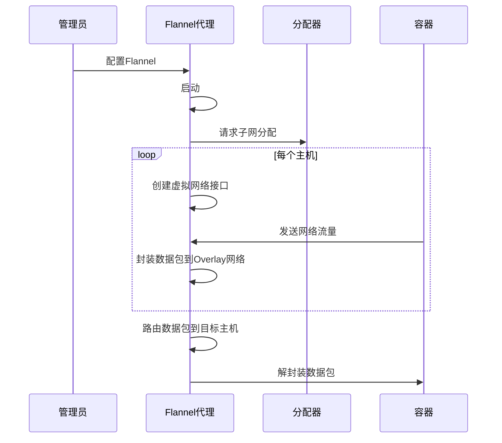

# Docker

> Docker 是一个开源的应用容器引擎，让开发者可以打包他们的应用以及依赖包到一个可移植的镜像中，然后发布到任何流行的 Linux或Windows 机器上，也可以实现虚拟化。容器是完全使用沙箱机制，相互之间不会有任何接口

使用场景

- 持续集成
- 可伸缩的云服务
- 微服务架构

## 容器与虚拟机


虚拟机最大的缺点就是依赖其专用的操作系统

容器本质上就是利用了 Linux 的 cgroup 与 namespace 创建了一个进程，该进程相对于宿主机，拥有一定的资源限制及隔离，该进程可以创建子进程，这些子进程也跟父进程一样，会受到资源限制及拥有一个被限制的视角，只能看到跟父进程一样的资源视图，这是容器中进程运行起来的动态视图

另一部分，则是通过 mount namsapce 及 rootfs 创建的容器镜像，这是容器的静态视图

## Docker架构


- 镜像与容器
  - 容器是镜像的实例

## 引擎

Docker引擎由如下主要的组件构成：Docker客户端（Docker Client）、Docker守护进程（Docker daemon）、containerd以及runc。它们共同负责容器的创建和运行


LXC提供了对诸如命名空间（Namespace）和控制组（CGroup）等基础工具的操作能力，它们是基于Linux内核的容器虚拟化技术


Docker公司开发了名为Libcontainer的自研工具，用于替代LXC

runc：

- 创建容器

containerd：

- 容器的生命周期管理

启动容器的过程：


容器运行时与Docker daemon是解耦的,对Docker daemon的维护和升级工作不会影响到运行中的容器

shim：

- 保持所有STDIN和STDOUT流是开启状态
- 将容器的退出状态反馈给daemon

## 镜像


### 镜像使用

- 搜索镜像

```shell
docker search name
```

- 拉取镜像

```shell
docekr pull name<:tag>
```

- 删除镜像

```shell
docker rmi 镜像ID
docker image rm $(docker image ls -q) -f
```

### 标签

在镜像名后面的:xxx 代表标签

没有标签的镜像被称为悬虚镜像

### 分层


docker 会复用已存在的镜像层

### 镜像仓库


## 容器

### 持久化

容器在停止后启动写入的数据仍会存在

但是volume才是持久化的首选

### 重启策略

在指定事件或者错误后重启来完成自我修复

- always
- unless-stoped
- on-failed

## 容器化


### Dockerfile

命令|用途
-|-
FROM|base image
RUN|执行命令
ADD|添加文件
COPY|拷贝文件
CMD|执行命令
EXPOSE|暴露端口

编写Dockerfile文件：

```docker
FROM ubuntu
MAINTAINER MY
RUN apt-get update
RUN apt-get install nginx -y
COPY index.html /var/www/html
ENTRYPOINT ["/usr/sbin/nginx","-g","daemon off;"]
EXPOSE 80
```

每一个RUN指令会新增一个镜像层。因此，通过使用&& 连接多个命令以及使用反斜杠（\ ）换行的方法，将多个命令包含在一个RUN指令中，通常来说是一种值得提倡的方式

### 最佳实践

利用构建缓存：

- 执行命令时，Docker会检查构建缓存中是否存在基于同一基础镜像，并且执行了相同指令的镜像层

合并镜像：

- 执行docker image build 命令时，可以通过增加--squash 参数来创建一个合并的镜像


no-install-recommends：

- 若使用的是APT包管理器，则应该在执行apt-get install 命令时增加no-install-recommends 参数。这能够确保APT仅安装核心依赖（Depends 中定义）包

不要安装MSI包（Windows）

## Docker 网络

CNM: 定了Docker网络架构的基础组成要素


Libnetwork是CNM标准的实现


```sh
docker network ls # 列出可用网络
docker run -d --network my-net # 指定容器网络
```

如果在相同网络中继续接入新的容器，那么在新接入容器中是可以通过的容器名称来进行网络通信的

### 容器网络

#### Flannel

主要功能是为容器提供跨主机的网络互连，使得不同主机上的容器可以直接通信，无论它们是否在同一物理网络中。它通过创建虚拟网络层来实现这一目标，并使用Overlay网络技术在物理网络之上构建虚拟网络，其有两种实现：

- UDP
- VXLAN
- host-gw


host-gw 模式必须要求集群宿主机之间是二层连通的


使用 UDP 实现的方案，需要经过三次用户态与内核态之间的数据拷贝：

1. 用户态的容器进程发出的 IP 包经过 docker0 网桥进入内核态
2. IP 包根据路由表进入 TUN（flannel0）设备，从而回到用户态的 flanneld 进程
3. flanneld 进行 UDP 封包之后重新进入内核态，将 UDP 包通过宿主机的 eth0 发出去

有着严重的性能问题，已经废弃




#### Calico


Felix 负责在宿主机上插入路由规则。除了对路由信息的维护方式之外，Calico 项目与 Flannel 的 host-gw 模式的另一个不同之处，就是它不会在宿主机上创建任何网桥设备

Calico 维护的网络在默认配置下，是一个被称为“Node-to-Node Mesh”的模式，即每个节点都要两两连接。另外一种模式叫做 Route Reflector，会指定一个或者几个专门的节点，来负责跟所有节点建立 BGP 连接从而学习到全局的路由规则。而其他节点，只需要跟这几个专门的节点交换路由信息，就可以获得整个集群的路由规则信息了

如果宿主机之间网络不通，即没办法通过二层网络把 IP 包发送到下一跳地址，则需要通过 IPIP 模式，其原理就是通过内核，将包直接封装在一个宿主机网络的 IP 包中。使用 IPIP 模式的时候，集群的网络性能会因为额外的封包和解包工作而下降


只要能够让宿主机之间的路由设备（也就是网关），通过 BGP 协议“学习”到 Calico 网络里的路由规则，那么从容器发出的 IP 包，可以通过这些设备路由到目的宿主机。一种做法是用一个独立的组件收集路由规则，再通过 BGP 协议同步给网关

### 网络类型
  
- Bridge：: 单机桥接网络 Docker设计的NAT网络模型（默认类型）
  -  只能在单个Docker主机上运行，并且只能与所在Docker主机上的容器进行连接


```sh
docker network create -d bridge localnet
```

- Host：与主机共享Network Namespace，--net=host
- overlay：多机覆盖网络
- 接入现有网络
- None：:不为容器配置任何网络功能，没有网络 --net=none
- Container：与另一个运行中的容器共享Network Namespace，--net=container:containerID
- 端口映射

```shell
# 将本机8080端口映射到容器80端口
docker run -p 8080:80 <name>

# 将本机端口随机与容器端口映射
docker run -P <name>
```

## 持久化

每个Docker容器都有自己的非持久化存储。非持久化存储自动创建，从属于容器，生命周期与容器相同

持久化是将数据存储在卷上。卷与容器是解耦的


卷类型：

- 块存储
  - 适用于对小块数据的随机访问负载
- 文件存储
  - 包括NFS和SMB协议的系统
- 对象存储
  - 适用于较大且长期存储的、很少变更的二进制数据存储。通常对象存储是根据内容寻址

## 安全


Docker 平台安全技术：

- Swarm模式
  - 加密节点ID。
  - 基于TLS的认证机制。
  - 安全准入令牌。
  - 支持周期性证书自动更新的CA配置。
  - 加密集群存储（配置DB）。
  - 加密网络
- 内容信任
  - 通过 Docker Hub 信任内容
- 密钥
  - 使用`docker secret`管理密钥

### Namespace

Docker 提供的容器环境是和 Linux 内核隔离的。想要实现这种隔离，就需要用到 Namespace 机制 Namespace的隔离并不够彻底

### Capabilities

提供了更细粒度的授权机制，它定义了主体能够进行的某一类操作

- 拒绝所有的挂载操作；
- 拒绝部分文件的操作，比如修改文件所有者；
- 拒绝内核模块加载

### CGroups

利用 CGroups 机制来实现对容器中内存、CPU 和 IO 等的限制

### 守护进程安全性

守护进程，具备操控 Docker 容器的全部权限

如果守护进程提供的API接口没有认证，则很容易被入侵

### 镜像安全

- 最小精简镜像
- 使用User 指令指定运行用户

## 关联内容（自动生成）

- [/操作系统/容器化.md](/操作系统/容器化.md) 容器化技术是Docker的核心，该文档深入探讨了容器的本质、实现原理和系统架构
- [/操作系统/虚拟化.md](/操作系统/虚拟化.md) Docker作为容器化技术的一种实现，与虚拟化技术有密切关系，该文档介绍了虚拟化的基本概念和实现方式
- [/运维/K8s.md](/运维/K8s.md) Kubernetes是容器编排的事实标准，与Docker密切相关，该文档介绍了K8s的架构和核心概念
- [/软件工程/架构/系统设计/云原生.md](/软件工程/架构/系统设计/云原生.md) Docker是云原生技术栈的重要组成部分，该文档介绍了云原生的核心理念和架构模式
- [/软件工程/DevOps.md](/软件工程/DevOps.md) Docker在DevOps实践中扮演重要角色，该文档介绍了DevOps的核心理念和实践方法
- [/中间件/数据库/ElasticSearch.md](/中间件/数据库/ElasticSearch.md) 该文档介绍了如何使用Docker部署ElasticSearch，提供了实际应用示例
- [/操作系统/linux/内核.md](/操作系统/linux/内核.md) Docker容器技术依赖于Linux内核的namespace和cgroup机制，该文档深入解析了这些内核机制
- [/软件工程/微服务/ServiceMesh/ServiceMesh.md](/软件工程/微服务/ServiceMesh/ServiceMesh.md) Service Mesh是云原生架构的重要组件，与Docker容器技术密切相关
- [/数据技术/任务调度系统.md](/数据技术/任务调度系统.md) 该文档介绍了容器调度相关内容，与Docker容器的运行和管理相关
- [/软件工程/架构/架构.md](/软件工程/架构/架构.md) 该文档涉及微服务与K8s架构，与Docker容器化部署相关
