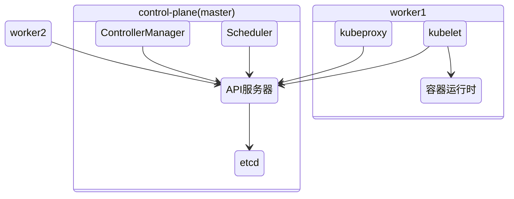
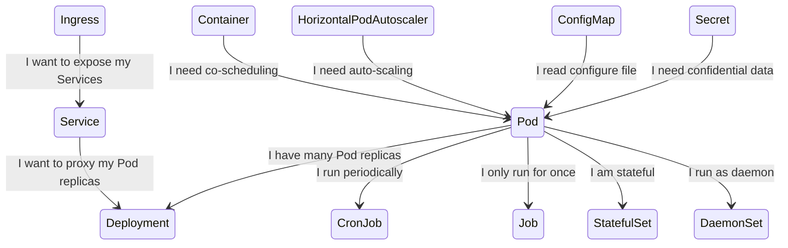
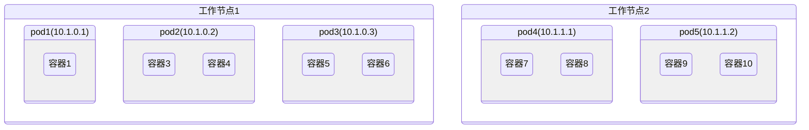
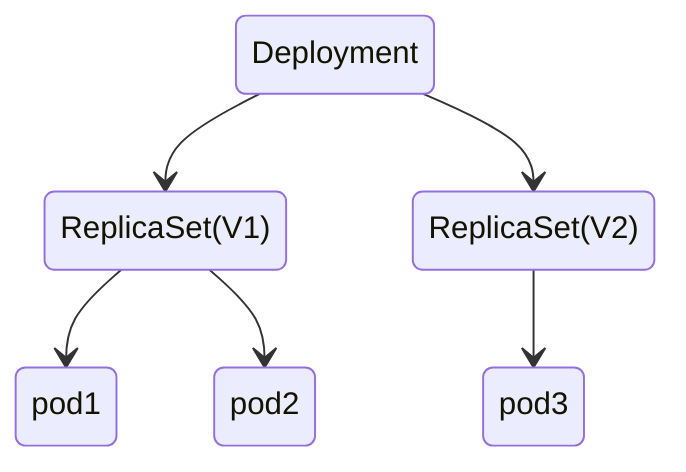
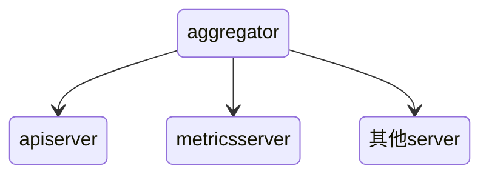

# Kubernetes

>Kubernetes（常简称为K8s）是用于自动部署、扩展和管理容器化（containerized）应用程序的开源系统


## 架构





master：用于控制集群

- API服务器：外部访问入口
- Scheduler：调度应用（为应用分配工作节点）
- Controller Manager：执行集群级别的功能
- etcd：存储集群配置的分布式数据存储

工作节点：运行用户部署应用的节点

- 容器运行时：Docker 或者其他容器
- Kubelet：与API服务器通信 管理当前节点的容器
- kube-proxy:负责组件之间的负载均衡

### 分布式

- Kubenetes系统组件间只能通过API服务器通信
- 为了保证高可用性， master的每个组件可以有多个实例

### etcd

只有API服务器才能直接与etcd通信

数据在etcd中存储的是一个层次级目录结构 末端节点存储的json数据

集群一致性保证：raft算法

### API 服务器

- 认证授权


- 通知客户端资源变更


#### 安全防护

- pod 使用 service accounts机制进行认证


```sh
kubectl get sa # 获取服务账户
kubectl create serviceaccount foo # 创建
```


- 使用sa:

```yaml
spec:
  serviceAccountName: foo
```

RBAC控制：使用插件

### 调度器

利用 API 服务器的监听机制等待新创建的 pod, 然后给每个新的、 没有节点集的 pod 分配节点


调度过程是很复杂的：

- 选择可用节点
- 选择最佳节点
- 高级调度
  - 如何保证节点副本分布尽可能均匀

调度的过程是一个生产者消费者模型，由 informer 监听 service、pod 等对象的变化，加入优先级队列，再由调度器消费队列中的 pod 信息，结合 cache 中的节点信息，过滤并选择节点，将 pod 绑定到指定节点上

### 控制管理器

确保系统真实状态朝 API 服务器定义的期望的状态收敛

```go
for {
  实际状态 := 获取集群中对象X的实际状态（Actual State）
  期望状态 := 获取集群中对象X的期望状态（Desired State）
  if 实际状态 == 期望状态{
    什么都不做
  } else {
    执行编排动作，将实际状态调整为期望状态
  }
}
```

- rc rs控制器 deployment控制器...

### Kubelet

kubelet 是 Node 节点上负责 Pod 生命周期管理的核心守护进程，负责把 Master 节点（主要是 API Server）的“调度意图”真正落地到本地容器运行时（如 containerd 或 Docker）

```
+-----------------------------+
|         API Server         |
+-------------+--------------+
              |
       Watch/Report Pod
              |
        +-----v------+
        |   kubelet  | <------------------+
        +------------+                    |
        | Pod 管理   |                    |
        | 健康探针   |                    |
        | Volume 挂载|                    |
        +-----+------+                    |
              |CRI                        |
       +------v------+                   |
       | containerd   | --- 调用 ---> Docker 或其他 runtime
       +-------------+                   |
                                        本地文件读取 (静态Pod)
```

### kube-proxy

kube-proxy 是一个“编程内核规则的控制器”。真正转发流量的是 Linux 内核（通过 iptables/ipvs）

```lua
+----------------------+
|   Kubernetes API     |
|     (Service 信息)   |
+----------+-----------+
           |
     watch service/ep
           |
     +-----v------+
     | kube-proxy |  <===> 维护 iptables/ipvs 规则（实际流量不会经过这里）
     +------------+
           |
   +-------+--------+
   | Linux 网络栈    |
   | iptables / ipvs |
   +-------+--------+
           |
   +-------v--------+
   | 请求被转发到 Pod |
   +----------------+
```

服务暴露的外部ip与端口通过每个节点上的kube-proxy实现

暴露的这个ip是虚拟的 主要是用来做映射用的 当kube-proxy接收到这个ip的请求 就会查找映射 转发请求


### 容器运行时

kubelet 会监听 pod 对象的变化，根据变化并调用 CRI 来创建或者更新容器。CRI 由不同的容器技术实现，对 kubelet 暴露出 gRPC 服务


CRI 的接口分为两组：

1. 第一组，是 RuntimeService。它提供的接口，主要是跟容器相关的操作
2. 第二组，则是 ImageService。它提供的接口，主要是容器镜像相关的操作

### 控制器协作


### 高可用集群

应用高可用：

- 水平扩展
- 主从架构

master高可用：


- etcd自身会进行数据同步
- API 服务器是无状态的
- 控制器与调度器会进行主从选举 只有leader才会进行调度控制工作

## 优点

- 简化部署
- 充分利用硬件
- 健康检查 自修复
- 自动扩容

## 在K8S中运行应用

根据描述信息生成对应的pod 在pod中运行容器

K8S会保证集群中的容器数量实例 在容器死亡时 会启动新容器替补

K8S 在运行时可根据需求动态调整副本数量

通过kube-proxy能进行服务连接动态切换

### 部署第一个应用

```sh
kubectl  run  kubia  --image=luksa/kubia  --port=8080  # 创建容器运行
kubectl get pods # 获取pod
kubectl get rc
kubectl port-forward kubia 8080:8080 # 开启端口转发
kubectl get pods -o wide # 查看应用在哪个节点
kubectl scale rc kubia --replicas=3 # 水平扩容
```


逻辑架构：


- RC用来确保始终有pod运行
- 使用http服务来完成外部请求到pod的映射

## pod


一组紧密相关的容器 独立的逻辑机器



一 个 pod 中的所有容器都在相同的 network 和 UTS 命名空间下运行

每个 pod 都有自己的 IP 地址， 并且可以通过这个专门的网络实现 pod。为了实现这个效果，在 k8s 中，其会通过先启动一个 infra 容器，由这个容器创建出一个 namespace，用户定义的容器再加入该 namespace 中，之间同个 pod 的容器就能互相访问

pod 扮演的是机器这个角色，容器扮演的机器中的进程。所以，关于 pod 对象的设计，凡是调度、网络、存储，以及安全相关的属性，基本上是 pod 级别的，跟容器 namespace 相关的，也是 pod 级别的。

pod的使用：

- 倾向于单个pod单个容器

### 使用yml创建pod

```yml
apiVersion: v1
kind: Pod
metadata:
  name: kubia-manual
  labels:
    env: test # 指定一个标签
spec:
  nodeSelector: # 选择特定标签的节点
    super: "true"
  containers:
  - image: luksa/kubia
    name: kubia
    ports:
    - containerPort: 8080
      protocol: TCP
```

```sh
kubectl create -f kubia-manual.yaml
kubectl logs kubia-manual # 查看日志
```

### 存活探针

存活探针判断容器是否存活，当存活探针失败，容器就会重启

### 就绪探针

判断 Pod 是否准备好接收流量，如果失败，Pod 会被从 Service 的 Endpoint 列表中移除，不会接收流量

### 标签

```sh
kubectl get po --show-labels
kubectl label po kubia-manual createtion_method=manual # 修改标签
kubectl label node minikube super=true
kubectl get po -l createtion_method=manual # 根据标签筛选
```

### 注解

注解也是键值对

```sh
kubectl annotate pod kubia-manual wang.ismy/name="cxk"
```

### 命名空间

命名空间简单为对象划分了一个作用域

```sh
kubectl get ns
kubectl get po -n kube-system # 获取命名空间下的pod

kubectl create namespace custom-namespace # 创建命名空间
kubectl create -f kubia-manual.yaml -n custom-namespace # 指定命名空间
```

### 停止与移除

```sh
kubectl delete po kubia-manual # 根据名字删除
```

### pod 的生命周期

pod 的状态：

- Pending：这个状态意味着，Pod 的 YAML 文件已经提交给了 Kubernetes，API 对象已经被创建并保存在 Etcd 当中。但是，这个 Pod 里有些容器因为某种原因而不能被顺利创建。比如，调度不成功
- Running：这个状态下，Pod 已经调度成功，跟一个具体的节点绑定。它包含的容器都已经创建成功，并且至少有一个正在运行中
- Succeeded：这个状态意味着，Pod 里的所有容器都正常运行完毕，并且已经退出了。这种情况在运行一次性任务时最为常见。
- Failed：这个状态下，Pod 里至少有一个容器以不正常的状态（非 0 的返回码）退出。- Unknown：这是一个异常状态，意味着 Pod 的状态不能持续地被 kubelet 汇报给 kube-apiserver，这很有可能是主从节点（Master 和 Kubelet）间的通信出现了问题

1. 应用必须意识到会被杀死或者重新调度
    - ip与主机名会发生变化
    - 使用卷解决数据写入问题
2. 不断重启的pod不会被重新调度
3. 固定顺序启动pod
    - 使用init容器
    - 应用要处理好其他依赖没有准备好的情况
4. 生命周期钩子
    - postStart
    - preStop
5. pod的关闭


### pause 容器

创建每个 Pod 时自动启动的第一个容器，它为其他容器提供共享的 Linux 命名空间

## 副本机制

k8s 会保证 pod 以及 容器的健康运行

### ReplicaSet

ReplicaSet 取代了 ReplicationController

rs 的pod 选择器的表达能力更强

- 创建

```yml
apiVersion: apps/v1
kind: ReplicaSet
metadata:
  name: kubia
spec:
  replicas: 3
  selector:
    matchLabels:
      app: kubia
  template:
    metadata:
      labels:
        app: kubia
    spec:
      containers:
      - name: kubia
        image: luksa/kubia
```

### DaemonSet

由DaemonSet 创建的 pod 会绕过调度程序 会在所有集群节点上运行（或者也可以通过指定`nodeSelector`在其他节点运行）, 当集群有新的节点加入或离开，pod 会被自动添加及删除


- 创建

```yml
apiVersion: apps/v1
kind: DaemonSet
metadata:
  name: ssd-monitor
spec:
  selector:
    matchLabels:
      app: ssd-monitor
  template:
    metadata:
      labels:
        app: ssd-monitor
    spec:
      nodeSelector:
        disk: ssd
      containers:
      - name: main
        image: luksa/ssd-monitor
```

### Job

允许运行一种 pod, 该 pod 在内部进程成功结束时， 不重启容器。

- 创建

```yml
apiVersion: batch/v1
kind: Job
metadata:
  name: batch-job
spec:
  completions: 5 # 运行pod数
  parallelism: 2 # 并行运行数
  template:
    metadata:
      labels:
        app: batch-job
    spec:
      restartPolicy: OnFailure
      containers:
      - name: main
        image: luksa/batch-job
```

### CronJob

- 创建

```yml
apiVersion: batch/v1beta1
kind: CronJob
metadata:
  name: cron-job
spec:
  schedule: "0,15,30,45 * * * *"
  jobTemplate:
    spec:
      template:
        metadata:
          labels:
            app: batch-job
        spec:
          restartPolicy: OnFailure
          containers:
          - name: main
            image: luksa/batch-job
```

## 服务

是一种为一组功能相同的 pod 提供单一不变的接入点的资源


- 创建

```yml
apiVersion: v1
kind: Service
metadata:
  name: kubia
spec:
  ports:
  - port: 80
    targetPort: 8080
  selector:
    app: kubia
```

Service 是由 kube-proxy 组件，加上 iptables 来共同实现的。当一个 Service 对象被提交给 k8s，kube-proxy 感知到，就会创建一条 iptables 规则

当 iptables 规则过多时，会占据较多的资源。

所以引入了 IPVS 模式，使用哈希表作为基础数据结构，并且在内核空间中工作。 这意味着，与 iptables 模式下的 kube-proxy 相比，IPVS 模式下的 kube-proxy 重定向通信的延迟要短，并且在同步代理规则时具有更好的性能

### 服务间的发现

- 通过环境变量

```sh
kubectl exec kubia-9knkg -- env
```

#### DNS

k8s 会为 service 以及 pod 自动创建 dns 记录

除了无头 Service 之外的 “普通” Service 会被赋予一个形如 my-svc.my-namespace.svc.cluster-domain.example 的 DNS A 和/或 AAAA 记录

每个 Service 的名字是 `<name> + <namespace>` 唯一决定的，如果通过了服务名进行 dns 解析，pod 中 /etc/resolv.conf 配置的搜索域列表会生效，会自动补全全称

### 暴露服务给外部

#### Service

NodePort：每个集群节点都会在节点上打开一个端口 将在该端口上接收到的流量重定向到基础服务

```yml
apiVersion: v1
kind: Service
metadata:
  name: kubia-nodeport
spec:
  type: NodePort
  ports:
  - port: 80
    targetPort: 8080
    nodePort: 30123
  selector:
    app: kubia
```

通过nodeip:30123 访问

其也是通过添加 iptables 规则来实现的

ClusterIP：暴露出一个虚拟的 IP 加到 iptables，在集群内部访问这个 IP 时，会转发到指定的服务上

#### Endpoint Slice

Service 是一个逻辑抽象资源，定义了一组后端 Pod 的选择规则（selector），但它本身并不包含实际的 Pod IP 或端口。为了让网络组件（如 kube-proxy）知道该把访问 Service 的请求转发到哪些 Pod 上，就必须有一种方式记录这些实际地址

#### LoadBalancer

- 负载均衡器将流量重定向到跨所有节点的节点端口。客户端通过负载均衡器的 IP 连接到服务

```yml
apiVersion: v1
kind: Service
metadata:
  name: kubia-loadbalancer
spec:
  type: LoadBalancer
  ports:
  - port: 80
    targetPort: 8080
  selector:
    app: kubia
```

部署了一个 LoadBalancer 类型的 Service

Kubernetes 调用云平台 API（如 AWS、阿里云）创建一个 LB 实例

LB 的监听端口 → 转发到集群内的 NodePort → Pod

通过externalip:一个随机端口访问

#### Ingress

```lua
外部用户浏览器
      │
      ▼
[Ingress Controller]（如 nginx-ingress）
      │
      ▼
[Ingress 规则]
      │
      ▼
[Service]（ClusterIP 类型）
      │
      ▼
[Pod]
```

#### Gateway API

是 Ingress 的下一代入口流量管理标准

```yaml
[ Client ]
    │
    ▼
[ Gateway Service (LoadBalancer / NodePort) ]  ←←←←←←←←←←←←←←←←←←←←←
    │                                             ⬆ 网关 Service 类型决定如何暴露
    ▼
[ Gateway Pod (Ingress Controller 实现，如 nginx/istio) ]
    │
    ▼
[ Gateway Object (定义监听 port、协议) ]
    │
    ▼
[ HTTPRoute / TCPRoute / TLSRoute / UDPRoute ]
    │
    ▼
[ Target Service (ClusterIP) ]
    │
    ▼
[ Pod (app container) ]
```

### 服务故障排除

- 确保从集群内连接到服务的集群IP
- 服务的集群IP 是虚拟IP, 是无法ping通的
- 如果已经定义了就绪探针， 请确保 它返回成功；否则该pod不会成为服务的一部分
- 确认某个容器是服务的 一 部分
- 检查是否连接到服务公开的端口，而不是目标端口
- 尝试直接连接到podIP以确认pod正在接收正确端口上的 连接
- 法通过pod的IP 访问应用， 请确保应用不是仅绑定 到本地主机

## 卷

卷是 pod 的一个组成部分， 因此像容器 一 样在 pod 的规范中定义


### 在容器之间共享数据

emptyDir：pod被删除时 卷的内容就会丢失

- 创建

```yml
apiVersion: v1
kind: Pod
metadata:
  name: fortune
spec:
  containers:
  - image: luksa/fortune
    name: html-genrator
    volumeMounts:
    - name: html
      mountPath: /var/htdocs
  - image: nginx:alpine
    name: web-server
    volumeMounts:
    - name: html # 使用html卷
      mountPath: /usr/share/nginx/html # 挂载到容器的位置
      readOnly: true
    ports:
    - containerPort: 80
      protocol: TCP
  volumes: # 创建一个卷
  - name: html
    emptyDir: {}
```

gitRepo：以git仓库文件填充目录文件

```yml
apiVersion: v1
kind: Pod
metadata:
  name: gitrepo-volume-pod
spec:
  containers:
  - image: nginx:alpine
    name: web-server
    volumeMounts:
    - name: html
      mountPath: /usr/share/nginx/html
      readOnly: true
    ports:
    - containerPort: 80
      protocol: TCP
  volumes:
  - name: html
    gitRepo:
      repository: https://github.com/luksa/kubia-website-example.git
      revision: master
      directory: .
```

### 访问工作节点文件

hostPath 卷指向节点文件系统上的特定文件或目录

### 持久化存储

- gce持久盘
- aws弹性块存储
- nfs卷

### 持久卷


- 创建持久卷

```yml
apiVersion: v1
kind: PersistentVolume
metadata:
  name: mongodb-pv
spec:
  capacity:
    storage: 1Gi
  accessModes:
    - ReadWriteOnce
    - ReadOnlyMany
  persistentVolumeReclaimPolicy: Retain
  hostPath:
    path: /tmp/mongodb
```

- 创建持久卷声明

```yml
apiVersion: v1
kind: PersistentVolumeClaim
metadata:
  name: mongodb-pvc
spec:
  resources:
    requests:
      storage: 1Gi
  accessModes:
  - ReadWriteOnce
  storageClassName: "" # 动态持久卷
```

- 容器使用持久卷

```yml
# ...
  volumes:
  - name: mongodb-data
    persistentVolumeClaim:
      claimName: mongodb-pvc
```

### 动态持久卷

- 创建StorageClass

```yml
apiVersion: storage.k8s.io/v1
kind: StorageClass
metadata:
  name: fast
provisioner: k8s.io/minikube-hostpath
parameters:
  type: pd-ssd
```

声明是通过名称引用它的 方便之处主要是在不同集群之间移植


## 参数配置

通过定义传递参数：

```yml
  - image: luksa/fortune:args
    args: ["2"]
```

使用环境变量：

```yml
- image: luksa/fortune:env
  env:
  - name: INTERVAL
    value: "30"
```

### ConfigMap

类似于配置中心：


- 创建

```sh
kubectl create configmap fortunes-config --from-literal=sleep-interval=25
```

- 单个环境变量使用

```yml
  - image: luksa/fortune:env
    env:
    - name: INTERVAL
      valueFrom:
        configMapKeyRef:
          name: fortunes-config
          key: sleep-interval
```

- 一次传递所有环境变量

```yml
  - image: luksa/fortune:env
    env:
    envFrom:
    - prefix: CONFIG_
    configMapRef:
      name: fortunes-config
    args: ["${CONFIG_xxx}"] # 传递到命令行
```

- 挂载到卷

```yml
volumes:
- name: config
  configMap:
    name: configmap
```

- 更新配置

```sh
kubectl edit configmap xxx
```

### Secret

存储与分发敏感信息

- 创建

```sh
 kubectl create secret generic fortune-https --from-file=https.key
```

- 挂载卷使用

```yml
- image: xxx
  volumeMounts:
  - name: keys
    mountPath: /etc/nginx/keys/
volumes:
- name: keys
  secret:
    secretName: fortune-https
```

- 环境变量使用

```yml
env:
- name: FOO_SECRET
  valueFrom:
    secretKeyRef:
      name: fortune-https
      key: name
```

## pod 元数据访问

### Downward API


通过环境变量：

```yml
env:
- name: POD IP
  valueFrom:
    fieldRef:
      fieldPath: status.podIP
- name: CONTAINER CPU REQUEST MILLICORES
  valueFrom:
    resourceFieldRef:
      resource: requests.cpu
      divisor: lm
```

通过卷：

```yml
volumes:
- name: downward
  downwardAPI:
    items:
    - path: "podName"
      fieldRef:
        fieldPath: metadata.name
```


### 使用 K8S API 服务器

REST API：

- 启动kubectl proxy

```sh
curl http://localhost:8001/apis/batch/v1/jobs
```

在 pod 内部使用

客户端API

## Deployment

实际上是一个两层控制器。首先，它通过 ReplicaSet 的个数来描述应用的版本；然后，它再通过 ReplicaSet 的属性（比如 replicas 的值），来保证 Pod 的副本数量



更新应用：

- 删除旧版本pod 启动新版本pod
  - 会造成短暂的服务不可用
- 启动新版本pod 删除旧版本pod


### 使用 Deployment 声明式升级

- 创建

```yml
apiVersion: apps/v1
kind: Deployment
metadata:
  name: kubia
spec:
  replicas: 3
  selector:
    matchLabels:
      app: kubia
  template:
    metadata:
      name: kubia
      labels:
        app: kubia
    spec:
      containers:
      - image: luksa/kubia:v1
        name: nodejs
```
```sh
kubectl create -f kubia-dep-v1.yaml --record # 加上该参数会记录历史版本号
```

- 更新版本

```sh
kubectl set image deployment kubia nodejs=luksa/kubia:v2
```

- 回滚

```sh
kubectl rollout undo deployment kubia
```

使用 - -to-revision=xxx 回滚到特定版本

- 升级速率控制

```yml
rollingUpdate :
  maxSurge: 1 # 最多允许超过的副本数
  maxunavailable: 0 # 最多允许多少百分比pod不可用
```

- 使用rollout pause 暂停滚动升级 部分软件版本就不一样 金丝雀发布

- minReadySeconds属性指定新创建的pod至少要成功运行多久之后 ， 才能 将其视为可用

如果 一 个新的pod 运行出错， 并且在minReadySeconds时间内它的就绪探针出现了失败， 那么新版本的滚动升级将被阻止

- 使用kubectl apply升级Deployment

## StatefulSet

如何复制有状态的pod？

StatefulSet 把应用的状态抽象为了：

1. 拓扑状态：应用的多个实例之间不是完全对等的关系。这些应用实例，必须按照某些顺序启动，再次被创建出来时也必须严格按照相同的顺序，k8是是通过 pod 的名字+编号固定拓扑状态的
2. 存储状态：Statefulset 保证了pod在重新调度后保留它们的标识和状态

StatefulSet 的控制器直接管理的是 Pod，每个 Pod 的 hostname、名字等都是不同的、携带了编号的。k8s 通过 Headless Service，为这些有编号的 Pod，在 DNS 服务器中生成带有同样编号的 DNS 记录。StatefulSet 会为每个 Pod 分配一个同样编号的 pvc ，这样 k8s 通过持久化卷机制为 pvc 绑定 pv，每个pod都有专属于它的持久卷

### 使用

- 创建持久卷
- 创建控制 Service

```yml
apiVersion: v1
kind: Service
metadata:
  name: kubia
spec:
  clusterIP: None
  selector:
    app: kubia
  ports:
  - name: http
    port: 80
```

- 创建StatefulSet

```yml
apiVersion: apps/v1
kind: StatefulSet
metadata:
  name: kubia
spec:
  serviceName: kubia # 在执行控制循环（Control Loop）的时候，使用这个 Headless Service 来保证 Pod 的“可解析身份”
  replicas: 2
  selector:
    matchLabels:
      app: kubia # has to match .spec.template.metadata.labels
  template:
    metadata:
      labels:
        app: kubia
    spec:
      containers:
      - name: kubia
        image: luksa/kubia-pet
        ports:
        - name: http
          containerPort: 8080
        volumeMounts:
        - name: data
          mountPath: /var/data
  volumeClaimTemplates:
  - metadata:
      name: data
    spec:
      resources:
        requests:
          storage: 1Mi
      accessModes:
      - ReadWriteOnce
```

- 使用一个 Service 来访问 Pod

```yml
apiVersion: v1
kind: Service
metadata:
  name: kubia-public
spec:
  selector:
    app: kubia
  ports:
  -  port: 80
     targetPort: 8080
```

### 发现伙伴节点

- 容器内部通过DNS SRV 记录

## 安全

### pod 使用宿主节点的Linux命名空间

- 使用宿主节点的网络命名空间

```yaml
spec:
  hostNetwork: true
```

- 使用宿主节点的端口而不使用宿主节点的网络命名空间


如果使用hostport 一个节点只能有一个相同的pod

- 使用宿主的PID与IPC空间

```yml
spec:
  hostPID: true
  hostIPC: true
```

开启后 相同节点的pod的进程之间就是可见的 可通信的

### 安全上下文

```yml
spec:
  securityContext:
    # ... pod 级别的
  containers:
    securityContext:
      runAsUser: 405 # 以指定用户运行
      runAsNonRoot: true # 禁止以root运行
      privileged: true # 在特权模式下允许
      capabilities:
        add:
        - SYS_TIME # 开放硬件时间修改权限
        drop:
        - CHOWN # 禁用文件所有者修改权限
      readOnlyRootFilesystem: true # 禁止在根目录写文件
```

### pod 网络隔离

- 网络策略

```yml
apiVersion: networking.k8s.io/v1
kind: NetworkPolicy
metadata:
  name: postgres-netpolicy
spec:
  podSelector:
    matchLabels:
      app: database # 对该标签的pod生效
  ingress: # 只允许来自匹配下面标签的pod请求
  - from:
    - podSelector:
        matchLabels:
          app: webserver
    ports:
    - port: 5432
```

## 计算资源管理

### 申请资源

```yaml
spec:
  containers:
  - image: busybox
    command: ["dd", "if=/dev/zero", "of=/dev/null"]
    name: main
    resources:
     requests:
       cpu: 200m # 申请200毫核 也就说20%CPU
       memory: 10Mi # 申请10M内存
```

添加了requests对调度的影响：

通过设置资源requests我们指定了pod对资源需求的最小值。

调度器不关心资源的实际使用了 而是关心各pod所定义的requests资源量 


如果将 Pod 的 CPU 资源的 requests 和 limits 设置为同一个相等的整数值，那么该 Pod 就会被绑定在 2 个独占的 CPU 核上

### 限制资源

```yml
resources:
  limits:
    cpu: 1 # 允许最大使用1核
    memory: 20Mi # 内存允许最大 20M
```

超过limits的情况：

- cpu：进程分配到的CPU不会超过指定的
- 内存：如果内存超过limit 则容器会被杀掉

### QoS 等级

通过定义优先级决定资源不足时杀谁


- BestEffort 优先级最低
  - 没有设置requess和limits都属于这个级别
- Guaranteed 优先级最高
  - cpu和内存都要设置requests 和 limits
  - 所有容器都要设置资源量
  - requests 与 limits必须相等
- Burstable 其他的pod都属于这个等级

### 限制命名空间中的pod

- LimitRange插件
- ResourceQuota

### 监控 pod

- Heapster


## 自动伸缩与集群

- 基于CPU使用率的自动伸缩

```sh
kubectl autoscale deployment kubia --cpu-percent=30 --min=1 --max=5
```

- 纵向扩容

自动修改CPU与内存大小

### 集群节点扩容

新节点启动后，其上运行的Kubelet会联系API服务器，创建 一 个Node资源以注册该节点

当一 个节点被选中下线，它首先会被标记为不可调度， 随后运行其上的pod 将被疏散至其他节点

## 高级调度

### 污点和容忍度

限制哪些pod可以被调度到某一个节点

```sh
kubectl describe node minikube | grep Taints # 查看节点污点
```


- NoSchedule 表示如果 pod 没有容忍这些污点， pod 则不能被调度到包含这些污点的节点上
- PreferNoSchedule 是 NoSchedule 的 一 个宽松的版本， 表示尽量阻止pod 被调度到这个节点上， 但是如果没有其他节点可以调度， pod 依然会被调度到这个节点上
- NoExecute会影响正在节点上运行着的 pod 。 如果在 一 个节点上添加了 NoExecute 污点， 那些在该节点上运行着的pod, 如果没有容忍这个 NoExecute 污点， 将会从这个节点去除

- 添加污点

```sh
kubectl taint node minikube node-type=production:NoSchedule
```

- pod添加容忍度

```yml
spec:
  replicas: 5
  template:
    spec:
      ...
      tolerations:
      - key: node-type
        operator: Equal
        value: production
        effect: NoSchedule
```

### 节点亲缘性

这种机制允许你通知 Kubemetes将 pod 只调度到某个几点子集上面

```yml
spec:
  affinity:
    nodeAffinity:
      requiredDuringSchedulingIgnoredDuringExecution:
        nodeSelectorTerms:
        - matchExpressions:
          - key: gpu
            operator: In
            values:
            - "true"
```


## 最佳实践


### 客户端请求处理

1. pod启动时避免客户端连接断开
    - 使用一个就绪探针来探测pod是否准备好接受请求了
2. pod关闭时避免请求断开
    - 停止接受新连接
    - 等待所有请求完成
    - 关闭应用

### 让应用方便运行与管理

1. 可管理的容器镜像
    - 镜像太大难以传输 镜像太小会缺失很多工具
2. 合理给镜像打标签
    - 不要使用latest 使用具体版本号
3. 使用多维度的标签
4. 使用注解描述额外信息
5. 使用/dev/termination-log 写入失败信息
6. 日志
    - 将日志打印到标准输出方便查看
    - 集中式日志系统

## 应用扩展

### CRD对象

- 创建

```yml
apiVersion: apiextensions.k8s.io/v1beta1
kind: CustomResourceDefinition
metadata:
  name: websites.extensions.example.com
spec:
  scope: Namespaced
  group: extensions.example.com
  version: v1
  names:
    kind: Website
    singular: website
    plural: websites
```

- 创建CRD实例

```yml
apiVersion: extensions.example.com/v1
kind: Website
metadata:
  name: kubia
spec:
 gitRepo: https://github.com/luksa/kubia-website-example.git
```

### 服务目录

服务目录就是列出所有服务的目录。 用户可以浏览目录并自行设置目录中列出的服务实例

## 网络


相同节点的pod通信：


不同节点的pod通信：


只有当所有节点连接到相同网关的时候 上述方案才有效

### CNI

CNI 的设计思想是 Kubernetes 在启动 Infra 容器之后，就可以直接调用 CNI 网络插件，为这个 Infra 容器的 Network Namespace，配置符合预期的网络栈

## 监控


1. 宿主机的监控数据通过以 DaemonSet 的方式运行在宿主机的 Node Exporter 提供
2. API Server 也会在 /metrics API 里，暴露出各个 Controller 的工作队列（Work Queue）的长度、请求的 QPS 和延迟数据等等
3. Kubernetes 相关的监控数据。容器相关的 Metrics 主要来自于 kubelet 内置的 cAdvisor 服务。其他数据则是由 Metrics Server 提供



### 日志

第一种方式：logging agent 以 DaemonSet 的方式运行在节点上，然后将宿主机上的容器日志目录挂载进去，最后由 logging-agent 把日志转发到后端存储，这种方式要求应用输出的日志，都必须是直接输出到容器的 stdout 和 stderr 里

第二种方式：当容器的日志只能输出到某些文件里的时候，可以通过一个 sidecar 容器把这些日志文件重新输出到 sidecar 的 stdout 和 stderr 上，这样就能够继续使用第一种方案了。但这会存两份日志文件，占用磁盘。

第三种方式：通过一个 sidecar 容器，直接把应用的日志文件发送到远程存储里面去。这个 sidecar 会对日志文件进行解析，这可能需要消耗较多资源，从而导致拖垮应用容器。

