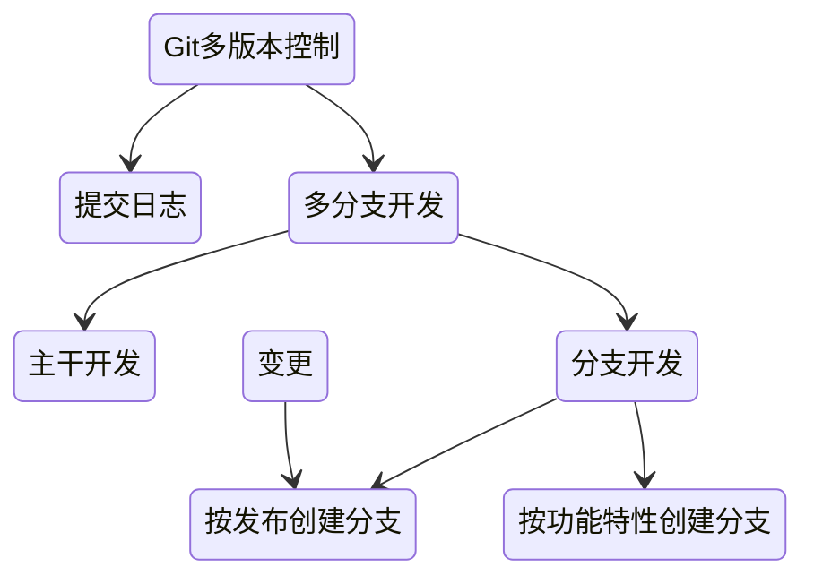
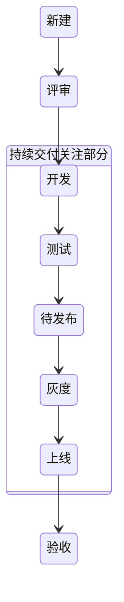
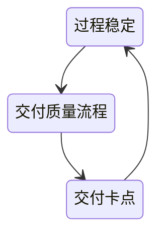
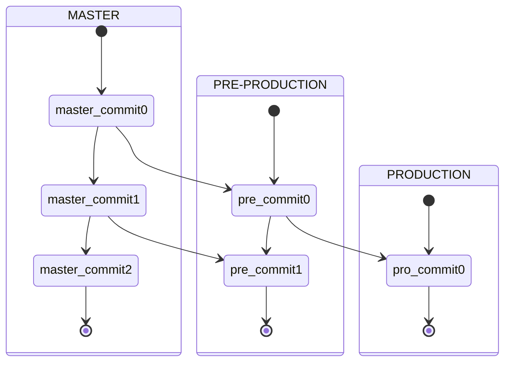
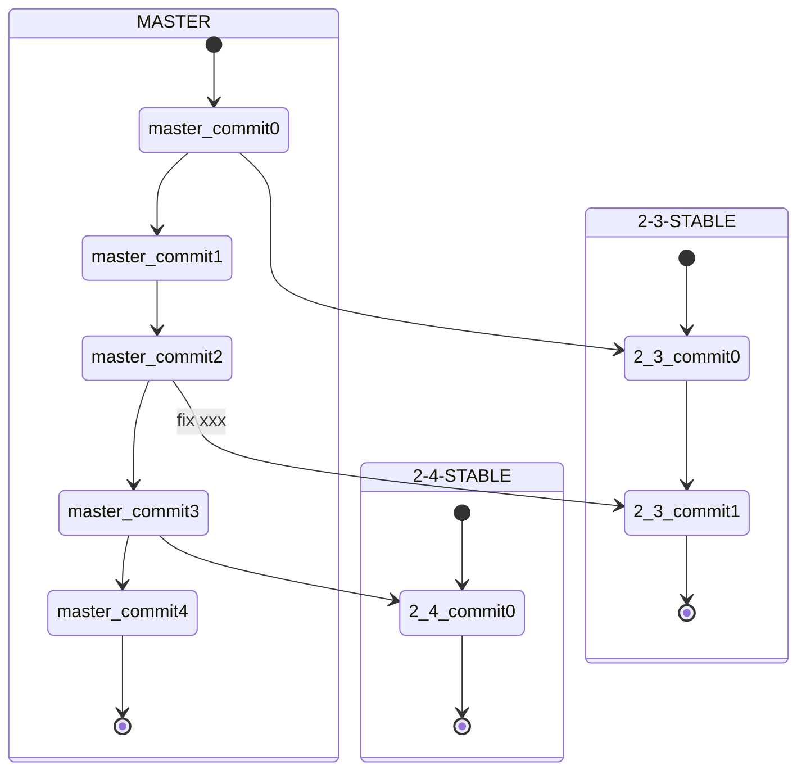

# 持续交付

- 尽早发现问题解决问题

单测是第一道防线

快速（自动化）、迭代（版本控制）、持续（[DevOps](/软件工程/DevOps.md)）

构建自动化、测试自动化、流程编排、持续集成、部署自动化

## 价值

1. 交付速度

## 影响因素

### 文化

适合持续交付的三种组织文化（紧密配合 集思广益 自我驱动）

### 流程

持续交付一定会打破的这三类流程：

1. 耗时较长
2. 完全人工
3. 报备类

如何打破流程：

1. 该审批流程是否确实需要，能否够通过系统来保证去除？
2. 该审批流程是否可以从事前审批转化为事后审核？
3. 该审批流程是否可以被简化？

### 架构

- 集中的架构打包集成更容易，但需要处理日益复杂导致的编译、打包、环境问题
- 相对分散的以SOA为代表，由于分布式，部署变得更加麻烦，中间件的引入也需要考虑适配
- 部署架构的问题 部署标准与部署方式、发布编排次序、灰度发布、自检

## 版本控制

需求任务关联、版本开发规范、语义化版本

开发代码版本：多人多版本

持续交付版本：存于仓库的唯一版本

线上版本

二方版本：提供给其他依赖方的版本

多版本开发：

## 需求周期

为了缩短交付周期，可以使用流水线，一个需求完了之后就可以丢到交付流水线

交付过程的单一迭代时间、交付的质量、流程的科学性及需求本身的质量都会影响需求能不能快速进入开发状态

## 交付质量

### 质量红线

偏离：

- 实现偏离
- 验收不重复

故障：

- 代码问题
- 数据问题
- 配置问题
- 环境问题

## 开发模式

### 主干开发模式

基于主干开发，基于分支发布，使用功能开关来保证功能切换

这种方式是持续集成最理想的开发模式：

1. 一提交就能集成
2. 提交代码前必须merge或rebase远程仓库的代码，尽早解决冲突
3. 可以实现artifact晋级
4. 功能开关很方便

### gitlab flow开发模式

新分支基于主干，不同环境不同分支，发布合并到主干

### 分支开发模式

基于分支开发，分支合并主干，feature基于分支

这种方式不仅无法经常集成代码，而且合并时常常会造成大规模的合并冲突

### 持续交付开发模式

## 变更发布

自动触发部署：测试环境、内部环境

手动触发：正式环境、完成流程化审批

发布人员：

需求方 -> 开发方 -> 执行人 -> 验收方

度量：

发布跟踪里的发布度量
