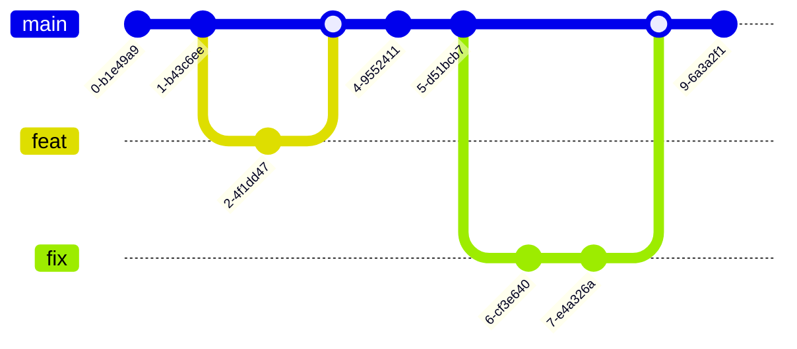
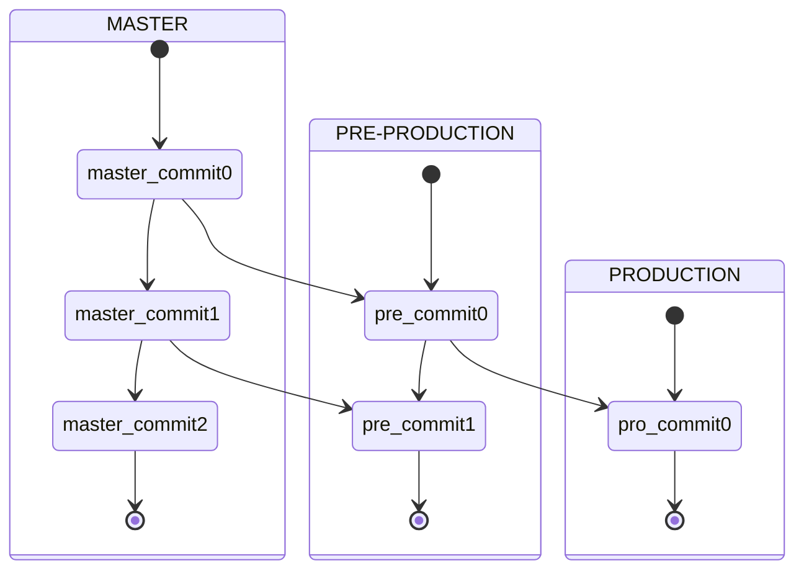
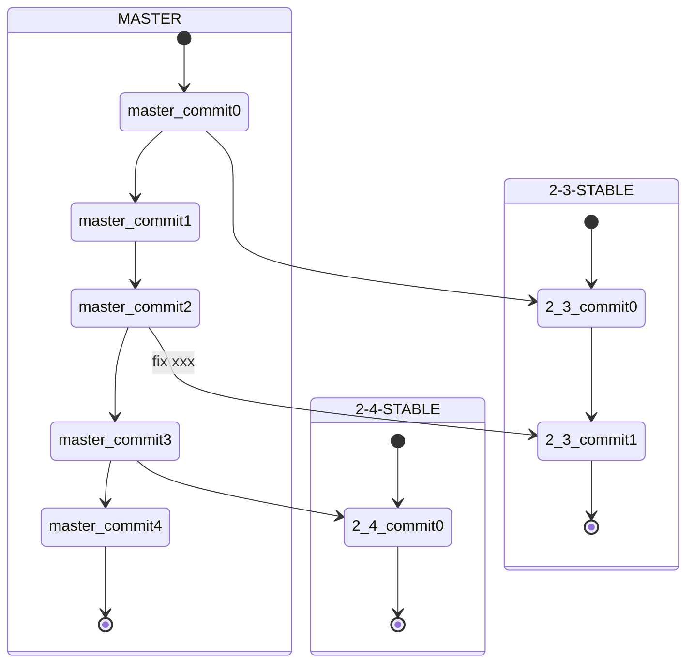
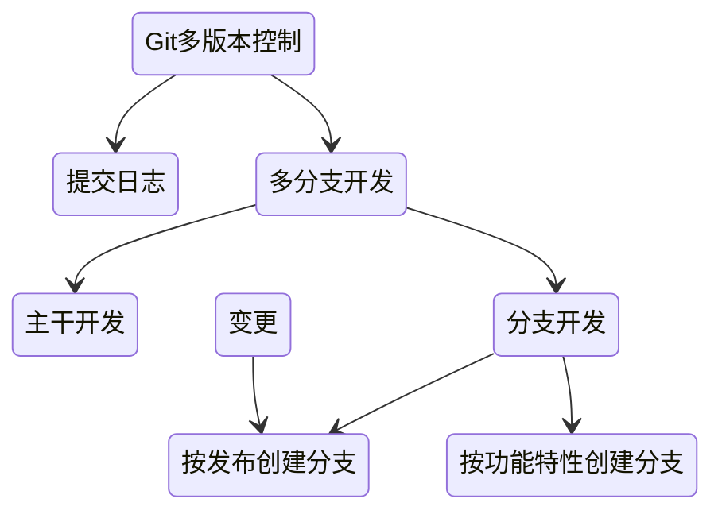
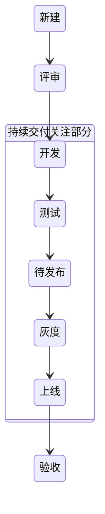
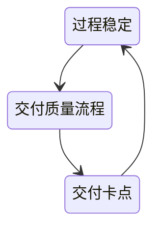

# 持续交付

- 尽早发现问题解决问题

单测是第一道防线

快速（自动化）、迭代（版本控制）、持续（[DevOps](/软件工程/DevOps.md)）

构建自动化、测试自动化、流程编排、持续集成、部署自动化

## 价值

1. 交付速度

## 影响因素

### 文化

适合持续交付的三种组织文化（紧密配合 集思广益 自我驱动）

### 流程

持续交付一定会打破的这三类流程：

1. 耗时较长
2. 完全人工
3. 报备类

如何打破流程：

1. 该审批流程是否确实需要，能否够通过系统来保证去除？
2. 该审批流程是否可以从事前审批转化为事后审核？
3. 该审批流程是否可以被简化？

### 架构

- 集中的架构打包集成更容易，但需要处理日益复杂导致的编译、打包、环境问题
- 相对分散的以SOA为代表，由于分布式，部署变得更加麻烦，中间件的引入也需要考虑适配
- 部署架构的问题 部署标准与部署方式、发布编排次序、灰度发布、自检

## 配置管理

### 分支策略

#### 主干开发

基于主干开发，基于分支发布，使用功能开关来保证功能切换

这种方式是持续集成最理想的开发模式：

1. 一提交就能集成
2. 提交代码前必须merge或rebase远程仓库的代码，尽早解决冲突
3. 可以实现artifact晋级
4. 功能开关很方便

但这对团队成员个人的能力要求高，功能开关没处理好也容易引入新的问题

#### git flow

#### github flow

master 分支中包含稳定的代码，它已经或即将被部署到生产环境。任何开发人员都不允许把未测试或未审查的代码直接提交到 master 分支。对代码的任何修改，包括 Bug 修复、热修复、新功能开发等都在单独的分支中进行

#### gitlab flow

新分支基于主干，不同环境不同分支，发布合并到主干

#### 总结-分支开发模式

基于分支开发，分支合并主干，feature基于分支

不同的功能可以在独立的分支做开发，不容易干扰到主分支，但这种方式不仅无法经常集成代码，而且合并时常常会造成大规模的合并冲突

如果需要做CICD，也需要对不同的分支准备不同的环境

#### 选择

情况                                                                     | 适合的分支策略
---------------------------------------------------------------------- | -------------------
开发团队系统设计和开发能力强，有一套有效的特性切换的实施机制，保证上线后，无需修改代码就能够修改系统行为需要快速迭代，想获得CICD所有好处 | 主干开发
不具备主干开发能力。有预定的发布周期，需要执行严格的发布流程                                         | Git Flow
不具备主干开发能力。随时集成随时发布:分支集成后经过代码评审和自动化测试，就可以立即发布的应用                        | GitHub Flow
不具备主干开发能力，无法控制准确的发布时间，但又要求不停集成                                         | GitLab Flow (带生产分支)
不具备主干开发能力。需要逐个通过各个测试环境验证                                               | GitLab Flow (带环境分支)
不具备主干开发能力，需要对外发布和维护不同版本                                                | GitLab Flow (带发布分支)

### 代码回滚

什么时候需要回滚：源代码导致线上或者测试部署回滚

回滚的原则：坚决不用 reset --hard，这些有问题的commit可能在后续有用，或者别的分支合并可能会导致reset的commit又被合并进来

场景名称      | 特点                                     | 策略
--------- | -------------------------------------- | -----------------------------------------------------------
个人分支回滚    | 不会影响团队其他成员                             | 可以用git reset --hard
集成分支上线前回滚 | 会影响团队其他成员，非线上故障，相对不紧急，可以对单独的commit 做回滚 | 一定不用git reset --hard，可在gitlab.上找到对应的Merge Request，点击revert
集成分支上线后回滚 | 会影响团队其他成员，线上故障，相对紧急，需回滚到包对应的commit     | 一定不用git reset，在集成分支的头，上增加一个commit,该commit的内容等于包回滚后对应的commit

## 版本控制

需求任务关联、版本开发规范、语义化版本

开发代码版本：多人多版本

持续交付版本：存于仓库的唯一版本

线上版本

二方版本：提供给其他依赖方的版本

多版本开发：

## 需求周期

为了缩短交付周期，可以使用流水线，一个需求完了之后就可以丢到交付流水线

交付过程的单一迭代时间、交付的质量、流程的科学性及需求本身的质量都会影响需求能不能快速进入开发状态

## 交付质量

### 质量红线

偏离：

- 实现偏离
- 验收不重复

故障：

- 代码问题
- 数据问题
- 配置问题
- 环境问题

## 变更发布

自动触发部署：测试环境、内部环境

手动触发：正式环境、完成流程化审批

发布人员：

需求方 -> 开发方 -> 执行人 -> 验收方

度量：

发布跟踪里的发布度量
