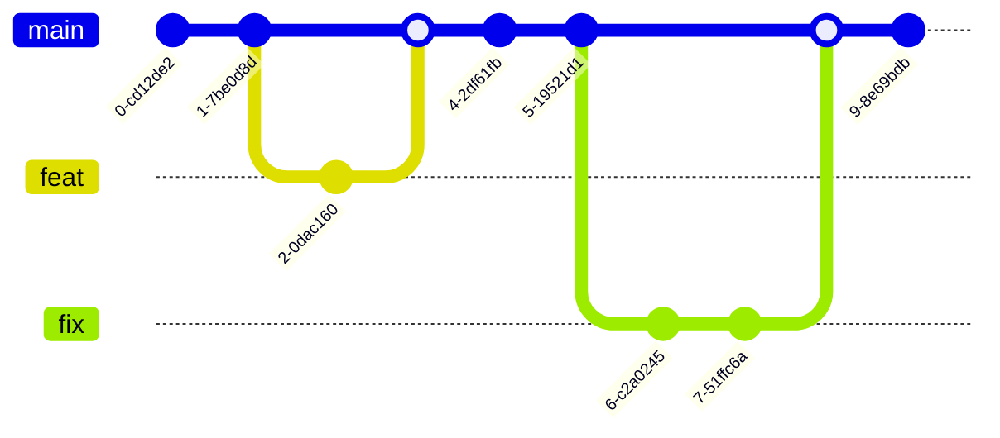

# 持续交付

- 尽早发现问题解决问题

单测是第一道防线

快速（自动化）、迭代（版本控制）、持续（[DevOps](/软件工程/DevOps.md)）

构建自动化、测试自动化、流程编排、持续集成、部署自动化

## 价值

1. 交付速度

## 影响因素

### 文化

适合持续交付的三种组织文化（紧密配合 集思广益 自我驱动）

### 流程

持续交付一定会打破的这三类流程：

1. 耗时较长
2. 完全人工
3. 报备类

如何打破流程：

1. 该审批流程是否确实需要，能否够通过系统来保证去除？
2. 该审批流程是否可以从事前审批转化为事后审核？
3. 该审批流程是否可以被简化？

### 架构

- 集中的架构打包集成更容易，但需要处理日益复杂导致的编译、打包、环境问题
- 相对分散的以SOA为代表，由于分布式，部署变得更加麻烦，中间件的引入也需要考虑适配
- 部署架构的问题 部署标准与部署方式、发布编排次序、灰度发布、自检

## 配置管理

- 版本变更标准化：确保所有软件变更（包括源代码、配置、环境等）都遵循标准化的流程和记录方式，便于管理、追溯和协作。
- 将一切纳入版本控制：所有与软件交付相关的产物（如代码、配置文件、脚本、环境等）都应纳入版本控制系统，确保每个变更都可以追溯并快速回退。
- 全流程可追溯：通过需求、变更、测试、上线等环节的关联，确保整个软件交付过程可追溯，快速定位问题和依赖关系。
- 单一可信数据源：建立统一的版本控制、信息渠道和元数据管控，确保所有信息一致、可靠，避免信息不一致或数据来源不统一的问题

### 分支策略

1. 尽量少拉长期分支
2. 尽量晚拉分支
3. 分支尽早合并或删除
4. 分支活跃期间要频繁同步
5. 分支从哪里拉出来，就合并回哪里
6. 主干分支必须保持随时可发布

#### 主干开发 分支发布

基于主干开发，基于分支发布，使用功能开关来保证功能切换

这种方式是持续集成最理想的开发模式：

1. 一提交就能集成
2. 提交代码前必须merge或rebase远程仓库的代码，尽早解决冲突
3. 可以实现artifact晋级
4. 功能开关很方便

但这对团队成员个人的能力要求高，功能开关没处理好也容易引入新的问题

#### 主干开发 主干发布

开发人员的代码改动都直接集成到这条主干分支上，同时，软件的发布也基于这条主干分支进行，如果想要做到主干分支在任何时间都处于可发布状态，那么，这就对每一次提交的代码质量要求非常高

#### git flow

#### github flow

master 分支中包含稳定的代码，它已经或即将被部署到生产环境。任何开发人员都不允许把未测试或未审查的代码直接提交到 master 分支。对代码的任何修改，包括 Bug 修复、热修复、新功能开发等都在单独的分支中进行

#### gitlab flow

新分支基于主干，不同环境不同分支，发布合并到主干

#### 总结-分支开发模式

基于分支开发，分支合并主干，feature基于分支

不同的功能可以在独立的分支做开发，不容易干扰到主分支，但这种方式不仅无法经常集成代码，而且合并时常常会造成大规模的合并冲突

如果需要做CICD，也需要对不同的分支准备不同的环境

#### 选择

情况                                                                     | 适合的分支策略
---------------------------------------------------------------------- | -------------------
开发团队系统设计和开发能力强，有一套有效的特性切换的实施机制，保证上线后，无需修改代码就能够修改系统行为需要快速迭代，想获得CICD所有好处 | 主干开发
不具备主干开发能力。有预定的发布周期，需要执行严格的发布流程                                         | Git Flow
不具备主干开发能力。随时集成随时发布:分支集成后经过代码评审和自动化测试，就可以立即发布的应用                        | GitHub Flow
不具备主干开发能力，无法控制准确的发布时间，但又要求不停集成                                         | GitLab Flow (带生产分支)
不具备主干开发能力。需要逐个通过各个测试环境验证                                               | GitLab Flow (带环境分支)
不具备主干开发能力，需要对外发布和维护不同版本                                                | GitLab Flow (带发布分支)

### 代码回滚

什么时候需要回滚：源代码导致线上或者测试部署回滚

回滚的原则：坚决不用 reset --hard，这些有问题的commit可能在后续有用，或者别的分支合并可能会导致reset的commit又被合并进来

场景名称      | 特点                                     | 策略
--------- | -------------------------------------- | -----------------------------------------------------------
个人分支回滚    | 不会影响团队其他成员                             | 可以用git reset --hard
集成分支上线前回滚 | 会影响团队其他成员，非线上故障，相对不紧急，可以对单独的commit 做回滚 | 一定不用git reset --hard，可在gitlab.上找到对应的Merge Request，点击revert
集成分支上线后回滚 | 会影响团队其他成员，线上故障，相对紧急，需回滚到包对应的commit     | 一定不用git reset，在集成分支的头，上增加一个commit,该commit的内容等于包回滚后对应的commit

## 环境管理

- 开发环境 主要用户是研发 需要包含一套完整的业务应用依赖以及相关的基础设施
- 功能测试环境 测试过程中版本及依赖应该锁定
- 验收测试环境 除了可以用作测试之外，还可以用作产品展示
- 预发布环境 已经进入了生产网络，和真实的生产应用共享同一套数据库等基础设施，一般不允许开发人员直接登录
- 生产环境

良好的测试环境：

1. 能随时可得，随时归还
2. 快速部署
3. 独立
4. 稳定
5. 高仿真，数据仿真、基础设施仿真

### 建设关键技术点

1. 网段规划。每个环境都要有独立的网段，为了便于管理，如分配回收资源以及部署应用，还是要在逻辑上或者物理上区分出来
2. 服务化框架的单元化调用，服务调用的基本规则就是基于上述网段的规划来建立的，规则要放到服务化的注册中心
3. 环境的域名访问策略，主要是要管理好域名与IP映射，简单的可以手动修改host，复杂的可以引入DNS服务

### 成本

多套环境：

1. 机器资源成本
2. 管理成本 需要维护可用性、数据、配置等
3. 流程成本 每增加一套环境，都需要如何协作，还有多套环境测试成本也会飙升

调解：

1. 抽象公共环境，底层服务，相对比较稳定，其他环境都可以利用这些公用服务，在公共环境的基础上，可以通过泳道的方式隔离相关环境
2. 避免产生多套公共环境
3. 减轻配置的复杂度

### 环境自描述

环境配置不光要考虑单个实例初始化配置，还要考虑基础软件的版本升级引起的运行时配置的变更，而且这些变更都需要被清晰地记录下来，从而保证扩容出新的服务器时能取到正确的、最新的配置

通过独立环境配置，保证一个环境能够完整运作的同时，又保证足够的隔离性：环境依赖的中间件、公共服务如何配置、访问入口的配置问题

通过标准化环境配置来解决混乱的问题：

1. 默认化所有配置、自动化环境产生
2. 规范定义，约定大于配置

当有了标准化，要让环境自描述：

1. 定义 server spec，服务器生成时，写入它自己的描述文件
2. 再通过配置中心拉取配置，完成其他的配置

环境根据自身的能力和属性，决定自己应该去干什么

### 配置

- 构建时配置：通过在打包时指定参数的方式注入配置
- 打包时配置：构建使用默认配置，构建完后根据需求进行配置替换
- [配置中心](/软件工程/微服务/服务治理/配置中心.md)

配置最需要的注意的就是回滚，代码回滚了，配置是否需要跟着回滚？

最好的办法是保证配置与代码的兼容性，这就需要人工在回滚配置时进行判断

### 环境构建

#### 虚拟机准备

- 基于 OPenStack，提前初始化池化虚拟机资源，交由后续的步骤

#### 应用部署

除了要求部署要标准化，同时要允许有一定的并行度

另外要实现流水线容错机制，即在部署发生错误时，要将环境的快照信息保存下来，提供给用户，让用户解决完了之后再重新部署

#### 环境变更

- 关注用户访问应用的入口、应用之间调用链的管理，以及应用对数据库之类的基础设施的访问

访问入口的管理可以通过 SLB 自定义域名的方式，入口暴露后即可创建一个对应的域名

中间件需要可以做到自动判断，被隔离的环境内是否有需要被调用的服务，并在当前环境以及基础环境中间进行自动选择，以保证服务被正确调用到

至于数据库，则可以创建一个基准库，再由用户自己来维护这个基准库的数据

#### 容器

容器能带来更高的自动化、标准化，但由于容器本身不可变的特征，对于一些个性化的环境配置需求，想要实现起来，就比以往更麻烦了

## 版本控制

需求任务关联、版本开发规范、语义化版本

开发代码版本：多人多版本

持续交付版本：存于仓库的唯一版本

线上版本

二方版本：提供给其他依赖方的版本

多版本开发：

## 需求周期

为了缩短交付周期，可以使用流水线，一个需求完了之后就可以丢到交付流水线

交付过程的单一迭代时间、交付的质量、流程的科学性及需求本身的质量都会影响需求能不能快速进入开发状态

## 交付质量

### 质量检测

- 检测是否违反了依赖规则：限定最低版本、避免引入有漏洞的版本等
- 测试：单元测试、接口测试、自动执行
- 安全审计，进行源代码扫描
- 性能和容量压测，这个步骤放在最接近真实线上环境的环境执行

### 质量红线

偏离：

- 实现偏离
- 验收不重复

故障：

- 代码问题
- 数据问题
- 配置问题
- 环境问题

## 发布

- 自动触发部署：测试环境、内部环境
- 手动触发：正式环境、完成流程化审批

### 单机部署

粗暴：kill -> upload -> run

### 集群部署

发布的目标是一组机器而不是一台机器时，主要问题就变成了如何协调整个过程

- [灰度发布](/运维/灰度发布.md)

### 发布系统设计

- 1 张页面展示发布信息，且仅有 1 张页面，展示发布当时的绝大多数信息、数据和内容，这个页面既要全面，又要精准
- 2 个操作按钮简化使用，即页面上除了“回滚”按钮常在外，最多同时展示 2 个操作按钮。目的是要降低发布系统的使用难度，做到“谁开发，谁运行”
- 3 种发布结果，即成功、失败和中断状态，目的是简单、明了地显示用户最关心的发布结果
- 4 类操作选择，包括开始发布、停止发布、发布回退、发布重试，目的是使状态机清晰明了
- 5 个发布步骤，即 markdown、download、install、verify 和 markup。这里需要注意到的是，verify 这步包含了预热，由于耗时往往比较长，一般采用异步的处理方式
- 6 大页面主要内容，包括集群、实例、发布日志、发布历史、发布批次、发布操作，来统一、简洁而又详细呈现发布中和未发布时的各种信息

#### 发布架构

- 单机单应用还是单机多应用 隔离性问题
- 增量发布还是全量发布 对于发布频率非常高的后台服务，需要随时回滚的服务，很难回滚

#### 核心模型

系统的对象模型和所采用的部署架构有很大关系

#### 流程状态流转

下载构建物 --> 通知上游，暂停服务 --> 启动 --> 验证自身健康 -> 对外服务

#### 刹车机制

- Quick and Dirty ：不管成功或失败，优先尝试把版本发布完，继续执行下个发布批次，后续再解决个别目标服务器发布失败的问题

当发布失败达到一定比率，就应该强制中断掉当前发布，刹车后，发布系统允许用户先执行重试发布操作

#### 发布速度

影响发布速度的步骤通常是下载和点火，点火可以通过规范应用的启动规范、就绪准备检测规范、来提升容错性和速度

回滚速度方面，可在目标服务器上缓存最近的多个版本，这样在回滚时也能比重新下发更快，同时可以分多个批次进行并行回滚加快速度

#### 降级

在本地做好数据缓存，做好在外部服务不可用时，也能进行发布

### 发布人员

需求方 -> 开发方 -> 执行人 -> 验收方

### 度量

发布跟踪里的发布度量

## [监控](/软件工程/架构/系统设计/可观测性.md)

对于交付后的监控，最重要的是版本发布后的一段时间进行观察，去监控系统的异常，最理想的情况就是使用业务指标来监控，但两种情况是业务监控无能为力：

1. 系统异常需要累积到一定量后才会表现为业务异常
2. 阴跌，这种小幅度的变化也无法在业务监控上得到体现

## 测试管理

### 代码静态检查

为尽早地发现代码问题：

1. 鼓励开发人员在开发环境下执行静态检查
2. 尽可能地在代码合入主干之前，通过静态检查
3. 没有通过静态检查的产品包，不允许发布到线上或用户验证环境

如何提高静态检查的效率：

1. 缩短代码扫描所消耗的时间
2. 使用异步的方式进行静态检查
3. 在代码合入主干前采用增量形式的静态检查，也就是只检查变更的部分

### 破坏性测试

破坏性测试的手段和过程，是被严格设计和执行的，有对破坏性结果的预期，需要权衡破坏的量和度

破坏性测试设计：

1. 第一个维度：设计一个或一组操作，能够导致应用或系统奔溃或异常，观察系统能否自恢复
2. 第二个维度：整个系统的破坏性测试，采用压力测试、暴力测试、阻断链路去除外部依赖等方法，试图找到需要进行破坏性测试的具体的点

执行策略：

绝大部分破坏性测试都会在单元测试、功能测试阶段执行。而执行测试的环境也往往是局部的测试子环境

### 自动化回归测试

- Mock
- 流量回放

## 平台化

平台化的必要：

1. 多技术栈
2. 分工协作
3. 交付流程、工具不断发展

### 平台化设计

1. 确认交付平台涵盖的模块及范围
2. 挑选最为重要或最为急迫的模块，优先加以实施
3. 定义各个模块交付产物的标准
4. 选择合适持续交付流水线的引擎，不管是自己硬编码写死流程，还是开源的jenkins
5. 抽象公共能力、用户权限管理、消息通知...
6. 用户入口：站点、命令行、还是插件

### 平台化实现

1. 平台化设计：流水线平台专注于流程编排和底层基础能力，而非集成所有垂直业务能力。各垂直业务平台（如自动化测试平台、代码质量平台等）独立存在，并与流水线平台协作，快速复用现有能力，实现最小成本的建设。

2. 可编排与可视化：用户可以通过可视化界面自由定义软件交付过程中的每一个步骤和执行顺序，实现流程的灵活编排，支持不同技术栈和交付环节的需求。

3. 流水线即代码：通过代码化的方式（如 Jenkinsfile）描述流水线逻辑，使其与版本控制系统结合，简化配置管理，便于追溯和维护变更记录。

4. 流水线实例化：支持参数化执行，允许流水线实例化每次执行的任务，生成独立的快照，支持历史回溯和并发执行，提升灵活性和扩展性。

5. 有限支持原则：设计时聚焦大多数常见场景，提供有限的定制化能力，避免复杂性过高；通过通用类原子能力满足差异化需求。

6. 流程可控：流水线支持不同的触发方式（定时、手动、事件触发等），并且可以实现人工审批和权限管控，满足不同业务阶段的需求，灵活覆盖软件交付流程的各个环节。

7. 动静分离配置化：通过动静分离设计，将动态调整的内容配置化，使系统在不修改代码的情况下进行配置调整，提升流水线的灵活性和可扩展性。

8. 快速接入：流水线平台需要支持快速接入外部平台，通过插件机制或自动生成代码的方式，降低接入成本，增强平台的扩展能力。

9. 内建质量门禁：在流水线各阶段设置质量检查，建立质量门禁，确保问题早发现、早修复，实现质量的自动化检查和反馈。

10. 数据聚合采集：通过数据聚合，实现流水线各个环节的可视化展示，便于用户查看全流程的执行结果，并为企业度量平台提供数据支持。

### 度量

1. 稳定性相关指标
2. 性能相关指标
   1. push 和 fetch 代码的速度
   2. 环境创建和销毁的速度
   3. 产生仿真数据的速度
   4. 平均编译速度及排队时长
   5. 静态检查的速度
   6. 自动化测试的耗时
   7. 发布和回滚的速度
3. 持续交付能力成熟度指标
   1. commit 的数量，code review 的拒绝率，并行开发的分支数量
   2. 计算资源的使用率，环境的平均大小
   3. 计算资源的使用率，环境的平均大小
   4. 单元测试的覆盖率，自动化测试的覆盖率
   5. 周发布数量，回滚比率

## 移动APP

特点：

1. 分支开发，主干发布
2. 组件化开发，依赖管理需要注意
3. 需要做好版本管理，重点管理每个功能的信息
4. 构建管理需要考虑安卓、IOS，还有证书问题
5. 版本更新难强制，有内测或公测机制、分发渠道多
6. 需要对版本进行追踪：崩溃、性能、响应等技术指标
7. 有热修复机制

### 交付流水线

1. 发布快车：一个特性按照规划，并入到预定好的版本发布中，版本会定期发车，这需要使用分支开发，主干发布的策略，保证主干随时能发布，实现发布流程全自动化
2. 构建通道：分支合并主干前，都要进行一次CI，保证功能分支的集成是成功的，并且这种继承是要串行的，这样才能保证主干分支上的任何 commit 随时都可以成功构建
3. 自动化发布：相比后端服务，移动端APP更简单，只需打好包，上传至发布站点即可

### 效率

开发效率： 拆分代码仓库，组件化，需要关注组件之间的依赖、兼容问题

构建效率：

- 扁平化依赖，直接由内核去依赖其他组件，这就要求组件之间要做好兼容
- 二进制交付，对于组件，直接依赖其编译包，可以提升编译效率

测试效率：

- 静态扫描：进行自定制，门槛低，也比较轻
- UI 自动化测试：成本太高了，只针对重要的模块和组件
- 自动 Monkey 测试

发布效率：

- 精准性：分发的目标、数量、时长，以及渠道一定要合理、有效，否则就会消耗无谓的分发成本
- 稳定性：做好监控数据的收集和分析，并且要考虑好风险的处理以及必要的回滚和热修复手段
