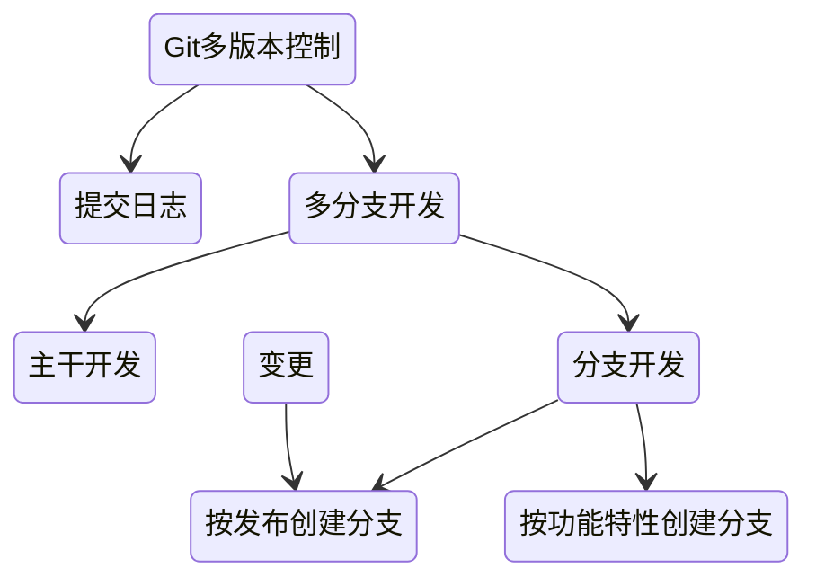
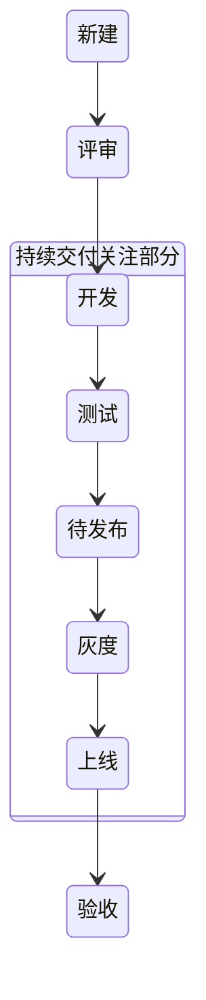
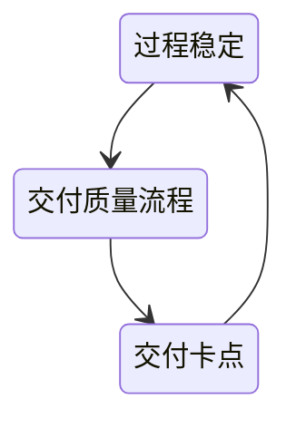
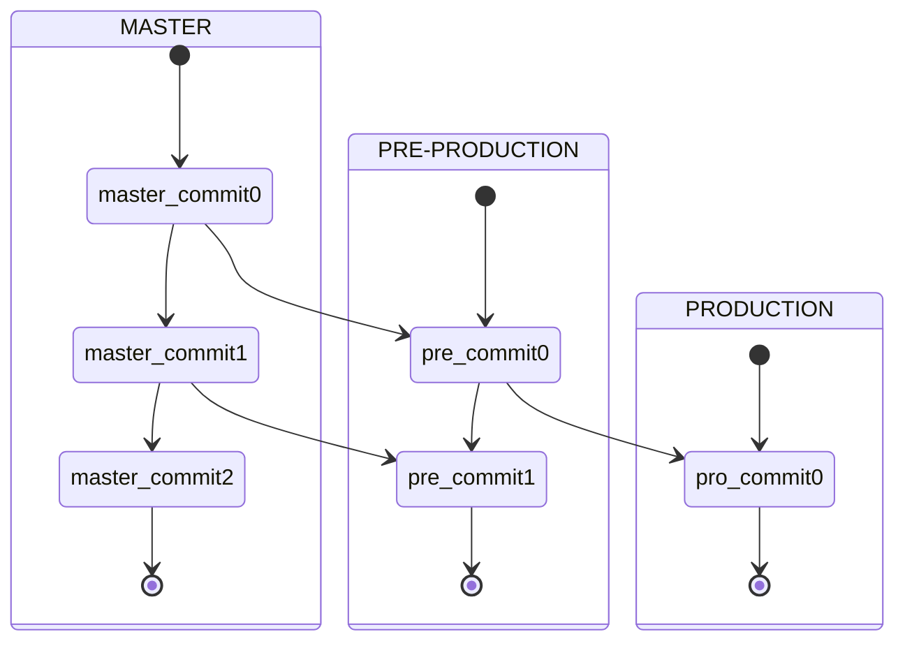
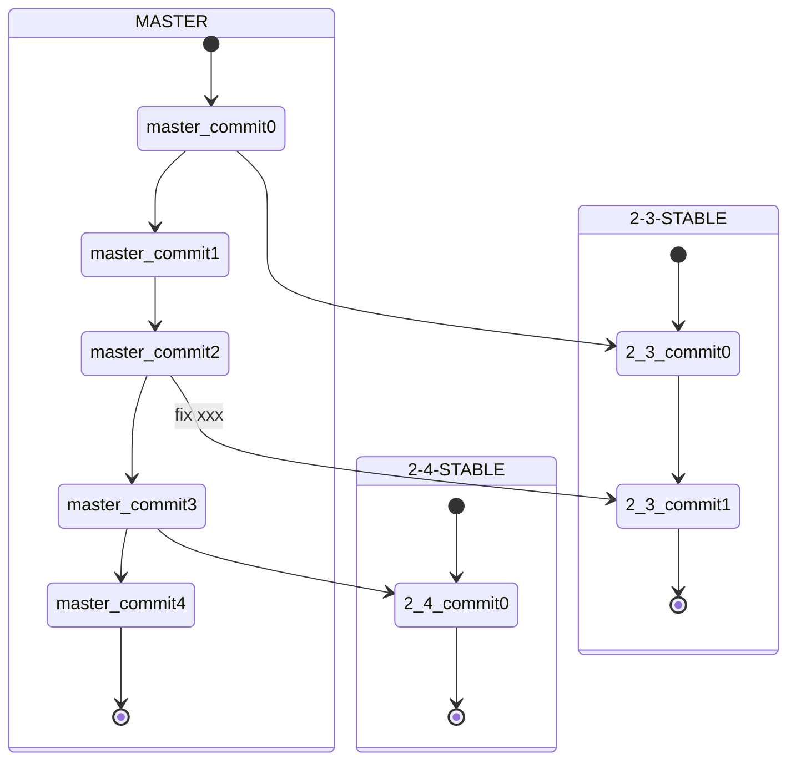

# 持续集成

>持续集成是一种软件开发实践，即团队开发成员经常集成他们的工作，通常每个成员每天至少集成一次，也就意味着每天可能会发生多次集成。每次集成都通过自动化的构建（包括编译，发布，自动化测试）来验证，从而尽早地发现集成错误。

- 持续集成的一个主要作用是保证新提交的代码与已有代码进行集成

**真正的持续集成：**

- 代码应该频繁地被集成
- 应该有测试来验证正确性
- 构建失败后的第一任务时修复失败

**好处：**

- 自动化集成部署，提高了集成效率
- 更快的修复问题
- 更快的进行交付
- 提高了产品质量

## 特点

- 它是一个自动化的周期性的集成测试过程，从检出代码、编译构建、运行测试、结果 记录、测试统计等都是自动完成的，无需人工干预
- 需要有专门的集成服务器来执行集成构建
- 需要有代码托管工具支持

## 流程

### 构建

代码提交到代码仓库后，触发Hook，通知集成服务器拉取最新代码进行构建

### 测试

- 部署之后，就会根据源代码的类型准备环境并运行相关测试

- 单元测试（必需的）
- 集成测试
- 端到端测试（自动化UI测试等）

### 部署

将构建完成之后的工件发布到服务器上，以供访问

## 构建流水线与持续集成

把一个复杂的构建流程分成许多个阶段，称之为构建流水线，不仅能更早地发现错误，而且可以很好地反映软件的质量

- 持续交付(CD)基于以上概念，它频繁地将软件的新版本，交付给质量团队或者用户，以供评审

## 持续交付

- 尽早发现问题解决问题

单测是第一道防线

快速（自动化）、迭代（版本控制）、持续（[DevOps](/软件工程/DevOps.md)）

构建自动化、测试自动化、流程编排、持续继承、部署自动化

### 版本控制

需求任务关联、版本开发规范、语义化版本

开发代码版本：多人多版本

持续交付版本：存于仓库的唯一版本

线上版本

二方版本：提供给其他依赖方的版本

多版本开发：

### 需求周期

为了缩短交付周期，可以使用流水线，一个需求完了之后就可以丢到交付流水线

交付过程的单一迭代时间、交付的质量、流程的科学性及需求本身的质量都会影响需求能不能快速进入开发状态

### 交付质量

#### 质量红线

偏离：

- 实现偏离
- 验收不重复

故障：

- 代码问题
- 数据问题
- 配置问题
- 环境问题

### 开发模式

#### 主干开发模式

基于主干开发，基于分支发布，使用功能开关来保证功能切换

#### gitlab flow开发模式

新分支基于主干，不同环境不同分支，发布合并到主干

#### 分支开发模式

基于分支开发，分支合并主干，feature基于分支

#### 持续交付开发模式

### 变更发布

自动触发部署：测试环境、内部环境

手动触发：正式环境、完成流程化审批

发布人员：

需求方 -> 开发方 -> 执行人 -> 验收方

度量：

发布跟踪里的发布度量

## 持续部署

- 在持续交付的基础上，把部署到生产环境的过程自动化

实际部署到生产环境之前肯定需要一定的人工卡点，如引入必要的检查以及人工测试来做最后的兜底保障

## 持续集成工具

- jenkins 可私有化部署
- travis-ci
- github action
- ...
