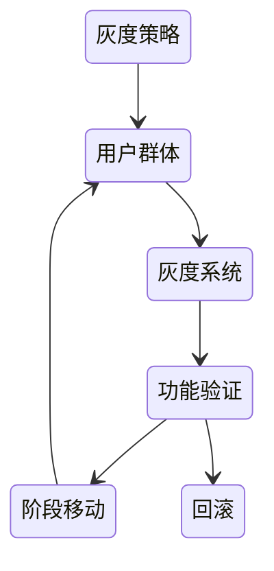
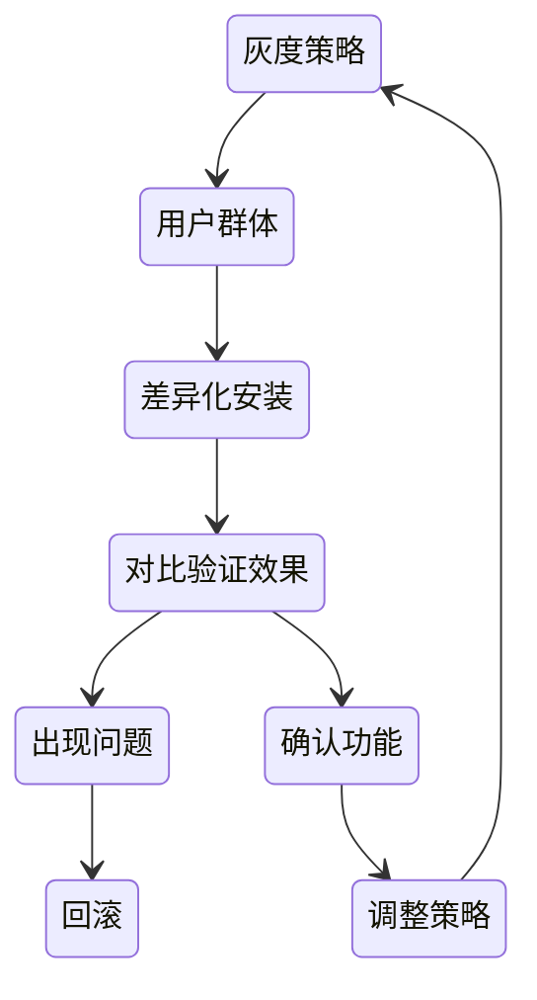
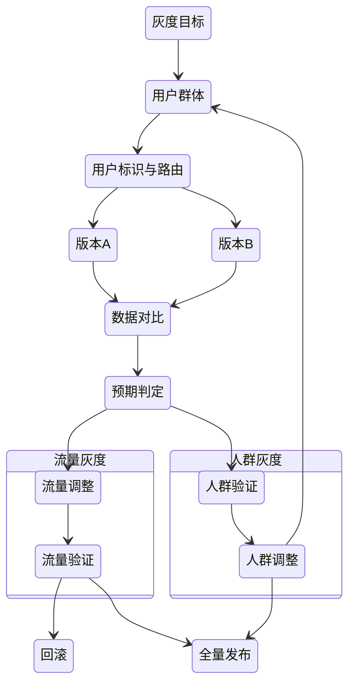

# 灰度发布

## 灰度发布的本质与定位

### 本质定义

灰度发布是一种**风险控制型的软件变更交付机制**。其核心思想是：

> 在不确定性环境下，通过**不完全暴露、可观测反馈、可逆操作**，逐步验证系统变更的安全性与价值。

灰度发布关注的是：

* 如何**控制变更风险**
* 如何**限制故障影响半径**
* 如何在真实环境中**获取高质量反馈**

### 在交付体系中的位置

灰度发布位于 CI/CD 流水线之后、全量发布之前，是连接**工程变更**与**真实用户环境**的关键治理环节。

```
代码交付 → 构建/部署 → 灰度发布 → 全量发布
```

它是[持续交付](/运维/持续交付.md)体系中，**将技术不确定性转化为可控风险**的核心能力。


## 灰度发布设计原则

| 原则 | 说明 |
|------|------|
| **可观测性优先** | 无监控，不灰度 |
| **快速回滚能力** | 分钟内完成回滚 |
| **渐进式放量** | 指数级增长（1% → 5% → 20% → 50% → 100%） |
| **业务指标为核心** | 技术指标通过 ≠ 发布成功 |
| **自动化决策** | 人工审批 + 自动执行 |

## 灰度发布能力模型

从稳定性与系统治理视角看，灰度发布可以抽象为以下五类核心能力：

### 流量控制能力

* 请求分流（比例 / 规则 / 动态调整）
* 支持多版本并行
* 支持按阶段逐步放量

这种流量控制能力通常通过[网关](/软件工程/架构/系统设计/网关.md)实现，网关作为系统的边界控制点，负责请求的路由与转发。

### 用户识别与分群能力

* 用户唯一标识（账号、设备、Cookie 等）
* 用户标签体系
* 人群定向与排除能力

### 可观测与度量能力

* 技术指标：错误率、延迟、资源使用
* 业务指标：转化率、留存、营收
* 日志、埋点、链路追踪

灰度发布依赖于完善的[可观测性](/软件工程/架构/系统设计/可观测性.md)体系，通过指标、日志、追踪三支柱模型实现对系统的全面监控。

### 决策与策略能力

* 灰度目标定义
* 验证规则与阈值
* 人工 / 自动决策支持

### 回滚与可逆能力

* 快速回滚
* 配置级切换
* 最小化状态污染

> 灰度发布是否成熟，取决于上述能力是否形成**闭环协同**

## 灰度策略分类（按目标划分）

### 验证性灰度（Risk Validation）

**目标**：验证系统变更是否安全、稳定、符合预期。

典型场景：

* 新版本发布
* 架构或依赖升级
* 高风险变更

核心关注点：

* 异常是否出现
* 指标是否偏离基线

#### 验证性灰度流程模型


```mermaid
stateDiagram-v2
灰度策略 --> 用户群体
用户群体 --> 灰度系统
灰度系统 --> 功能验证
功能验证 --> 阶段移动
功能验证 --> 回滚
阶段移动 --> 用户群体
```

### 探索性灰度（Value Exploration）

**目标**：探索不同方案在真实环境中的业务价值。

典型场景：

* A/B Test
* 功能体验对比
* 商业策略验证

核心关注点：

* 相对效果差异
* 长期收益表现

#### 探索性灰度流程模型


```mermaid
stateDiagram-v2
灰度策略 --> 用户群体
用户群体 --> 差异化安装
差异化安装 --> 对比验证效果
对比验证效果 --> 出现问题
出现问题 --> 回滚
对比验证效果 --> 确认功能
确认功能 --> 调整策略
调整策略 --> 灰度策略
```

## 统一灰度流程闭环模型

无论是验证性还是探索性灰度，其底层流程可以统一抽象为：

**策略 → 分流 → 验证 → 决策 → 行动**


```mermaid
stateDiagram-v2
灰度目标 --> 用户群体
用户群体 --> 用户标识与路由
用户标识与路由 --> 版本A
用户标识与路由 --> 版本B
版本A --> 数据对比
版本B --> 数据对比
数据对比 --> 预期判定

预期判定 --> 流量调整
state 流量灰度 {
流量调整 --> 流量验证
}
流量验证 --> 回滚
流量验证 --> 全量发布

预期判定 --> 人群验证
state 人群灰度 {
人群验证 --> 人群调整
}
人群调整 --> 用户群体
人群调整 --> 全量发布
```

该模型强调：

* 所有灰度行为必须可观测
* 所有决策必须可逆


## 灰度发布生命周期管理

### 三阶段控制

灰度发布生命周期可分为三个阶段，每个阶段有明确的关注重点与控制目标：

| 阶段 | 核心目标 | 关键动作 |
|------|----------|----------|
| **灰度前** | 风险预防 | 预验证、老逻辑保持、变更评审 |
| **灰度中** | 渐进验证 | 流量染色、新老分流、熔断回滚 |
| **灰度后** | 稳定交付 | 全量切换、快速回滚、监控观测 |

### 灰度拉齐周期控制

灰度版本与生产版本长期共存会产生技术债务，必须控制拉齐周期。

**拉齐周期原则**：

* 灰度版本拉齐周期**不宜超过两周**
* 超过两周未全量的灰度版本应启动升级评估
* 长期灰度会导致运维复杂度增加、故障定位困难

**拉齐触发条件**：

| 条件 | 处理方式 |
|------|----------|
| 核心指标达标 | 进入全量发布流程 |
| 出现异常或指标偏离 | 启动回滚流程 |
| 周期超限且无明确结论 | 暂停灰度，组织评审 |

**生命周期闭环**：

```
灰度前准备 → 灰度中验证 → 灰度后收尾 → 全量/回滚
                    ↓
              周期超限评估 → 继续/终止
```


## 灰度发布技术体系

### Feature Toggle（特性开关）

Feature Toggle 是一种在**代码层面**实现灰度控制的技术手段，通过动态配置决定功能的开启与关闭。

**核心价值**：

* 毫秒级切换，可紧急关闭问题功能
* 支持按用户、比例、时间等规则动态控制
* 无需重新部署即可改变系统行为

**规则类型**：

* 用户ID哈希
* 白名单（指定用户/组织）
* 百分比流量
* 时间窗口
* SpEL 表达式

**生命周期管理**：

| 阶段 | 状态 | 说明 |
|------|------|------|
| 开发阶段 | OFF | 功能开发中，默认不启用 |
| 灰度阶段 | ON | 小范围启用，逐步放量 |
| 全量阶段 | 100% | 所有用户可用 |
| 归档阶段 | ARCHIVED | 功能稳定后清理开关 |

**适用场景**：

* 功能灰度与紧急开关
* A/B 测试
* 缺陷热修复

### 四层灰度架构

灰度发布的技术实现可分为四个层次，各层协同实现完整的灰度能力：

| 层级 | 职责 |
|------|------|
| **L1: 流量接入层** | 入口流量控制 |
| **L2: 服务层** | 实例级调度 |
| **L3: 应用层** | 逻辑级控制 |
| **L4: 数据层** | 实验分析 |

**层级协同关系**：

```
L1 流量接入层 → 负责入口流量分配
    ↓
L2 服务层 → 负责实例级别版本路由
    ↓
L3 应用层 → 负责代码级功能开关
    ↓
L4 数据层 → 负责数据采集与效果分析
```

> 实际应用中，可根据业务需求选择合适层次组合。

### 数据库灰度

数据库变更是灰度发布中的高风险场景，因为数据结构变更一旦失败，影响范围往往是全局性的。

**数据库灰度的核心挑战**：

* 数据库无版本概念，变更难以回滚
* 上下游依赖的字段结构无法渐进式切换
* 数据迁移窗口通常需要停机或锁表

**数据库灰度策略**：

| 策略 | 说明 | 适用场景 |
|------|------|----------|
| -expand-column | 新增字段使用默认值，允许新旧代码共存 | 字段类型变更、默认值变更 |
| 幽灵表 | 先建空表，正式发布时切换数据 | 大表结构变更 |
| 双写 | 新旧字段同时写入，逐步切换读取 | 关键字段新增 |
| 数据库快照 | 灰度前创建快照，异常时快速恢复 | 高风险迁移 |

**数据库灰度实施步骤**：

1. **变更规划**：评估对上下游的影响，制定回滚方案
2. **环境准备**：在测试环境复制生产数据结构
3. **变更实施**：编写可回滚的迁移脚本
4. **功能验证**：验证新字段读写正常
5. **灰度发布**：小范围启用新字段逻辑
6. **全量部署**：确认稳定后切换所有流量

**最佳实践**：

* 使用数据库版本管理工具跟踪变更
* 保持新旧字段兼容，避免强耦合
* 灰度周期内定期同步数据，防止数据不一致
* 灰度版本拉齐周期不宜过长（业界经验为两周）

### 优雅下线

服务终止时停止接收新请求，确保现有请求处理完成后再退出。

**核心概念**：

| 概念 | 说明 |
|------|------|
| 优雅下线 | 停止接收新请求，处理完现有请求后退出 |
| 强制下线 | 立即停止，不等待请求处理完成 |
| 退出窗口 | 等待现有请求处理的最大时间 |

**实现流程**：

```
接收终止信号 → 流量摘除 → 等待退出窗口 → 强制退出
```

**关键机制**：

* **流量摘除**：从负载均衡/服务发现中移除实例
* **连接耗尽**：等待线程池/HTTP连接池处理完毕
* **信号处理**：捕获 SIGTERM，执行下线逻辑

> 优雅下线是滚动发布的基础设施能力，确保旧实例在流量切换前处理完所有在途请求。

### 部署实现方式

#### 蓝绿部署

**特点**：

* 新旧版本环境完全隔离
* 一次性切换流量

**适用场景**：

* 变更风险较高
* 基础设施资源充足

**局限**：

* 资源成本高
* 不适合长期共存验证

#### 金丝雀发布

**特点**：

* 新旧版本长期共存
* 小流量逐步放量

**适用场景**：

* 高频发布
* 持续交付体系

在[微服务](/软件工程/微服务/微服务.md)架构中，灰度发布变得更加重要，因为服务数量增多，变更风险也随之增加。

#### 滚动发布

**特点**：

* 在同一套环境内逐步替换实例
* 每次启动一台新实例，停止一台老实例，循环进行
* 资源需求增量较小

**适用场景**：

* 大规模集群环境
* 资源成本受限
* 可接受短暂新旧版本共存

**局限**：

* 升级期间新旧版本共存，系统状态不稳定
* 问题定位困难，难以判断异常来源
* 回滚速度较慢

> 滚动发布与蓝绿部署的核心区别在于：**蓝绿部署需要双套环境并支持瞬时切换，滚动发布在同一套环境内顺序替换**。

#### 三种部署方式对比

| 维度 | 蓝绿部署 | 金丝雀发布 | 滚动发布 |
|------|----------|------------|----------|
| 环境策略 | 双套完全隔离 | 单套或双套共存 | 单套内顺序替换 |
| 流量切换 | 瞬时全量切换 | 比例渐进放量 | 顺序逐步切换 |
| 资源成本 | 双倍资源 | 少量增量 | 少量增量 |
| 回滚速度 | 秒级 | 分钟级 | 较慢（需逆序） |
| 升级期间状态 | 稳定（全切或全不切） | 稳定（比例可控） | 不稳定（新旧共存） |
| 问题定位 | 清晰（切换前后分明） | 清晰（流量比例明确） | 困难（多版本混杂） |
| 适用场景 | 高风险变更、核心系统 | 高频发布、持续交付 | 大规模集群、资源受限 |
| 验证周期 | 短（可快速全量） | 可长（持续观察） | 中等 |

### 灰度度量指标

**短期指标（稳定性）**：

* 错误率
* 延迟
* 资源使用

**长期指标（业务）**：

* 转化率
* 用户留存
* 营收与利润

这些指标的收集与分析是[质量工程](/软件工程/质量工程.md)的重要组成部分，通过数据驱动的方式验证灰度发布的效果。

### 异常分级与回滚策略

* 一级异常：严重故障，立即回滚
* 二级异常：系统劣化，大规模出现需回滚
* 三级异常：可控问题，持续观察

原则：

> 灰度阶段优先保护系统与用户，而非功能本身。


## 组织协作与流程责任

* 策略制定：产品 / 技术负责人
* 指标监控：运维 / SRE
* 回滚决策：值班负责人（预先授权）

灰度发布是**组织协作能力**，不是单一团队行为。

在[安全生产](/软件工程/安全生产.md)体系中，灰度发布是变更管理的重要环节，通过风险分级与管控确保系统稳定。


## 总结与复盘机制

* 灰度目标是否达成
* 风险是否被有效控制
* 指标偏离的原因分析
* 流程与策略的优化点

最终目标是：

> 让灰度发布从"经验驱动"演进为"体系化治理能力"。

## 关联内容

- [/运维/持续交付.md](/运维/持续交付.md) 持续交付是灰度发布的重要前置环节，提供了自动化构建、测试、部署的能力基础
- [/运维/持续集成.md](/运维/持续集成.md) 持续集成是灰度发布的上游环节，确保每次变更经过充分验证后进入灰度流程
- [/运维/K8s.md](/运维/K8s.md) K8s 的滚动更新（RollingUpdate）、蓝绿部署、金丝雀发布是灰度发布的经典技术实现
- [/软件工程/架构/系统设计/网关.md](/软件工程/架构/系统设计/网关.md) 网关是实现灰度发布中流量控制和路由策略的关键组件，负责请求的分发与管理
- [/软件工程/架构/系统设计/可观测性.md](/软件工程/架构/系统设计/可观测性.md) 可观测性体系为灰度发布提供必要的监控、日志和追踪能力，确保灰度过程的可见性
- [/软件工程/架构/系统设计/故障管理.md](/软件工程/架构/系统设计/故障管理.md) 灰度发布是变更治理体系的重要组成部分，提供风险控制与快速回滚能力
- [/软件工程/架构/系统设计/混沌工程.md](/软件工程/架构/系统设计/混沌工程.md) 灰度发布后可结合混沌工程验证系统在变更后的容错能力
- [/软件工程/微服务/微服务.md](/软件工程/微服务/微服务.md) 微服务架构下灰度发布变得更加重要，需要考虑服务间的依赖关系和版本兼容性
- [/软件工程/质量工程.md](/软件工程/质量工程.md) 质量工程提供了灰度发布中的度量指标体系和质量保障方法论
