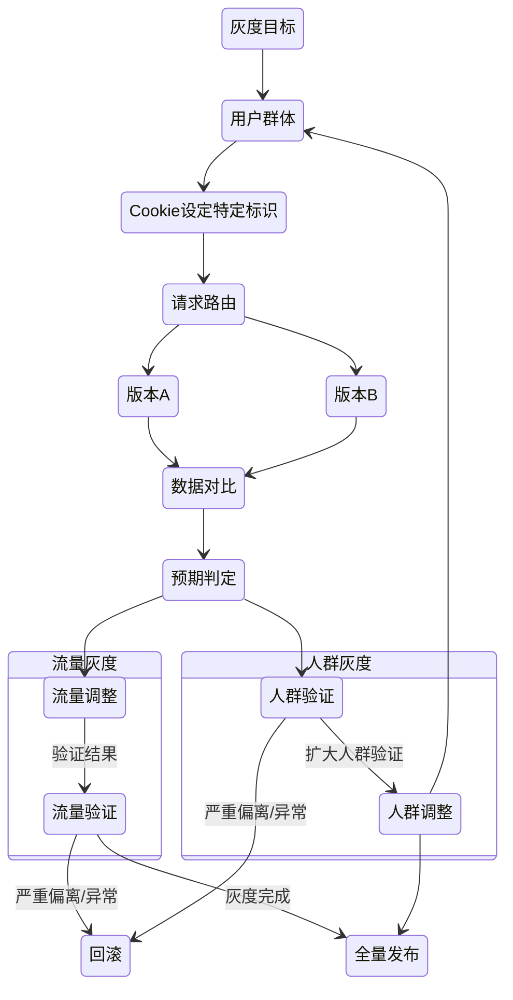

# 灰度发布

- 逐步发布

## 场景

- 应用灰度
- 链路灰度
- 前端灰度

## 验证性灰度

## 探索性灰度

- A/B Test

差异化流量探索 功能对比

## 灰度策略

灰度的持续时间要保证采集到足够的数据

灰度覆盖的范围要确定能覆盖变更的情况

灰度的异常是否要修复，修复要马上回滚

- 商业策略
- 功能体验
- 新版发布
- 定向发布
- AB测试
- 高危试错

### 用户群体

如何选择：

- 按地域
- 按用户标签
- 历史用户特征
- ...

#### 用户标识管理

- 用户群体
- 用户数量
  - 针对特定群体特定数量的用户
  - 无差别灰度 比较简单

### 具体实现

#### 蓝绿部署

有时候，某些问题只有在特定环境下才能出现，蓝绿部署就是部署新版本服务后，不停止老版本服务，先对新服务运行一些测试，如果没问题就把流量从老服务转发到新服务，一旦出现问题，快速切换回老服务。

但需要你能切换生产流量到不同的主机以及拥有足够的主机来部署两个服务

#### 金丝雀发布

金丝雀发布则是将部分生产流量从老服务切换到新服务，来验证系统是否按预期执行，金丝雀发布与蓝绿部署的区别在于，金丝雀发布老旧版本共存时间较长，而蓝绿部署一旦确定新系统没问题，就会关停老系统

### 灰度功能范围
### 发布频率（在当前用户群体停留的时间）
### 验证方法
### 回滚策略
### 灰度度量

验证性度量：

- 短期 异常数量 用户流量 业务指标
- 长期 用户使用情况（转化率） 营收利润

## 发布执行

灰度平台：

## 流量分级

- 小流量验证 避免大规模损失
  - 灰度平台自动拆分批次
- 细粒度灰度支持
  - 影响最小化
  - 与业务集合
  - 账户指向灰度 方便验证
  - 开关灰度 瞬时切换 快速回滚

## 回滚策略

灰度的过程中每个阶段都有可能导致异常发生 首先要执行回滚，然后再排查原因

针对高位预警，需要进行场景化梳理，在日志里埋点，进行定向监控后预警

### 异常分级

- 一级：导致故障的重点异常 出现较多需要回滚
- 二级：导致系统不太健康或者出现奇怪行为的异常 大规模出现时需要回滚
- 三级：不会进行恶化的异常 持续关注 无需回滚

## 总结与复盘

全面梳理灰度用户使用情况信息

针对整个过程进行分析、总结、完善

整个灰度是否达到了降低风险、减少bug带来的影响

针对发布的过程，思考灰度流程是否有优化的空间

结果是否符合预期，复盘偏离的原因，如何避免偏离

灰度发布后续计划，什么人做什么事

灰度过程后沉淀下的经验，帮助其他的项目以及后续的发布
