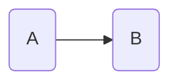
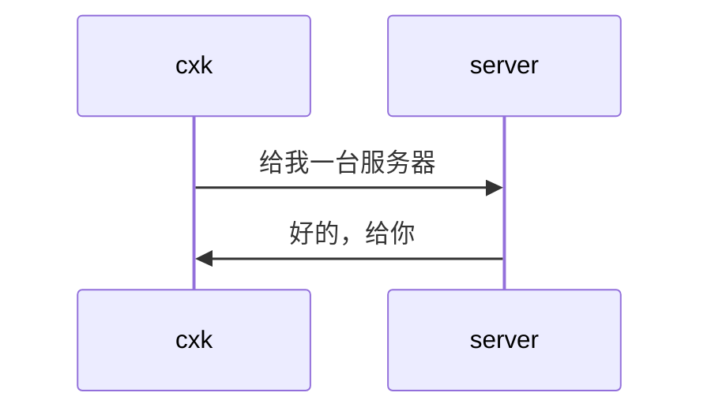

# markdown写作

- 语法简单
- 文本格式
- 网络协作

## 文章题纲

- 标题

```md
## 二级标题
```

- 无序列表

```md
- 1
- 2
```

- 有序列表

```md
1. a
2. b
```

- 完成任务

```md
- [x] 已完成
- [ ] 未完成
```

- [x] 已完成
- [ ] 未完成

## 文本与代码

- 分段

```md
p1

p2
```

- 粗体

```md
**text**
```

- 斜体

```md
*text*
```

- 删除线

```md
~~text~~
```

- 引用

```md
> 引用文本
```

- 代码块

- 转移字符
- 脚注

```md
- cxk[^1]

[^1]:知名篮球选手.
```

## 表格图形

- 表格

```md
| 姓名 | 性别 | 年龄 | 婚姻状况 |
|-----|-----:|:---:|:--------|
| 张三 | 男   | 25  | 未婚     |
| 李四 | 女   | 35  | 已婚     |
| 王五 | 男   | 45  | 离异     |
```

可以使用html来呈现复杂表格

- 流程图



- 序列图



## 数学

- latex

行内引用：$\LaTeX$

单独引用：$$\LaTeX$$

- 上标与下标

$$10^2$$

$$10^{2+i}$$

$$A_i$$

$$A_{i+1}$$

- 求和

$$\sum_{i=0}^n A_i$$

- 上划线下划线

$$P(A) = \overline{A}\overline{B}$$

$$A = B \underline{B}$$

- 花括号

$$\underbrace{e,d}_{公钥P_k}$$

- 分式

$$\frac{a}{2}$$

- 矩阵

$$
  \begin{matrix}
    a && b \\
    c && d \\ 
  \end{matrix}
$$