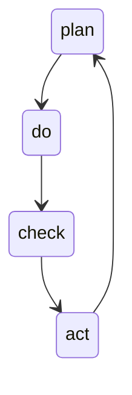
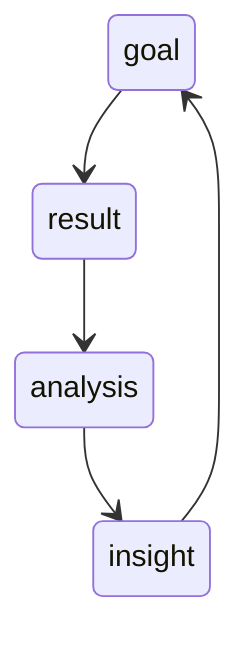
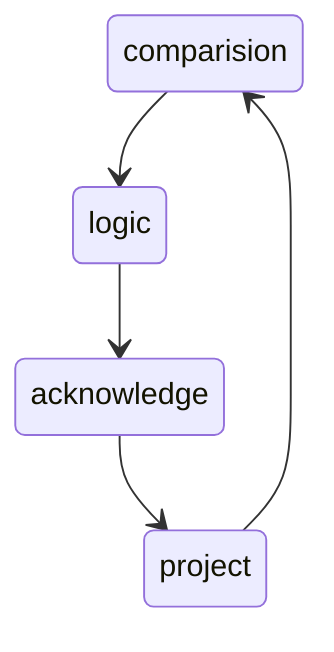
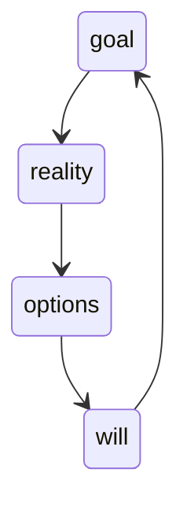

# 复盘

## 模型

### PDCA

常见易错点可以整理成 Checklist，行之有效的方法可以固化到流程中

PDCA 只会教你实现目标，不会教你调整目标；只会告诉你怎么把事情做好，不会告诉你是不是该做别的事情了

### PDF

- 目标：当初设定的目标是什么，设定目标的原因是什么
- 结果：对照目标评估现在的工作成果，是完成了，没有完成，还是部分完成
- 分析：通过不停地追问，找到成功或失败的根本原因
- 总结：继续深挖成功的经验或失败的教训

优化了PDCA没有对战略目标的调整，但分析与总结严重依赖复盘者的个人能力

### CLAP

- 对比（Comparison）：陈述结果，和最初设定的目标进行对比，也就是对事实的总结
- 逻辑（Logic）：梳理逻辑，解释结果和目标之间的差距，也就是对原因的分析
- 认知（Acknowledge）：提出假设，更新对业务和用户的理解，也就是对认知的修正
- 规划（Project）：制定改进规划，在实践中验证，也就是对未来的优化。得到的结果，又可以作为下一次循环的依据。

## 教练技术

- Goal（界定目标）：放下情绪冲突的意气之争，聚焦于真正的目标探讨
- Reality（反映真相）：从行为的表象中意识到心态的本质。
- Options（改善心态）：不但要关注方案上的选择，更要关注心理上的选择
- Will（计划行动）：积极地制定行动计划，跨越障碍，解决问题，达成目标

### 四种基本能力

1. 聆听：通过聆听发现对方可能存在的问题
2. 发问：通过提问让对方袒露出真实的想法
3. 区分：通过区分帮对方卸下心理上的负担
4. 回应：通过回应及时给予对方有力的支持

## 制度和文化

想让复盘顺利落地，不光要掌握复盘流程、工具和方法，也要营造复盘的环境

1. 制订优先级 复盘属于重要但不紧急的事，预留一定的时间给临时性工作。而对常见的临时性工作，平时就要做好资料的整理工作
2. 奖惩措施 奖通常比罚更有效
3. 书面文档 沉淀之前积累的经验，整理成系统的书面文档资料 让文化与流程在团队里通过文档而非人来传播
4. 辅导机制 帮助新人融入

## 团队

- 组建复盘团队，并且做好团队成员的角色分工

### 选人原则

意愿度 ＞ 基本素质 ＞ 知识结构 ＞ 专业能力

### 职责分工

- 辅助者
  - 推进流程，把握主线
  - 提醒监督，维护秩序
  - 记录总结，及时同步
- 参与者
  - 整理资料，陈述事实
  - 提出问题，协助深挖
- 引导者
  - 观察控场，激活思路

## 资料准备

- 是否有重要因素被遗漏
- 是否存在相同要素的重复

> MECE 原则：相互独立，完全穷尽

### 资料要素

- 目标
- 计划
- 结果

## 复盘会议

- 产出：要结论有效
- 投入：要流程高效

步骤：

1. 破冰 活跃氛围，创造一个平等和开放的对话环境
2. 事实比较 回顾目标 -> 目标结果对比
3. 分析原因
4. 分析成功、失败的规律
5. 制定计划 做正确的事、停错误的事、想有利于达到目标的事

## 计划

如何考核：

- 存量市场的确定性业务，适合用 KPI 考核
- 不确定性的业务，适合用 OKR 管理
- 确定性业务要做出超级增量的，适合 KPI 和 OKR 一起使用

归档：

1. 会议记录
2. 目标和结果比较
3. 新的认知
4. 下一步的目标和计划

## 检查评估

- 检查核验复盘的效果

检查方向：

1. 准备工作 是否提前准备好了数据详实的资料？参与复盘的全部人员是否已经仔细看过所有资料？
2. 会议气氛 是在甩锅还是在学习？是对人还是对事？是讲道理讲数据还是迷信权威？
3. 团队状态 是否积极发言？各角色是否在线？信息是否真实，逻辑是否自洽？
4. 流程效率 会议是否足够有效率？
5. 成员信心
6. 环节重点 CLAP是否到位
