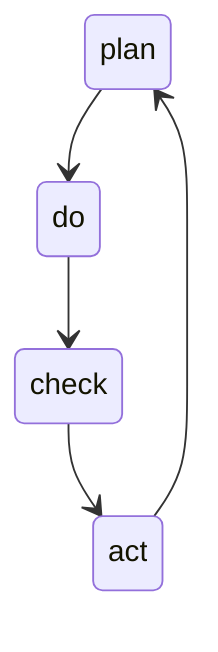
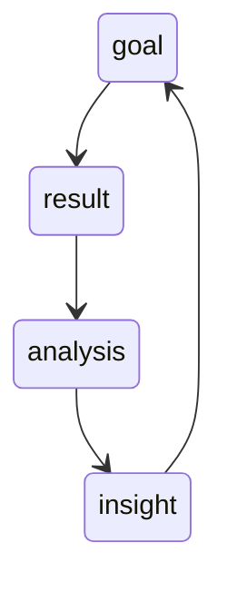
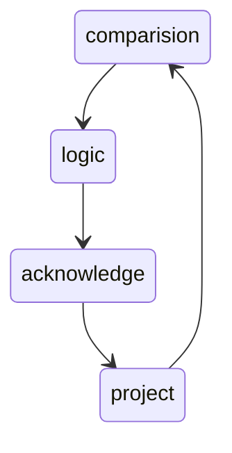
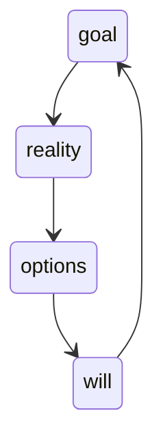

# 复盘

## 模型

### PDCA

常见易错点可以整理成 Checklist，行之有效的方法可以固化到流程中

PDCA 只会教你实现目标，不会教你调整目标；只会告诉你怎么把事情做好，不会告诉你是不是该做别的事情了

### PDF

- 目标：当初设定的目标是什么，设定目标的原因是什么
- 结果：对照目标评估现在的工作成果，是完成了，没有完成，还是部分完成
- 分析：通过不停地追问，找到成功或失败的根本原因
- 总结：继续深挖成功的经验或失败的教训

优化了PDCA没有对战略目标的调整，但分析与总结严重依赖复盘者的个人能力

### CLAP

- 对比（Comparison）：陈述结果，和最初设定的目标进行对比，也就是对事实的总结
- 逻辑（Logic）：梳理逻辑，解释结果和目标之间的差距，也就是对原因的分析
- 认知（Acknowledge）：提出假设，更新对业务和用户的理解，也就是对认知的修正
- 规划（Project）：制定改进规划，在实践中验证，也就是对未来的优化。得到的结果，又可以作为下一次循环的依据。

## 教练技术

- Goal（界定目标）：放下情绪冲突的意气之争，聚焦于真正的目标探讨
- Reality（反映真相）：从行为的表象中意识到心态的本质。
- Options（改善心态）：不但要关注方案上的选择，更要关注心理上的选择
- Will（计划行动）：积极地制定行动计划，跨越障碍，解决问题，达成目标

### 四种基本能力

1. 聆听：通过聆听发现对方可能存在的问题
2. 发问：通过提问让对方袒露出真实的想法
3. 区分：通过区分帮对方卸下心理上的负担
4. 回应：通过回应及时给予对方有力的支持
