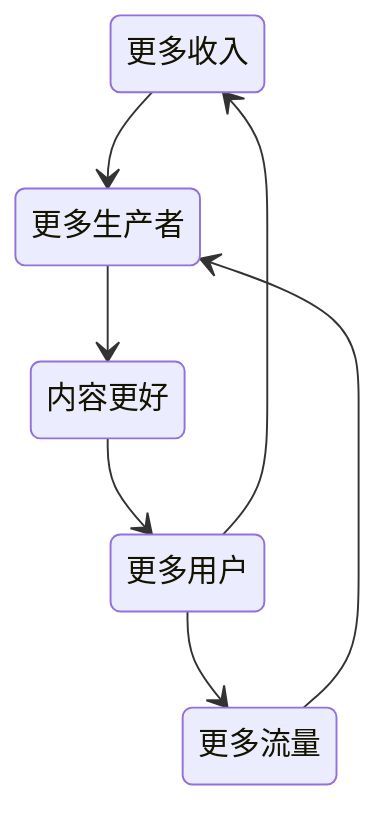

# 设计

什么是设计：

## 策略

### 业务周期

在业务[产品的不同生命周期](/产品/产品创新.md#生命周期)阶段，设计的侧重点

- 验证期：此时的重点工作都是搭建产品的基础建设，可以主动优化核心功能的体验，在共创过程中主动提出业务的差异化增长机会点，并推动项目落地，获得更好的成长和回报
- 爆发期：业务爆增，需求也会跟着应接不暇，更需要设计师有合理分配时间的能力，在承接需求以外，推动增长
- 成熟期：不断优化，服务好更为细分的业务点
- 衰退期：此时需要业务，建立新的核心壁垒，拓展业务类型和生态，作为设计者，就需要帮助业务一起推动转型

### 商战模式

- 防御战：此时产品需要充分做好防御，也就是不断地补足自身弱点，同时不断超越自我，保持革新，时刻保持对竞品的敏感度，并持续思考我们的业务该如何创新突破
- 进攻战：找寻行业巨头的弱点，尤其当这个弱点是对方难以攻克的困难时，往往就是我们铸造护城河的机会
- 侧翼战：要在跟巨头的同一个领域中找到一个小阵地，做到不可替代，都要围绕核心差异化的定位来设计。侧翼战的核心在于抢夺心智
- 游击战：找到一个自己擅长的细分市场，而行业巨头不屑于进入或不擅长攻克，将业务的细分方向做到极致

### 市场洞察

业务全局观 = 市场面分析 + 用户面分析

1. 观测行业动向
   - 通过国家或者地区已有的产品矩阵来分析各个行业在这个地区的覆盖情况，以此大概判断出可以入手的行业
   - 阅读行业报告：咨询公司研报、国家数据库、大厂研报
   - 使用数据平台寻找机会点 data.ai
2. 梳理当下的市场环境和自身优劣势 Business Canvas 商业画布、SWOT 矩阵、波特五力分析、STP 理论、PEST 模型、BCG 矩阵、GE 矩阵... 
   - 用户：从用户的年龄、性别、所在城市、消费能力、不同的需求等寻找差异化
   - 产品：探索与竞品主打的不同功能价值，从多、快、好、省、新五个方向去思考
   - 营销
   - 合作：探索新差异化的合作伙伴和方式，可以为我们带来不一样的优势
   - 盈利：市场对于定价的反应也是不同的。在盈利模式上，也可以做出差异化
3. 业务目标制定：只有业务目标为用户带来的长期价值，利他的企业才能长青

### 用户洞察

对业务的重要性：在不确定方向时挖掘需求、在设计过程中指导方案、在产出上线后回收结果

对螺丝钉的重要性：

- 提升认知，找对技术上的解法、
- 资源不足时自己上，为自己的设计价值负责
- 掌握机会点，才能掌握话语权

[定性与定量研究](/产品/产品创新.md#定性与定量)

定性研究 1对1深度访谈：

1. 破冰环节：可以询问用户常规的一天都是如何获取信息内容的，目的是观察用户使用手机和接触信息的习惯。从宏观问题开始，让用户逐渐进入状态
2. 竞品调研：询问日常使用哪些社交类 / 内容类产品，目的是了解竞品的优缺点，理解用户的需求行为，在这个部分通常可以得出 1-3 个用户的核心需求
3. 核心需求深挖：针对用户提及的几大类需求，一个一个进行深度挖掘。比如用户提到想看内容打发时间，就继续深挖用户具体喜欢什么类型的内容。这一部分也是整体访谈的黄金模块
4. 次要需求探索：当核心需求已经掌握到位后，再引导用户说出其他次要需求，并对其他需求进行深挖
5. 访谈收尾：最后，可以让用户提出一些建议，或者说 3 个期待的关键词，具体词汇不重要，重要的是引导用户说出选这 3 个词背后的原因是什么

定量研究 问卷调查：

样本抽样 - 设计问卷 - 投放问卷 - 降噪处理 - 输出报告

这种研究需要注意的是要降低用户的答卷压力，还要进行降噪，避免无效的问卷，可以在选项里设置一个“不成立选项”，如果用户选择了这个选项，或者选择速度不正常，那么这个用户的问卷就作废

### 用户画像

- Persona：根据真实的调研，推导出来的用户聚类，用来帮助我们挖掘业务机会点，需要符合 MECE 原则，相互独立、完全穷尽
- Profile：用定量的方式生成用户行为、需求、个人信息等标签，需要产品上线，使用线上数据才能绘出这种类型的用户画像

Persona 的作用：

- 0 到 1 孵化一个新产品时，确定用户二点种类
- 对于衰退期陷入瓶颈的产品进行方向变更或创新突破
- Persona 能帮助我们判断产品需求的合理性，围绕用户画像的优先级有序地发展

Persona 分析：

1. 对一定数量的人进行定性研究
2. 初步判断影响用户需求行为的变量维度，相对来说以客观物理条件为主，比如：地理城市、年龄、性别、收入
3. 逐个分析每一位受访者，梳理每个维度的指标，维度和指标都会在分析全程不断调整、优化
4. 将受访者画像进行细颗粒度的聚类，把有明显相似性的用户记录在一起
5. 整合细分聚类，得出用户画像，为了通过分析得出典型用户类型，如果画像不够典型，就要思考是不是目标用户
6. 可视化传达：取一个可以代表这个群体特征的名字，再配上符合这类用户气质的照片

用户画像推理的本质是信息的打散和重组，所以你不用担心推导出来的 Persona 是错误的，更多的是不同的人推导出来的画像存在差异，关键在于分析的广度以及深度

### 用户旅程

作用：

1. 排查流程缺口，可以回顾用户的整个体验路径是否完整闭环
2. 获得全局视角，可视化梳理用户在每个流程中的需求、痛点，有助于我们升维思考，避免忽略了更为重要的机会点
3. 精细化满足不同用户类型，一张用户地图对应一类 Persona

如何画：

1. 大阶段小流程：根据每一类 Persona 的核心流程来制定，要尽量包含这条核心流程的全部节点
2. 用户的想法和需求：将用户访谈中收集到的需求和想法对应到每一个流程中去，避免需求丢失和痛点造成用户的体验缺口
3. 用户的行为和触点：需要梳理用户在每个流程中完成的主要行为，以及分别是通过什么接触到产品和服务的渠道来完成的
4. 用户的感受和心情曲线：将用户在每个流程中的感受用心情值量化出来，也要将用户反馈的爽点、痛点和痒点记录下来
5. 机会点：推导出干预用户体验感受的机会点，目标，就是针对心情曲线，放大爽点，解决痛点

峰终定理：人们的记忆由两个因素决定，分别是高峰和结束时的体验感受。无论好坏，这都将定性人们对这次体验的印象

魔法数字：根据业务想要提升的目标，比如留存、成交转化、复购等，找出相关联的用户行为条件，其数量就是魔法数字

## 设计价值

量化设计价值可以帮助回顾过往的成长，也是在职场中争取话语权的重要手段

### 基础价值

提供设计支持，来完成业务需求

#### 核心基础能力

1. 专业能力：扎实的专业基本功
2. 洞察分析能力：理解商业业务目标、分析用户洞察，且有将其转化为设计表达的能力
3. 通用合作能力：与业务上下游合作方有效沟通、推动项目，并把控风险、保证项目落地的能力

提升洞察推导能力：与业务方讨论业务目标，并达成共识 -> 拆分业务目标，寻找可以下手的角度 -> 针对拆分的目标，制定设计策略 -> 输出设计方案

提升通用合作能力：承接需求时，需求已经很确定时，此时的重点是及时和上下游沟通，控制风险。自驱发起项目时，要做的就是把握好资源、如何吸引他人合作。

#### 第一性原理

回归问题本质，不要被表现迷惑

接到需求 -> 识别出真正的问题 -> 产生价值

#### [复盘](/通识/复盘.md)

对个人：

- 每一次的复盘结果都可以作为下一次项目的指导
- 也是扩大自己和项目影响力的一个机会

对行业、对公司：

- 给他人以参考，推进更多业务百花齐放

### 二级价值

完成日常的基础设计支持，想要超出预期，就要优化负向，也就是找出产品的负向体验，发起设计自驱项目进行优化，推动上线后再量化我们的优化结果

#### 发现问题

1. 数据反馈：根据数据发现问题和机会点
2. 用户反馈：收集查阅用户反馈的内容，。对于用户高频提出的问题、紧急程度高的问题，需要重点关注
3. 可用性测试：尤其是国际化产品或特殊人群产品，可用性测试对于找出负向体验是极其必要的
4. 用户体验旅程：可以帮助我们分析不同 Persona 的体验切入点，也可以帮助我们全链路地规划所有触点，避免流程的遗漏

如何判断优先级：重要性、可控性、紧急程度、成本、创新性这五个维度

#### 发起项目

自驱，它要求我们负责好自己的项目，确保将项目推动落地，取得结果

1. 写清规划，设置目标：背景 + 目标 + 方案
2. 对其目标：把控进度：将规划中预估的人力、时间，转为确切的对接人和具体的时间计划，做好时间分配后，需要制定周期对齐的计划并定时确认产出
3. 追踪优化，复盘沉淀：项目上线后，就可以开始监控数据了，做的好做的差就能从数据知道了，并针对数据问题进行优化

#### 竞争合作

面对竞争：

- 讲清楚彼此的能力和优劣势，判断是否可以分工合作，定位长短板，做自己更擅长的事情
- 避免评判标准单一，评判标准以结果目标为导向，且有丰富多维的结果衡量手段可以避免内卷
- 培养自己的创新突破能力，使自己具备更强的竞争力，跳出固有思维，规划创新能力，不然争不过别人
- 避免无意义的斗争，寻找新增长点，对于个人来说，成长了多少才是我们最应该关注的核心收入

如何合作：

1. 有需求评审会机制下，先和相关领域的负责人提前打好招呼，讲清价值，预估资源，收集建议
2. 没有评审会机制下，就需要自下而上推动项目了，这种情况就要拉拢干系人，发挥利他主义，只有对别人有价值了，人家才会合作不是

### 三级价值

优化负向体验的能力在于解决现有问题，而实现增长是一件需要创新突破的事情

- 产品创新
- 运营推广

#### 增长误区

- 思维惯性：在没有归纳与演绎成功的因果关系时，盲目复刻已有成功项目的经验
- 虚荣数据：关注一些看似繁荣，但没有正向积极意义的数据指标

#### 用户增长

问题：获客成本越来越高、广告很难获取2B用户，更适合基于移动端的游戏、电商、O2O、社交平台类业务

增长环境是复杂的，需要配合多种手段，系统性解决

增长飞轮：病毒式裂变（Viral loop）、补贴增长（Paid loop）、UGC 内容循环（User-generated content loop）

#### 产品增长

1. 补足致命体验：核心功能不可用、刚需功能不完善
2. 持续观测行业与竞品：核心体验需要与竞品拉齐，还要做到比竞品更优的差异化体验
3. 用户调研，构建产品壁垒：关键在于差异化优势，别人做不了而自己能做的
4. AB测试，持续优化，构建MVP探索

#### 运营增长

针对细分的人、物、场景，进行精细化运营设计，满足不同的人、场景需求

做好营销活动 = 利益 / 精神吸引 + 任务机制 + 活动外皮

1. 明确营销的目标：是为拉新？促活？还是引导
2. 设计营销活动
   1. 福格行为：当用户具备充足的动机和完成该任务的能力时，通过提示来触发用户行动
   2. HOOK模型：通过内在或外在动机的触发，引导用户行动，通过多变的酬赏让用户保持猎奇和互动粘性，引导用户投入精神或物质成本，使其不愿意放弃，从而又进一步循环这四个步骤
   3. PBL模型：通过积分、勋章、排行榜，来刺激用户不断升级和竞争
3. 增强新鲜感：对于长期营销活动，只有不断地迭代，才能让用户保持新鲜感，愿意持续留存

做好广告投放：

调研得出目标市场用户高频接触的渠道，通过低成本的试验来测试不同文案、素材、宣传的效果，重点是如何平衡ROI

#### 品牌增长

做品牌的作用：

1. 提升知名度
2. 建立归属感：代表特定人群的核心价值和归属感
3. 品牌溢价

品牌项目：

1. 前期调研：充分理解业务方的目标预期，也充分参透市场和用户的需求，找准品牌可以突出重围的定位方式
2. 品牌策略：这个品牌在市场中的定位、品牌口号（Slogan）、核心价值、品牌调性等
3. 品牌设计：视觉基因的组合。超级符号、颜色、字体、动效等，都是在用不同视觉表达做组合，核心目标是将品牌理念表达到位，VI设计
4. 品牌渠道：渠道选择和素材制作，都要与业务自身定位相符，还有就是要怎么触达到用户

### 四级价值

扩大影响力就成为了我们需要达成的目标，扩大影响，将我们孵化成功并验证有效的项目，复用给同样需要这个能力的业务团队，降低重复孵化的成本

### 五级价值

带头为这个行业做点什么
