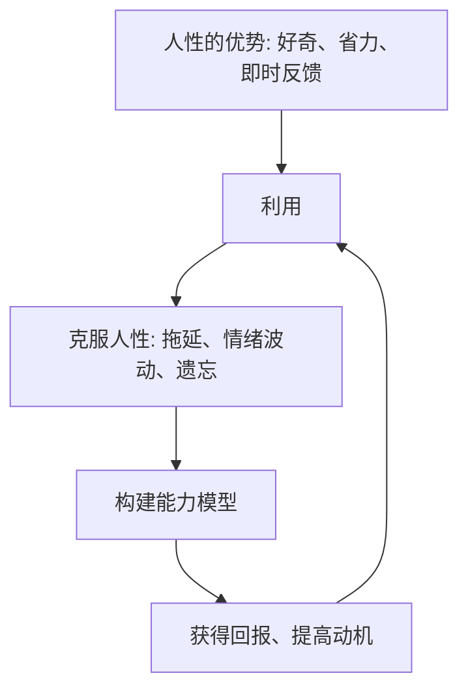
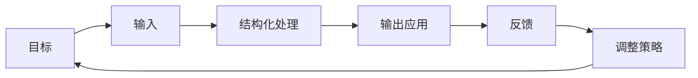
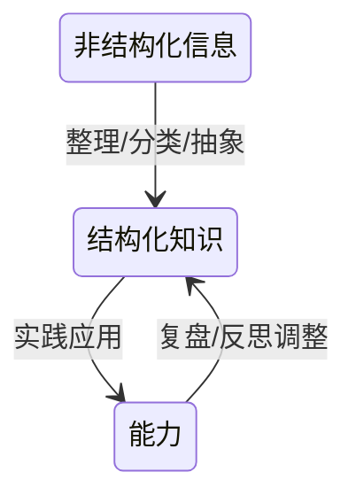
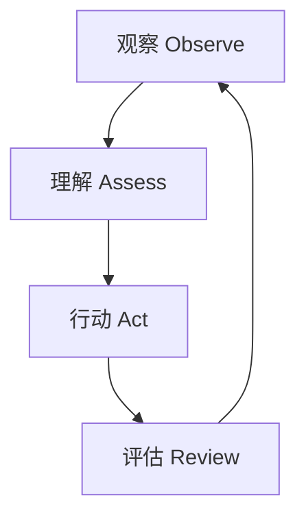
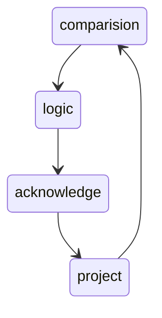

# 学习方法论

一个可复用的个人学习系统框架

## 1. 概述

学习方法论是一套用于高效获取、整理、内化并应用知识的系统框架，其目标是帮助个体构建可持续运作的学习系统，实现能力的持续提升。
学习不等于信息摄入，而是一个完整的系统：
**目标 → 输入 → 结构化 → 输出应用 → 反馈 → 调整**

这一循环不断运行，使认知模型逐渐精炼、能力不断增强。

---

# 2. 学习的本质

学习的本质是 **更新与优化个人的认知模型（Cognitive Model Update）**。

信息的价值不在于被收集，而在于：

* 是否进入模型
* 是否改变对世界的理解
* 是否增强解决问题的能力

更本质地说：

> **学习是一个利用人性 → 超越人性 → 回馈人性的螺旋过程。**

---

# 3. 总模型（核心框架）

个人学习系统由 6 大核心环节构成：

### 六大环节定义

1. **目标（Goal）**
   决定学习方向、优先级与深度。

2. **输入（Input）**
   从外界获取信息。包括书籍、课程、技术文档、论文、经验、讨论等。

3. **结构化处理（Process / Structure）**
   让信息从“外部内容”变成“内部知识”。
   涉及分类、模型化、归纳、抽象、关联化。

4. **输出应用（Output / Action）**
   包括动手实践、解决问题、教学、笔记、项目。

5. **反馈（Feedback）**
   外部反馈（实践结果）、内部反馈（反思、复盘）、同伴反馈。

6. **调整（Adjust）**
   通过不断迭代实现螺旋上升。

---

# 4. 核心概念体系

| 概念        | 定义         | 作用            |
| --------- | ---------- | ------------- |
| **认知模型**  | 对世界的理解框架   | 决定判断、决策、学习的效率 |
| **知识输入**  | 外界信息的摄入    | 学习的源头         |
| **知识结构化** | 将信息组织成可用结构 | 提升理解速度与深度     |
| **输出应用**  | 在实践中使用知识   | 巩固、验证、深化      |
| **反馈机制**  | 获取真实结果与误差  | 驱动认知优化        |

---

# 5. 输入模型（通用 + 技术领域）

## 5.1 通用学习输入分层模型

按照信息密度、准确性与权威性，可以分为：

1. **一级输入：高可信度高密度**

   * 教科书
   * 标准、规范
   * 论文与学术研究
   * 作者级作品

2. **二级输入：系统性强**

   * 系统课程
   * 专栏
   * 高质量培训

3. **三级输入：中度可信**

   * 博客文章、经验分享
   * 行业报告

4. **四级输入：高噪声但可补充**

   * 社交内容
   * 零散的信息源
   * 视频（偏入门）

**原则：越进阶的学习，越依赖更高等级输入。**

---

## 5.2 技术领域专属输入模型（保留你原有体系并更抽象化）

技术学习中信息源可以按照“离真实实现的距离”排序：

1. 语言规范 / 标准
2. 源码（语言 or 框架）
3. 官方文档
4. 核心技术图书
5. 实战类图书
6. 专栏
7. 高质量博客
8. 视频教程

**越靠近真实实现，越接近知识本质。**

---

# 6. 结构化模型

结构化是学习的关键，因为**非结构化内容无法直接进入认知模型**。

## 6.1 知识结构化流程

## 6.2 常见结构化方法

| 方法      | 特点           | 适用场景    |
| ------- | ------------ | ------- |
| 脑图      | 树结构          | 入门、梳理框架 |
| 关系图谱    | 图结构          | 展示知识关联  |
| 三层结构法   | 概念 - 原理 - 案例 | 技术理解    |
| 费曼笔记    | 以教促学         | 深度理解    |
| 问题驱动组织法 | 围绕问题组织知识     | 解决实际问题  |

## 6.3 深度理解策略

### 费曼学习法

费曼学习法是一种高效的学习策略，通过"以教促学"来深化理解。包含以下步骤：

1. **确立学习目标**：明确要学习的知识点
2. **理解知识**：深入学习相关概念
3. **以教代学**：用简单语言向他人解释所学内容
4. **回顾反思**：识别理解中的漏洞和不足
5. **简化优化**：将复杂概念用最简洁的语言表达

> "如果你无法简单地解释某件事，说明你还没有真正理解它。"

### 主动回忆（Active Recall）

主动回忆是一种基于认知科学的学习策略，通过主动提取记忆中的信息来加强学习效果，而不是被动地重新阅读材料。与传统的重复阅读相比，主动回忆能显著提高长期记忆效果。

**实践方法**：
- 学习后合上书本，尝试回忆关键内容
- 使用闪卡进行自测
- 定期进行无提示的知识复述

### 间隔重复（Spaced Repetition）

基于艾宾浩斯遗忘曲线的科学学习方法，通过在不同时间间隔重复学习内容，以最大化记忆保持率。

**最佳复习时间点**：
- 学习后 24 小时内进行首次复习
- 之后按一定间隔（如 3 天、7 天、15 天、30 天等）进行重复
- 根据记忆牢固程度调整间隔时间

**提高效率**：与一次性大量学习后立即复习相比，间隔重复能用更少的时间达到更持久的记忆效果。它避免了过度学习已经熟练的内容，将精力集中在那些即将遗忘或需要加强的知识点上。

## 6.4 记忆策略

### 记忆分类与管理

根据认知科学，记忆按时间可分为：

1. **瞬时记忆**：信息的短暂存储，持续时间约 0.25-2 秒
2. **短时记忆**：信息的临时存储，持续时间约 15-30 秒
3. **长时记忆**：信息的长期存储，理论上可永久保存

### 记忆巩固策略

1. **联想记忆法**：将新知识与已有知识建立联系
2. **故事记忆法**：将信息编成故事便于记忆
3. **记忆宫殿法**：利用空间位置记忆信息
4. **多感官记忆**：调动视觉、听觉、触觉等多种感官参与记忆

---

# 7. 输出模型

输出是学习真正开始发生的阶段。

## 输出的三种类型

1. **实践应用（Action）**

   * 写代码
   * 做项目
   * 解题
   * 复现实验

2. **知识表达（Expression）**

   * 教别人
   * 写笔记
   * 制作教程
   * 公开演讲

3. **推演验证（Reasoning Test）**

   * 反推实现
   * 构建简化模型
   * 与实际对比验证

规律是：

> **输入越精准，结构化越清晰，输出就越扎实。**

---

# 8. 学习反馈机制（PDAC 等框架统一到此）

学习中真正重要的是反馈闭环。
这里整合了 PDCA、AAR（事后复盘）、OODA 等方法，统一到一个更通用的模型：

## 8.1 通用反馈循环（Unified Learning Feedback Loop）

简化解释：

* **观察（Observe）**：收集学习表现与难点
* **理解（Assess）**：判断差距与根因
* **行动（Act）**：实施改进策略
* **评估（Review）**：评估结果，进入下一轮

PDAC 可以作为该模型的一个子集。

## 8.2 复盘与反思机制

### 复盘的层次模型（CLAP）

- **对比（Comparison）**：陈述结果，和最初设定的目标进行对比，也就是对事实的总结
- **逻辑（Logic）**：梳理逻辑，解释结果和目标之间的差距，也就是对原因的分析
- **认知（Acknowledge）**：提出假设，更新对业务和用户的理解，也就是对认知的修正
- **规划（Project）**：制定改进规划，在实践中验证，也就是对未来的优化

### 有效复盘的要素

1. **事实与情绪分离**：专注于客观事实而非主观情绪
2. **多角度审视**：从不同视角分析问题和结果
3. **根因分析**：使用5 Why方法深入挖掘根本原因
4. **可执行改进**：制定具体、可衡量的改进措施

## 8.3 反馈质量评估

高质量的反馈应具备以下特征：

- **及时性**：反馈应在学习行为后尽快提供
- **具体性**：明确指出具体的行为和结果
- **建设性**：提供改进的方向和方法
- **可操作性**：反馈内容应能指导具体行动

---

# 9. 能力体系（三层模型）

## 9.1 认知基础层

* 注意力管理
* 记忆策略
* 动机与情绪调节

### 注意力管理

注意力是学习的入口，高效的学习需要良好的注意力管理。人的注意力有以下特点：

1. **选择性注意力**：在复杂环境中选择关注特定信息的能力
2. **持续性注意力**：维持注意力在特定任务上的能力，通常可持续 7-10 分钟
3. **分配性注意力**：同时处理多个任务的能力，但人无法真正并行处理多个任务

**注意力管理策略**：
- **减少干扰**：创造无干扰的学习环境，关闭通知，整理学习空间
- **时间分块**：将学习任务分割为 25-50 分钟的专注时间段
- **单一任务**：避免多任务处理，专注于单一学习任务
- **环境优化**：利用 50-80 BPM 的音乐提升专注力，避免高分贝噪音
- **休息调节**：每 7-10 分钟短暂休息，释放注意力负荷

### 认知负荷管理

认知负荷是指完成学习任务时对大脑处理能力的需求。有效管理认知负荷能提升学习效率：

1. **内在认知负荷**：由学习内容本身复杂性决定
2. **外在认知负荷**：由学习材料呈现方式造成
3. **相关认知负荷**：用于构建和自动化心理模型

**降低认知负荷的策略**：
- 将复杂任务分解为简单子任务
- 减少不必要的视觉和听觉干扰
- 使用图表、模型等可视化工具辅助理解
- 在学习新概念时避免同时处理其他复杂任务

## 9.2 结构能力层（核心）

* 抽象能力
* 结构化思维
* 问题拆解
* 模型化能力

## 9.3 应用能力层

* 实践转化能力
* 知识表达能力
* 反思复盘能力

这三个层次共同构成“可持续学习能力”。

---

# 10. 学习治理系统

学习不仅需要技术，也需要治理。有效的学习治理系统包括时间管理、环境营造、内容治理和风险控制等多个方面。

## 10.1 时间治理

* 依据记忆规律安排复习（如艾宾浩斯遗忘曲线）
* 给不同层级输入分配权重
* 设定专注时间段，避免多任务处理
* 合理安排学习与休息的节奏

## 10.2 环境治理

### 物理环境
* **学习空间**：创造专门的学习空间，减少干扰因素
* **工具准备**：准备好学习所需的工具和材料
* **舒适度**：确保光线、温度、座椅等符合人体工学

### 数字环境
* **信息过滤**：使用工具过滤无关信息，减少信息噪音
* **专注模式**：设置设备专注模式，关闭非必要通知
* **知识管理工具**：使用笔记、脑图等工具辅助学习

## 10.3 内容治理

* 定期清除过期知识
* 维护知识体系的结构完整性
* 建立知识分类和标签体系
* 定期更新和迭代已有知识

## 10.4 风险治理

* 避免错误知识
* 避免偏差认知
* 管控过度输入与信息焦虑
* 防止学习疲劳和动机衰减

## 10.5 效果治理

* 建立输出机制
* 定期进行学习评估
* 设定可衡量的学习目标
* 跟踪学习进度和效果

---

# 11. 场景化应用

* **技术学习**：语言、框架、系统设计
* **学科理解**：数学、物理、理论体系
* **技能提升**：表达、写作、领导力
* **专业能力建设**：架构、管理、产品

每个场景都可以套用同一框架，但输入源与输出形式不同。

---

# 12. 选型决策模型（学习策略匹配）

## 初学者（目标：快速入门）

* 更多依赖结构化课程、视频、教程
* 输出以“理解与再表达”为主
* 强调动机与情绪管理

## 进阶者（目标：掌握原理和方法）

* 提升高可信输入比重（文档、书籍）
* 增加结构化与推演
* 强化实践项目

## 专家（目标：形成原创能力与领域洞察）

* 源码、论文、标准
* 行业大会、前沿趋势
* 大量推演、对比、反思
* 构建自己的知识体系

---

# 13. 反模式（易踩坑）

* 只输入不输出
* 不做结构化处理
* 没目标，纯刷内容
* 没有反馈机制
* 工具依赖或形式主义
* 情绪波动影响学习连续性

避免反模式比掌握技巧更重要。

---

# 14. 元认知与学习策略

## 14.1 元认知能力

元认知是指对认知的认知，即对自己思考过程的觉察和调控能力。在学习中，元认知能力体现在：

1. **计划策略**：学习前对学习任务的分析和规划
2. **监控策略**：学习过程中对理解程度的自我监控
3. **调节策略**：根据监控结果调整学习方法和策略

## 14.2 学习如何学习

"学习如何学习"是学习方法论的核心技能，包括：

- **认知策略**：复述、精细加工、组织等具体的学习技巧
- **元认知策略**：计划、监控、调节等对学习过程的管理
- **资源管理策略**：时间管理、环境管理、寻求帮助等

## 14.3 学习风格与适应性

不同学习者具有不同的学习风格和偏好，有效的学习系统应该：

- 识别自己的学习偏好（视觉、听觉、动觉等）
- 在不同情境下灵活调整学习策略
- 持续优化个人的学习系统

# 15. 总结

学习方法论不是技巧集合，而是一个 **可持续的认知增长系统**。
其核心是六个字：

> **目标、输入、结构、输出、反馈、调整**

在此之上，结合能力体系、治理体系、人性模型和元认知能力，就能构建一个长期可复用的个人学习系统，使学习变成长周期复利。

学习的本质是构建和优化个人的认知模型，通过科学的方法和持续的实践，每个人都可以建立属于自己的高效学习系统，实现认知的螺旋式上升和能力的持续提升。

## 关联内容（自动生成）

- [/个人成长/复盘.md](/个人成长/复盘.md) 学习方法论中的反馈机制与复盘密切相关，包括反思、总结、认知更新等环节
- [/个人成长/思维.md](/个人成长/思维.md) 学习方法论中的认知模型构建与多种思维模式相关，包括结构化思维、批判思维、系统性思维等
- [/个人成长/OKR.md](/个人成长/OKR.md) 学习目标的设定与管理可参考OKR方法，两者都强调目标导向和持续反馈
- [/个人成长/个人成长.md](/个人成长/个人成长.md) 学习方法论是个人成长的重要组成部分，为个人持续提升提供系统框架
- [/QWEN.md](/QWEN.md) 学习方法论与知识管理哲学相结合，形成深度认知与稳定知识管理体系
- [/个人成长/职场/职业素养.md](/个人成长/职场/职业素养.md) 学习方法论有助于提升职业素养，包括学习能力、自我管理能力等
- [/个人成长/方法论.md](/个人成长/方法论.md) 学习方法论是个人成长方法论的具体应用，提供可操作的实践指导

