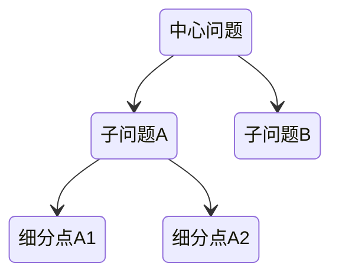
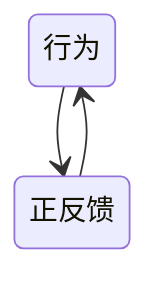

# 方法论

**一个用于理解、拆解与干预复杂世界的认知操作系统**

---

## 一、方法论世界观（总纲）

### 1. 基本假设（第一性前提）

1. 世界由**系统**构成，而非孤立事件
2. 系统通过**反馈机制**演化
3. 个体资源有限，必须通过**关键约束点**改变系统
4. 人的认知能力有限，必须用**低复杂度模型**理解世界

> 方法论的目标不是“解释一切”，而是：
> **用最小的认知成本，获得最大的干预效果。**

---

### 2. 方法论分层结构

```
方法论体系
├─ 认知层：如何正确理解世界
│  ├─ 第一性原理
│  └─ 奥卡姆剃刀
│
├─ 分析层：如何拆解复杂问题
│  ├─ 结构化思维
│  └─ 主次矛盾
│
└─ 行为层：如何持续改变结果
   └─ 反馈飞轮
```

> 核心原则：
> **先认知 → 再分析 → 后行动 → 用反馈修正认知**

---

## 二、认知层方法论（世界是如何被理解的）

### 2.1 第一性原理（First Principles Thinking）

#### 本质定义

将问题还原为**不可再分的基本事实与约束条件**，而非沿用既有经验、规则或共识。

#### 解决的问题

* 经验失效
* 类比误导
* 被“行业惯例”“别人都这么做”限制思考

#### 操作步骤

1. 明确问题目标（要解决什么）
2. 拆解为事实性命题（不能再被否定）
3. 去除所有假设、惯例、类比
4. 从基本事实重新组合解法

#### 适用边界

* 高价值决策
* 创新问题
* 复杂系统设计

#### 常见误区

* 把“底层逻辑解释”当第一性原理
* 还原过度，导致不可执行

---

### 2.2 奥卡姆剃刀（Occam’s Razor）

#### 本质定义

在解释或建模时，**在满足解释力的前提下，选择最简单的模型**。

#### 解决的问题

* 模型过拟合
* 思维复杂化
* 分析瘫痪

#### 操作原则

* 能用 1 个变量解释，不用 3 个
* 能用结构解释，不用心理揣测
* 能用机制解释，不用故事

#### 适用边界

* 问题初期建模
* 多解并存时的筛选

#### 常见误区

* 把“简单”当“粗糙”
* 过早简化，忽略关键变量

---

## 三、分析层方法论（问题是如何被拆解的）

### 3.1 结构化思维（Structured Thinking）

#### 本质定义

将复杂问题**分解为层级清晰、逻辑互斥且穷尽的结构**，以降低认知负担。

#### 核心原则

* 自上而下
* 层层递进
* 同层互斥



#### 解决的问题

* 思路混乱
* 表达不清
* 分析遗漏

#### 操作步骤

1. 明确中心问题
2. 按逻辑维度拆分
3. 校验是否重叠 / 遗漏
4. 逐层下钻

#### 常见误区

* 结构只是罗列，没有逻辑维度
* 过早下钻细节

---

### 3.2 主次矛盾（Key Constraint Thinking）

#### 本质定义

在资源受限的系统中，**决定系统整体表现的往往是少数关键因素**。

#### 理论基础

* 二八法则
* 约束理论（TOC）
* 系统瓶颈效应

#### 解决的问题

* 努力方向错误
* 局部优化无效
* 忙而无功

#### 操作步骤

1. 枚举影响系统的关键因素
2. 评估每个因素的边际影响
3. 找到制约系统的关键约束
4. 优先干预该点

#### 常见误区

* 把“最显眼的问题”当主要矛盾
* 多点同时优化，稀释资源

---

## 四、行为层方法论（结果是如何被改变的）

### 4.1 反馈飞轮（Feedback Loop）

#### 本质定义

行为会产生结果，结果反过来塑造行为，系统通过**反馈循环自我强化或衰减**。

#### 正反馈（强化回路）



适用场景：

* 习惯养成
* 能力积累
* 飞轮型增长

#### 负反馈（抑制回路）


适用场景：

* 风险控制
* 行为纠偏
* 系统稳定性维护

#### 操作原则

* 想改变行为，先改变反馈
* 长期目标用弱正反馈
* 高风险行为用强负反馈

#### 常见误区

* 只设计目标，不设计反馈
* 正负反馈混用导致系统失控

---

## 五、方法论的组合使用路径（操作系统视角）

### 标准问题处理路径

1. **奥卡姆剃刀**：压缩问题空间
2. **第一性原理**：还原本质模型
3. **结构化思维**：拆解问题结构
4. **主次矛盾**：选择关键干预点
5. **反馈飞轮**：持续修正与进化

> 这是一个**可反复运行的认知闭环**，而非一次性分析工具。

---

## 六、方法论使用总原则

* 不追求"想得全"，而追求"打中要害"
* 不迷信方法，方法必须服务于目标
* 认知升级来自**长期反馈，而非一次洞察**

## 关联内容（自动生成）

- [/个人成长/思维.md](/个人成长/思维.md) 与方法论同属于个人成长领域，思维方法与方法论体系相互补充，共同构建认知操作系统
- [/个人成长/学习方法论.md](/个人成长/学习方法论.md) 学习方法论是方法论在学习领域的具体应用，两者在认知提升方面密切相关
- [/个人成长/复盘.md](/个人成长/复盘.md) 复盘是方法论中反馈飞轮的具体实践方式，是持续改进的认知闭环
- [/软件工程/架构/架构思维.md](/软件工程/架构/架构思维.md) 架构思维与方法论在结构化思维、系统分析方面有共通之处
- [/数学/线性代数.md](/数学/线性代数.md) 线性代数中的第一性原理和认知地图构建方法与方法论中的认知层方法论相呼应
- [/数学/概率论与数理统计.md](/数学/概率论与数理统计.md) 概率论与统计学中的认知框架和贝叶斯公式体现了方法论中的认知更新机制
- [/中间件/浏览器/V8.md](/中间件/浏览器/V8.md) V8引擎设计中的第一性原理和稳定认知模型与方法论中的认知层方法论相呼应
- [/中间件/浏览器/浏览器.md](/中间件/浏览器/浏览器.md) 浏览器架构设计中的第一性原理和系统边界认知与方法论中的系统分析方法相关
- [/中间件/数据库/数据库.md](/中间件/数据库/数据库.md) 数据库系统设计中的第一性原理和四层认知模型与方法论中的认知层方法论相呼应
- [/中间件/数据库/数据类型.md](/中间件/数据库/数据类型.md) 数据类型选型方法论与本文档方法论在决策层面上有共通之处
- [/中间件/数据库/数据库优化.md](/中间件/数据库/数据库优化.md) 数据库优化方法论与本文档方法论在系统性分析和优化策略方面相关
- [/中间件/数据库/redis/持久化.md](/中间件/数据库/redis/持久化.md) Redis持久化设计中的第一性原理和系统治理方法与方法论中的分析和行为层方法相关
- [/操作系统/死锁.md](/操作系统/死锁.md) 死锁问题分析中的系统性思维与方法论中的结构化思维和主次矛盾分析相关
- [/计算机网络/rpc.md](/计算机网络/rpc.md) RPC系统设计中的第一性原理和架构决策与方法论中的认知和分析方法相关
- [/数据技术/推荐系统.md](/数据技术/推荐系统.md) 推荐系统设计中的系统性方法论与本文档方法论在问题拆解和系统分析方面相关
- [/数据技术/数据存储.md](/数据技术/数据存储.md) 数据存储系统设计中的方法论与本文档方法论在系统性分析和架构设计方面相关
- [/数据技术/检索技术.md](/数据技术/检索技术.md) 检索技术中的系统设计方法与方法论中的分析层方法论相关
- [/软件工程/性能工程/性能优化.md](/软件工程/性能工程/性能优化.md) 性能优化方法论与本文档方法论在系统性分析和反馈机制方面相关
- [/软件工程/架构/系统设计/架构设计.md](/软件工程/架构/系统设计/架构设计.md) 架构设计方法论与本文档方法论在系统性思维和结构化分析方面相关
- [/软件工程/架构/系统设计/系统设计.md](/软件工程/架构/系统设计/系统设计.md) 系统设计方法论与本文档在问题拆解和系统分析方面有共通之处
