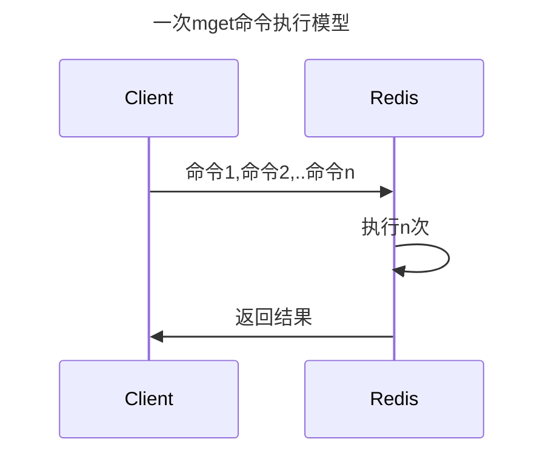
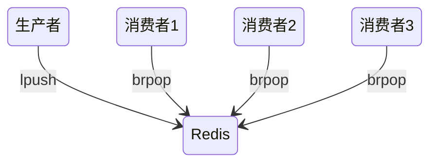

# API

## 通用

- keys * : 查看所有的键(生产环境应禁用，原因：正则表达式可能会占用大量资源)
- dbsize 返回当前数据库中建的总数
- type key ： 获取键对应的value的类型
- del key：删除指定的key(可以是多个)
- exists key：判断指定的key是否存在
- expire key time：指定key的生存时间，单位：秒
- ttl key 查看键的剩余过期时间

## 字符串类型

命令|时间复杂度
-|-
set key value|O(1)
get key|O(1)
del key key ...|O(k),k是键的个数
mset key value key value ...|O(k),k是键的个数
mget key key ...|O(k),k是键的个数
incr key|O(1)
decr key|O(1)
incrby key increment|O(1)
decrby key decrement|O(1)
incrbyfloat key increment|O(1)
append key value|O(1)
strlen key|O(1)
setrange key offset value|O(1)
getrange key start end|O(n),n是字符串长度，由于获取字符串非常快，所以如果字符串不是很长，可以视同为O(1)

```sh
set key value [ex seconds] [px milliseconds] [nx|xx] # 设置值
# ex 以秒为单位的过期时间
# px 毫秒单位的过期时间
# nx：set if not exists
# xx set if exists
get key # 获取值

mset name cxk age 18 # 批量设置值
mget name age # 批量获取值

incr a # 自增1
incrby a 15 # 自增指定值
decrby a 15 # 自减指定值
incrbyfloat a 10.5 # 自增浮点数

append name jntm # 字符串追加值
strlen name # 获取字符串长度
set name 蔡徐坤
strlen name # redis将中文序列化为byte数组 中文的长度取决于终端的编码集
getset name world # 设置新值并返回旧值
setrange name 2 kd # 从指定位置设置字符串
getrange name 0 -1 # 获取指定范围的字符串
```



- 在redis中 自增操作都是原子的 不用担心被别的客户端修改

### bitmap

这个数据类型适合用来处理海量数据

```sh
setbit map 5 1 # 将偏移量为5的bit设置为1 在第一次初始化Bitmaps时，假如偏移量非常大，那么整个初始化过程执行会比较慢，可能会造成Redis的阻塞
getbit map 5 # 获取偏移量为5的值
bitcount map 0 -1 # 获取指定范围内1的个数
bitop and|or|not|xor ret map map1 # bitmap 集合运算
bitpos map 1 # bitmap 第一个值为1的bit的偏移量
```

例子：

统计某个时间窗口内的登录天数

```sh
setbit cxk 1 1 # 第一天登录
setbit cxk 364 1 # 第364天登录
bitcount cxk 0 10 # 0 - 10天这个时间窗口登录了几天
```

统计某个时间窗口活跃用户数

```sh
setbit 200618 1 1 # 18号1号用户登录
setbit 200619 1 1 # 19号1号用户登录
setbit 200619 7 1 # 19号7号用户登录
bitop or ret 200618 200619 # 使用或运算合并bit
bitcount ret 0 0 # 统计有多少位1
```

### HyperLogLog

通过HyperLogLog可以利用极小的内存空间完成大量元素的独立总数的统计

用小空间来估算如此巨大的数据，其中一定存在误差率（类似于布隆过滤器）

使用这个来估算数据 可以容忍一定的误差率

```sh
pfadd users user1 user2 user3 user4 # 添加元素
pfcount users # 统计个数
```

## 哈希类型

命令|时间复杂度
-|-
hset key field value|O(1)
hget key field|O(1)
hdel key field field ...|O(k),k是field个数
hlen key|O(1)
hgetall key|O(n),n是field总数
hmget field field ...|O(k),k是field的个数
hmset field value field value ...|O(k),k是field的个数
hexists key field|O(1)
hkeys key|O(n),n是field总数
hvals key|O(n),n是field总数
hsetnx key field value|O(1)
hincrby key field increment|O(1)
hincrbyfloat key field increment|0(1)
hstrlen key field|O(1)

```sh
hset user:1 name cxk age 18 # 设置field
hsetnx user:1 name cxk # set if not exists
hget user:1 name # 获取field
hdel user:1 name age # 删除field
hlen user:1 # 计算field个数
hmget user:1 name age # 批量获取field
hexists user:1 name # 判断field是否存在
hkeys user:1 # 获取所有field名称
hvals user:1 # 获取所有field value
hgetall user:1 # 获取全部kv对
hincrby user:1 age 1 # 对指定field自增
hincrbyfloat user:1 age 1.5 # 浮点数自增
```

内部编码：

- ziplist 压缩列表 这种类型使用更加紧凑的结构实现多个元素的连续存储 **节省内存**
- hashtable 读写效率比ziplist高

使用场景：

- 哈希类型是稀疏的，而关系型数据库是完全结构化的，哈希类型每个键可以有不同的field，而关系型数据库一旦添加新的列，所有行都要为其设置值
- 关系型数据库可以做复杂的关系查询，而Redis去模拟关系型复杂查询开发困难

## 列表类型

命令|时间复杂度
-|-
rpush key value value ...|O(k),k是元素个数
lpush key value value ...|O(k),k是元素个数
linsert key before/after pivot value|O(n),n是pivot距离列表头或尾的距离
lrange key start end|O(s+n),s是start偏移量，n是start到end的范围
lindex key index|O(n),n是索引的偏移量
llen key|O(1)
lpop key|O(1)
rpop key|O(1)
lrem count value|O(n),n是列表长度
ltrim key start end|O(n),n是要裁剪的元素总数
lset key index value|O(n),n是索引的偏移量
blpop brpop|O(1)

- 将元素加入列表左边：`lpush key value`
- 将元素加入列表右边：`rpush key value`
- 元素插入：`linsert key before|after pivot value`
- 范围获取：`lrange key start end`
- 获取指定下标：`lindex key i`
- 获取列表长度:`llen key`
- 删除列表最左边的元素，并将元素返回:`lpop key`
- 删除列表最右边的元素，并将元素返回:`rpop key`
- 删除指定元素
  - 从左到右 最多删除一个：`lrem list 1 java`
  - 从右到左 最多删除一个：`lrem list -1 java`
  - 删除全部：`lrem list 0 java`
- 索引范围内的元素：`ltrim list 0 1`
- 修改指定下标的元素：`lset list 0 java`
- 阻塞操作
  - 3秒内获取不到就返回:`brpop list 3`

内部编码：

- ziplist
- linkedlist
- quicklist 结合了ziplist和linkedlist两者的优势

使用场景：

- 消息队列 户端使用lrpush从列表左侧插入元素 多个消费者客户端使用brpop命令阻塞式的“抢”




- 分页列表 使用lrange实现

其他：

·lpush+lpop=Stack
·lpush+rpop=Queue
·lpsh+ltrim=Capped Collection
·lpush+brpop=Message Queue

## 集合类型

命令|时间复杂度
-|-
sadd key element element...|O(k),k是元素个数
srem key element element ...|O(k),k是元素个数
scard key|0(1)
sismember key element|O(1)
srandmember key count|O(counnt)
spop key|O(1)
smembers key|O(n),n是元素总数
sinter key key... 或 sinterstore|O(m*k),k是多个集合中元素最少的个数，m是键个数
suinon key key... 或 suionstore|O(k),k是多个集合元素个数和
sdiff key key... 或 sdiffstore|O(k),k是多个集合元素个数和

```sh
sadd set a b c # 添加元素
srem set b # 删除元素
scard set # 计算元素个数(维护一个变量得到)
sismember set c # 判断元素是否在集合内
srandmember set 2 # 随机从集合返回指定个数元素
# 正数：取出一个去重的结果集（不能超过已有集）
# 负数：取出一个带重复的结果集，一定满足你要的数量
# 如果：0，不返回
spop set 1 # 随机弹出元素
smembers set # 获取所有元素

sinter s1 s2 # 求交集
sunion s1 s2 # 求并集
sdiff s1 s2 # 求差集
sinterstore s3 s1 s2 # 交集结果存储到s3
# ...
```

内部编码：

- intset 占用内存小
- hashtable

例子：用户标签

```sh
sadd user1 food movie sport music
sadd user2 food music network
sinter user1 user2 # 计算用户共同感兴趣的标签
```

例子：抽奖

```sh
sadd k 1 2 3 4 5 6 7 8 9 # 9个用户
SRANDMEMBER k 3 # 抽取三个不重复用户
SRANDMEMBER k -3 # 抽取三个可能会重复的用户
```

- sadd=Tagging（标签）
- spop/srandmember=Random item（生成随机数，比如抽奖）
- sadd+sinter=Social Graph（社交需求）

## 有序集合类型

命令|时间复杂度
-|-
zadd key score member...|O(k×log(n)),k是添加成员的个数，n是当前有序集合成员个数
zcard key|O(1)
zscore key member|O(1)
zrank key member、zrevrank key member|O(log(n)) n是当前有序集合成员个数
zrem key member...|O(k*1og(n)),k是删除成员的个数，n是当前有序集合成员个数
zincrby key increment member|O(log(n)),n是当前有序集合成员个数
zrange key start end 、zrevrange key start end|O(log(n)+k),k是要获取的成员个数，n是当前有序集合成员个数
zcount|O(log(n)),n是当前有序集合成员个数
zremrangebyrank key start end|O(log(n)+),k是要删除的成员个数，n是当前有序集合成员个数
zremrangebyscore key min max|O(log(n)+),k是要删除的成员个数，n是当前有序集合成员个数
zinterstore destination numkeys key key ...|`O(n*k)+O(m*log(m))`,n是成员数最小的有序集合成员个数，k是有序集合的个数，m是结果集中成员个数
zunionstore destination numkeys key key ...|O(n)+O(m*log(m)),n是成员数最小的有序集合成员个数，k是有序集合的个数，m是结果集中成员个数

```sh
help @sorted_set
```


物理内存左小右大

```sh
zadd users 251 tom # 添加成员 分数251
zcard users # 计算成员个数
zscore users tom # 获取某个成员分数
zrank users tom # 计算某个成员排名
zrem users tom # 删除成员
zincrby users 8 jerry # 增加某个成员的分数
zrange users 0 10 # 正序返回指定排名范围的成员
zrevrange users 0 10 # 倒序返回指定排名范围的成员
zrangebyscore users 0 255 # 正序返回指定分数范围的成员
zrevrangebyscore users 0 255 # 正序返回指定分数范围的成员
zcount users 0 255 # 计算指定分数范围的成员个数
zremrangebyrank users 0 1 # 删除指定排名范围内的成员
zremrangebyscore users 0 10 # 删除指定分数范围内的成员

zinterstore user:ranking:1_inter_2 2 user:ranking:1 user:ranking:2 weights 1 0.5 aggregate max # 并集
```

内部数据结构：

- ziplist
- skiplist

例子：点赞

```sh
zadd video 0 cxk # cxk发布了一个视频 0赞
zincrby video 1 cxk # 有人给cxk视频点了一个赞
zrem video cxk # 清空cxk的视频点赞
zrevrange video 0 9 # 获取点赞排行榜
```

## Streams

- XADD：插入消息，保证有序，可以自动生成全局唯一 ID
- XREAD：用于读取消息，可以按 ID 读取数据
- XREADGROUP：按消费组形式读取消息
- XPENDING 和 XACK：XPENDING 命令可以用来查询每个消费组内所有消费者已读取但尚未确认的消息，而 XACK 命令用于向消息队列确认消息处理已完成

## 键管理

单键管理：

```sh
rename name newname # 键重命名
randomkey # 随机返回数据库里的一个键
expire name 10 # 设置键10秒后过期
expireat name timestamp # 设置键在指定时间戳后过期
# 对于字符串 set 会清除其过期时间
# Redis不支持二级数据结构（例如哈希、列表）内部元素的过期功能
persist name # 去除键的过期时间
```

键迁移：

- move 同一redis内
- dump restre 通过RDB文件的方式
- migrate 自动通过网络传输数据

遍历键：

```sh
keys * # 获取所有键 如果Redis包含了大量的键，执行keys命令很可能会造成Redis阻塞
scan 0 # 渐进式遍历 该命令返回两个部分：1. 下一个游标 2. 遍历结果
# 如果要继续遍历 下一次scan后面接的就是返回的游标
```

数据库管理：

```sh
select 2 # 切换到2号数据库
flushdb # 清空数据库 如果当前数据库键值数量比较多，flushdb/flushall存在阻塞Redis的可能
flushall
```

Redis3.0后已经逐渐弱化多数据库这个功能
