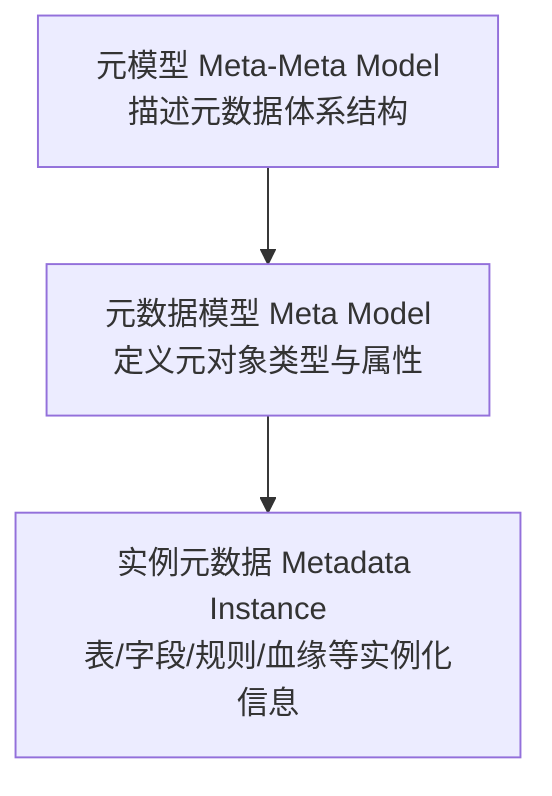
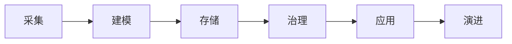
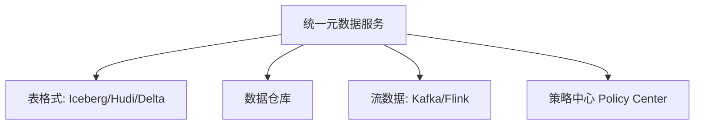

# 元数据管理

## **1. 概述（Overview）**

在数据治理架构的选择中，无论企业采用 **数据仓库、数据湖、还是湖仓一体**，真正决定“数据能否成为企业资产”的，并不是存储形态本身，而是隐藏在架构之下的两个核心能力：

### **① 元数据管理（Metadata Management）**

### **② 数据分层（Data Layering）**

它们构成了数据体系的“认知结构”与“生产结构”，是任何数据体系都绕不过的底层能力。本篇文档聚焦其中的第一部分：**元数据管理**。

元数据管理是一个面向全企业的数据控制平面，用于对所有数据资产进行描述、组织、治理和关联。
它提供：

* 数据的上下文
* 数据的语义
* 数据的血缘
* 数据的质量规则
* 数据的生命周期
* 数据的可发现性与可管理性

在课程体系中，它是贯穿整个数字化数据治理体系的“底层系统”。

---

## **2. 本质（Essence）**

元数据管理的本质是：

> **为数据提供结构化语义与治理规则，使数据成为可理解、可运营、可流通的企业资产。**

它让数据从“无意义的字节”变成“被组织、被定义、被追踪的资产”。

其本质价值包括：

1. **构建企业的数据认知地图（semantic + structural map）**
2. **成为数据治理所有策略的载体（分类分级、安全、质量、合规等）**
3. **成为数据流动、引用、依赖的“可观察层”**
4. **连接业务语义与技术体系的统一语义层**

没有元数据，数据体系就是非结构化、无语义的黑箱。

---

## **3. 模型（Model）**

### **3.1 元数据三层模型**

三层模型保证企业可以统一定义数据资产的结构、语义和行为。

---

### **3.2 元数据分类模型（四大类）**

| 类型        | 作用        | 示例           |
| --------- | --------- | ------------ |
| **技术元数据** | 描述数据技术结构  | Schema、分区、索引 |
| **业务元数据** | 描述语义与业务口径 | 指标口径、业务领域    |
| **操作元数据** | 描述运行过程    | ETL日志、访问行为   |
| **管理元数据** | 描述治理策略    | 分类分级、权限规则    |

---

### **3.3 元数据生命周期模型**

元数据不是静态文档，而是不断演化的生态系统。

---

## **4. 能力体系（Capability System）**

### **4.1 五大核心能力**

1. **元数据采集（Discovery）**
2. **元数据存储（Repository）**
3. **血缘分析（Lineage）**
4. **语义与指标管理（Semantic & Metric）**
5. **治理策略体系（Policy Management）**

---

### **4.2 四大增强能力**

6. 元数据质量
7. 搜索与可视化
8. 版本管理
9. API 与生态集成

元数据能力体系的成熟度决定了企业数据治理的深度。

---

## **5. 架构模型（Architecture Model）**

### **5.1 集中式元数据架构**

适用于中小规模数据体系。

### **5.2 分布式元数据架构**

用于复杂 ETL、多系统、多存储结构的场景。

### **5.3 联邦式 / 数据网格元数据架构**

面向大型组织，允许“领域自治 + 联邦治理”。

---

### **5.4 湖仓一体时代的元数据统一架构**

表格式推动元数据从“外置”变为“内嵌式 ACID 元数据”。

---

## **6. 类型体系（Taxonomy）**

元数据类型进一步包括：

* 结构元数据
* 语义元数据
* 过程元数据
* 策略元数据
* 使用行为元数据
* 数据质量元数据
* AI/ML 元数据（特征、模型、训练血缘）

---

## **7. 治理体系（Governance System）**

### **7.1 制度治理**

标准、命名规范、术语库等。

### **7.2 流程治理**

采集、变更、审核、发布。

### **7.3 技术治理**

自动化采集、血缘准确性、权限、安全。

元数据治理是数据治理的最底层支撑层。

---

## **8. 演进趋势（Evolution）**

1. 结构元数据 →
2. 自动化元数据 →
3. 统一语义与策略中心 →
4. 联邦与数据网格 →
5. AI 驱动的自演化元数据（自动口径、自动血缘、自动发现）

元数据正从“文档”升级为“自演进的智能控制平面”。

---

## **9. 与数据分层的关系：进入下一节课的重要桥梁**

你原文中提到：

> *无论选择哪种数据治理架构，都离不开元数据管理和数据分层。*

在知识体系中，两者关系如下：

### **元数据管理 = 数据治理的“描述系统”**

* 描述结构
* 描述语义
* 描述流动
* 描述规则
* 提供统一认知

### **数据分层 = 数据治理的“组织系统”**

* 决定数据的生产流程
* 决定数据在不同阶段的形态
* 决定数据复用、质量和稳定性

两者构成数据体系的“双核心”：

* **元数据管理告诉你“是什么”与“为什么”**
* **数据分层告诉你“在哪里”与“如何组织”**

因此在课程体系中，元数据管理与数据分层必须成对讲解。

---

## **10. 总结（Conclusion）**

1. **元数据管理是所有数据治理的基础设施，是数据体系的控制平面。**
2. **没有元数据，就不存在真正可管理的数据资产。**
3. **数据分层与元数据管理共同组成数据资产化的底层结构。**
4. **湖仓一体与数据网格时代，元数据成为决定架构是否可持续的关键因素。**
5. **未来的元数据系统将从“人工维护”演进为“AI 驱动的自演化生态系统”。**

## 关联内容（自动生成）

- [/数据技术/数据治理.md](/数据技术/数据治理.md) 元数据管理是数据治理的核心组成部分，提供数据的上下文、语义和血缘关系，是数据治理所有策略的载体
- [/数据技术/数据架构.md](/数据技术/数据架构.md) 数据架构中的支撑系统层包含元数据管理，元数据管理为整个数据架构提供描述、组织、治理和关联能力
- [/数据技术/数据工程.md](/数据技术/数据工程.md) 数据工程涉及海量数据处理，元数据管理是保证数据安全有序推进和数据运维的关键能力
- [/数据技术/数据网格.md](/数据技术/数据网格.md) 数据网格中的数据产品负责生成和管理元数据，包括数据文档、语义和语法声明、服务水平目标等信息
- [/数据技术/数据仓库.md](/数据技术/数据仓库.md) 数据仓库作为数据集成的中心，需要通过元数据管理来统一模式、描述数据血缘和管理数据质量

