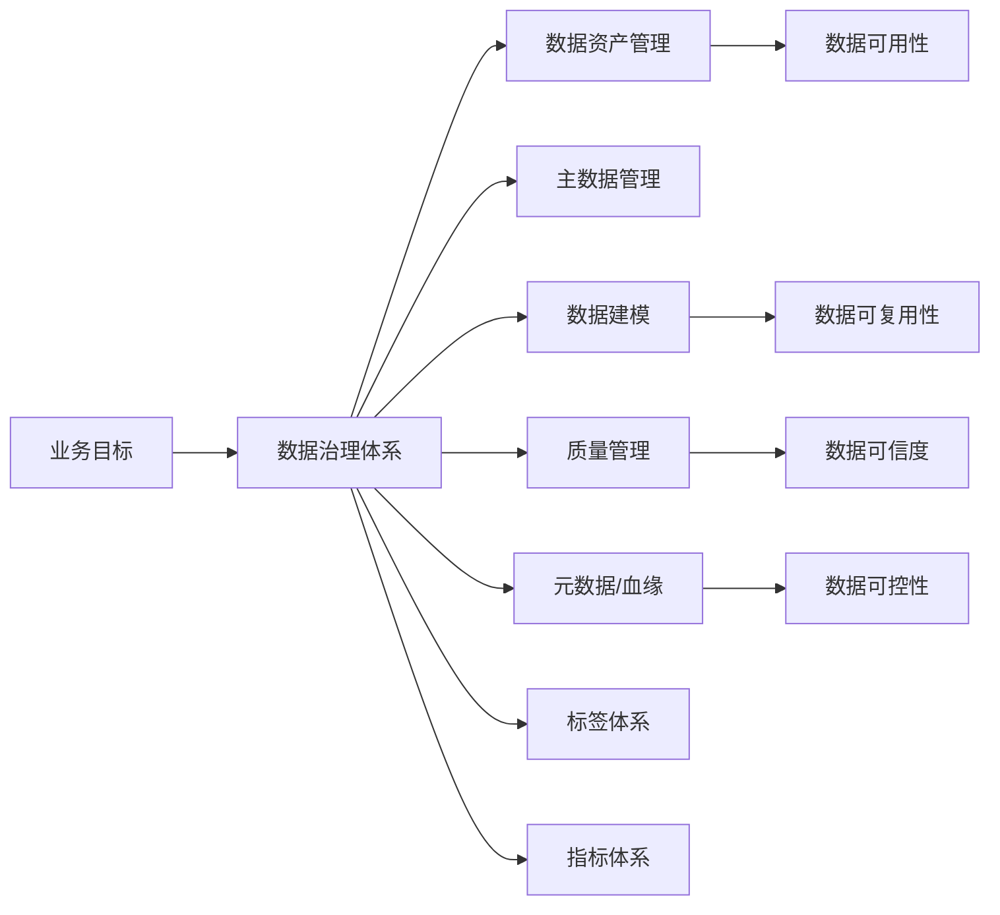
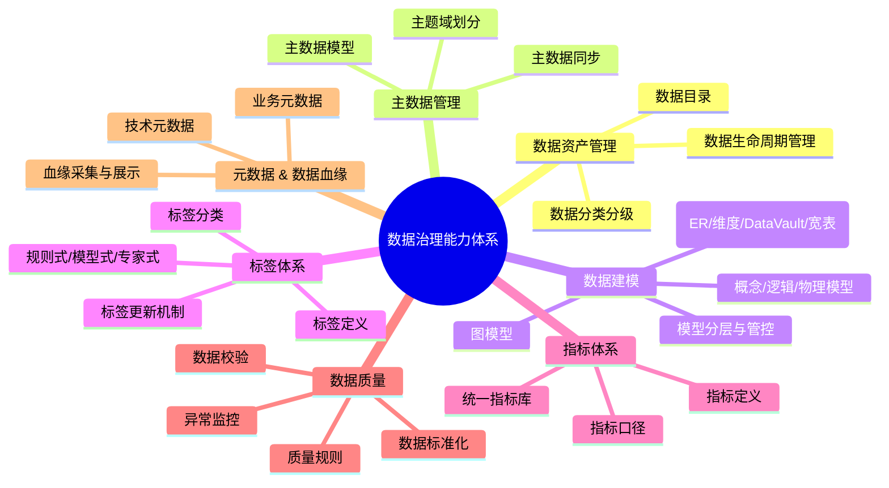
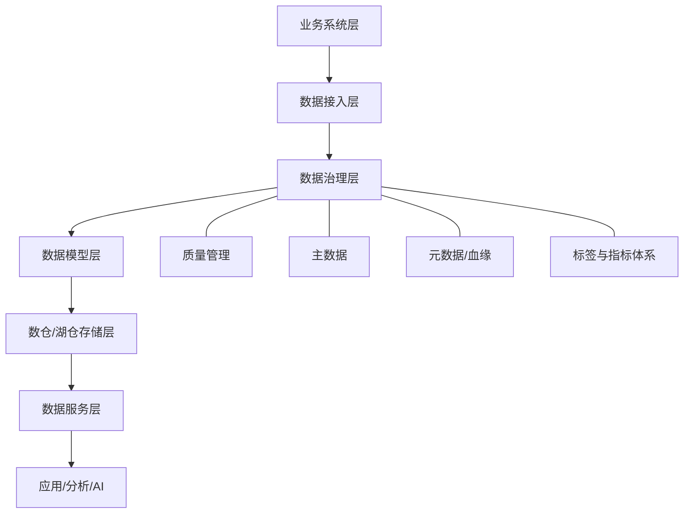
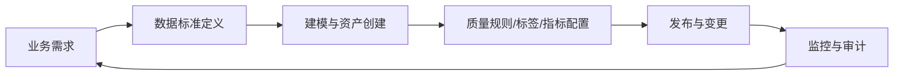

# 数据治理

## 1. 概述（Overview）

数据治理（Data Governance）是组织为确保数据的**可用、可靠、一致、安全和可控**而构建的一套体系化方法。它连接业务战略、数据资产、技术架构与治理流程，是驱动组织数据化能力的“大底层系统”。

数据治理不是单一模块，而是由**资产管理、质量管理、建模体系、主数据、元数据、血缘、标签与指标体系等多要素**构成的能力集合。

---

## 2. 本质（Essence）

数据治理的核心本质可以抽象为三个关键词：

### **1. 一致性（Consistency）**

跨系统、跨部门的数据语义、结构、口径保持一致，使数据可用于决策与自动化。

### **2. 可控性（Controllability）**

数据的生命周期、质量、风险、变更透明可控。

### **3. 可复用性（Reusability）**

形成标准化模型、主数据、标签、指标库，沉淀企业级数据资产，提高复用效率。

---

## 3. 核心模型（Model）

数据治理体系的整体模型可抽象为以下结构：

每个模块分别提供独立能力，但在治理体系中形成协同网络。

---

## 4. 能力体系（Capability System）

以下是企业级数据治理的能力树：

---

## 5. 架构模型（Architecture Model）

将数据治理映射到整体数据架构，可得到如下层次结构：

数据治理是贯穿数据流全链路的横向能力层。

---

## 6. 类型体系（Taxonomy）

数据治理可以从不同维度进行分类：

### **按对象分类**

* **结构化数据治理**
* **半结构化数据治理**
* **非结构化数据治理**

### **按功能分类**

* 描述类治理（资产、目录、元数据）
* 结构类治理（建模、主数据）
* 质量类治理（规则、校验）
* 决策类治理（标签、指标）

### **按责任主体分类**

* 业务域：口径、含义、业务规则
* 数据团队：模型、资产、血缘
* 平台团队：服务、工具、底层治理能力

---

## 7. 边界与生态（Boundary & Ecosystem）

### **1. 数据治理不等于数仓建设**

数仓是技术实现；治理是方法与组织能力。

### **2. 数据治理不等于数据质量**

质量是治理的一个子系统。

### **3. 数据治理不等于平台工具**

工具是载体而非方法本身。

### **4. 与相关生态的关系**

| 生态领域        | 与数据治理关系        |
| ----------- | -------------- |
| **数据架构**    | 提供治理框架的结构化载体   |
| **数据安全**    | 负责权限、合规，治理定义规则 |
| **数据质量**    | 治理提出规则，质量执行监控  |
| **主数据管理**   | 跨域数据一致性的核心机制   |
| **AI/机器学习** | 高质量、高一致性数据是前提  |

---

## 8. 治理体系（Governance System）

数据治理体系涉及组织、流程、制度三个维度。

### **组织体系**

* 数据治理委员会
* 数据负责人（Data Owner）
* 数据管理员（Data Steward）
* 数据工程团队

### **治理流程**

### **治理制度**

* 命名规范
* 模型分层规范
* 指标口径规范
* 主数据同步规范
* 数据质量规则规范
* 数据安全与权限规范

---

## 9. 演进趋势（Evolution）

数据治理正在从“制度型治理”向“智能化产品型治理”演进：

### **1. 从人工治理 → 自动化治理**

自动血缘、自动质量校验、自动规范检测。

### **2. 从数据目录 → 主动式数据可观测性**

数据健康监控、数据 SLA、异常自动定位。

### **3. 从规则式治理 → 模型驱动治理**

利用 ML/LLM 自动生成质量规则、标签、模型建议。

### **4. 从静态治理 → 实时治理**

实时血缘、实时标签、实时质量监控。

### **5. 从独立治理 → AI 原生治理**

治理能力融入 AI 应用、AI Agent、数据产品全生命周期。

---

## 10. 选型方法论（Selection Framework）

当企业在不同阶段推进数据治理时，可使用以下选型框架：

### **1. 数据建模选型**

| 场景             | 推荐模型       |
| -------------- | ---------- |
| OLTP/细粒度业务     | ER模型       |
| OLAP/报表分析      | 维度建模       |
| 多源并行、变更频繁      | Data Vault |
| 泛分析、宽依赖、查询性能优先 | 宽表         |
| 关系多、连接复杂       | 图模型        |

### **2. 主数据选型**

* 多系统共享、跨域一致性 → **集中式 MDM**
* 每个域独立治理，再聚合 → **联邦式 MDM**
* 域驱动 + API → **数据中台式 MDM**

### **3. 标签系统选型**

* 规则驱动 → 行为简单/规则明确的业务
* 模型驱动 → 个性化、行为模式复杂
* 专家驱动 → 需要业务主观判断场景

---

## 11. 总结（Conclusion）

数据治理是一套贯穿数据生命周期的系统能力框架，其目标不仅是"规范数据"，更是：

* 提升数据复用效率
* 提升数据决策质量
* 降低数据成本与风险
* 支撑数据产品化与智能化

## 关联内容（自动生成）

- [/数据技术/元数据管理.md](/数据技术/元数据管理.md) 元数据管理是数据治理体系的核心组成部分，提供数据描述、组织、治理和关联能力，是数据治理所有策略的载体
- [/数据技术/数据架构.md](/数据技术/数据架构.md) 数据架构为数据治理提供结构化载体，数据治理通过架构层实现数据资产的组织与管控，支撑数据架构的可维护性需求
- [/数据技术/数据质量.md](/数据技术/数据质量.md) 数据质量是数据治理的重要子系统，治理定义质量规则，质量执行监控与校验，共同保障数据可信度
- [/数据技术/数据分层.md](/数据技术/数据分层.md) 数据分层与数据治理共同构成企业数据管理体系，分层为治理提供组织结构基础，治理为分层数据提供质量与合规保障
- [/数据技术/数据仓库.md](/数据技术/数据仓库.md) 数据仓库建设需要通过数据治理来保障数据质量和口径一致性，治理为数仓提供标准化建模与指标体系规范
- [/数据技术/数据中台.md](/数据技术/数据中台.md) 数据中台的建设需要基于数据治理体系，通过治理保障主数据、指标体系等核心数据资产的一致性与可控性
- [/数据技术/数据网格.md](/数据技术/数据网格.md) 数据网格与传统数据治理在理念上相互呼应，通过联邦治理模式确保跨域数据的一致性、安全性和合规性
- [/数据技术/数据分析.md](/数据技术/数据分析.md) 数据分析依赖治理提供的指标体系和标签体系，确保分析口径统一和数据可信，是数据治理价值的直接体现
- [/数据技术/数据工程.md](/数据技术/数据工程.md) 数据工程实践需要遵循数据治理制定的标准和规范，保障数据从生产到应用全流程的质量与合规
- [/数据技术/数据存储.md](/数据技术/数据存储.md) 数据存储选型与数据治理策略密切相关，治理要求推动湖仓一体等架构中统一元数据和ACID事务保证的实现
- [/数据技术/数据处理.md](/数据技术/数据处理.md) 数据处理环节需遵循数据治理的质量规范，保证ETL过程中数据质量及降低运维成本，满足治理提出的规则要求
- [/数据技术/数据集成.md](/数据技术/数据集成.md) 数据集成过程需要考虑数据质量探查和安全规范，与数据治理体系结合确保数据一致性、安全性和合规性
- [/数据技术/任务调度系统.md](/数据技术/任务调度系统.md) 任务调度系统中的元数据管理与数据血缘追踪是数据治理的重要技术实现手段，保障数据质量和流程透明性
- [/软件工程/质量工程.md](/软件工程/质量工程.md) 软件质量工程与数据治理在质量度量和指标体系建设方面有相似性，都强调通过指标体系提升质量和可管理性
- [/软件工程/架构/系统设计/可观测性.md](/软件工程/架构/系统设计/可观测性.md) 数据治理与系统可观测性都强调对系统状态的监控与管理，数据治理可视为数据资产的可观测性管理
- [/软件工程/安全生产.md](/软件工程/安全生产.md) 安全生产中的数据安全与合规治理与数据治理中的数据安全要求相互关联，共同构建数据安全防护体系
- [/计算机网络/网络安全/安全性.md](/计算机网络/网络安全/安全性.md) 数据安全是数据治理和网络安全共同关注的领域，数据治理定义安全规则，网络安全提供技术实现
- [/编程语言/JAVA/框架/ORM.md](/编程语言/JAVA/框架/ORM.md) ORM框架中的元数据映射与数据治理中的元数据管理有相似理念，都关注数据结构和映射关系的标准化
- [/软件工程/架构模式/对象关系模式.md](/软件工程/架构模式/对象关系模式.md) 对象-关系元数据映射模式为数据治理中的元数据管理提供了技术实现参考
- [/数据技术/埋点设计.md](/数据技术/埋点设计.md) 埋点设计需要遵循数据治理的规范，通过埋点管理平台统一字段、命名与元数据字典
