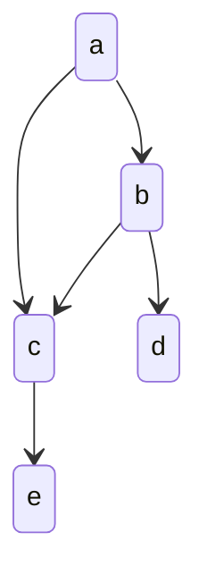

# 机器学习（Machine Learning）

## 一、机器学习的第一性原理（Principles）


### 1.1 学习的本质定义

**机器学习的本质**：

> 在不完全信息条件下，利用有限样本，对未知决策函数进行近似，并在未来数据上保持稳定表现。

这一过程可抽象为：

```
现实世界
  ↓（采样）
数据分布
  ↓（假设空间）
模型族
  ↓（优化）
参数
  ↓（决策）
预测 / 行为
```

三大永恒矛盾：

* 拟合能力 vs 泛化能力
* 表达能力 vs 稳定性
* 不确定性数据 vs 确定性决策

---

### 1.2 频率学派与贝叶斯学派

#### 频率视角

* 参数是**固定但未知的常量**
* 数据是随机变量
* 学习目标：**经验风险最小化（ERM）**

> 用训练数据的经验分布近似真实分布，通过优化损失函数估计参数

#### 贝叶斯视角

* 参数本身是**随机变量**
* 数据是已观测事实
* 学习结果是**参数的后验分布**

> 本质区别：是否显式建模不确定性

---

### 1.3 什么问题适合机器学习

机器学习适用问题需同时满足：

1. 问题中存在可学习的模式（显性或隐性）
2. 难以通过确定性规则精确建模
3. 拥有足够规模与质量的数据

---

## 二、学习范式与方法体系（Methodologies）

### 2.1 学习范式总览

| 范式    | 核心目标 | 本质描述        |
| ----- | ---- | ----------- |
| 监督学习  | 预测   | 从样本到标签的函数逼近 |
| 无监督学习 | 描述   | 发现数据内在结构    |
| 强化学习  | 决策   | 延迟奖励下的最优控制  |
| 迁移学习  | 复用   | 跨任务知识迁移     |

---

### 2.2 监督与无监督学习

* **监督学习**：直接逼近 $f(x) \to y$
* **无监督学习**：学习 $p(x)$ 或其结构

> 二者本质区别在于：是否存在明确的监督信号

---

### 2.3 集成学习：降低不确定性的系统方法

> 集成学习的核心哲学：**通过多样性对抗不确定性**

#### 能力结构

```
集成学习
├── 多样性来源
│   ├── 数据扰动（Bagging）
│   ├── 样本权重（Boosting）
│   └── 模型异构（Stacking）
├── 偏差-方差权衡
├── 鲁棒性提升
└── 工程代价
```

#### 方法分类

* **Bagging**：通过数据扰动降低方差
* **Boosting**：通过序列依赖降低偏差
* **Stacking**：通过元模型融合不同假设空间

##### AdaBoost

强分类器形式：

$$
f(x)=\sum_{i=1}^n\alpha_iG_i(x)
$$

> 本质：逐步聚焦“难样本”，重塑数据分布

---

## 三、模型、假设空间与复杂度（Models）

### 3.1 参数模型 vs 非参数模型

| 维度   | 参数模型 | 非参数模型 |
| ---- | ---- | ----- |
| 表达能力 | 有限   | 随数据增长 |
| 可解释性 | 强    | 弱     |
| 偏差   | 较高   | 较低    |
| 方差   | 较低   | 较高    |

> 本质区别：**假设空间容量是否随数据增长**

---

### 3.2 模型生命周期

1. 模型拟合（训练集）
2. 模型选择（验证集）
3. 模型评估（测试集）

> 三者必须**严格隔离**，否则评估失真

---

## 四、优化：从搜索到逼近（Optimization）

### 4.1 优化的本质

> 优化不是“找最优解”，而是在巨大搜索空间中**高效逼近可接受解**

---

### 4.2 梯度下降的几何直觉


* 利用局部线性近似
* 沿负梯度方向迭代更新

$$
w := w - \alpha \nabla J(w)
$$


#### 工程稳定性技巧

* 学习率控制
* 特征缩放
* 小批量梯度下降
* 软更新

---

### 4.3 随机化优化方法谱系

| 方法   | 核心思想   |
| ---- | ------ |
| 随机搜索 | 空间采样   |
| 爬山法  | 局部改进   |
| 模拟退火 | 接受劣解逃逸 |
| 遗传算法 | 群体进化   |

> 随机性用于对抗局部最优

---

## 五、泛化、过拟合与正则化（Generalization）

### 5.1 偏差-方差分解


* 偏差：模型假设过强
* 方差：模型过于灵活

---

### 5.2 正则化的统一解释

> 正则化的本质：**对函数空间施加约束**

形式：

$$
J = Loss + \lambda \cdot Complexity
$$


* L1：结构稀疏化
* L2：参数平滑化

---

### 5.3 学习曲线与数据规模


> 数据并非万能，错误的模型结构无法被数据拯救

---

## 六、实验设计与评估体系（Evaluation）

### 6.1 实验的工程哲学

> 实验的目的不是“证明模型好”，而是**理解模型行为**

* 控制变量
* 全因子实验
* 连续实验

---

### 6.2 数据划分策略

* Holdout
* 交叉验证
* 自助法
* 时间切割
* 离线 Replay

---

### 6.3 评估指标体系

* Accuracy / Precision / Recall
* F-Score
* ROC / AUC
* LogLoss
* RMSE

> 指标选择应服从业务风险偏好

---

## 七、强化学习：延迟奖励下的学习（RL）

> 强化学习解决的是：**序列决策与长期回报最大化**


### 7.1 核心抽象

* 状态 $S$
* 动作 $A$
* 奖励 $R$
* 策略 $\pi$

### 7.2 贝尔曼方程

$$
Q(s,a)=R(s)+\gamma\max_{a'}Q(s',a')
$$

> 本质：递归定义最优性

---

## 八、概率图模型：结构化不确定性

### 8.1 建模哲学

> 用图结构表达随机变量之间的条件独立性



$$
p(A,B,C,D,E)=p(A)p(B|A)p(C|A,B)p(D|B)p(E|C)
$$

---

## 九、从算法到系统（ML as a System）

### 9.1 机器学习系统生命周期

```
数据 → 特征 → 模型 → 决策 → 反馈 → 再训练
```

### 9.2 系统性挑战

* 数据漂移
* 概念漂移
* 评估失效
* 线上线下一致性

---

## 十、总结：机器学习的长期视角

> 机器学习不是"找到一个好算法"，
> 而是**构建一个能够持续学习、纠错和进化的系统**。

真正稳定的能力来自：

* 对不确定性的敬畏
* 对复杂度的克制
* 对系统行为的持续观测

## 关联内容（自动生成）

- [/数据技术/监督学习.md](/数据技术/监督学习.md) 监督学习是机器学习的重要范式之一，与文档中提到的监督学习概念密切相关
- [/数据技术/非监督学习.md](/数据技术/非监督学习.md) 非监督学习是机器学习的另一个重要范式，与文档中提到的无监督学习概念相对应
- [/数据技术/深度学习.md](/数据技术/深度学习.md) 深度学习是机器学习的一个重要分支，体现了文档中提到的模型复杂度与表达能力的关系
- [/数据技术/特征工程.md](/数据技术/特征工程.md) 特征工程是机器学习实践中重要的环节，直接影响模型的学习效果和泛化能力
- [/数据技术/推荐系统.md](/数据技术/推荐系统.md) 推荐系统是机器学习的重要应用领域，体现了文档中提到的从算法到系统的转化
- [/数据技术/数据分析.md](/数据技术/数据分析.md) 数据分析与机器学习密切相关，机器学习往往作为数据分析的高级手段
- [/数据技术/数据建模.md](/数据技术/数据建模.md) 数据建模是机器学习的基础，涉及文档中提到的假设空间和模型选择问题
- [/数据技术/数据处理.md](/数据技术/数据处理.md) 数据处理是机器学习流程中的重要环节，影响数据质量从而影响学习效果
