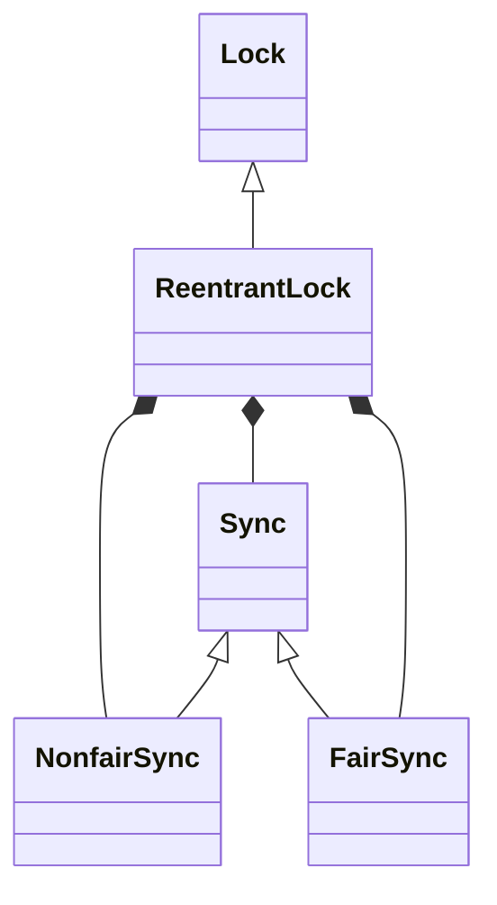
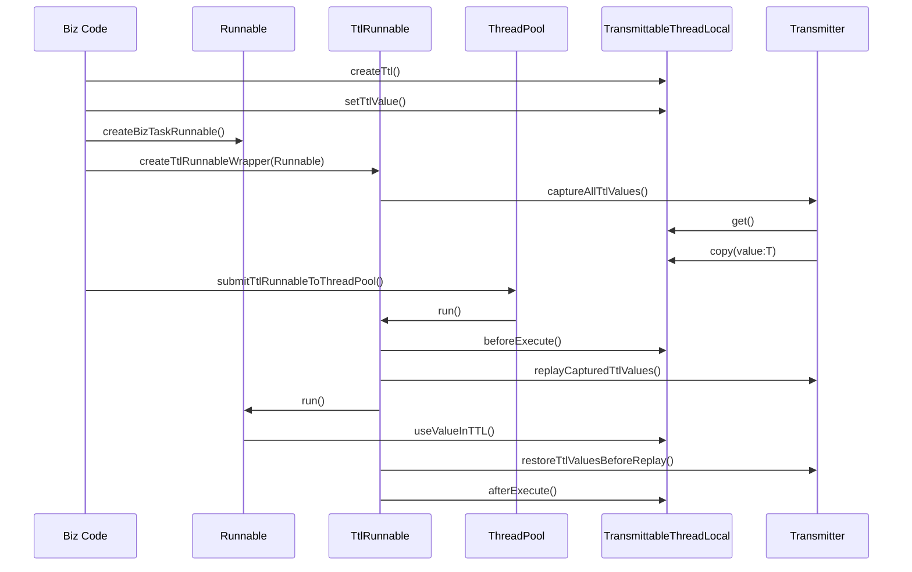

# JUC

J.U.C java.util.concurrent

主要分为几个类簇：

- 线程同步类　使进程间的协调更加容易　CountDownLatch CyclicBarrier等
- 并发集合类
- 线程管理类　线程池等
- 锁相关类　

## ReentrantLock

- 语义同 synchronized 锁，可重入互斥锁
- 构造器接受 fairness 的参数，fairness 是 ture 时，保证获得锁时的顺序，false 不保证

轻量级锁与重量级锁:“轻量级”是相对于使用操作系统互斥量来实现的传统锁而言的

ReentrantLock 和synchronized 都是 可重入锁

可重入 是同一线程 外层函数获得锁之后 ，内层递归函数仍然有获取该锁的代码，但不受影响

```java
try {
    lock.lock();
    // do something
} catch (Exception e){
    e.printStackTrace();
}finally {
    lock.unlock();
}
```

- 尝试加锁

```java
lock.tryLock() // 可以进行“尝试锁定”tryLock，这样无法锁定，或者在指定时间内无法锁定，线程可以决定是否继续等待
```

- 可打断的加锁

```java
lock.lockInterruptibly(); // 可以通过interrupt()打断
```

- 公平锁

公平锁：每个线程抢占锁的顺序为先后调用lock方法的顺序依次获取锁

非公平锁：每个线程抢占锁的顺序不定，谁运气好，谁就获取到锁，和调用lock方法的先后顺序无关

```java
new ReentrantLock(true); // true为公平锁
```

为什么需要非公平锁：在竞争激烈的情况下，唤醒等待线程的开销会很高，基本上是一种等待-获取-等待-获取的串行的局面，无法很好地利用并发性

### synchronized vs ReentrantLock 

- synchronized 是 JVM 实现的，而 ReentrantLock 是 JDK 实现的
- 新版本java 两者性能大致相同
- ReentrantLock 可中断，而 synchronized 不行
- synchronized 中的锁是非公平的，ReentrantLock 默认情况下也是非公平的，但是也可以是公平的
- ReentrantLock 可以同时绑定多个 Condition 对象
- synchronized 是基于代码块的方式 是由虚拟机自动帮开发人员释放锁 而 ReentrantLock 的加锁释放锁更加灵活但同时也更加危险

应该优先选择synchronized:

- synchronized的锁释放是自动的
- jvm天生支持

### 类层次结构



### 同步器

- 非公平地获取锁

```java
final boolean nonfairTryAcquire(int acquires) {
    final Thread current = Thread.currentThread();
    int c = getState();
    // 代表锁还没被获取
    if (c == 0) {
        // 设置状态标记获取锁
        if (compareAndSetState(0, acquires)) {
            // 标记获取锁的线程是当前线程
            setExclusiveOwnerThread(current);
            return true;
        }
    }
    // 锁已经被获取了，并且获取锁的线程是当前线程
    else if (current == getExclusiveOwnerThread()) {
        int nextc = c + acquires;
        if (nextc < 0) // overflow
            throw new Error("Maximum lock count exceeded");
        // 设置锁的状态+1
        setState(nextc);
        return true;
    }
    // 加入等待队列
    return false;
}
```

- 尝试释放锁

```java
protected final boolean tryRelease(int releases) {
    // 释放锁后线程持有的锁数
    int c = getState() - releases;
    // 当前的线程没有持有锁
    if (Thread.currentThread() != getExclusiveOwnerThread())
        throw new IllegalMonitorStateException();
    boolean free = false;
    // 锁释放完了
    if (c == 0) {
        // 可以让其他线程获取锁
        free = true;
        setExclusiveOwnerThread(null);
    }
    // 如果锁没有释放完，设置state为当前线程持有的锁数
    setState(c);
    return free;
}
```

### FairSync公平锁

```java
protected final boolean tryAcquire(int acquires) {
    final Thread current = Thread.currentThread();
    int c = getState();
    // 锁没有被持有
    if (c == 0) {
        // 如果当前线程处于同步队列的头节点，则获取锁成功，否则等待
        if (!hasQueuedPredecessors() &&
            compareAndSetState(0, acquires)) {
            setExclusiveOwnerThread(current);
            return true;
        }
    }
    // 锁被当前线程持有，重入
    else if (current == getExclusiveOwnerThread()) {
        int nextc = c + acquires;
        if (nextc < 0)
            throw new Error("Maximum lock count exceeded");
        setState(nextc);
        return true;
    }
    // 锁被其他线程持有，等待
    return false;
}
```

### NonfairSync非公平锁

这里的非公平锁tryAcquire实现就是上面同步器sync中的实现

## ReentrantReadWriteLock

当读写锁是写加锁状态时, 在这个锁被解锁之前, 所有试图对这个锁加锁的线程都会被阻塞

当读写锁在读加锁状态时, 所有试图以读模式对它进行加锁的线程都可以得到访问权, 但是如果线程希望以写模式对此锁进行加锁, 它必须直到所有的线程释放锁

```java
class Cache {
    private Map<String, Object> cache = new HashMap<>();
    private ReentrantReadWriteLock lock = new ReentrantReadWriteLock();

    public void put(String key, Object value) {
        ReentrantReadWriteLock.WriteLock writeLock = lock.writeLock();
        writeLock.lock();
        cache.put(key, value);
        writeLock.unlock();
    }

    public Object get(String key) {
        ReentrantReadWriteLock.ReadLock readLock = lock.readLock();
        readLock.lock();
        Object value = cache.get(key);
        readLock.unlock();
        return value;
    }
}
```

关于读写锁的一些问题：

- 释放优先：当一个线程释放写锁时，那么应该优先选择下一个读线程还是写线程，还是最先发出操作的线程
- 读线程插队：如果锁当前被一些读线程持有，但有一个写线程在等待，那么新到达的读线程是应该插队写线程还是老老实实排在写线程后面
- 重入性：读取和写入的锁是否可重入
- 降级：如果一个线程持有写锁，那么它能不能直接获取读锁
- 升级：如果一个线程持有读锁，那么它能不能优先于其他正在等待的线程获取写锁

## CountDownLatch(闭锁)

> 确保某些活动直到其他活动都完成后才继续执行


其最大的作用不是为了加锁，而是通过计数达到等待的功能，主要有两种形式的等待：

- 让一组线程在全部启动完成之后，再一起执行
- 主线程等待另外一组线程都执行完成之后，再继续执行

```java
CountDownLatch latch = new CountDownLatch(5);

for (int i = 0; i < 5; i++) {
    int finalI = i;
    new Thread(()->{
        Random random = new Random();
        try {
            Thread.sleep(random.nextInt(5000));
        } catch (InterruptedException e) {
            e.printStackTrace();
        }
        System.out.println("线程"+ finalI +"完成");
        lock.latch();
    }).start();
}

latch.await();
System.out.println("all mission complete");
```

### await

```java
// await方法的实现是获取共享锁，如果获得后就返回，否则就等待
public void await() throws InterruptedException {
    sync.acquireSharedInterruptibly(1);
}
// 这里sync判断能否获得锁的标志是state是否=0
protected int tryAcquireShared(int acquires) {
    return (getState() == 0) ? 1 : -1;
}
```

### countDown

```java
// countDown的实现就是释放一个锁
public void countDown() {
    sync.releaseShared(1);
}
// sync判断能否释放锁的标志是 释放这次锁之后，锁的个数为0
protected boolean tryReleaseShared(int releases) {
    // Decrement count; signal when transition to zero
    for (;;) {
        int c = getState();
        // 已经没有锁了
        if (c == 0)
            return false;
        int nextc = c - 1;
        if (compareAndSetState(c, nextc))
            return nextc == 0;
    }
}
```

## CyclicBarrier（栅栏）

>闭锁用于等待事件，而栅栏用于等待其他线程


```java
CyclicBarrier barrier = new CyclicBarrier(5, () -> System.out.println("all thread run"));
// 调用await的线程会进行等待，直到第5个线程调用await，所有线程才会继续执行
for (int i = 0; i < 5; i++) {
    new Thread(() -> {
        Random rnd= new Random();
        try {
            Thread.sleep(rnd.nextInt(3000));
            System.out.println(Thread.currentThread()+"run");
            barrier.await();
        } catch (InterruptedException | BrokenBarrierException e) {
            e.printStackTrace();
        }
    }).start();
}
```

## phaser

## Semaphore(信号量)

> 用来控制使用资源的主体数量

```java
Semaphore semaphore = new Semaphore(5);
// Semaphore semaphore = new Semaphore(5,true); 公平的信号量
// 最多只有5个线程能同时运行
for (int i = 0; i < 10; i++) {
    new Thread(()->{
        Random rnd = new Random();

        try {
            semaphore.acquire();
            System.out.println(Thread.currentThread()+"acquire lock");
            Thread.sleep(5000);
        } catch (InterruptedException e) {
            e.printStackTrace();
        }finally {
            semaphore.release();
        }
    }).start();
}
```

## Exchanger

两个线程交换数据

```java
Exchanger<String> exchanger = new Exchanger<>();

new Thread(()->{
    try {
        System.out.println("1st:"+exchanger.exchange("1"));
    } catch (InterruptedException e) {
        e.printStackTrace();
    }
}).start();
new Thread(()->{
    try {
        System.out.println("2nd:"+exchanger.exchange("2"));
    } catch (InterruptedException e) {
        e.printStackTrace();
    }
}).start();
```

## StampedLock

先试着读，然后通过 validate 方法确认是否进入了写模式，如果没有进入，就成功避免了获取锁的开销

```java

public class StampedSample {
  private final StampedLock sl = new StampedLock();

  void mutate() {
      long stamp = sl.writeLock();
      try {
          write();
      } finally {
          sl.unlockWrite(stamp);
      }
  }

  Data access() {
      long stamp = sl.tryOptimisticRead();
      Data data = read();
      if (!sl.validate(stamp)) {
          stamp = sl.readLock();
          try {
              data = read();
          } finally {
              sl.unlockRead(stamp);
          }
      }
      return data;
  }
  // …
}
```

## LockSupport

```java
var t = new Thread(()->{
    for (int i = 0; i < 10; i++) {
        if (i == 5){
            // 暂停线程
            LockSupport.park();
        }
        System.out.println(i);
    }
});
t.start();
Thread.sleep(3000);
// 继续线程 可以在park之前调用
LockSupport.unpark(t);
```

## VarHandle

- 支持一些原子操作

```java
public class Main {
    int x = 8;
    public static void main(String[] args) throws Exception{
        Main main = new Main();
        VarHandle varHandle = MethodHandles.lookup().findVarHandle(Main.class,"x",int.class);
        varHandle.compareAndSet(main,8,9);
        System.out.println(varHandle.get(main));
    }
}
```

## ThreadLocal

供了一种方式，让在多线程环境下，每个线程都可以拥有自己独特的数据，并且可以在整个线程执行过程中，从上而下的传递

```java
ThreadLocal<String> tl = new ThreadLocal<>();
var t1 = new Thread(()->{
    tl.set("cxk");
    System.out.println(tl.get()); // "cxk"
});
var t2 = new Thread(()->{
    System.out.println(tl.get()); // null
});
t1.start();
t1.join();
t2.start();
```

使用ThreadLocal包装的对象只能在当前线程使用


原理: <https://ismy.wang/java/2019/05/10/%E5%88%9D%E6%8E%A2ThreadLocal.html>

ThreadLocal使用了弱引用防止内存泄漏

注意：使用时，对象不再使用，必须手动remove，否则在使用线程池的情况下，线程如果没有被销毁，会产生内存泄漏

### 属性

```java
// 表示当前ThreadLocal在全局map中的存放位置
private final int threadLocalHashCode = nextHashCode();
// 它的hashCode是通过一个原子整数不断递增的形式给出的，这样可以保证每台机器的每一个ThreadLocal都有唯一的hashCode
private static AtomicInteger nextHashCode = new AtomicInteger();
// 用来存放各个ThreadLocal对应的数据
static class ThreadLocalMap {
    ...
}
```

### set

```java
public void set(T value) {
    Thread t = Thread.currentThread();
    // 获取当前线程的一个map
    ThreadLocalMap map = getMap(t);
    // 向map里面放数据（如果map为空，则创建map）
    if (map != null) {
        map.set(this, value);
    } else {
        // 这里创建map的时候，创建后会存入value
        createMap(t, value);
    }
}
// 也就是说每个线程都拥有一张map，这张map的可是ThreadLocal，这样当使用ThreadLocal存取数据时，就会通过ThreadLocal来在这张map上set/get数据
```

### get

```java
public T get() {
    Thread t = Thread.currentThread();
    ThreadLocalMap map = getMap(t);
    // 获取map进行get
    if (map != null) {
        ThreadLocalMap.Entry e = map.getEntry(this);
        if (e != null) {
            @SuppressWarnings("unchecked")
            T result = (T)e.value;
            return result;
        }
    }
    return setInitialValue();
}
```

### 应用

```java
// 获取当前的请求
RequestContextHolder.getCurrentRquest();
```

### 副作用

1. 线程池复用线程会导致ThreadLocal 也被重用　从而会导致脏数据的产生
2. 如果使用static修饰ThreadLocal　这个时候弱引用就无法防止内存泄露了

解决上面这些问题只需要使用的时候注意remove即可

### InheritableThreadLocal

使用 InheritableThreadLocal，可以在子线程中获取到父线程中的 ThreadLocal 变量

其原理是子线程在初始化时，会去获取父线程的 ThreadLocalMap 来作为自己的 ThreadLocalMap

### TransmittableThreadLocal

在使用 TransmittableThreadLocal 时，它在将值保存到父类 InheritableThreadLocal 中的同时，会将当前的 TransmittableThreadLocal 实际进行存储，这样使用完成后，它自己就会维护一份所有用到的TransmittableThreadLocal 实例，不管它是用户信息的，还是其他信息的实例

有了上面维护的信息，就可以借助Transmitter来对其中的数据进行操作，一般操作步骤如下

- 主线程：调用Transmitter.capture，将当前主线程中的所有TransmittableThreadLocal和值进行快照保存(Map结构，结果要作为value进行存储，否则其他线程取不到TransmittableThreadLocal的value值)
- 子线程：调用Transmitter.replay，用于将之前保存的所有TransmittableThreadLocal实例及其值重新设置一下（需要借助之前保存的map结构，因为TransmittableThreadLocal中的数据是线程隔离的），并将当前线程的所有TransmittableThreadLocal实例进行备份返回
- 子线程：业务代码执行完毕之后调用Transmitter.restore，用于将之前备份的数据进行恢复，原理同replay方法



## 锁的原理（AQS AbstractQueuedSynchronizer）

AQS 是一个锁框架，它定义了锁的实现机制，并开放出扩展的地方，让子类去实现，比如我们在 lock 的时候，AQS 开放出 state 字段，让子类可以根据 state 字段来决定是否能够获得锁，对于获取不到锁的线程 AQS 会自动进行管理，无需子类锁关心


AQS核心思想是，如果被请求的共享资源空闲，那么就将当前请求资源的线程设置为有效的工作线程，将共享资源设置为锁定状态；如果共享资源被占用，就需要一定的阻塞等待唤醒机制来保证锁分配。这个机制主要用的是CLH队列的变体实现的，将暂时获取不到锁的线程加入到队列中。

> CLH：Craig、Landin and Hagersten队列，是单向链表，AQS中的队列是CLH变体的虚拟双向队列（FIFO），AQS是通过将每条请求共享资源的线程封装成一个节点来实现锁的分配。


### 整体架构


### 属性

```java
// 这个状态用来判断是否可以获得锁，每次获得锁时+1，释放锁-1
// 当子类继承AQS来实现锁时，要根据这个状态判断能否获得锁(为0才能获得)跟释放锁(为1才能释放)
private volatile int state;

// 同步队列的头与尾,底层是一个双向链表，用来阻塞获取不到锁的线程，并在适当时机释放这些线程
private transient volatile Node head;
private transient volatile Node tail;

// 条件队列，管理获取不到锁的线程，但条件队列不直接和锁打交道，但常常和锁配合使用
public class ConditionObject implements Condition, java.io.Serializable {
    // Condition 可以用来代替 Object 中相应的监控方法
    // 它提供了一种线程协作方式，并且都有明确语义
    
    /** First node of condition queue. */
    private transient Node firstWaiter;
    /** Last node of condition queue. */
    private transient Node lastWaiter;
}

static final class Node {
    ...
    volatile int waitStatus;
    // 在共享锁中用来表示下一个等待线程，排它锁则用来表示当前节点是共享还是排它模式
    Node nextWaiter;
}
```

### 获取锁

- 排它锁

```java
// 排它模式下，尝试获得锁
public final void acquire(int arg) {
    // tryAcquire让子类实现的，思路一般是根据state的值决定是否能获取到锁
    if (!tryAcquire(arg) &&
        // 如果获取不到就调用addWaiter让线程进入同步队列，然后acquireQueued这个方法代表进入之后会阻塞，直到被唤醒获得锁
        acquireQueued(addWaiter(Node.EXCLUSIVE), arg))
        // 获取锁失败，打断自身
        selfInterrupt();
}
// 追加到同步队列的队尾
private Node addWaiter(Node mode) {
    Node node = new Node(mode);
        
    for (;;) {
        Node oldTail = tail;
        // 如果队尾不为空，就将node插入到队尾
        if (oldTail != null) {
            // 将原来队尾的node设置为新加入node的prev
            node.setPrevRelaxed(oldTail);
            // 原子方式将node设置为队尾
            if (compareAndSetTail(oldTail, node)) {
                oldTail.next = node;
                return node;
            }
        // 队尾为空，需要初始化同步队列
        } else {
            initializeSyncQueue();
        }
    }
}
// 阻塞当前线程
final boolean acquireQueued(final Node node, int arg) {
    boolean interrupted = false;
    try {
        for (;;) {
            final Node p = node.predecessor();
            // 如果这个当前线程节点的前置节点是头节点，并且自己已经能获得锁了
            if (p == head && tryAcquire(arg)) {
                // 将自己设置为头节点
                setHead(node);
                p.next = null; // help GC
                // 然后返回
                return interrupted;
            }
            // 前一个节点状态为SIGNAL了，那么就阻塞自己(park)
            if (shouldParkAfterFailedAcquire(p, node))
                interrupted |= parkAndCheckInterrupt();
        }
    } catch (Throwable t) {
        cancelAcquire(node);
        if (interrupted)
            selfInterrupt();
        throw t;
    }
}
```

- 共享锁

```java
public final void acquireShared(int arg) {
    // 同样由子类实现
    if (tryAcquireShared(arg) < 0)
        // 里面的这个方法主要做的是不断自旋直到获取到锁，当获取到锁之后，会通知排在它后面的节点
        doAcquireShared(arg);
}
private void doAcquireShared(int arg) {
    final Node node = addWaiter(Node.SHARED);
    boolean interrupted = false;
    try {
        for (;;) {
            final Node p = node.predecessor();
            // 当前节点的前置节点如果是头节点
            if (p == head) {
                // 尝试获取锁
                int r = tryAcquireShared(arg);
                // 获取锁成功
                if (r >= 0) {
                    setHeadAndPropagate(node, r);
                    p.next = null; // help GC
                    return;
                }
            }
            if (shouldParkAfterFailedAcquire(p, node))
                interrupted |= parkAndCheckInterrupt();
        }
    } catch (Throwable t) {
        cancelAcquire(node);
        throw t;
    } finally {
        if (interrupted)
            selfInterrupt();
    }
}
```

### 释放锁

- 排它锁

```java
public final boolean release(int arg) {
    // 同样留给子类实现判断是否能释放锁
    if (tryRelease(arg)) {
        Node h = head;
        // 后面有一些等待唤醒的节点
        if (h != null && h.waitStatus != 0)
            // 从头开始唤醒等待锁的节点
            unparkSuccessor(h);
        return true;
    }
    return false;
}
```

- 共享锁

```java
public final boolean releaseShared(int arg) {
    // 基本跟上面一样
    if (tryReleaseShared(arg)) {
        // 唤醒后面的线程
        doReleaseShared();
        return true;
    }
    return false;
}
```

### 条件队列

- 入队列等待 await

获得锁的线程，如果在碰到队列满或空的时候，就会阻塞住，这个阻塞就是用条件队列实现的，这个动作我们叫做入条件队列

- 单个唤醒 signal

之前队列满了，有了一些线程因为 take 操作而被阻塞进条件队列中，突然队列中的元素被线程 A 消费了，线程 A 就会调用 signal 方法，唤醒之前阻塞的线程
