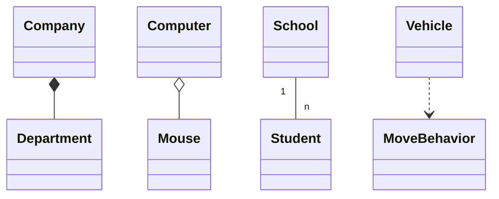

# 面向对象（Object-Oriented）

## 一、哲学层：世界观与本体论

面向对象不仅是一种编程方法，更是一种**认识世界与管理复杂性**的思想。
它的核心世界观是：**“一切皆对象”**。

### 1. 世界的对象化视角

现实世界由无数“事物”构成，每个事物既有**状态（数据）**，也有**行为（方法）**。
当我们用程序描述世界时，就是在为这些事物建立数字化的“投影”：

```java
class Person {
    Date birthday;
    int getAge();
}
```

> 对象是数据与行为的统一体。
> 类是对象的蓝图，是对世界中“共性”的抽象。
> 通过封装接口，隐藏内部变化，实现模块化与解耦。

### 2. 抽象的本质

抽象不是“省略细节”，而是“聚焦本质”。
在复杂系统中，抽象的目标是——**隔离变化、控制复杂性、表达语义**。

> 只暴露稳定的接口，让内部变化不影响外部世界。
> —— 这正是“封装”思想的哲学根基。

---

## 二、技术层：OOP的结构与机制

### 1. 三大特性

#### （1）封装（Encapsulation）

> 将数据与操作打包成一个最小可维护单元，屏蔽内部实现。

**作用：**

* 降低模块间耦合度
* 隐藏实现细节
* 降低变更影响范围
* 提高可维护性与安全性

```java
class Account {
    private double balance;
    public void deposit(double amount) { ... }
    public void withdraw(double amount) { ... }
}
```

#### （2）继承（Inheritance）

> 子类继承父类的属性与行为，形成 **IS-A** 关系。

继承带来**复用与抽象**，但也可能引发**脆弱性**。
继承应当体现语义上的一致性，而非仅仅为了代码复用。

```java
Animal dog = new Dog();  // 向上转型
```

> ✅ 用继承表达概念层次
> ⚠️ 用组合表达行为复用

#### （3）多态（Polymorphism）

> 同一接口，不同实现。

* **编译时多态**：方法重载
* **运行时多态**：方法重写 + 动态绑定

多态使得上层依赖抽象，而非具体实现，从而实现**扩展而不修改（Open-Closed Principle）**。

---

### 2. 组合 vs 继承

继承表达“是一种”（is-a），组合表达“拥有一种”（has-a）。
在现代设计原则中，组合往往比继承更灵活、更安全：

> **“优先使用组合，而不是继承。”**

```java
class Car {
    Engine engine;
    void run() { engine.start(); }
}
```

---

### 3. 类与协作

类是对象的定义，而对象之间的**协作**构成系统行为。

| 方向   | 含义            |
| ---- | ------------- |
| 自底向上 | 职责聚合，形成更高层抽象  |
| 自顶向下 | 职责分解，形成更小粒度模块 |

#### 确定类的原则

* 找出需求中的名词 → 候选类
* 分析其**状态**与**行为**

  * 有状态有行为 → 概念类
  * 有状态无行为 → 数据类
  * 无状态有行为 → 工具类
  * 无状态无行为 → 可舍弃

---

## 三、技术层延伸：UML 类图关系

| 关系     | 含义     | UML符号 |       |
| ------ | ------ | ----- | ----- |
| 泛化（继承） | IS-A   | `A <  | -- B` |
| 实现     | 接口实现   | `<    | ..`   |
| 聚合     | 弱整体-部分 | `o--` |       |
| 组合     | 强整体-部分 | `*--` |       |
| 关联     | 静态引用关系 | `--`  |       |
| 依赖     | 临时使用关系 | `..>` |       |

示例：



---

## 四、实践层：面向对象分析与设计（OOA/OOD）

### 1. 面向对象分析（OOA）

目标：**从需求到模型**，回答“系统要做什么”。

#### 层次结构

* **对象层**：识别问题域中的关键对象
* **特征层**：定义属性与操作
* **关系层**：描述对象间关联（继承、依赖、聚合）

#### 流程

1. 从用例（Use Case）出发，分析需求
2. 识别领域对象与类
3. 定义属性、行为与约束
4. 建立关系与包结构
5. 通过顺序图、状态图描述动态行为
6. 不断原型验证与迭代

---

### 2. 面向对象设计（OOD）

目标：**从模型到实现**，回答“系统应如何实现”。

主要关注：

* 模块划分与接口设计
* 抽象层次的组织
* 可复用结构（框架、组件）
* 持久化与性能优化

#### 子系统划分

* **人机交互层**：强调易用性与容错性
* **控制层**：协调流程逻辑
* **数据管理层**：管理持久化与一致性

> 面向对象设计的核心任务，是在抽象与实现之间架起桥梁。

---

### 3. 面向对象编程（OOP）

当分析与设计模型落实到编程语言中，就形成了 OOP 实践。

#### 程序设计范型演进

| 范型   | 核心思想  |
| ---- | ----- |
| 面向过程 | 按步骤执行 |
| 模块化  | 按功能分块 |
| 面向对象 | 按职责建模 |

OOP语言的好坏标准：

* 支持类与对象的抽象表达
* 支持继承、组合、多态
* 支持消息传递与封装

---

## 五、进化层：设计原则与模式

### 1. 面向对象设计原则

| 原则         | 核心思想            |
| ---------- | --------------- |
| **迪米特法则**  | 最少知识原则，只与“朋友”交流 |
| **合成复用原则** | 多用组合，少用继承       |
| **共同闭包原则** | 一起修改的类应放在同一模块   |
| **稳定抽象原则** | 稳定的模块应更抽象       |
| **稳定依赖原则** | 依赖方向应指向更稳定的模块   |

这些原则共同构成了 **面向变化设计的哲学基础**。

---

### 2. DCI 架构思想

> DCI：Data（数据） + Context（上下文） + Interaction（交互）

* **Data**：对象的状态与属性
* **Context**：对象在场景中的角色
* **Interaction**：对象之间的行为协作

DCI 强调从“行为视角”理解对象，使系统更贴近人类的思维方式（故事化建模）。

---

下面是 **完全重写后的第六点**，保持与全文一致的抽象层次与体系化风格，不再陷入语言细节，而是从 **哲学本质 → 抽象模型 → 技术机制 → 设计意义** 的路径展开，让这一章与前文的思想结构完整衔接。

---

## 六、原型式面向对象

传统面向对象语言（Java、C++、C# 等）以 **类（Class）** 为核心组织单位，通过类来抽象共性、由实例表达特性。这是一种 **分类学式的建模方式**：先定义类别，再生成对象。

然而，面向对象的本质并不依赖类。
在一些语言（JavaScript、Io、Self）中，系统采用 **基于原型（Prototype-based）** 的建模方式，提供了与类式 OOP 不同的对象世界观。

这一节的核心思想是：

> **类不是面向对象的本质，对象之间的“行为委托”才是。**

---

### **1. 哲学本质：从“分类”到“模仿”**

类式 OOP 的抽象方式是：

> 通过“集合归类”理解世界
> —— 类抽象共性，对象是实例化的个体

而原型式 OOP 的理解方式不同：

> 通过“模仿与委托”理解世界
> —— 新对象通过模仿已有对象获得行为

这种思维更接近人类学习方式：

* 不是先理解“鸟类”再创建“麻雀”
* 而是模仿一个具体的“原型麻雀”并进行修改

**不是自上而下的分类式抽象，而是自下而上的原型式抽象。**

---

### **2. 抽象模型：对象即原型、原型即模板**

在原型式 OOP 中：

* 一切皆对象
* 对象可直接作为其他对象的“原型”
* 新对象通过 **clone / delegation（委托）** 获得行为
* 无需事先定义“类”

原型式对象模型由三部分组成：

1. **对象自身的属性与行为**
2. **原型链接（prototype link）**
3. **委托链（delegation chain）**

访问属性时的逻辑是：

> **先查自身 → 再向原型委托 → 再向原型的原型委托……**

这条链就是原型式 OOP 的“继承结构”。

---

### **3. 继承机制：行为委托而非结构继承**

类式 OOP 的继承是：

> **结构继承（inheritance）**：
> 在类定义阶段决定对象的结构与方法集合

原型式 OOP 的继承是：

> **行为委托（delegation）**：
> 在运行时将对象无法处理的行为委托给原型去处理

两者的核心区别：

| 维度   | 类式 OOP | 原型式 OOP |
| ---- | ------ | ------- |
| 抽象来源 | 类（类型）  | 对象（原型）  |
| 继承时间 | 编译期    | 运行时     |
| 继承方式 | 拷贝结构   | 委托行为    |
| 变化方式 | 固定层次结构 | 动态增删属性  |
| 思维方式 | 分类     | 模仿      |

原型式继承不强调结构，而强调 **关系**：

> “我不会做，但我认识一个会的人。”

这是一种动态、灵活、适应变化的继承方式。

---

### **4. 技术机制：动态对象模型的特点**

虽然本文不深入展开语言细节，但需要理解原型式系统的核心机制：

#### **（1）对象的动态结构**

对象可在运行时增加、修改、删除属性。

这提供了：

* 更灵活的建模能力
* 对变化的更强适应性
* 更贴近“脚本式”的编程体验

#### **（2）委托链而非类型体系**

委托链（Prototype Chain）是动态的，可以在运行中改变原型关系。

这使得：

* 对象行为可以在运行时换“父辈”
* 某些设计模式（如策略模式）可以更自然地表达
* 对象角色可以根据上下文动态变化

#### **（3）从“类”到“对象”的反向定义**

类式 OOP：**类 → 对象**
原型式 OOP：**对象 → 原型 →（克隆）→ 子对象**

不再依赖“类型”，而依赖“实例经验”。

---

### **5. 原型式 OOP 的设计意义：更贴近对象本质的协作方式**

原型式 OOP 不只是“没有类”，而是提供了一种更贴近“对象协作本质”的方式：

#### **（1）更贴近 DCI/角色建模思想**

DCI（Data-Context-Interaction）强调：

> 对象在不同上下文中扮演不同角色

原型式 OOP 可以在运行时动态为对象添加行为，非常适合：

* 动态角色绑定
* 行为注入
* 上下文驱动协作

#### **（2）更自然地支持行为变化**

许多业务场景中，对象的行为会随时间、状态、上下文而变化，例如：

* 用户从“游客”变为“会员”
* 订单从“待支付”变为“已发货”再变为“已收货”

原型式模型可以在运行时直接改变行为而无需改变类型。

#### **（3）更轻量的建模方式**

对于原型、大量相似对象、临时角色、动态协作等场景，原型式更自然、更高效。

---

### **6. 类式 vs 原型式：两种对象观的统一视角**

原型式并不是对类式 OOP 的替代，而是一种 **补充性对象观**。

* 类式 OOP 更适合 **稳定结构、大规模系统、静态分析、类型安全**
* 原型式 OOP 更适合 **动态行为、临时角色、快速建模、脚本化业务**

底层思想统一于：

> **对象是行为的载体，系统由对象协作组成。
> 类和原型只是两种组织对象的方式。**

---

## 七、总结：从对象到系统的思维闭环

| 层次         | 关注点      | 目标      |
| ---------- | -------- | ------- |
| 世界观（哲学层）   | 抽象与封装    | 控制复杂性   |
| 技术机制（语言层）  | 封装、继承、多态 | 提供结构与语义 |
| 分析设计（方法层）  | 从需求到模型   | 建立系统蓝图  |
| 实践与原则（演化层） | 复用与稳定    | 实现可持续演进 |

> 原型式面向对象从“模仿与委托”的角度理解对象，强调动态性、行为协作与运行时结构。
>
> 类式 OOP 从“分类与类型”的角度理解对象，强调结构化复用与静态抽象。
>
> 两者共同揭示了：
> **对象的本质不在于类结构，而在于表示抽象与协作的能力。**
> 它让我们以对象的视角理解世界、抽象系统、驾驭复杂。

