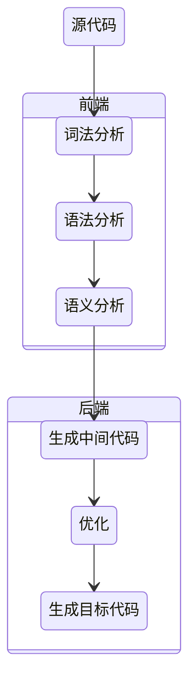
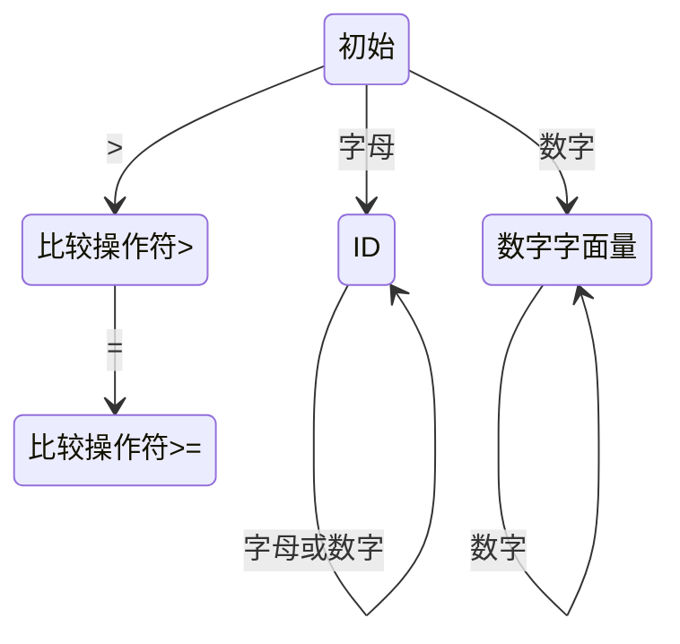

# 编译原理



## 词法分析

### 有限自动机

要实现一个词法分析器，首先需要写出每个词法的正则表达式，并画出有限自动机，之后，只要用代码表示这种状态迁移过程就可以了

age >= 45 的此法解析自动机：



```java
DfaState newState = DfaState.Initial;
if (isAlpha(ch)) {              //第一个字符是字母
    newState = DfaState.Id; //进入Id状态
    token.type = TokenType.Identifier;
    tokenText.append(ch);
} else if (isDigit(ch)) {       //第一个字符是数字
    newState = DfaState.IntLiteral;
    token.type = TokenType.IntLiteral;
    tokenText.append(ch);
} else if (ch == '>') {         //第一个字符是>
    newState = DfaState.GT;
    token.type = TokenType.GT;
    tokenText.append(ch);
}
```

使用正则表达式描述词法：

```js
Id :        [a-zA-Z_] ([a-zA-Z_] | [0-9])*
IntLiteral: [0-9]+
GT :        '>'
GE :        '>='
```

## 语法分析

### 语法规则描述

BNF:

```js
add ::= mul | add + mul
mul ::= pri | mul * pri
pri ::= Id | Num | (add) 
```

扩展BNF（EBNF）：

```js
// 会用到类似正则表达式的一些写法
add -> mul (+ mul)*
```


### 上下文无关文法

上下文无关指的是无论在任何情况下，文法的推导规则都是一样的

描述整数加法与乘法的文法，在解析后，可以形成一颗AST：

```regx
additiveExpression
    :   multiplicativeExpression
    |   additiveExpression Plus multiplicativeExpression
    ;

multiplicativeExpression
    :   IntLiteral
    |   multiplicativeExpression Star IntLiteral
    ;
```
“2+3*5” 的推导过程：
```regx
-->additiveExpression + multiplicativeExpression
-->multiplicativeExpression + multiplicativeExpression
-->IntLiteral + multiplicativeExpression
-->IntLiteral + multiplicativeExpression * IntLiteral 
-->IntLiteral + IntLiteral * IntLiteral
```

### 递归下降

上级文法嵌套下级文法，上级的算法调用下级的算法

消除左递归：

对于加法与乘法的文法：

```js
add -> mul | add + mul   
```

会陷入无限递归，那就引入一个终止条件，也就是空集来终止递归：

```js
add -> mul add'
add' -> + mul add' | ε
```
```js
// EBNP表达
add -> mul (+ mul)* 
```

## Antlr

词法规则文件：

```g4
lexer grammar Hello;  //lexer关键字意味着这是一个词法规则文件，要与文件名相同。

@header {
package antlrtest;
}

//关键字
If :               'if' | '如果';   //可以在程序里用‘如果’来代替'if'
Int :              'int';

//常量
IntLiteral:        [0-9]+;
StringLiteral:      '"' .*? '"' ;  //字符串常量

//操作符
AssignmentOP:       '=' ;    
RelationalOP:       '=='|'>'|'>='|'<' |'<=' ;    
Star:               '*';
Plus:               '+';
Sharp:              '#';
SemiColon:          ';';
Dot:                '.';
Comm:               ',';
LeftBracket :       '[';
RightBracket:       ']';
LeftBrace:          '{';
RightBrace:         '}';
LeftParen:          '(';
RightParen:         ')';

//标识符
Id :                [a-zA-Z_] ([a-zA-Z_] | [0-9])*;

//空白字符，抛弃
Whitespace:         [ \t]+ -> skip;
Newline:            ( '\r' '\n'?|'\n')-> skip;
```

```g4
// 语法分析器
expression
    :   assignmentExpression
    |   expression ',' assignmentExpression
    ;

assignmentExpression
    :   additiveExpression
    |   Identifier assignmentOperator additiveExpression
    ;

assignmentOperator
    :   '='
    |   '*='
    |  '/='
    |   '%='
    |   '+='
    |   '-='
    ;

additiveExpression
    :   multiplicativeExpression
    |   additiveExpression '+' multiplicativeExpression
    |   additiveExpression '-' multiplicativeExpression
    ;

multiplicativeExpression
    :   primaryExpression
    |   multiplicativeExpression '*' primaryExpression
    |   multiplicativeExpression '/' primaryExpression
    |   multiplicativeExpression '%' primaryExpression
    ;
```

```sh
# 生成词法分析器的java源码
antlr Hello.g4
# 生成语法分析器
antlr PlayScript.g4
# 输入表达式查看AST
grun antlrtest.PlayScript expression -gui
```
