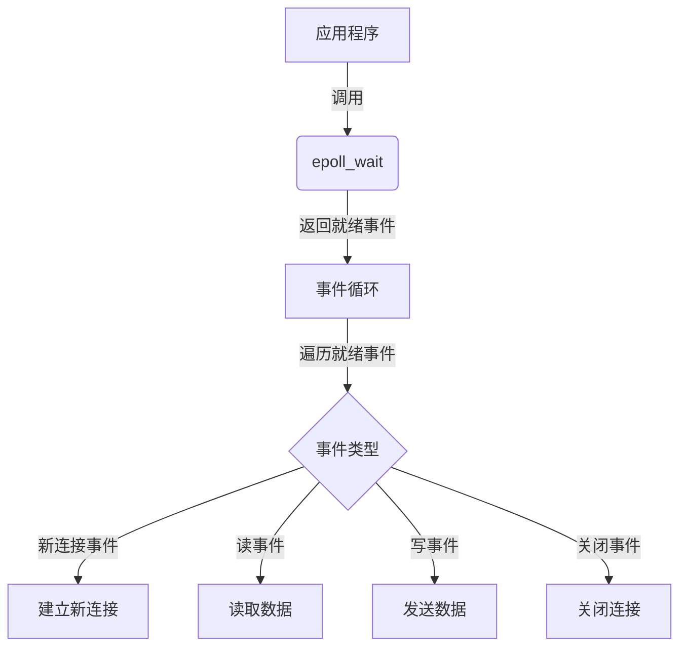

# I/O 模型

## 1. 概述（Overview）

I/O 模型是操作系统、网络协议栈与上层应用在数据交互过程中所遵循的“协作方式”。
它决定了：

* 程序如何等待数据？
* CPU 与内核如何调度资源？
* 多连接如何并行？
* 高并发系统如何避免线程爆炸与内存浪费？

从业务层看，I/O 模型影响系统吞吐、延迟、并发上限。
从工程层看，I/O 模型决定框架选择、架构模式（Reactor/Proactor）及优化路径。
从本质层看，I/O 模型是**如何协调 CPU（计算资源）、线程（执行单元）、内核（数据源）之间的等待关系**。

---

## 2. 本质（Essence）

I/O 模型不是“如何读写数据”，而是：

### **CPU 是主动等待还是被动唤醒？**

不同 I/O 模型的本质区别是：
**等待阶段由谁承担？**

* 同步阻塞：线程自己等
* 同步非阻塞：线程轮询
* I/O 多路复用：线程等待 OS 通知
* 信号驱动：OS 信号通知
* 异步 I/O：内核完成全部操作并回调通知

最终目标：
**减少线程浪费，提升 CPU 利用率，让等待更智能。**

---

## 3. I/O 模型全景图（Panorama）

```
┌──────────────────────────────────────────────┐
│                应用层（APP）                  │
└──────────────────────────────────────────────┘
               ▲              ▲
               │ 回调/事件    │
               │              │
┌──────────────────────────────────────────────┐
│           内核态（Kernel Space）              │
│   网络协议栈 | 驱动 | 中断 | I/O 队列          │
└──────────────────────────────────────────────┘

                 I/O 模型差异 = 谁负责等待？
```

---

## 4. 模型（Models）

```bash
                     ┌───────────────┐
                     │ CPU / 应用线程 │
                     └───────────────┘
                             │
                   ┌─────────▼─────────┐
                   │   IO 抽象模型层    │
                   │ BIO / NIO / AIO   │
                   └─────────┬─────────┘
           ┌──────────────────┼──────────────────┐
           │                  │                  │
    ┌──────▼─────┐    ┌──────▼─────┐    ┌──────▼─────┐
    │ 同步模型   │    │ 多路复用   │    │ 异步模型   │
    └───────────┘    └───────────┘    └───────────┘
             （底层对应 select/poll/epoll）
```

### **模型 1：阻塞 I/O（Blocking I/O）**

* 调用 recv() 后线程一直阻塞直到数据准备好
* 简单但低效
* 适用于小规模连接、简单场景

**优点：** 编程简单
**缺点：** 线程占用 = 连接数，无法扩展

---

### **模型 2：非阻塞 I/O（Non-blocking I/O）**

* recv() 立即返回，不等待
* 程序不断轮询尝试 read
* 高 CPU 消耗

**优点：** 不阻塞线程
**缺点：** 空轮询浪费 CPU，实用性差

---

### **模型 3：I/O 多路复用（poll / select / epoll）**

* 本质：**让 OS 帮你阻塞等待多个连接**
* 应用只在“事件就绪后”才读写
* 现代高并发框架的基础（NIO、Netty、Node.js）

**优点：** 高效、高并发、线程少
**缺点：** 存在事件回调开销与内核复杂性

**主要实现方式**

| 方法         | 核心机制                           | 特点                 | 局限性                               |
| ---------- | ------------------------------ | ------------------ | --------------------------------- |
| **select** | 用户空间传入 fd 集合，内核轮询并返回就绪集合       | 简单，跨平台好            | 文件描述符数量有限（通常 1024），每次调用都需拷贝 fd 集合 |
| **poll**   | 以结构数组形式传递 fd 集合，支持大于 1024 个描述符 | 支持更多 fd            | 每次调用仍需内核-用户空间拷贝，性能随 fd 数量增长下降     |
| **epoll**  | 内核维护 fd 与事件映射表，用户态与内核态共享内存     | 高效，支持成千上万 fd，无重复拷贝 | Linux 专用，复杂度稍高                    |

#### **select/poll 原理**

1. **用户空间构造 fd 集合**

   * 将所有需要监听的文件描述符填入集合或数组
2. **系统调用进入内核**

   * 内核遍历 fd 集合，检查每个 fd 是否就绪（read/write/error）
3. **内核返回结果**

   * 将就绪的 fd 列表返回用户空间
4. **应用遍历就绪 fd**

   * 根据不同事件类型执行对应的读写操作

**性能问题**：

* 每次调用都要**复制 fd 集合**（用户态 ↔ 内核态）
* 当 fd 数量非常大时，遍历开销显著
* **轮询行为导致 CPU 消耗大**

```c
int select(int __nfds, fd_set *__readfds, fd_set *__writefds, fd_set *__exceptfds, struct timeval *__timeout);

int poll(struct pollfd *__fds, nfds_t __nfds, int __timeout);
```

---

#### **epoll 原理与优化**

**核心思想**：由内核维护事件集合，应用只需“注册 fd 与事件”，就绪事件通过共享内存返回，无需每次遍历所有 fd。

1. **epoll_create / epoll_create1**

   * 创建 epoll 实例，内核分配事件表
2. **epoll_ctl**

   * 添加、修改或删除 fd 与感兴趣事件
3. **epoll_wait**

   * 阻塞等待事件就绪，仅返回就绪 fd 列表
   * 未就绪 fd 不返回，避免无效遍历

**性能优势**：

* **共享内存**：fd 与事件映射表位于用户态 + 内核态共享空间
* **O(1) 查询**：只返回有事件的 fd，而非全部轮询
* **高并发能力**：轻松处理上万甚至百万级 fd

```c
int epoll_create(int size);
int epoll_create1(int flags);

int epoll_ctl(int epfd, int op, int fd, struct epoll_event *event);

int epoll_wait(int epfd, struct epoll_event *events, int maxevents, int timeout);
```



### **模型 4：信号驱动 I/O（Signal-Driven I/O）**

* 内核用 SIGIO 通知应用准备好
* 较少使用，复杂，可用性差

**优点：** 线程不阻塞
**缺点：** 信号难用、不可靠、跨平台差

---

### **模型 5：异步 I/O（AIO / IO_uring）**

* **最高级模型**
* 内核不仅通知“准备好”，还完成读写后通知
* 应用只处理完成事件

**优点：** 真正的异步、高吞吐、低延迟
**缺点：** 实现复杂、平台差异大；IO_uring 才真正好用

---

## 5. 能力边界（Capability Boundary）

| 模型   | 内核/应用负责内容 | 优势    | 适用场景              |
| ---- | --------- | ----- | ----------------- |
| 阻塞   | 应用等待 + 读写 | 简单    | 小业务、脚本            |
| 非阻塞  | 应用轮询      | 简单但低效 | 少                 |
| 多路复用 | 内核等待、应用读写 | 并发强   | Web / IM / API 网关 |
| 信号驱动 | 内核信号通知    | 中等    | 少                 |
| AIO  | 内核完成全部流程  | 最强    | 高性能、IO 密集         |

关键区别：
**I/O 多路复用是事件驱动模型的基础；AIO 是最终形态。**

---

## 6. 架构模式关联（Architectural Patterns）

### **Reactor 模式（基于多路复用）**

映射到：

* Java NIO
* Netty
* libevent
* Node.js (libuv)

核心流程：

```
事件就绪 → Select 返回 → 应用层发起 read/write
```

本质：**事件通知 + 应用负责 I/O**

---

### **Proactor 模式（基于 AIO）**

映射到：

* Linux io_uring（未来标准）
* Windows IOCP

核心流程：

```
应用提交IO → 内核执行IO → 回调通知完成
```

本质：**内核负责全部 I/O 操作，回调通知应用处理结果**

未来趋势：Proactor + io_uring 将成为主流。

---

## 7. 性能设计原则（Performance Principles）

1. **不要让线程等待 I/O**（浪费）
2. **不要让线程轮询**（更浪费）
3. **应该让 OS 代理等待**（select/epoll）
4. **最终应该让 OS 完成整个 I/O**（io_uring）

---

## 8. 工程实践 / 落地指南（Engineering Implementation）

### **选择 I/O 模型的最佳实践**

| 场景             | 推荐模型           |
| -------------- | -------------- |
| 低并发脚本、CLI 工具   | Blocking I/O   |
| 普通业务系统（<5w连接）  | NIO / epoll    |
| 高并发高吞吐（>10w连接） | Netty + epoll  |
| 超高性能定制服务器      | io_uring (AIO) |
| Windows 服务     | IOCP           |

---

## 9. 与编程语言的关系（Language Mapping）

| 语言      | I/O 模型           | 框架                |
| ------- | ---------------- | ----------------- |
| Java    | NIO (epoll)      | Netty             |
| Go      | epoll + M:N 调度   | Go Runtime        |
| Node.js | libuv → epoll    | Node              |
| Rust    | tokio → epoll    | 高性能服务             |
| C++     | epoll / io_uring | Muduo, Boost.Asio |

趋势：
**未来框架将逐步从 Reactor（epoll）向 Proactor（io_uring）演进。**

---

## 10. 未来趋势（Future）

### **核心趋势：全面进入 “异步 I/O + 调度器” 时代**

* Linux io_uring = AIO 的真正落地
* 用户态 I/O（DPDK、SPDK）继续增长
* 编程语言将和 I/O 结合成统一的 Runtime（如 Go / Rust tokio）
* Reactor 框架逐步减少，Proactor 成为主流

最终形态：

**“语言 Runtime + 异步内核 + 零拷贝通道” → 极致 I/O 并发**

---

## **总结（Summary）**

I/O 模型体系本质包含三点：

1. **等待责任转移：从线程 → 内核**
2. **事件驱动与回调是并发的核心抽象**
3. **AIO 代表未来方向**

## 关联内容（自动生成）

- [/操作系统/输入输出.md](/操作系统/输入输出.md) 详细介绍了操作系统层面对 I/O 的管理机制，包括程序控制 I/O、中断驱动 I/O、DMA 等，与 I/O 模型的底层实现密切相关
- [/操作系统/linux/内核.md](/操作系统/linux/内核.md) 包含了 Linux 内核对网络系统的管理，特别是 NAPI 和网络包处理机制，与 I/O 多路复用模型在内核层面的实现相关
- [/计算机网络/网络编程.md](/计算机网络/网络编程.md) 探讨了网络编程中的并发模型与 I/O 模式，直接关联到 I/O 模型在实际网络编程中的应用
- [/操作系统/linux/Linux性能优化.md](/操作系统/linux/Linux性能优化.md) 涵盖了网络性能优化的内容，包括网络包的接收与发送流程，与 I/O 模型的性能优化密切相关
- [/计算机网络/链路层.md](/计算机网络/链路层.md) 介绍了链路层协议如以太网的二进制指数回退算法，与 I/O 模型中的异步处理思想相关
- [/操作系统/进程与线程.md](/操作系统/进程与线程.md) 讨论了进程同步问题，与 I/O 模型中同步与异步的概念相关
- [/软件工程/架构/系统设计/高并发.md](/软件工程/架构/系统设计/高并发.md) 涉及高并发系统设计，I/O 模型是实现高并发系统的关键技术基础
