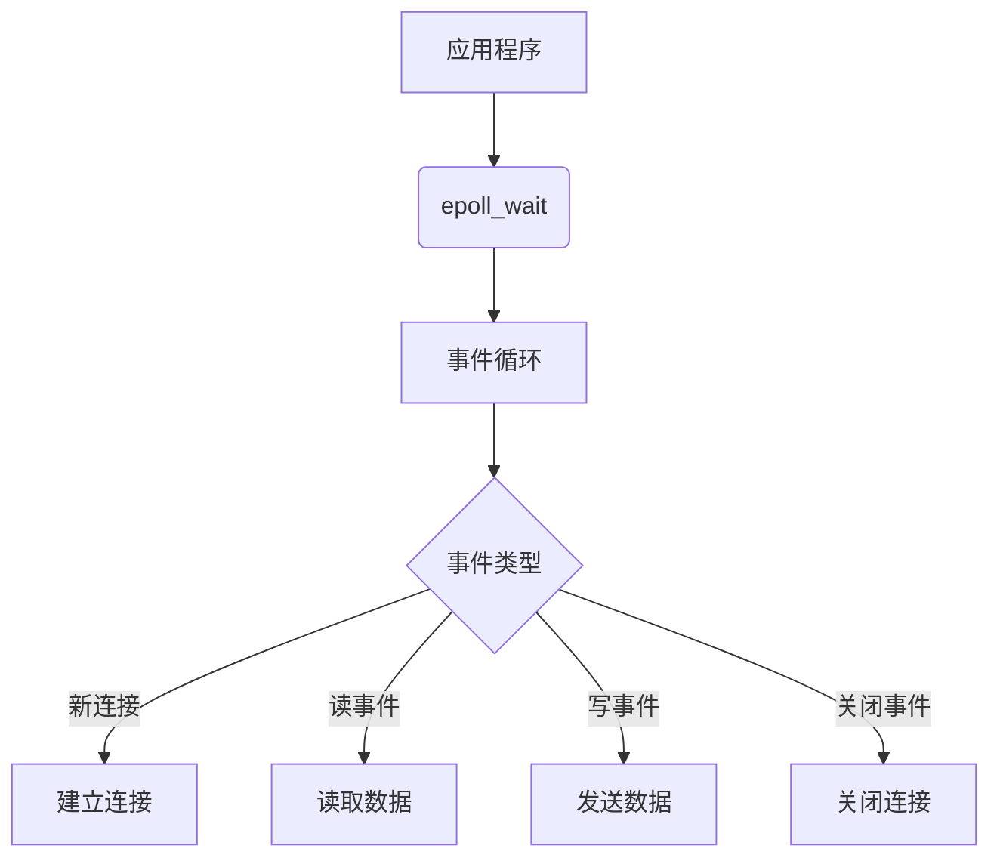
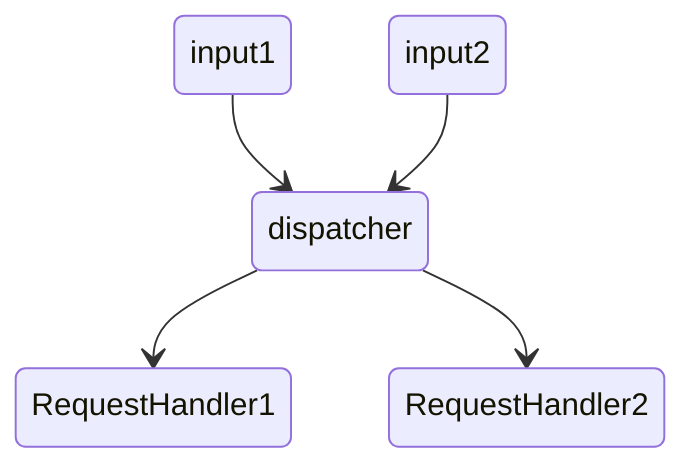

# 网络编程

## 1. 概述

网络编程是构建高并发、高性能系统的核心技术基础。现代网络系统需要在有限资源下处理海量连接，涉及的核心技术包括：

* **I/O多路复用**：通过事件驱动机制同时处理多个连接
* **非阻塞I/O（NIO/AIO）**：避免线程阻塞，提高CPU利用率
* **高效线程模型**：合理调度计算资源，提升吞吐量

本文以系统视角梳理网络编程的演进脉络，从I/O模型、Linux epoll机制、Java NIO、线程模型到生产实践，形成完整知识体系。

---

## 2. 网络编程的本质与核心挑战

### 2.1 本质

网络编程的核心问题是 **高并发场景下的I/O效率**，即如何在有限CPU和内存资源下同时处理海量连接，保证低延迟和高吞吐。

### 2.2 核心挑战

1. **C10K问题**：同时管理上万连接
2. **CPU利用率**：避免轮询和上下文切换带来的浪费
3. **内存拷贝效率**：减少用户态与内核态之间的数据拷贝

---

## 3. I/O模型演进与体系化理解

### 3.1 I/O模型分类

| 模型      | 阻塞类型     | 通知机制       | 特点         | 适用场景          |
| ------- | -------- | ---------- | ---------- | ------------- |
| BIO     | 阻塞       | 同步等待       | 简单、每连接占线程  | 低并发、短连接       |
| NIO     | 非阻塞      | 轮询Selector | 单线程管理多连接   | 高并发、长连接       |
| I/O多路复用 | 非阻塞/事件驱动 | 事件通知       | 一线程处理多连接   | 高并发网络编程主流     |
| AIO     | 非阻塞      | 异步回调       | 系统完成I/O后通知 | 文件I/O、高并发特定场景 |

### 3.2 同步/异步 vs 阻塞/非阻塞

* **同步/异步**：关注结果返回机制
* **阻塞/非阻塞**：关注调用线程是否挂起

> 理解区别是选择合适I/O模型的关键。

---

## 4. Linux epoll机制

### 4.1 核心原理

* **事件驱动**：只处理就绪事件
* **内存映射**：减少内核态与用户态拷贝
* **边缘触发**：提高效率，降低无效轮询

### 4.2 性能优势对比

| 特性    | select | poll | epoll   |
| ----- | ------ | ---- | ------- |
| 最大连接数 | 1024   | 系统限制 | 系统限制    |
| 时间复杂度 | O(n)   | O(n) | O(1)    |
| 内存拷贝  | 每次轮询   | 每次轮询 | mmap共享  |
| 触发方式  | 水平触发   | 水平触发 | 水平/边缘触发 |

### 4.3 应用示意



---

## 5. Java NIO体系

### 5.1 核心概念

| 组件       | 作用                       |
| -------- | ------------------------ |
| Buffer   | 数据容器，支持原始类型，减少系统调用       |
| Channel  | 类似文件描述符，支持双向读写           |
| Selector | 单线程管理多个Channel，实现I/O多路复用 |

### 5.2 Reactor与Proactor模式

* **Reactor（响应式）**

  * 事件到来由Reactor分发
  * 用户处理器完成数据读写与业务逻辑

* **Proactor（主动式）**

  * 系统异步完成I/O
  * 用户处理器处理完成事件



---

## 6. 线程模型演进

### 6.1 经典演进路径

1. **单线程模型**：简单但无法利用多核
2. **多线程模型（BIO风格）**：每连接一个线程，线程开销大
3. **线程池模型**：线程复用降低开销
4. **主从Reactor模型**：MainReactor处理连接，SubReactor处理I/O，线程池处理业务

### 6.2 高性能案例

* **Redis**

  * 6.0前：单线程 + epoll
  * 6.0后：多线程I/O，提高吞吐

* **Netty**

  * EventLoop机制绑定线程与Channel
  * 任务调度和异步执行能力强

```java
for (;;) {
    Runnable task = takeTask();
    if (task != null) task.run();
}
```

---

## 7. 高并发网络实践与优化

### 7.1 I/O与线程选择

| 类型    | 描述         | 场景       |
| ----- | ---------- | -------- |
| NIO   | Java跨平台非阻塞 | 通用高并发    |
| Epoll | Linux特化优化  | Linux高并发 |
| OIO   | 阻塞I/O      | 阻塞场景     |

### 7.2 C10K问题解决策略

* **应用层**：NIO + 合理线程模型
* **系统层**：提升文件描述符限制 + 零拷贝 + 高效I/O多路复用

### 7.3 内存与连接优化

* 使用DirectByteBuffer减少拷贝
* 连接池管理连接，合理超时
* 批量操作与事件驱动降低系统调用开销

---

## 8. 核心知识回顾

1. **I/O模型选择**：根据业务特性选择适合的模型
2. **epoll优势**：事件驱动、低开销、高并发首选
3. **NIO抽象**：跨平台非阻塞编程统一接口
4. **线程模型演进**：从单线程到主从Reactor，提高多核利用率

---

## 9. 未来趋势

* **异步化**：更多框架采用异步非阻塞
* **智能化**：运行时自动调优和资源管理
* **高层抽象**：降低开发复杂度，实现易用性与性能平衡

> 核心原则：**用最小资源开销处理最大数量的连接**。

---

## 10. 相关文档参考

* [操作系统/输入输出.md](/操作系统/输入输出.md)
* [编程语言/JAVA/高级/NIO.md](/编程语言/JAVA/高级/NIO.md)
* [中间件/数据库/redis/Redis.md](/中间件/数据库/redis/Redis.md)
* [编程语言/JAVA/框架/netty/netty.md](/编程语言/JAVA/框架/netty/netty.md)

