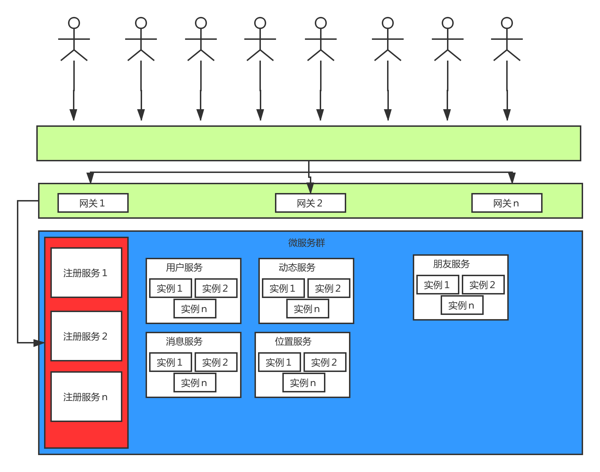

# 基于位置的网络社交平台分析与设计

## 摘要

为了给用户提供一个网络社交平台，针对社交平台可用性要求高，数据实时性强等特点，设计的一个基于位置服务网络设计平台系统。

## 正文

### 绪论

网络的拓展、技术的推进，让博客（Blog）、维基（Wiki）、社会性网站（SNS）、微信和易信等新移动网络社交平台得以广泛应用，Web2.0技术逐渐改变了人们的交往形式以及创造数据和共享数据的方式。本系统利用当前较为流行的微服务架构，辅之以LBS(基于位置服务)网络社交功能，满足用户的社交需求。

### 背景

电话和手机用了15年时间才积累到1亿用户，但Facebook做到这点只用了9个月。越来越多的人被在线社交网络连接起来，并且这个网络好像还在呈指数增长。但现实情况是，社交网络很少增加我们的联系人数量。社交网络上大部分的联系人我们以前就见过。我们已经在线下和这些人发生联系了，社交网络只是简单地让这种联系可视化。例如，我们经常和上学时的老朋友联系，并通过墙贴（wall posts）联络感情。但是一旦建立联系，我们很少进一步交流，时间长了我们会忘记这 个联系的存在。事实上，Facebook的用户与50%的 联系人从不发生联系。当我们研究人们如何在社交网络上互动时，我们发现大多数互动发上在 我们与联系人中很小一部分群体之间。

## 系统分析

### 需求分析

#### 系统需求

本系统是一个高度自治的平台系统，设计理念是少人工干预甚至不需要人工干预。除非是在需要人工介入进行有害信息过滤，否则整个将可以完全自治。

系统将用户分为

- 系统用户
- 普通用户

系统用户对系统的功能有限，除了能新增用户，查看系统数据报表外，有害信息删除，并无太多功能

普通用户是本系统的核心用户，功能如下：

- **安全管理**。实现用户登录注册、注销、修改密码等,用户进入系统需登录验证,无权限不可登录
- **个人信息管理**。登陆之后用户可以对自己的信息进行修改。
- **好友管理**。用户可以根据特定的规则搜索添加好友，以及删除好友。
- **好友动态**。用户可以在该模块当中，发布动态以及获取到好友发布的动态。
- **位置公布**。用户可以发布自己的当前实时位置，并能在系统用户地图查看本系统所有用户，添加其为好友。
- **即时消息通信**。用户可对好友发起即时通信，好友也能与用户即时通信。

#### 基础架构

- 开发环境规划

搭建私服资源，本系统将拆分为多个微服务，每个微服务交由独立的团队实现，版本控制工具将统一使用git,所以将提供一个maven私服以及一个内部git-lab服务器供各个团队使用，maven私服将上传公共模块。同时，项目将使用jenkins实现代码push后自动进行CI(持续集成),自动化部署到Docker服务器。

#### 系统用例及用例文档

#### 安全管理

- 登陆

用户服务接口接收到用户名以及密码等参数，查询数据库进行对比，如果身份验证通过返回登陆成功，否则返回登陆失败。

- 注销

当用户处于登陆状态时，向用户服务发送一个注销的请求，用户服务清除用户相关登陆凭证，返回注销成功。

- 修改密码(密码找回)

当用户忘记自己的密码时，可向用户服务发起重置密码的请求，同时附带其绑定的邮箱或手机号等参数，系统将会发送向其邮箱或者手机发送验证码，用户接收到验证码后再向用户服务发送新密码，验证码等参数，用户服务验证通过后即重置该用户的密码

#### 个人信息管理

- 个人资料管理

用户登陆之后，可向用户服务发送修改个人信息的请求，包括你昵称，性别，年龄，地区等。

#### 好友管理

- 添加好友

用户可向朋友服务发起一个查询用户的请求，查询条件可包括昵称，性别，年龄，地区等不同条件组合，朋友服务根据用户所提供的条件返回查询结果。

- 好友请求管理

用户登陆之后，可向朋友服务拉取全部该用户的朋友申请信息，用户可对请求进行同意或拒绝。若同意，则消息服务以用户的身份向申请用户发送一条问候信息，若不同意，则消息服务以系统的身份向申请用户发送一条其申请被拒绝的消息。

- 删除好友

用户可向朋友服务发起接触与某个用户好友关系的请求，朋友服务验证请求合法性后删除两个用户的联系，并返回删除成功。

#### 好友动态

- 动态发布

用户经过身份认证之后，可向动态服务发起发布动态的请求，附带动态内容以及其他一些附加参数，动态服务接受后，发布其动态，并返回发布成功。

- 动态删除

用户经过认证之后，可向动态服务发布删除其某条动态的请求，附带动态ID,动态服务验证其请求合法性成功后，删除其动态，返回删除成功。

- 动态拉取

用户经过认证之后，可向动态服务发起拉取其朋友包括自己的动态请求，动态服务返回最近一段时间动态列表。

#### 位置服务

- 位置发布

用户登陆之后，可向位置服务发布发布自己所在位置的请求，附带经纬度等附加参数，位置服务存储其位置数据，返回发布成功。

- 位置共享

用户发布自己的位置之后，可向位置服务申请拉取其附近的用户数据，位置服务返回其附近的用户列表。

- 位置删除

用户发布位置信息之后，可向位置服务申请删除其位置数据，位置服务删除其位置数据，返回删除成功。

####　消息服务

- 消息发送

用户经过认证之后，可向消息服务发送朋友消息，附带朋友ID等参数，消息服务接受请求之后，验证合法性，若接受方不在线，则服务器存储其消息。若接受方在线，则向接受方转发消息。

- 消息拉取

用户登陆之后，可向消息服务发起拉取所有未读消息请求，消息服务返回该用户的所有未读消息列表。

### 设计

#### 系统设计

- 整体设计

系统采用微服务架构，采取前后端分离模式开发，本项目不提供任何视图表现，只暴露相应的HTTP接口给外界，所以前端可以使用如不仅限于web/android/ios等技术实现。

##### 详细架构

- 反向代理

系统前端通过使用主从nginx实现对请求的转发,nginx将会把请求转发到网关，通过主从部署架构，实现服务高可用。

- 统一网关

所有从nginx到来的请求，都将经过网关，网关将统一对请求进行认证鉴权，同时网关根据系统管理员配置的规则，再次将请求转发到各个微服务，此时各个微服务将不再需要做用户认证等工作，提高了代码复用率。

- 服务发现与注册

系统将提供多台注册服务器，这些服务器也通过主从架构来实现高可用。同时当各个微服务启动时，其会把自身有关的诸如IP端口等注册到服务器上，其他微服务包括网关等都可以从注册服务器拉取相关微服务的信息，从而实现请求转发或者服务间调用。

- 服务调用

各个微服务之间可能会有互相调用的请求，比如朋友服务可能需要调用消息服务发送消息，那么服务调用将会采用统一的方式，由于各个微服务实例可能不止一个，那么服务调用将会可以采用透明的方式对调用进行负载均衡以及当服务实例死亡之后进行请求熔断，避免造成微服务雪崩效应。

- 服务架构

微服务内部的架构相对来说，实现方式比较自由，只要其暴露一个规定的接口即可。这里我们使用传统的三层架构来实现各个微服务。

**表现层**：接收外部请求参数，进行参数校验，转发到业务层。

**业务层**：接收表现层传递的参数，进行一些较为复杂的业务逻辑处理，并将其转化为对数据访问层的请求。

**数据访问层**：每个微服务都由属于自己的数据库，该层提供统一的方式访问数据，可以使用ORM等技术操作关系型数据库，也可以使用非关系型数据库。

- 系统整体架构图

##### 部署架构

- 各微服务独立部署

各服务交由团队自由开发，但进行统一管理，各个团队负责自己的微服务，并完成服务开发/测试/部署

- 服务可持续交付

实现微服务架构的保障就是能够严格执行服务的可持续交付, 服务可持续交付[6]指的是每个服务交付的流程具备持续性, 也就是说一个微服务应用从开发完毕到部署发布中间的过程是一个可持续的过程, 并且这个微服务应用可能存在多个版本不同运行状态的服务实例, 它们需要集成到现有的运行环境中稳定提供服务,服务可持续交付常常包括几个方面:开发、单元测试、构建、部署、集成、集成测试、发布, 从基础设施环境来看又包含几个部分:代码版本管理、构建管理、部署管理、集成管理、测试管理、发布管理、运维监控管理.

## 总结

社交网站同质化验证，如何在同类产品中脱颖而出，需要网站主题找到一个合适的方向，本文提供了一个基于位置服务的参考方向，不失为一种新商业化尝试。

## 参考文献

[1]申志强. 基于J2EE的图书管理系统设计研究[J] 四川图书馆学报 2019,(05),26-30

[２]蒋勇.基于微服务架构的基础设施设计[J].软件,2016,37(05):93-97

