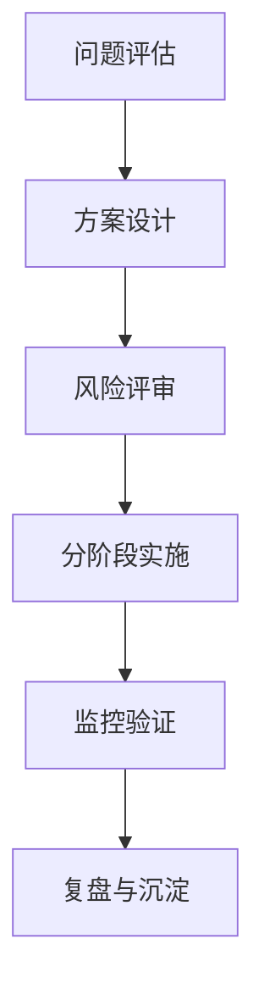

# 架构重构

*高抽象度·体系化·可长期沉淀的架构认知模型*

---

## 概述

架构重构是大型软件系统在生命周期中用于 **恢复、提升或重建系统结构健康度** 的核心机制。
其目标不是短期解决功能问题，而是为系统提供 **可持续演进能力**，抵御复杂度增长、业务不确定性和技术熵增。

从本质上看，架构重构属于 **组织性工程活动**：

* 以结构优化为手段
* 以系统可演进性为根本价值
* 以治理体系为支撑
* 以渐进式变更策略控制风险

架构重构的核心挑战不是技术，而是 **对复杂系统的理解、控制与引导能力**。

---

## 本质

架构重构的本质是：

> **在保持系统外部行为稳定的前提下，通过结构调整恢复系统的秩序、稳定性与可演进性。**

其底层原理包括：

### 系统复杂性管理

* 任何足够复杂的系统都会不断积累“架构熵增”
* 架构重构是对熵增进行逆向调节的系统性手段

### 结构与行为解耦

* 架构重构不直接面向功能，而面向结构
* 通过内部结构优化保持外部功能稳定

### 稳定性优先

* 结构优化以不破坏行为稳定性为预设
* 因此必须采用 **渐进式、可逆、可观测** 的调整策略

### 组织与技术协同

* 架构重构的难度更多来源于组织协作，而非技术
* 系统边界等于组织边界，重构必然涉及跨团队协调

---

## 核心概念模型（Core Concepts）

### 架构健康度（Architecture Health）

用于描述系统结构的可理解性、扩展性与演进能力。

### 架构负债与架构腐化（Debt & Erosion）

系统长期迭代导致结构退化，使复杂性超过可控阈值。

### 渐进式重构（Incremental Refactoring）

通过一系列小型变更逐步实现结构优化，与“大爆炸式重写”相反。

### 结构可逆性（Reversibility）

重构方案具备回退能力，是保障风险可控的核心机制。

### 结构过渡态（Transitional Architecture）

旧架构到新架构之间的临时结构形态，是渐进式重构的关键支撑点。

---

## 架构重构模型（Architecture Refactoring Model）

> 以下模型用于刻画一个系统从识别问题到结构演进的整体过程与逻辑。

### 架构重构生命周期模型（ARL：Architecture Refactoring Lifecycle）

模型要点：

* 关键不是一次性重构，而是维持可演进能力
* 过渡态架构是所有渐进式变更的基础
* 观测是判断是否继续推进的依据

---

## 能力体系（Capability System）

架构重构的能力体系可以划分为以下四大能力域：

### 问题洞察与识别能力

* 技术债务识别
* 架构腐化模式识别
* 性能瓶颈发现
* 模块耦合度分析
* 可扩展性边界识别

### 重构设计与规划能力

* 重构目标与边界定义
* 过渡态架构设计
* 新旧架构兼容策略
* 数据迁移与流量切换设计
* 重构路线图规划

### 风险控制能力

* 变更可逆性设计
* 风险识别与分级
* 回滚策略
* 监控/观测体系构建
* 渐进式验证（灰度、影子流量、A/B 测试）

### 协同治理与组织驱动力

* 与业务方对齐价值
* 跨团队时间与边界协调
* 上下游系统联动治理
* 重构节奏管理
* 沟通机制与决策机制建设

---

## 架构治理体系（Governance System）

架构重构的成败决定于是否有治理体系支撑，而不仅是设计方案。

### 架构重构治理流程

### 治理结构的关键维度

* 决策机制（架构委员会 / 技术治理小组）
* 风险管理机制（评审、回滚、演练）
* 跨团队协作机制（上下游联动）
* 透明度机制（可视化看板、指标与状态反馈）

---

## 边界与生态（Boundary & Ecosystem）

架构重构处理三类边界：

### 技术边界

* 系统间耦合
* 数据耦合
* 共享基础设施依赖

### 组织边界

* 团队结构与协作方式影响模块边界
* 康威定律决定系统演进节奏

### 业务边界

* 核心链路 vs 边缘功能
* 业务高峰期 vs 低峰期
* 价值优先级影响重构节奏

---

## 重构类型体系（Taxonomy）

架构重构可以根据目标与方式分类：

### 按问题类型分类

* 性能重构
* 可维护性重构
* 可扩展性重构
* 稳定性重构
* 领域边界重构

### 按实施方式分类

* 渐进式重构
* Big Rewrite（高风险大重写）
* 模块解耦式重构
* 架构替换式重构（如单体 → 微服务）

### 按结构层级分类

* 代码结构层
* 模块/组件层
* 系统架构层
* 组织结构层

---

## 方法论与实施策略

### 演进式架构重构策略

强调小步快跑、可观测、可回滚。

核心机制：

* 功能开关
* 阶段性替换
* 渐进式迁移（数据库 / 流量）
* 影子发布 / 灰度流量

### 路线图驱动策略

适用于长期、复杂度高的重构计划。

路线图结构包含：

* 阶段目标
* 阶段接口与依赖
* 关键风险节点
* 里程碑与可观测指标

### 模块化重构策略

目标是降低耦合、提升系统结构清晰度。
原则：

* 稳定边界优先调整
* 核心模块优先治理
* 依赖反转 / 模块隔离 / 防腐层构建

---

## 量化评估体系（Metrics System）

以下量化指标用于衡量重构效果与过程质量：

### 技术指标

| 指标类型 | 示例               |
| ---- | ---------------- |
| 性能   | RT、吞吐量、错误率       |
| 可维护性 | 模块圈复杂度、依赖数量、变更成本 |
| 可扩展性 | 横向扩展能力、模块边界清晰度   |

### 业务指标

| 指标类型 | 示例         |
| ---- | ---------- |
| 稳定性  | MTTR、失败率   |
| 效率   | 发布频率、开发周期  |
| 成本   | 资源利用率、运维成本 |

### 过程指标

* 重构阶段完成率
* 风险处置效率
* 团队协作满意度
* 回滚发生次数

---

## 演进趋势

### 云原生架构的全面重构

* 从自运维服务 → 自动化治理
* 从静态架构 → 动态可观测

### 从同步调用向事件驱动演进

* 降低系统耦合
* 提升弹性与可扩展性

### 服务网格与零侵入治理

* 流量治理能力从应用层剥离
* 重构从代码问题转向平台化问题

### 架构智能化治理

* 基于指标自动识别架构腐化
* 智能化自动化修复建议

---

## 选型与决策框架（Selection Framework）

架构重构是否值得做，取决于下列决策矩阵：

### 决策矩阵

| 维度   | 关键问题           |
| ---- | -------------- |
| 价值   | 重构能带来长期收益吗？    |
| 风险   | 对业务连续性的影响？     |
| 可行性  | 是否具备组织能力与技术能力？ |
| 替代方案 | 是否存在更低成本路径？    |

### 决策流程

1. 明确定义问题而非解决方案
2. 衡量价值 vs 成本
3. 评估变更可逆性
4. 基于风险分级选择渐进式方案

---

## 总结

架构重构不是技术优化，而是 **系统演进能力的建设过程**。
它依赖三类稳定的长期认知：

* 系统复杂性与熵增不可避免
* 架构演进必须可逆、可观测、渐进式
* 技术结构与组织结构相互影响

当架构重构转变为：

* 有模型可依
* 有能力体系支持
* 有治理机制保障
* 有指标体系衡量
* 有长期演进路线图引导

它就从"技术活动"升级为 **系统性治理工程**，成为组织长期软件竞争力的一部分。

## 关联内容（自动生成）

- [/软件工程/软件设计/代码质量/代码重构.md](/软件工程/软件设计/代码质量/代码重构.md) 架构重构与代码重构密切相关，代码重构是实现架构健康的重要手段，二者共同构成系统的重构治理体系
- [/软件工程/架构/架构治理.md](/软件工程/架构/架构治理.md) 架构重构的成败决定于是否有治理体系支撑，架构治理为重构提供了组织级策略支持和风险控制机制
- [/软件工程/架构/演进式架构.md](/软件工程/架构/演进式架构.md) 演进式架构强调系统的可演进性和适应性，与架构重构的目标一致，都是为了保持系统的长期健康和可持续发展
- [/软件工程/软件设计/代码质量/整洁代码.md](/软件工程/软件设计/代码质量/整洁代码.md) 架构重构是整洁代码理念在系统层面的扩展，从代码整洁到架构整洁的系统性治理
- [/软件工程/软件设计/代码质量/编码规范.md](/软件工程/软件设计/代码质量/编码规范.md) 编码规范是架构重构的基础，良好的编码规范有助于降低重构难度和风险
- [/软件工程/架构/架构.md](/软件工程/架构/架构.md) 该文档阐述了架构的基本概念和治理原则，是理解架构重构在整体架构体系中作用的基础
- [/软件工程/架构/架构师.md](/软件工程/架构/架构师.md) 架构重构通常由架构师主导和规划，涉及对系统结构的深度理解和重构决策
- [/软件工程/架构模式/分层架构.md](/软件工程/架构模式/分层架构.md) 分层架构是常见的架构重构目标模式之一，有助于降低系统复杂度和提升可维护性
- [/软件工程/架构模式/响应式架构.md](/软件工程/架构模式/响应式架构.md) 响应式架构作为现代架构模式之一，可能是架构重构的目标架构风格
- [/软件工程/微服务/微服务.md](/软件工程/微服务/微服务.md) 从单体架构向微服务架构的重构是常见的架构重构实践之一
- [/软件工程/架构/系统设计/架构设计.md](/软件工程/架构/系统设计/架构设计.md) 架构重构需要遵循架构设计的原则和方法，是架构设计的演进和优化过程
- [/软件工程/架构/技术选型.md](/软件工程/架构/技术选型.md) 架构重构过程中往往伴随着技术选型的重新评估和决策
- [/软件工程/架构/系统设计/可观测性.md](/软件工程/架构/系统设计/可观测性.md) 架构重构过程中需要完善的可观测性体系来验证重构效果和保障系统稳定性
- [/软件工程/架构/系统设计/故障管理.md](/软件工程/架构/系统设计/故障管理.md) 架构重构需要考虑故障管理机制，确保重构过程中的系统稳定性
- [/软件工程/软件设计/软件开发本质.md](/软件工程/软件设计/软件开发本质.md) 理解软件开发本质有助于更好地认识架构重构的必要性和价值
- [/软件工程/DevOps.md](/软件工程/DevOps.md) 架构重构需要与DevOps流程相结合，确保重构过程的自动化和可控性
- [/软件工程/架构/中台.md](/软件工程/架构/中台.md) 中台架构设计与重构有密切关系，涉及组织和系统边界的重新定义
- [/软件工程/架构/Web前端/前端工程化.md](/软件工程/架构/Web前端/前端工程化.md) 前端架构重构是整体架构重构的重要组成部分
- [/软件工程/架构/系统设计/缓存.md](/软件工程/架构/系统设计/缓存.md) 缓存策略是架构重构中需要考虑的重要非功能性需求
- [/数据技术/数据架构.md](/数据技术/数据架构.md) 数据架构重构是系统架构重构的重要组成部分，需要同步考虑数据层面的重构策略
