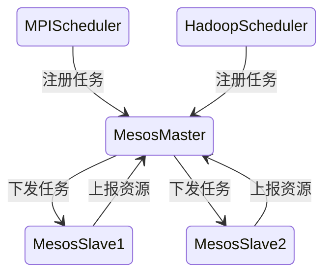
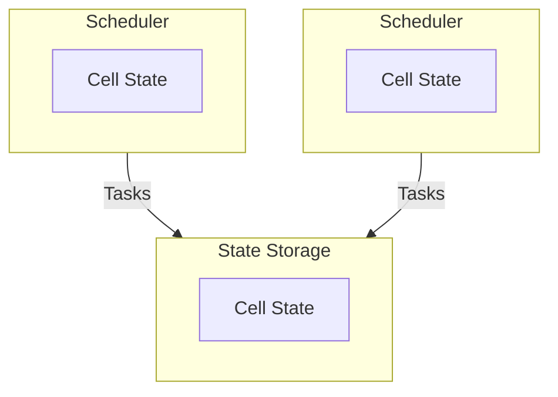

# 分布式系统

> 分布式系统是一种将多个独立计算节点通过网络协作组成统一整体的系统架构，它的核心目标是**资源共享、性能扩展与高可用性**。
> 在现代互联网体系中，几乎所有大型系统（搜索引擎、电商、支付、云计算平台）都构建在分布式架构之上。

---

## 一、概览

分布式系统通常由以下几个主要部分构成：

* **存储系统**

  * GFS、HDFS、Ceph
* **计算系统**

  * 批处理：MapReduce、Spark
  * 流处理：Storm、Flink
* **节点关系**

  * 主从式（Master-Slave）
  * 对等式（Peer-to-Peer）

中间件作为通信与协调的核心层，连接了整个系统的各个节点：

---

## 二、网络与通信基础

分布式系统运行在计算机网络之上。网络的可靠性与延迟直接影响系统的一致性、可用性与性能。

### 1. 网络硬件

* **以太网 (Ethernet)**：局域网通信的基础。
* **互联网 (Internet)**：连接分布式节点的全球通信网络。

### 2. 网络协议与服务

* **面向连接（TCP）** vs **无连接（UDP）**
* **数据流（Stream）** vs **数据包（Datagram）**
* **远程调用（RPC）**：分布式系统通信的核心抽象，常见实现包括 gRPC、Thrift。

---

## 三、接入与负载均衡层

前端层和接入层负责请求的分发与入口管理。

### 1. 前端技术

* MVC 框架（Spring MVC、Django）
* WebSocket、RESTful API、GraphQL

### 2. 反向代理

* **Nginx**：HTTP 反向代理、负载均衡、缓存。
* **Varnish**：高性能 Web 缓存。

### 3. 负载均衡

* **DNS 轮询**（L3 层）
* **硬件负载均衡（F5）**
* **软件负载均衡（LVS、HAProxy、Nginx）**

负载均衡的核心目标是 **将请求均匀分发到后端节点**，避免单点瓶颈。

---

## 四、分布式中间件

中间件是分布式系统的“胶水层”，承担节点间通信、数据一致性、任务协调、异步传递等关键职责。

### 1. 分布式协调与同步

* **一致性协议**

  * Paxos、Raft、ZAB、ARK、NPC
* **典型实现**

  * Chubby（Google）
  * Zookeeper（Apache）
* **主要功能**

  * 配置管理、分布式锁、服务注册发现、选主、心跳监测。

### 2. 数据访问中间件

* **客户端代理**

  * Sharding-JDBC
* **服务端代理**

  * MyCat、Cobar
* **目标**

  * 数据分片、路由、负载均衡、读写分离。

### 3. 分布式服务调用（RPC）中间件

* Dubbo、Dubbox、gRPC、Thrift、Motan
* **特征**

  * 服务注册中心（Zookeeper、Nacos）
  * 负载均衡与容错（Failover、Failfast）
  * 序列化协议（Protobuf、JSON、Avro）

### 4. 分布式消息中间件

* Kafka、RabbitMQ、RocketMQ、Pulsar
* **应用场景**

  * 异步化、削峰填谷、系统解耦。

### 5. 分布式链路追踪中间件

* Dapper（Google）
* Zipkin、SkyWalking、Pinpoint、鹰眼
* **作用**

  * 调用链监控、性能分析、全链路追踪。

---

## 五、分布式存储系统

### 1. 分布式文件系统

业界代表：

* GFS（Google File System）
* HDFS（Hadoop Distributed File System）
* TFS（淘宝文件系统，适用于海量小文件）

**设计要点：**

* 传输模式（上传/下载/远程访问）
* 命名与目录层次
* **命名透明性**

  * 位置透明：逻辑路径与物理位置解耦。
  * 位置独立：文件迁移不影响访问路径。
* **文件共享语义**

  * 顺序一致性、写后读一致性。

---

### 2. NoSQL 数据库

NoSQL 以 **高可用与扩展性** 为目标，通过牺牲部分 ACID 特性（尤其是 C）实现 CAP 平衡。

| 类型    | 特征                   | 代表系统                      |
| ----- | -------------------- | ------------------------- |
| 键值型   | 高速缓存、简单查询            | Redis、LevelDB、Tair、Dynamo |
| 列存型   | 按列存储、高效聚合            | Bigtable、HBase、Cassandra  |
| 文档型   | 灵活的 schema-free 数据模型 | MongoDB、CouchDB、RethinkDB |
| 搜索引擎型 | 全文索引与查询优化            | ElasticSearch、Solr        |
| 图数据库  | 图结构关系与遍历             | Neo4j、JanusGraph          |
| 时序数据库 | 时间序列数据采集与分析          | InfluxDB、Prometheus TSDB  |

---

### 3. NewSQL 数据库

NewSQL 融合了传统关系型数据库与 NoSQL 的优点，兼顾 **一致性与可扩展性**。

代表系统：

* Google Spanner / F1
* TiDB
* OceanBase
* CockroachDB

关键特性：

* 分布式事务（TrueTime、两阶段提交）
* 全局一致性快照
* 水平扩展与自动分片

---

## 六、分布式任务调度

分布式任务调度系统是集群资源管理与作业分配的核心组件。

### 1. 单体调度（Centralized Scheduler）

一个主节点负责所有调度决策：

* 统一资源视图
* 调度器单点问题突出
* 示例：早期 Hadoop YARN

### 2. 两层调度（Two-Level Scheduler）

将调度职责分为两层：

* 第一层：集群资源管理（Mesos Master）
* 第二层：框架级调度（Hadoop Scheduler、MPI Scheduler）

### 3. 共享状态调度（Shared-State Scheduler）

每个调度器维护全局状态视图，通过状态存储共享集群信息。

* 可扩展性强
* 更快的任务响应
* 示例：Kubernetes 调度架构

---

## 七、分布式系统设计思想

### 1. 云化与虚拟化

* 虚拟机、容器（Docker）
* 资源池化与弹性伸缩

### 2. 一切皆可能失败

* 容错设计：多节点、副本、心跳检测
* 冗余与Failover机制

### 3. 水平扩展（Scale Out）

* 数据：分片（Sharding）
* 服务：集群、负载均衡
* 数据中心：异地多活、灾备

### 4. 简化与解耦

* 减少组件依赖
* 异步化削峰填谷
* 最终一致性（BASE模型）

### 5. 微服务化与可观测性

* 服务粒度拆分
* 链路追踪、日志、指标、告警三位一体

---

## 八、大型互联网架构共性分析

| 层级   | 特征                   | 实现                    |
| ---- | -------------------- | --------------------- |
| 分层设计 | 存储层、服务层、接口层、分析层      | 典型三层/四层架构             |
| 集群管理 | 容器化、资源池化、独立调度系统      | Kubernetes、Mesos      |
| 存储层  | 文件系统 + 数据库 + 缓存      | HDFS、MySQL、Redis      |
| 服务层  | RPC 框架 + 注册中心 + 消息队列 | Dubbo、Kafka、Zookeeper |
| 数据分析 | 实时 + 离线分离            | Hadoop、Spark、Flink    |
| 可观测性 | 监控、日志、追踪、报警体系        | Prometheus、SkyWalking |

---

## 九、总结

分布式系统是一门跨越 **计算机网络、操作系统、数据库、系统架构** 的综合学科。
它的核心挑战包括：

* **一致性**：CAP、Paxos、Raft
* **可用性**：故障检测、容错、自动恢复
* **扩展性**：水平扩展、负载均衡
* **性能**：异步化、并行计算
* **可观测性**：链路追踪与监控体系

## 关联内容（自动生成）

- [/软件工程/架构/系统设计/分布式/分布式理论.md](/软件工程/架构/系统设计/分布式/分布式理论.md) 深入探讨了CAP定理、BASE理论等分布式系统的基本理论，与本文的原理和架构设计密切相关
- [/软件工程/架构/系统设计/分布式/分布式共识算法.md](/软件工程/架构/系统设计/分布式/分布式共识算法.md) 详细介绍了Paxos、Raft等共识算法，是实现分布式系统一致性的核心技术基础
- [/软件工程/架构/系统设计/分布式/分布式事务.md](/软件工程/架构/系统设计/分布式/分布式事务.md) 涵盖两阶段提交、TCC模式、Saga模式等多种分布式事务处理方案，解决分布式环境下的数据一致性问题
- [/软件工程/架构/系统设计/分布式/分布式数据.md](/软件工程/架构/系统设计/分布式/分布式数据.md) 详细分析了分布式数据存储、复制和分区策略，是对分布式系统中数据管理的具体实现
- [/软件工程/架构/系统设计/分布式/分布式一致性与协调机制.md](/软件工程/架构/系统设计/分布式/分布式一致性与协调机制.md) 详细分析了分布式系统中的协调挑战和协调机制的演化趋势，包括分布式锁、Session管理等内容
- [/软件工程/架构/系统设计/分布式/分布式一致性系统.md](/软件工程/架构/系统设计/分布式/分布式一致性系统.md) 深入探讨了分布式一致性系统的本质、三层本质、从问题到模型的推导链，与本文的理论部分形成呼应
- [/中间件/数据库/分布式数据库.md](/中间件/数据库/分布式数据库.md) 分布式数据库是分布式系统理论在数据存储领域的具体实现，涉及分片、副本复制、一致性协议等核心技术
- [/中间件/消息队列/消息队列.md](/中间件/消息队列/消息队列.md) 消息队列在分布式系统中解决服务间通信、解耦、异步处理等问题，是构建可靠分布式系统的关键组件
- [/计算机网络/rpc.md](/计算机网络/rpc.md) RPC是分布式系统中实现节点间通信的核心技术，分布式环境中的网络不可靠性、延迟等问题直接影响RPC的设计与实现
- [/软件工程/微服务/微服务.md](/软件工程/微服务/微服务.md) 微服务本质上是分布式系统的一种实现方式，分布式系统的理论、挑战和解决方案对理解和实践微服务至关重要
- [/数据技术/Hadoop.md](/数据技术/Hadoop.md) Hadoop是分布式系统的典型实现，体现了分布式系统设计中的核心原理和挑战，如CAP理论、一致性与可用性的权衡等
- [/中间件/数据库/redis/集群.md](/中间件/数据库/redis/集群.md) Redis Cluster是分布式系统的一个具体实例，展示了分布式缓存系统的设计思想和实现机制
- [/中间件/数据库/ElasticSearch.md](/中间件/数据库/ElasticSearch.md) ElasticSearch是分布式搜索引擎的典型实现，涉及分片、副本管理、分布式查询等核心技术
- [/软件工程/架构/系统设计/可观测性.md](/软件工程/架构/系统设计/可观测性.md) 分布式系统的复杂性使得可观测性变得尤为重要，涉及链路追踪、监控、日志等技术
- [/软件工程/架构/系统设计/扩展性.md](/软件工程/架构/系统设计/扩展性.md) 分布式系统是实现扩展性的重要架构范式，通过水平扩展解决单机性能瓶颈
