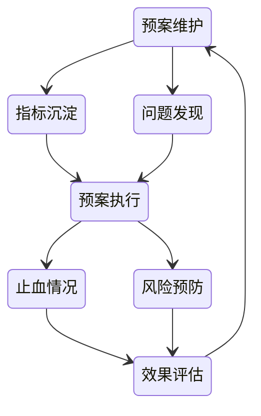

# 故障治理

## 一、故障治理的第一性原理

### 1. 故障不可避免，但**失控是可以避免的**

* 软件系统 = 高复杂度 + 不完全认知
* 故障的本质不是“是否发生”，而是：

  * 是否可被**快速发现**
  * 是否能**限制影响范围**
  * 是否能**快速恢复**
  * 是否能**避免重复发生**

> 因此，故障治理关注的不是“零故障”，而是 **可控性（Controllability）**。

---

### 2. 故障治理的核心目标模型

所有机制、流程、预案，最终都应服务于以下稳定目标：

1. **缩短 MTTR（平均恢复时间）**
2. **限制影响半径（Blast Radius）**
3. **降低重复故障概率**
4. **提升组织应对确定性**

---

## 二、统一的故障生命周期模型

故障治理是一个闭环系统，而非线性处理流程：

> **发生 → 发现 → 判断 → 决策 → 执行 → 恢复 → 复盘 → 演进**

该模型强调：

* 决策与执行同等重要
* 复盘的目标是系统升级，而非个体追责

---

## 三、故障的多维分类模型（核心抽象）

单一维度的“故障类型”无法支撑治理，需要引入多维标签体系。

### 1. 故障多维坐标系

| 维度   | 说明                               |
| ---- | -------------------------------- |
| 触发阶段 | 发布 / 运行 / 运维 / 外部依赖              |
| 根因类型 | 设计缺陷 / 实现错误 / 配置问题 / 容量不足 / 依赖异常 |
| 影响对象 | 用户体验 / 资金资产 / 数据正确性 / 合规安全       |
| 系统层级 | 基础设施 / 平台 / 应用 / 业务              |
| 可预防性 | 可预防 / 可缓解 / 不可控                  |

> **一次真实故障 = 多维标签的组合结果**，而不是单一分类。

---

### 2. 典型故障场景的模型化映射

#### 资损类故障（结果维度）

* 本质：系统未正确履行资金或权益承诺
* 常见根因：设计缺陷 / 并发异常 / 数据一致性问题

治理策略：

* 事中：止血、冻结、限制继续扩散
* 事后：追回、订正、流程补偿

---

#### 流量与容量类故障（系统能力维度）

* 本质：系统承载能力 < 实际需求

治理策略：

* 限流 / 熔断 / 降级
* 弹性扩容
* 架构层削峰填谷

---

#### 发布类故障（触发阶段维度）

* 本质：系统状态在变更过程中失稳

治理策略：

* 灰度发布
* 快速回滚能力
* 发布窗口与值守机制

---

#### 数据类故障（系统一致性维度）

* 本质：系统状态与真实业务状态不一致

治理策略：

* 可审计的数据链路
* 订正、清洗与补偿机制
* 从源头修复错误写入逻辑

---

## 四、统一的故障处理认知模型

所有故障处理行为都可抽象为同一认知路径：

> **信号 → 判断 → 决策 → 动作 → 反馈**

### 1. 信号（发现）

* 系统监控（资源、错误率、延迟）
* 业务监控（订单、资金、转化）
* 舆情与用户反馈

---

### 2. 判断（定位）

* 系统诊断：上下游、发布关联、历史问题
* 业务诊断：是否真实影响业务目标
* 日志诊断：被动查询 + 主动异常发现

---

### 3. 决策（止血策略）

* 是否需要立即止血
* 是否升级故障等级
* 是否切换预案

---

### 4. 动作（执行）

* 重启 / 限流 / 扩容 / 降级
* 回滚 / 切换 / 开关控制

---

### 5. 反馈（验证）

* 指标是否恢复
* 影响是否停止扩散

---

## 五、风险控制与变更治理体系

### 1. 风险定级模型

| 类型  | 风险认知         |
| --- | ------------ |
| 查询类 | 大数据量存在潜在风险   |
| 变更类 | 取决于影响范围与可回滚性 |

风险控制手段：

* 缩小影响面
* 灰度发布
* 回滚预案
* 限流止血

---

### 2. 发布治理原则

* 禁止无监管的线上变更
* 所有变更必须可追溯

发布前卡点：

* 自动化测试
* 静态扫描
* 人工审批

发布窗口：

* 集中发布
* 明确值守
* 避开高风险时段

---

## 六、预案体系：从被动响应到主动治理

### 1. 预案的本质

预案不是脚本，而是 **“确定性决策的固化”**。

### 2. 预案闭环模型

---

## 七、故障复盘：系统性学习机制

### 1. 复盘关注点

* 是否及时发现与触达
* 止血是否有效
* 决策是否正确
* 系统是否诱发错误

---

### 2. 复盘产出要求

* 根因分析（技术 + 组织）
* 系统性改进项
* 可复用的经验沉淀

> 复盘的目标不是追责，而是 **降低未来不确定性**。

---

## 八、故障演练：将不确定性前移

### 1. 演练原则

* 突袭式
* 多样化故障类型
* 全流程真实执行

### 2. 演练评估指标

* 首次响应时间
* 决策耗时
* 恢复路径准确度
* 误操作率

---

## 九、总结：从"处理故障"到"治理不确定性"

> 成熟的系统不是没有故障的系统，
> 而是 **故障发生后行为高度确定的系统**。

故障治理的终极目标，是：

* 把经验变成机制
* 把个人能力变成系统能力
* 把不可控事件，转化为可管理风险

## 关联内容（自动生成）

- [/软件工程/架构/系统设计/可用性.md](/软件工程/架构/系统设计/可用性.md) 故障管理与可用性设计密切相关，可用性关注宕机时长、容灾多活、冗余等机制，直接关系到故障发生时系统的响应与恢复能力
- [/软件工程/架构/系统设计/可观测性.md](/软件工程/架构/系统设计/可观测性.md) 可观测性是故障发现与定位的基础，通过指标、日志、追踪等手段，实现对系统状态的全面掌握，支撑故障的快速发现与根因分析
- [/软件工程/架构/系统设计/混沌工程.md](/软件工程/架构/系统设计/混沌工程.md) 混沌工程是故障管理的前置实践，通过主动引入故障来验证系统的容错能力，提前发现潜在问题，增强系统韧性
- [/运维/SRE.md](/运维/SRE.md) SRE体系关注故障响应与处理，通过MTTR、SLI/SLO、错误预算等概念，建立系统化的故障处理与改进机制
- [/运维/运维.md](/运维/运维.md) 运维体系涵盖了故障管理的平台化、自动化、智能化实现，包括CMDB、监控告警、自愈系统等基础设施
- [/软件工程/架构/系统设计/流量控制.md](/软件工程/架构/系统设计/流量控制.md) 流量控制是故障预防与止血的重要手段，通过限流、熔断、降级等措施，限制故障影响范围
- [/软件工程/架构/系统设计/监控系统设计.md](/软件工程/架构/系统设计/监控系统设计.md) 监控系统是故障发现的第一道防线，提供指标收集、告警通知、问题定位等功能，支撑故障处理全流程
- [/软件工程/微服务/服务治理/服务容错.md](/软件工程/微服务/服务治理/服务容错.md) 服务容错机制是故障处理的核心技术手段，包括熔断、降级、重试等，确保单个服务故障不扩散到整个系统
- [/软件工程/架构/系统设计/分布式/分布式系统.md](/软件工程/架构/系统设计/分布式/分布式系统.md) 分布式系统中的故障处理面临网络分区、节点失效、数据一致性等特有问题，需要专门的容错机制和处理策略
- [/数据技术/数据运维.md](/数据技术/数据运维.md) 数据层面的故障管理关注数据一致性、数据恢复、备份策略等，是整体故障治理体系中不可或缺的一环
