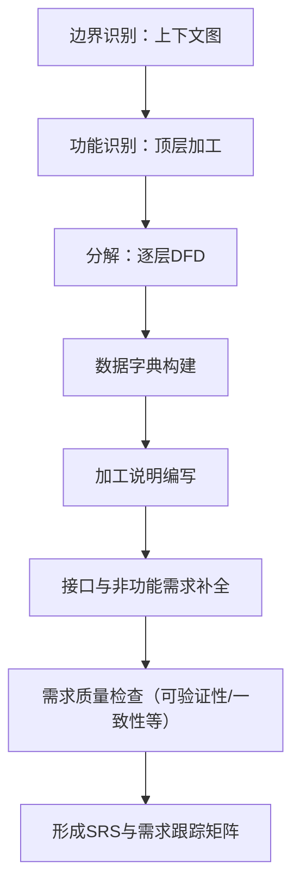
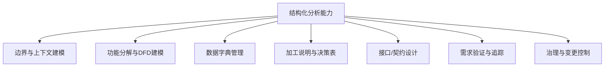

# 结构化分析方法

## 概述

本文件将“结构化分析方法”从工程实践层升维为体系化、抽象化的知识文档，提供清晰的概念模型、核心要素、方法论框架、应用场景、治理要点与演进方向。目标是将分散的实践要点抽象为可复用的认知模块，成为团队内部的理论参考与设计决策依据。

## 本质与定义

结构化分析（Structured Analysis）是一套以数据流为中心，通过自顶向下分解系统功能与数据转换，建立明确的功能模型、数据模型与接口契约的系统分析方法论。其本质是“把系统视为信息（数据）在加工单元之间流动与变换的组合”，强调过程分解、数据约定、可验证的需求表达，以及与结构化设计/程序化设计的衔接。

重要特征（抽象）：

* 以“信息流 + 加工”为核心的系统观；
* 自顶向下的分解与层次化模型（可控复杂度）；
* 强调可验证、可追溯、与设计/实现解耦的需求表达；
* 以正式化的模型（DFD、数据字典、加工说明）作为规范契约。

## 核心概念与要素

下表列出结构化分析的核心概念、定义与作用。

| 概念                                       |                  定义（抽象） | 作用 / 价值                 |
| ---------------------------------------- | ----------------------: | ----------------------- |
| 数据流（Data Flow）                           | 在系统边界或处理节点间传递的信息单元或消息集合 | 描述信息移动、触发与依赖，定位接口与触发条件  |
| 加工（Process / Transformation）             | 对输入数据进行计算、校验、转换或路由以产生输出 | 划分行为边界、定义功能单元并为后续设计提供契约 |
| 数据存储（Data Store）                         |        持久或暂存的信息保管点（逻辑上） | 描述状态、持久化需求与并发访问约束       |
| 外部实体（External Entity / Data Source/Sink） | 系统外的发送或接收信息的对象（人、系统、设备） | 定义边界、接口与责任归属            |
| 数据字典（Data Dictionary）                    |       对所有数据项、记录及结构的规范说明 | 统一语义，支持一致性校验与接口定义       |
| 加工说明（Process Specification）              | 对每个加工的细粒度逻辑与规则的文字或伪代码说明 | 支持可验证性、测试用例生成与设计映射      |
| 分解（Decomposition）                        |       自顶向下把复杂加工拆为更细粒度加工 | 控制复杂度并为模块化设计提供基础        |
| 需求规格（SRS）要素                              |      对功能、接口、性能、约束的结构化陈述 | 提供可测试、可验证的需求契约          |

## 模型与表达工具

结构化分析的主要模型与表达工具，以及它们在知识体系中的角色：

* 数据流图（DFD）

  * 角色：功能与数据流的可视化骨架
  * 层级：上下文图 → 第一级DFD → 详细分解图
  * 约束：每层应满足数据流与数据存储的一致性（平衡）

* 数据字典

  * 角色：系统共同语义库（字段、记录、约束、来源）
  * 内容：数据项名称、类型、取值域、来源、用途、生命周期、敏感性

* 加工说明（Pseudocode / Decision Table / State Table）

  * 角色：把图形化的加工节点转为可执行的逻辑规范
  * 形式：结构化自然语言、伪代码、决策表、状态机

* 接口规范（API / UI / HW interface）

  * 角色：将DFD中的数据流具体化为调用契约（消息格式、交互序列、错误处理）

## 结构化分析过程模型

以“从需求到可验证SRS”为目的的典型流程（抽象并可复用）：

关键活动说明：

* 边界识别：确定系统上下文、外部实体与主要数据流；
* 功能识别：从业务价值或用例提炼顶层加工（过程）；
* 分解：对功能进行自顶向下逐层分解，直到单元可实现/可测试；
* 数据字典：逐步补全，确保每一数据项语义唯一且可校验；
* 加工说明：对每个最小加工写清楚输入/输出/逻辑/错误路径；
* 接口补全：把数据流映射到具体接口协议、消息格式与时序；
* 质量检查：按SRS质量属性（见下一节）进行验证与修正。

## 需求规格（SRS）结构化要点

SRS不只是文本，而是“结构化契约集合”。关键组成与每项的抽象要求：

* 引言：目标、范围、定义（边界与成功准则）
* 概述：上下文图、主要用例、高层功能视图
* 功能需求：以加工/DFD节点为组织单元，含输入/输出/副作用/前提/后置条件
* 约束与前提：技术约束、法规、安全/隐私约束
* 数据需求：数据字典摘录、数据生命周期、备份/恢复需求
* 接口需求：外部实体交互协议、消息格式、错误码
* 性能需求：吞吐、延迟、并发与可扩展性目标（量化）
* 非功能属性：安全、可维护性、可观测性、可部署性
* 其他需求：本地化、合规、部署环境

## 需求验证标准（质量属性）

针对SRS的验证维度（抽象、可工具化的检验项）：

* 正确性（Requirement correctness） — 每条需求均能追溯到业务目标或用例
* 无歧义性（Unambiguity） — 语义唯一，不能产生多种实现解释
* 完整性（Completeness） — 涵盖所有必需场景与边界条件
* 可验证性（Verifiability） — 能被定义的测试/度量验证（量化或可检证明）
* 一致性（Consistency） — 内部无冲突，数据定义与接口一致
* 可理解性（Understandability） — 面向读者（开发/测试/产品）可快速理解
* 可修改性（Modifiability） — 结构化组织，便于局部修改并保证影响分析
* 可追踪性（Traceability） — 每个需求可映射到来源（用例、法规、客户请求）并可追溯到设计/测试
* 设计无关性（Design independence） — 需求不嵌入实现细节（除非约束所需）
* 注释与文档（Documentation） — 所有假设、决定、未决项须注记

## 交付物模板（示例片段）

示例数据字典条目（表格形式）：

| 字段名     |       描述 |      类型/长度 |            约束 |   来源 |     敏感性 |
| ------- | -------: | ---------: | ------------: | ---: | ------: |
| orderId | 业务订单唯一标识 | string(36) |        唯一, 非空 | 下单服务 |  PII:NO |
| userId  |     用户ID |     bigint | FK -> user.id | 用户服务 | PII:YES |

加工说明模板（伪结构）：

* 加工标识：P_XXX（唯一）
* 输入：{数据项A, 数据项B}
* 输出：{数据项C}
* 前置条件：用户登录，订单状态=待付款
* 处理逻辑：描述或决策表/伪代码
* 错误处理：异常类型与返回码
* 性能约束：平均响应 < 200ms

## 决策/选型：何时使用结构化分析

结构化分析适用与不适用场景的决策表（抽象判定）：

| 判断维度                 | 倾向使用结构化分析 | 倾向其他（面向对象 / 领域驱动） |
| -------------------- | --------: | ----------------- |
| 业务以信息流/批处理为核心        |         强 | 弱                 |
| 需求稳定且强调流程明细          |         强 | 弱                 |
| 系统以事务/数据处理为主（报表、ETL） |         强 | 弱                 |
| 领域复杂、行为与状态驱动         |         中 | 强（DDD/面向对象）       |
| 需要强接口契约与可追溯性         |         强 | 中                 |
| 快速探索性原型或 UX 驱动       |         弱 | 强                 |

快速决策树（文字版）：

* 如果主要问题是“数据如何流动、在哪里存储、如何加工” → 选择结构化分析；
* 如果问题是“复杂业务规则与领域模型的交互” → 优先考虑领域建模/面向对象方法；
* 两者可结合：结构化分析用于外部接口与系统交互，领域建模用于内部核心领域逻辑。

## 体系化能力树（mermaid）

## 与其他方法的关系（依赖与互补）

* 与结构化设计/结构化程序设计：结构化分析产出（DFD、数据字典、加工说明）是结构化设计输入，二者在思想上保持一致（分解、模块化、信息隐藏）。
* 与面向对象/DDD：结构化分析侧重信息流与过程，面向对象侧重状态与行为的封装。可以用结构化分析来定义系统边界与外部接口，用领域模型实现核心业务逻辑。
* 与敏捷与用户故事：结构化分析偏向计划化与全局视角，敏捷可将结构化模型拆成若干可交付的小目标（Sprint），并在迭代中逐步细化DFD与数据字典。
* 与形式化方法（模型校验、状态机）：加工说明和决策表可进一步形式化用于模型校验或自动生成测试。

## 治理、质量与演进要点

治理建议（抽象化）：

* 以“契约优先”治理：DFD与接口规范作为团队间协议，变更需通过变更控制与兼容性评估；
* 数据字典为共享元数据仓库：必须纳入版本管理、访问控制与发布流程；
* SRS质量看板：将可验证性、一致性、可追踪性作为核验门（Definition of Ready/Done）；
* 变更影响分析（Change Impact）：每个需求变更要自动/半自动映射至DFD节点、数据字典项与加工说明，以便评估影响范围。

演进方向（趋势/抽象化视角）：

* 从手工图表到模型驱动：把DFD、加工说明以机器可读的模型（YAML/JSON）表达，支持自动化验证、代码/测试生成；
* 数据治理整合：数据字典与元数据管理与组织级数据治理系统整合（血缘、隐私标签）；
* 混合建模：结构化分析与领域建模的混合实践，在不同层次采用最合适的抽象；
* 可观测性嵌入：设计阶段就纳入可观测性（指标/日志/链路）契约，支持运行时验证假设。

## 实用检查表（供团队落地）

SRS 发布前快速核查（每项应有“有/无/待补”）：

* 引言含目标与范围
* 上下文图（Context Diagram）存在且已审阅
* 顶层DFD与第一级DFD平衡（数据流平衡）
* 最小加工的加工说明已编写
* 数据字典涵盖所有数据流、字段与类型
* 接口格式（消息/API）已定义与示例
* 性能指标已量化（吞吐/延迟/并发）
* 可验证性条目：每项可转测试用例
* 追踪矩阵（需求→用例→设计→测试）已建立
* 变更与版本策略已定义

## 参考实践建议（工程化）

* 工具化：采用模型编辑器（支持层级DFD）、元数据仓库与需求管理工具以保证追踪；
* 约定：所有数据项命名遵循统一命名规范（语义优先）并附带示例值和边界值；
* 版本化：DFD、数据字典与加工说明均纳入版本控制，变更需评审；
* 自动化测试：从加工说明与数据字典生成自动化测试用例骨架；
* 可视化审查：在关键里程碑进行DFD审查工作坊，确保跨团队理解一致。

## 总结

结构化分析是一种面向"信息流与加工"的高价值分析范式，适用于强调数据处理与明确接口契约的系统。将结构化分析升维为工程级知识体系的关键在于：把图形与文本产出形式化为可追溯、可验证、可工具化的模型；把数据字典与契约视为治理对象；并将其与现代方法（领域建模、敏捷、可观测性）有机结合，以在保证理论严谨的前提下支持工程落地与演进。

## 关联内容（自动生成）

- [/软件工程/理论/结构化设计方法.md](/软件工程/理论/结构化设计方法.md) 结构化分析的输出（DFD、数据字典、加工说明）是结构化设计的输入，在思想上保持一致（分解、模块化、信息隐藏）
- [/软件工程/理论/软件需求.md](/软件工程/理论/软件需求.md) 结构化分析是需求分析的重要方法，通过数据流图和数据字典等工具实现需求规格说明（SRS）的构建
- [/软件工程/领域驱动设计.md](/软件工程/领域驱动设计.md) 结构化分析侧重信息流与过程，领域驱动设计侧重领域模型和业务逻辑封装，两者可以结合使用
- [/软件工程/理论/UML.md](/软件工程/理论/UML.md) UML和结构化分析都是建模方法，UML提供更现代的可视化建模语言，而结构化分析提供了数据流和加工分解的思维框架
