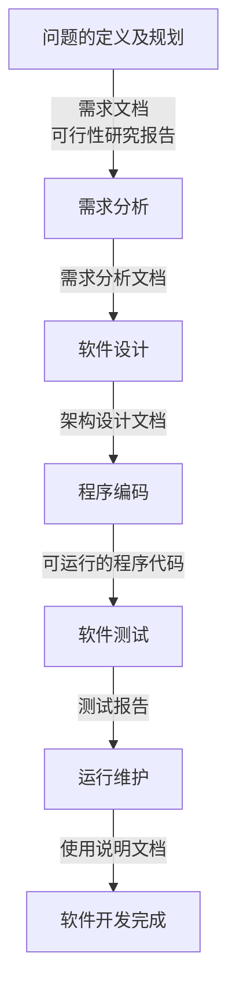

# 软件工程

> 软件工程是研究和应用如何以系统性的、规范化的、可定量的过程化方法去开发和维护软件，以及如何把经过时间考验而证明正确的管理技术和当前能够得到的最好的技术方法结合起来

工程方法：有目的、有计划、有步骤地解决问题的方法

- 想法：想法阶段通常是想要解决问题。最开始问题通常是模糊的，所以需要清晰地定义好问题，研究其可行性，检查是否有可行的解决方案
- 概念：概念阶段就是用图纸、草图、模型等方式，提出一些概念性的解决方案。这些方案可能有多个，最终会确定一个解决方案
- 计划：计划阶段是关于如何实施的计划，通常会包含人员、任务、任务持续时间、任务的依赖关系，以及完成项目所需要的预算
- 设计：设计阶段就是要针对产品需求，将解决方案进一步细化，设计整体架构和划分功能模块，作为分工合作和开发实施的一个依据和参考
- 开发：开发阶段就是根据设计方案，将解决方案构建实施。开发阶段通常是一个迭代的过程，这个阶段通常会有构建、测试、调试和重新设计的迭代
- 发布：将最终结果包括文档发布

软件的发展阶段经历了个人程序时期、软件作坊时期，现在进入了软件工程时期，以应对软件危机和提高软件开发的质量和效率

## 软件的定义及特点

> 软件（中国大陆及香港用语，台湾称作软体，英文：Software）是一系列按照特定顺序组织的计算机数据和指令的集合。一般来讲软件被划分为系统软件、应用软件和介于这两者之间的中间件。软件并不只是包括可以在计算机（这里的计算机是指广义的计算机）上运行的电脑程序，与这些电脑程序相关的文档一般也被认为是软件的一部分

### 特点

- 无形的，没有物理形态，只能通过运行状况来了解功能、特性、和质量
- 软件渗透了大量的脑力劳动，人的逻辑思维、智能活动和技术水平是软件产品的关键
- 软件不会像硬件一样老化磨损，但存在缺陷维护和技术更新
- 软件的开发和运行必须依赖于特定的计算机系统环境，对于硬件有依赖性，为了减少依赖，开发中提出了软件的可移植性
- 软件具有可复用性，软件开发出来很容易被复制，从而形成多个副本

## 软件工程的起源

- 早期计算机程序

  > 在1946年计算机刚诞生时，人们采用机器码编制程序，根本没有独立的软件的概念。 机器码指令只是为了驱动计算机硬件工作，就像人们调节电视机、录像机、洗衣机等家用电器的按钮一样。 1947年，冯诺依曼首先提出用流程图描述计算机的运行过程，才使人们认识到程序设计是完全不同于硬件研制的另一项工作。从此以后，软件的开发和研究才开始独立地进行。

- 现在人们认为

  > 在信息产业中，微电子是基础，计算机和网络是载体，软件是核心

## 软件的种类

- 系统软件
- 支撑软件
- 应用软件

## 软件开发的本质和基本手段

- 软件开发的含义

 

- 实现映射的基本手段：建模  **模型**

### 软件工程框架

- 目标
- 活动

  需求、设计、实现、确认、支持

- 原则

  - 选择适宜的开发模型
  - 提供高质量工程支持
  - 重视开发过程的管理

- 软件工程框架的作用
  - <目标，原则，活动>

## 软件过程

### 软件生存周期过程的概念

- 软件生存周期
- 软件生存周期过程（软件过程）

  > 系统地给出了软件开发所需的任务，回答了软件开发需要做哪些基本映射

### 软件生存周期过程的分类

- 基本过程
- 支持过程
- 组织过程
- 各过程关系

  

### 软件生存周期模型

与 软件开发模型

### 常见的软件生存周期模型

#### 瀑布模型

优点：

- 为项目提供了按阶段划分的检查点。
- 当前一阶段完成后，只需要去关注后续阶段。
- 可在迭代模型中应用瀑布模型。
增量迭代应用于瀑布模型。迭代1解决最大的问题。每次迭代产生一个可运行的版本,同时增加更多的功能。每次迭代必须经过质量和集成测试。
- 它提供了一个模板，这个模板使得分析、设计、编码、测试和支持的方法可以在该模板下有一个共同的指导。

缺点：

- 各个阶段的划分完全固定，阶段之间产生大量的文档，极大地增加了工作量。
- 由于开发模型是线性的，用户只有等到整个过程的末期才能见到开发成果，从而增加了开发风险。
- 通过过多的强制完成日期和里程碑来跟踪各个项目阶段。
- 瀑布模型的突出缺点是不适应用户需求的变化。

瀑布模型让让软件开发过程有序可控，同时也让分工写作成为可能，最重要的是提升了软件质量

#### 原型模型

先迅速建造一个可以运行的软件原型，然后收集用户反馈，再反复修改确认，使开发出的软件能真正反映用户需求

#### 增量模型

把待开发的软件系统模块化，然后在每个小模块的开发过程中，应用一个小瀑布模型，对这个模块进行需求分析、设计、编码和测试

#### 迭代模型

每次只设计和实现产品的一部分，然后逐步完成更多功能。每次设计和实现一个阶段叫做一个迭代

#### 喷泉模型