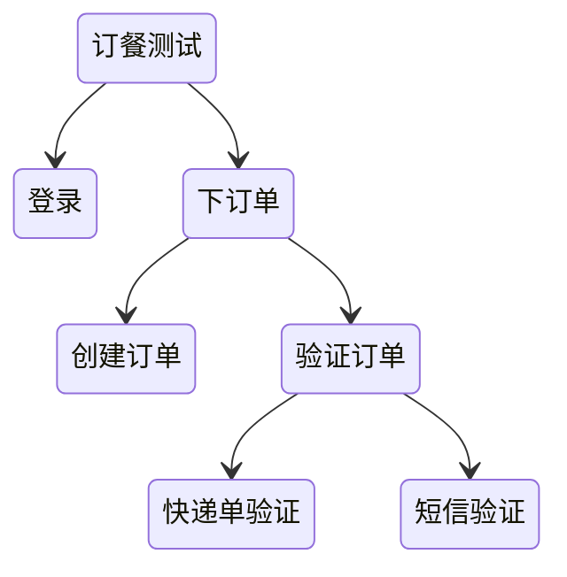

# 自动化测试

## 价值

- 自动化测试项目的最终交付价值是它产生的效益，也就是投入回报率比 ROI，ROI越高越值得自动化
- 自动化测试是用来做回归测试的
- 只有当功能模块稳定的时候，才开始自动化

小项目、项目的早期不适合自动化

ROI = 单次手工运行时间 * 运行次数 / 开发成本 + 维护成本

UI测试 -> 接口测试 -> 单元测试 ROI从低到高，在选择自动化的时候，一个功能模块，如果能在某一层获得更高的ROI，就只要测试该层就好

摊平开发成本：配置化读取测试用例执行，一份代码执行多次

降低维护成本：完善的测试脚本错误发现机制，及时恢复有问题的脚本

### 工具选择

1. 录制回放 产生自动化脚本的这种方法，优点是速度快、零编码，但规模一大很难维护，也无法集成到CICD中
2. 关键字驱动 配置驱动，降低了测试开发人员的技术要求。而且测试开发人员对代码还有了更多的逻辑控制能力
3. 模块库开发 系统沉淀好相关的测试能力，让顶层测试人员来调包进行开发
4. DSL
5. AI

ROI高的工具：

1. 满足需求
2. 社区活跃度高
3. 维护方便

### 规范先行

> Auto Gen Auto：根据配置描述自动化生成测试代码

用在接口比较多，提供一个接口的契约，生产消费方通过契约来约定如何交互，测试代码也能以此编写自动化测试

- openapi-generator
- Spring Clond Contract

### 介入开发运维

- 左移：在开发阶段就进行测试设计、测试工作与开发并行
- 右移：需求上线后，测试并不停止，持续地在生产环境中进行测试，及时发现异常，作为运维的补充

## 设计

### 测试模型

一个运行的测试任务，具备哪些方面：

1. Input&Output：测试 Job 的输入和输出是什么
2. DAO：测试 Job 应该用什么格式，怎么持久化自动化测试报告、日志、抓图等等
3. Depdedncy：测试 Job 的前置条件是什么，由谁来提供
4. TestData：测试 Job 的测试数据是什么结构，需要多少组
5. TestConfig：测试 Job 的运行时需不需要通过配置来调节？比如，健壮性、诊断性、环境信息等等
6. Document：测试 Job 的其它信息

### 编排

学习软件的模块开发，使用模块化编排测试：



### 驱动工具


## 度量

- 避免绝对数字
- 趋势比绝对值更有决策价值
- 避免指标单一

### 交付质量度量

- 交付速度，可以用发布的周期来度量
- 交付范围，可以用新增代码行数来度量
- 质量，用生产环境发现的 Bug 数量来度量

### 内建质量度量

可以划分成四个维度：需求质量、设计质量、开发质量和测试质量

## 测试设计模式

### 数据驱动

把测试数据和测试脚本分离，通过读取测试数据来驱动脚本的行为

### page object

- 把自动化测试代码以页面进行组织，将同一个页面上的所有信息，相关操作都放到一个类中

XXXPage.YYYComponent.ZZZOperation

```js
class LoginPage{
username_input = findElementByName("username"); 
password_input = findElementByName("password");
login_ok_button = findElementByName("login_ok_button");
login_cancel_button = findElementByName("login_cancel_button");
}

function login(username,password) {
  LoginPage.username_input.input(username);
  LoginPage.password_input.input(password);
  LoginPage.login_ok_button.click();
} 
```

页面对象自动生成技术：不用再手工维护 Page Class 了，只需要提供 Web 的 URL，它就会自动帮你生成这个页面上所有控件的定位信息，并自动生成 Page Class

### [分层模式](/软件工程/架构模式/架构模式.md#分层架构)

### 业务流程抽象

从业务的维度来指导测试业务流程的封装，别适用于组装面向终端用户的端到端（E2E）的系统功能测试用例，尤其适用于业务功能非常多，并且存在各种组合的 E2E 测试场景

```java
// Business FLow - Login flow
LoginFlowParameters loginFlowParameters = new LoginFlowParameters();
loginFlowParameters.setUserName("username");
loginFlowParameters. setPassword("password");
LoginFlow loginFlow = new LoginFlow(loginFlowParameters); loginFlow.execute();

// Business Flow - Search book flow
SearchBookFlowParameters searchBookFlowParameters = new SearchBookFlowParameters();
searchBookFlowParameters.setBookName("bookname");
SearchBookFlow searchBookFlow = new SearchBookFlow(searchBookFlowParameters);
searchBookFlow.withStartPage(loginFlow.getEndPage()).execute();
```

## 精准测试

通过自动化的手段对更新的代码进行范围判断，生成测试用例，自动执行

## 技术

### 单元测试自动化

1. 用例框架代码生成的自动化
2. 部分测试输入数据的自动化生成：简单根据不同变量类型自动生成测试输入数据
3. 自动桩代码的生成：生成用来代替真实代码的临时代码，以及集成测试时去除掉桩代码
4. 代码的自动化静态分析：即Sonar之类的代码扫描
5. 测试覆盖率的自动统计与分析

### 接口测试自动化

1. 准备 API 调用时需要的测试数据
2. 准备 API 的调用参数并发起 API 的调用
3. 验证 API 调用的返回结果

一些问题：

1. 测试过程中的第三方接口：需要使用 mock server
2. 异步 API 的测试：一是测试异步调用是否成功，二是测试异步调用的业务逻辑处理是否正确，往往需要去验证中间件里的数据，这就需要测试代码具有访问和操作中间件的能力

### GUI测试自动化

Selenium、Appium

#### 不稳定因素

1. 非预期的弹出对话框：走异常场景恢复分支，判断弹窗类型，看能不能自恢复
2. 页面控件属性的细微变化：采用模糊匹配，避免绝对的XPath、或者绝对的ID名称
3. 被测系统的 A/B 测试：脚本需要能够区分 A 和 B 两个的不同版本，并做出相应的处理
4. 随机的页面延迟造成控件识别失败：需要引入重试机制、超时机制
5. 测试数据问题

#### 测试报告

1. 最简单的视频录制
2. 在关键处埋下HOOK，进行截图，生成时间序列线