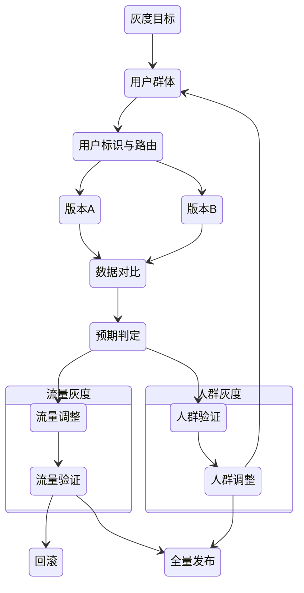

# 灰度发布

## 1. 灰度发布的本质与定位

### 1.1 本质定义

灰度发布并非一种具体的部署方式，而是一种**风险控制型的软件变更交付机制**。

其核心思想是：

> 在不确定性环境下，通过**不完全暴露、可观测反馈、可逆操作**，逐步验证系统变更的安全性与价值。

灰度发布关注的不是"如何上线"，而是：

* 如何**控制变更风险**
* 如何**限制故障影响半径**
* 如何在真实环境中**获取高质量反馈**

### 1.2 在交付体系中的位置

灰度发布位于 CI/CD 流水线之后、全量发布之前，是连接**工程变更**与**真实用户环境**的关键治理环节。

```
代码交付 → 构建/部署 → 灰度发布 → 全量发布
```

它是[持续交付](/运维/持续交付.md)体系中，**将技术不确定性转化为可控风险**的核心能力。

---

## 2. 灰度发布能力模型

从稳定性与系统治理视角看，灰度发布可以抽象为以下五类核心能力：

### 2.1 流量控制能力

* 请求分流（比例 / 规则 / 动态调整）
* 支持多版本并行
* 支持按阶段逐步放量

这种流量控制能力通常通过[网关](/软件工程/架构/系统设计/网关.md)实现，网关作为系统的边界控制点，负责请求的路由与转发。

### 2.2 用户识别与分群能力

* 用户唯一标识（账号、设备、Cookie 等）
* 用户标签体系
* 人群定向与排除能力

### 2.3 可观测与度量能力

* 技术指标：错误率、延迟、资源使用
* 业务指标：转化率、留存、营收
* 日志、埋点、链路追踪

灰度发布依赖于完善的[可观测性](/软件工程/架构/系统设计/可观测性.md)体系，通过指标、日志、追踪三支柱模型实现对系统的全面监控。

### 2.4 决策与策略能力

* 灰度目标定义
* 验证规则与阈值
* 人工 / 自动决策支持

### 2.5 回滚与可逆能力

* 快速回滚
* 配置级切换
* 最小化状态污染

> 灰度发布是否成熟，取决于上述能力是否形成**闭环协同**，而非是否使用了某种部署技术。

---

## 3. 灰度策略分类（按目标划分）

### 3.1 验证性灰度（Risk Validation）

**目标**：验证系统变更是否安全、稳定、符合预期。

典型场景：

* 新版本发布
* 架构或依赖升级
* 高风险变更

核心关注点：

* 异常是否出现
* 指标是否偏离基线

#### 验证性灰度流程模型


### 3.2 探索性灰度（Value Exploration）

**目标**：探索不同方案在真实环境中的业务价值。

典型场景：

* A/B Test
* 功能体验对比
* 商业策略验证

核心关注点：

* 相对效果差异
* 长期收益表现

#### 探索性灰度流程模型


---

## 4. 统一灰度流程闭环模型

无论是验证性还是探索性灰度，其底层流程可以统一抽象为：

**策略 → 分流 → 验证 → 决策 → 行动**



该模型强调：

* 所有灰度行为必须可观测
* 所有决策必须可逆

---

## 5. 灰度实现方式（技术手段层）

### 5.1 蓝绿部署

**特点**：

* 新旧版本环境完全隔离
* 一次性切换流量

**适用场景**：

* 变更风险较高
* 基础设施资源充足

**局限**：

* 资源成本高
* 不适合长期共存验证

### 5.2 金丝雀发布

**特点**：

* 新旧版本长期共存
* 小流量逐步放量

**适用场景**：

* 高频发布
* 持续交付体系

> 蓝绿与金丝雀是**灰度能力的具体实现方式**，而非灰度发布本身。

在[微服务](/软件工程/微服务/微服务.md)架构中，灰度发布变得更加重要，因为服务数量增多，变更风险也随之增加。

---

## 6. 灰度治理与度量体系

### 6.1 灰度度量指标

**短期指标（稳定性）**：

* 错误率
* 延迟
* 资源使用

**长期指标（业务）**：

* 转化率
* 用户留存
* 营收与利润

这些指标的收集与分析是[质量工程](/软件工程/质量工程.md)的重要组成部分，通过数据驱动的方式验证灰度发布的效果。

### 6.2 异常分级与回滚策略

* 一级异常：严重故障，立即回滚
* 二级异常：系统劣化，大规模出现需回滚
* 三级异常：可控问题，持续观察

原则：

> 灰度阶段优先保护系统与用户，而非功能本身。

---

## 7. 组织协作与流程责任

* 策略制定：产品 / 技术负责人
* 指标监控：运维 / SRE
* 回滚决策：值班负责人（预先授权）

灰度发布是**组织协作能力**，不是单一团队行为。

在[安全生产](/软件工程/安全生产.md)体系中，灰度发布是变更管理的重要环节，通过风险分级与管控确保系统稳定。

---

## 8. 总结与复盘机制

* 灰度目标是否达成
* 风险是否被有效控制
* 指标偏离的原因分析
* 流程与策略的优化点

最终目标是：

> 让灰度发布从"经验驱动"演进为"体系化治理能力"。

## 关联内容

- [/运维/持续交付.md](/运维/持续交付.md) 持续交付是灰度发布的重要前置环节，提供了自动化构建、测试、部署的能力基础
- [/软件工程/架构/系统设计/网关.md](/软件工程/架构/系统设计/网关.md) 网关是实现灰度发布中流量控制和路由策略的关键组件，负责请求的分发与管理
- [/软件工程/架构/系统设计/可观测性.md](/软件工程/架构/系统设计/可观测性.md) 可观测性体系为灰度发布提供必要的监控、日志和追踪能力，确保灰度过程的可见性
- [/软件工程/微服务/微服务.md](/软件工程/微服务/微服务.md) 微服务架构下灰度发布变得更加重要，需要考虑服务间的依赖关系和版本兼容性
- [/软件工程/质量工程.md](/软件工程/质量工程.md) 质量工程提供了灰度发布中的度量指标体系和质量保障方法论
- [/软件工程/安全生产.md](/软件工程/安全生产.md) 安全生产体系中的变更管理与灰度发布密切相关，共同保障系统的稳定运行
- [/运维/持续集成.md](/运维/持续集成.md) 持续集成是灰度发布的上游环节，确保每次变更经过充分验证后进入灰度流程
