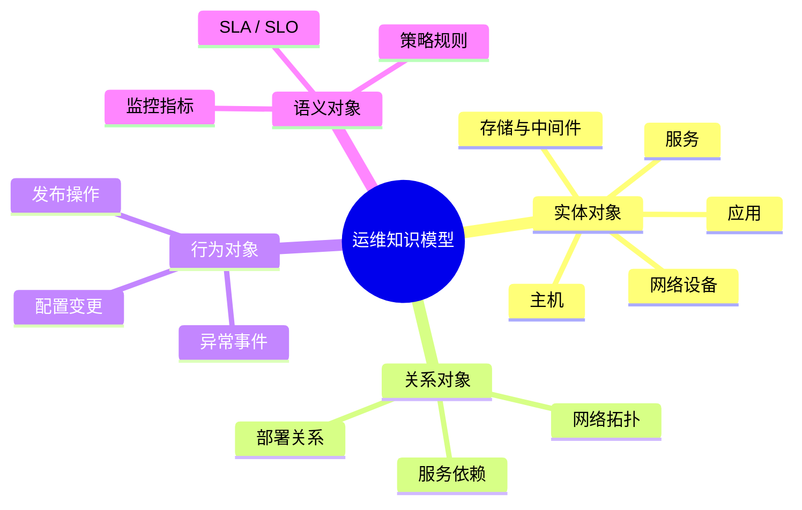
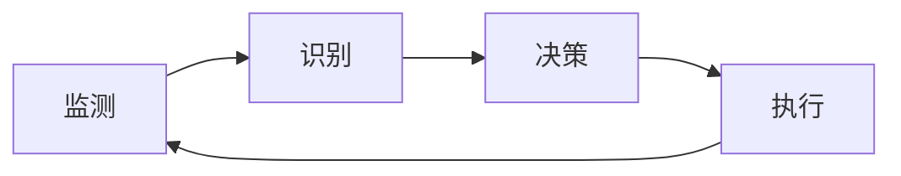
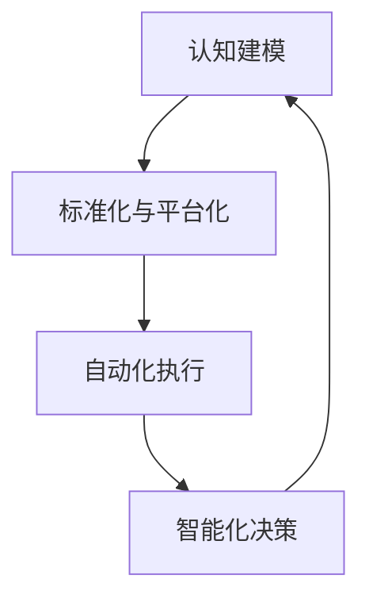

# 现代运维体系：从管理对象到智能自治的闭环模型

> 运维不是运作的延迟，而是系统稳定性的工程化表达。
> ——《现代运维体系白皮书》

---

## 一、体系演进：从基础设施管理到系统自治

### 1.1 范式迁移

运维体系的演进，是技术与管理范式的共同转型。
它经历了三个阶段的跃迁：

| 阶段              | 核心中心  | 方法特征            | 价值焦点    |
| --------------- | ----- | --------------- | ------- |
| 传统运维（Ops）       | 基础设施  | 手工操作、静态配置       | 稳定性与一致性 |
| DevOps 阶段       | 应用与流程 | 自动化、持续交付、协作     | 效率与响应速度 |
| 云原生与智能运维（AIOps） | 系统与数据 | 声明式管理、事件驱动、自愈自治 | 智能与可持续性 |

这一路径实质上是从**人驱动到系统驱动**、从**静态控制到动态自治**的演化。

---

### 1.2 运维哲学

现代运维的核心思想是：

> **以系统为中心的可持续运营能力构建。**

它不再仅仅关注“维护”，而是追求：

* 系统的**自描述性（Self-Descriptive）**
* 系统的**可演化性（Evolvable）**
* 系统的**可自治性（Autonomous）**

---

## 二、体系建模：以标准化为基底的认知结构

### 2.1 对象建模：从元素到关系

运维的第一步是**认知建模**——即识别和定义系统中的核心运维对象。

这一模型构成了“运维知识图谱”（O&M Ontology）的基础。
任何自动化、可观测或智能决策，均建立在此之上。

---

### 2.2 标准化：复杂系统的可操作前提

标准化是从混沌到秩序的抽象过程。
其本质是为所有运维对象建立一致的**语义、结构与行为模型**。

标准化原则：

1. **统一性**：同类对象遵循相同定义与接口规范
2. **可扩展性**：结构可演进、语义可延伸
3. **可度量性**：一切状态可量化
4. **可追溯性**：所有变更可回放

标准化的结果是——**运维对象可以被程序理解、被策略控制、被数据驱动**。

---

## 三、平台化：从自动化到平台工程

### 3.1 平台化的逻辑

> 自动化解决“重复劳动”，平台化解决“复杂协作”。

当组织进入规模化阶段，仅靠脚本化自动化已无法支撑系统演进。
平台工程（Platform Engineering）通过统一的接口与抽象层，
将复杂的运维能力封装为“服务能力单元（Ops-as-a-Service）”。

核心目标：

* **抽象一致性**：统一接口、统一模型
* **自治边界**：团队可独立操作而不破坏系统整体性
* **内建安全**：安全策略成为系统设计的一部分

---

### 3.2 平台组成

平台化的底层能力可抽象为四大支柱：

| 层级   | 核心系统                                    | 功能定位           |
| ---- | --------------------------------------- | -------------- |
| 数据基座 | **CMDB（运维数据湖）**                         | 管理全域运维对象与关系    |
| 执行编排 | **IaC / CI/CD / GitOps**                | 以代码化方式驱动变更与部署  |
| 可观测层 | **Metrics / Logging / Tracing / Event** | 感知系统运行态        |
| 决策智能 | **AIOps / 自愈系统**                        | 基于数据实现预测、诊断与自治 |

它们共同构成“运维操作系统”的逻辑基座。

---

## 四、稳定性体系：从防御到自愈

### 4.1 稳定性三层模型

| 层次              | 目标    | 关键机制            |
| --------------- | ----- | --------------- |
| 防御层（Prevention） | 预防性稳定 | 容量规划、限流降级、发布管控  |
| 检测层（Detection）  | 快速发现  | 全链路监控、异常检测、告警聚合 |
| 恢复层（Recovery）   | 自愈与回滚 | 混沌工程、应急开关、自动回滚  |

SRE 理念将“可靠性”转化为**工程问题**，
通过 SLI / SLO / SLA 与 Error Budget 建立量化约束。

---

### 4.2 混沌工程与自愈闭环

稳定性的终极形态不是“零故障”，
而是系统具备在故障中**自我修复与持续运行的能力**。

闭环模型：

这一闭环对应 AIOps 的核心能力：
**感知（Sense） → 决策（Decide） → 执行（Act） → 学习（Learn）**

---

## 五、安全与可观测：体系的双翼

### 5.1 DevSecOps：安全即设计

现代安全从“防御边界”转向“系统内建”。
安全成为生命周期早期的一部分，而非事后补丁。

* **安全左移**：开发阶段集成安全扫描、代码审计
* **安全右移**：运行阶段实时防护、威胁检测
* **安全即代码（Security as Code）**：安全策略以声明式配置管理

### 5.2 可观测性：系统的感官

可观测性不只是监控，而是系统认知的一致入口。

核心三要素：

1. **日志（Logging）** — 记录行为
2. **指标（Metrics）** — 度量状态
3. **追踪（Tracing）** — 理解因果

配合 **事件（Event）** 与 **拓扑（Topology）**，构成统一语义层。
通过 OpenTelemetry 等标准化采集协议，可实现全域观测与根因分析。

---

## 六、组织与文化：从职能分工到责任闭环

### 6.1 组织演化

传统组织按职能分层，现代组织按价值流重构。

| 模式      | 特征          | 局限         |
| ------- | ----------- | ---------- |
| 职能型（传统） | 系统/网络/数据库分工 | 责任割裂、协作成本高 |
| DevOps型 | 跨职能小队       | 交付快但平台依赖重  |
| 平台工程型   | 平台服务 + 自助能力 | 统一治理与高自治并存 |

### 6.2 角色体系

* **SRE**：以工程化手段保障可靠性
* **DevOps**：以流程自动化加速交付
* **平台团队**：构建自助化运维平台
* **安全团队**：提供安全策略与防御服务
* **可观测性团队**：构建系统认知基础设施

最终目标：形成**端到端责任闭环**，
让每个变更都有归属、每个事件可追踪、每次演进可验证。

---

## 七、智能化演进：迈向自治运维

### 7.1 AIOps：数据驱动的智能

AIOps（Artificial Intelligence for IT Operations）是智能运维的核心路径。
它让系统从被动反应，转向主动预测与自动决策。

关键能力：

* 异常检测（Anomaly Detection）
* 根因分析（Root Cause Analysis）
* 预测性维护（Predictive Maintenance）
* 智能决策与自愈（Auto-Remediation）

### 7.2 GitOps：自治机制的基石

GitOps 将 Git 作为唯一事实源（Single Source of Truth），
所有运维行为通过声明式配置实现自动化同步。

> 它让“系统状态”变得可版本化、可回溯、可复现。

GitOps + AIOps 的结合，标志着
**“系统自治（Autonomous Operations）”的时代正在到来。**

---

## 八、体系总结：运维的终极形态

现代运维体系不再是“维护”，而是“演化”。
它是一套围绕“系统认知—系统执行—系统学习”的闭环系统。

这一闭环的核心价值是：

* 从复杂性中提炼秩序
* 在变化中保持稳定
* 让系统以最小的人为介入持续演化

---

> **运维的未来，不在于消灭故障，而在于让系统能够优雅地与不确定性共存。**

---

## 附录：现代运维体系四象限模型（摘要）

| 象限   | 关注维度                     | 技术代表                   | 价值产出    |
| ---- | ------------------------ | ---------------------- | ------- |
| 认知象限 | CMDB / Observability     | O&M Ontology           | 全域可见性   |
| 执行象限 | IaC / CI-CD / GitOps     | Kubernetes / Terraform | 自动化变更   |
| 稳定象限 | SRE / Chaos / Resilience | Error Budget / Canary  | 高可用与韧性  |
| 智能象限 | AIOps / Self-Healing     | ML / Rule Engine       | 智能决策与自治 |

---

## 关联文档链接

- [/中间件/数据库/分布式数据库.md](/中间件/数据库/分布式数据库.md) - 分布式数据库的架构、一致性、可用性等概念与运维中的数据管理、高可用架构密切相关
- [/中间件/数据库/数据库.md](/中间件/数据库/数据库.md) - 数据库管理是运维工作的重要组成部分，涉及性能优化、备份恢复、监控告警等方面
- [/中间件/消息队列/消息队列.md](/中间件/消息队列/消息队列.md) - 消息队列是现代分布式系统的重要组件，其运维涉及可靠性保证、性能优化、监控告警等
- [/软件工程/DevOps.md](/软件工程/DevOps.md) - DevOps是现代运维的核心理念和实践，涵盖CI/CD、自动化、团队协作等方面
- [/软件工程/架构/系统设计/可观测性.md](/软件工程/架构/系统设计/可观测性.md) - 可观测性是运维的重要技术手段，包括日志、指标、链路追踪等
- [/操作系统/容器化.md](/操作系统/容器化.md) - 容器化技术是现代运维的基础，涉及namespace、cgroups、资源限制等概念
- [/计算机网络/网络排查.md](/计算机网络/网络排查.md) - 网络排查是运维工程师的必备技能，涉及抓包、诊断工具、IP透传等
- [/数据技术/数据处理.md](/数据技术/数据处理.md) - 大数据处理平台的运维涉及批处理、流处理、架构选型等方面
